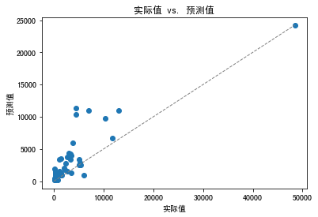

```python
import numpy as np
import pandas as pd
df_sales = pd.read_csv('/Users/zheyiwang/Downloads/易速鲜花订单记录.csv')
print('日期范围:%s ~ %s' % (df_sales['消费日期'].min(), df_sales['消费日期'].max()))
df_sales['消费日期'] = pd.to_datetime(df_sales['消费日期'])
print('日期范围: %s ~ %s' % (df_sales['消费日期'].min(), df_sales['消费日期'].max()))#显示日期范围
```

    日期范围:1/1/2021 10:11 ~ 9/9/2020 9:20
    日期范围: 2020-06-01 09:09:00 ~ 2021-06-09 12:31:00


```python
df_sales = df_sales.loc[df_sales['消费日期'] < '2021-06-01'] #只保留整月数据
print('日期范围: %s ~ %s' % (df_sales['消费日期'].min(), df_sales['消费日期'].max())) #显示日期范围
```

    日期范围: 2020-06-01 09:09:00 ~ 2021-05-31 17:39:00


```python
df_sales['总价'] = df_sales['单价']*df_sales['数量']
df_sales_3m = df_sales[(df_sales.消费日期 > '2020-06-01') & (df_sales.消费日期 <= '2020-08-30')] #构建仅含头三个月数据的数据集
df_sales_3m.reset_index(drop=True) #重置索引
df_sales_3m.head()
```


<div>
<style scoped>
    .dataframe tbody tr th:only-of-type {
        vertical-align: middle;
    }

    .dataframe tbody tr th {
        vertical-align: top;
    }

    .dataframe thead th {
        text-align: right;
    }
</style>
<table border="1" class="dataframe">
  <thead>
    <tr style="text-align: right;">
      <th></th>
      <th>订单号</th>
      <th>产品码</th>
      <th>消费日期</th>
      <th>产品说明</th>
      <th>数量</th>
      <th>单价</th>
      <th>用户码</th>
      <th>城市</th>
      <th>总价</th>
    </tr>
  </thead>
  <tbody>
    <tr>
      <th>0</th>
      <td>536374</td>
      <td>21258</td>
      <td>2020-06-01 09:09:00</td>
      <td>五彩玫瑰五支装</td>
      <td>32</td>
      <td>10.95</td>
      <td>15100</td>
      <td>北京</td>
      <td>350.4</td>
    </tr>
    <tr>
      <th>1</th>
      <td>536376</td>
      <td>22114</td>
      <td>2020-06-01 09:32:00</td>
      <td>茉莉花白色25枝</td>
      <td>48</td>
      <td>3.45</td>
      <td>15291</td>
      <td>上海</td>
      <td>165.6</td>
    </tr>
    <tr>
      <th>2</th>
      <td>536376</td>
      <td>21733</td>
      <td>2020-06-01 09:32:00</td>
      <td>教师节向日葵3枝尤加利5枝</td>
      <td>64</td>
      <td>2.55</td>
      <td>15291</td>
      <td>上海</td>
      <td>163.2</td>
    </tr>
    <tr>
      <th>3</th>
      <td>536378</td>
      <td>22386</td>
      <td>2020-06-01 09:37:00</td>
      <td>百合粉色10花苞</td>
      <td>10</td>
      <td>1.95</td>
      <td>14688</td>
      <td>北京</td>
      <td>19.5</td>
    </tr>
    <tr>
      <th>4</th>
      <td>536378</td>
      <td>85099C</td>
      <td>2020-06-01 09:37:00</td>
      <td>橙黄香槟色康乃馨</td>
      <td>10</td>
      <td>1.95</td>
      <td>14688</td>
      <td>北京</td>
      <td>19.5</td>
    </tr>
  </tbody>
</table>
</div>


```python
df_user_LTV = pd.DataFrame(df_sales['用户码'].unique()) #生成以用户码为主键的结构
df_user_LTV.columns = ['用户码'] #设定字段名
df_user_LTV.head() #显示头几行数据

```


<div>
<style scoped>
    .dataframe tbody tr th:only-of-type {
        vertical-align: middle;
    }

    .dataframe tbody tr th {
        vertical-align: top;
    }

    .dataframe thead th {
        text-align: right;
    }
</style>
<table border="1" class="dataframe">
  <thead>
    <tr style="text-align: right;">
      <th></th>
      <th>用户码</th>
    </tr>
  </thead>
  <tbody>
    <tr>
      <th>0</th>
      <td>15100</td>
    </tr>
    <tr>
      <th>1</th>
      <td>15291</td>
    </tr>
    <tr>
      <th>2</th>
      <td>14688</td>
    </tr>
    <tr>
      <th>3</th>
      <td>15311</td>
    </tr>
    <tr>
      <th>4</th>
      <td>15862</td>
    </tr>
  </tbody>
</table>
</div>


```python
df_R_value = df_sales_3m.groupby('用户码').消费日期.max().reset_index() #找到每个用户的最近消费日期，构建df_R_value对象
df_R_value.columns = ['用户码','最近购买日期'] #设定字段名
df_R_value['R值'] = (df_R_value['最近购买日期'].max() - df_R_value['最近购买日期']).dt.days #计算最新日期与上次消费日期的天数
df_user_LTV = pd.merge(df_user_LTV, df_R_value[['用户码','R值']], on='用户码') #把上次消费距最新日期的天数（R值）合并至df_user结构
df_F_value = df_sales_3m.groupby('用户码').消费日期.count().reset_index() #计算每个用户消费次数，构建df_F_value对象
df_F_value.columns = ['用户码','F值'] #设定字段名
df_user_LTV = pd.merge(df_user_LTV, df_F_value[['用户码','F值']], on='用户码') #把消费频率(F值)整合至df_user结构
df_M_value = df_sales_3m.groupby('用户码').总价.sum().reset_index() #计算每个用户三个月消费总额，构建df_M_value对象
df_M_value.columns = ['用户码','M值'] #设定字段名
df_user_LTV = pd.merge(df_user_LTV, df_M_value, on='用户码') #把消费总额整合至df_user结构
df_user_LTV #显示用户表结构
```


<div>
<style scoped>
    .dataframe tbody tr th:only-of-type {
        vertical-align: middle;
    }

    .dataframe tbody tr th {
        vertical-align: top;
    }

    .dataframe thead th {
        text-align: right;
    }
</style>
<table border="1" class="dataframe">
  <thead>
    <tr style="text-align: right;">
      <th></th>
      <th>用户码</th>
      <th>R值</th>
      <th>F值</th>
      <th>M值</th>
    </tr>
  </thead>
  <tbody>
    <tr>
      <th>0</th>
      <td>15100</td>
      <td>45</td>
      <td>6</td>
      <td>635.10</td>
    </tr>
    <tr>
      <th>1</th>
      <td>15291</td>
      <td>35</td>
      <td>35</td>
      <td>1329.95</td>
    </tr>
    <tr>
      <th>2</th>
      <td>14688</td>
      <td>6</td>
      <td>85</td>
      <td>1472.28</td>
    </tr>
    <tr>
      <th>3</th>
      <td>15311</td>
      <td>5</td>
      <td>718</td>
      <td>12730.01</td>
    </tr>
    <tr>
      <th>4</th>
      <td>15862</td>
      <td>89</td>
      <td>64</td>
      <td>354.23</td>
    </tr>
    <tr>
      <th>...</th>
      <td>...</td>
      <td>...</td>
      <td>...</td>
      <td>...</td>
    </tr>
    <tr>
      <th>365</th>
      <td>15951</td>
      <td>1</td>
      <td>22</td>
      <td>375.17</td>
    </tr>
    <tr>
      <th>366</th>
      <td>14745</td>
      <td>1</td>
      <td>7</td>
      <td>240.60</td>
    </tr>
    <tr>
      <th>367</th>
      <td>15724</td>
      <td>0</td>
      <td>5</td>
      <td>103.65</td>
    </tr>
    <tr>
      <th>368</th>
      <td>15874</td>
      <td>0</td>
      <td>5</td>
      <td>584.35</td>
    </tr>
    <tr>
      <th>369</th>
      <td>15656</td>
      <td>0</td>
      <td>15</td>
      <td>920.35</td>
    </tr>
  </tbody>
</table>
<p>370 rows × 4 columns</p>
</div>


```python
#我们先根据一整年的数据计算出每一个用户的 LTV 值，也就是 12 个月的总消费金额：
```


```python
df_user_1y = df_sales.groupby('用户码')['总价'].sum().reset_index() #计算每个用户整年消费总额，构建df_user_1y对象
df_user_1y.columns = ['用户码','年度LTV'] #设定字段名
df_user_1y.head() #显示头几行数据

```


<div>
<style scoped>
    .dataframe tbody tr th:only-of-type {
        vertical-align: middle;
    }

    .dataframe tbody tr th {
        vertical-align: top;
    }

    .dataframe thead th {
        text-align: right;
    }
</style>
<table border="1" class="dataframe">
  <thead>
    <tr style="text-align: right;">
      <th></th>
      <th>用户码</th>
      <th>年度LTV</th>
    </tr>
  </thead>
  <tbody>
    <tr>
      <th>0</th>
      <td>14681</td>
      <td>498.95</td>
    </tr>
    <tr>
      <th>1</th>
      <td>14682</td>
      <td>52.00</td>
    </tr>
    <tr>
      <th>2</th>
      <td>14684</td>
      <td>1236.28</td>
    </tr>
    <tr>
      <th>3</th>
      <td>14687</td>
      <td>628.38</td>
    </tr>
    <tr>
      <th>4</th>
      <td>14688</td>
      <td>4470.65</td>
    </tr>
  </tbody>
</table>
</div>


```python
df_LTV = pd.merge(df_user_LTV, df_user_1y, on='用户码', how='left') #构建整体LTV训练数据集
df_LTV #显示df_LTV
```


<div>
<style scoped>
    .dataframe tbody tr th:only-of-type {
        vertical-align: middle;
    }

    .dataframe tbody tr th {
        vertical-align: top;
    }

    .dataframe thead th {
        text-align: right;
    }
</style>
<table border="1" class="dataframe">
  <thead>
    <tr style="text-align: right;">
      <th></th>
      <th>用户码</th>
      <th>R值</th>
      <th>F值</th>
      <th>M值</th>
      <th>年度LTV</th>
    </tr>
  </thead>
  <tbody>
    <tr>
      <th>0</th>
      <td>15100</td>
      <td>45</td>
      <td>6</td>
      <td>635.10</td>
      <td>635.10</td>
    </tr>
    <tr>
      <th>1</th>
      <td>15291</td>
      <td>35</td>
      <td>35</td>
      <td>1329.95</td>
      <td>4596.51</td>
    </tr>
    <tr>
      <th>2</th>
      <td>14688</td>
      <td>6</td>
      <td>85</td>
      <td>1472.28</td>
      <td>4470.65</td>
    </tr>
    <tr>
      <th>3</th>
      <td>15311</td>
      <td>5</td>
      <td>718</td>
      <td>12730.01</td>
      <td>58352.77</td>
    </tr>
    <tr>
      <th>4</th>
      <td>15862</td>
      <td>89</td>
      <td>64</td>
      <td>354.23</td>
      <td>659.73</td>
    </tr>
    <tr>
      <th>...</th>
      <td>...</td>
      <td>...</td>
      <td>...</td>
      <td>...</td>
      <td>...</td>
    </tr>
    <tr>
      <th>365</th>
      <td>15951</td>
      <td>1</td>
      <td>22</td>
      <td>375.17</td>
      <td>375.17</td>
    </tr>
    <tr>
      <th>366</th>
      <td>14745</td>
      <td>1</td>
      <td>7</td>
      <td>240.60</td>
      <td>1167.16</td>
    </tr>
    <tr>
      <th>367</th>
      <td>15724</td>
      <td>0</td>
      <td>5</td>
      <td>103.65</td>
      <td>212.30</td>
    </tr>
    <tr>
      <th>368</th>
      <td>15874</td>
      <td>0</td>
      <td>5</td>
      <td>584.35</td>
      <td>4330.67</td>
    </tr>
    <tr>
      <th>369</th>
      <td>15656</td>
      <td>0</td>
      <td>15</td>
      <td>920.35</td>
      <td>1425.90</td>
    </tr>
  </tbody>
</table>
<p>370 rows × 5 columns</p>
</div>


```python
#现在，在这个数据集中，R、F、M 值来自于头 3 个月收集的数据，是模型的特征；LTV 值来自于整年的数据，是模型的标签。这非常符合我们的目标：用短期数据，来预测用户的长期价值。
```


```python
#创建特征集和标签集
```


```python
X = df_LTV.drop(['用户码','年度LTV'],axis=1) #特征集
X.head() #显示特征集
```


<div>
<style scoped>
    .dataframe tbody tr th:only-of-type {
        vertical-align: middle;
    }

    .dataframe tbody tr th {
        vertical-align: top;
    }

    .dataframe thead th {
        text-align: right;
    }
</style>
<table border="1" class="dataframe">
  <thead>
    <tr style="text-align: right;">
      <th></th>
      <th>R值</th>
      <th>F值</th>
      <th>M值</th>
    </tr>
  </thead>
  <tbody>
    <tr>
      <th>0</th>
      <td>45</td>
      <td>6</td>
      <td>635.10</td>
    </tr>
    <tr>
      <th>1</th>
      <td>35</td>
      <td>35</td>
      <td>1329.95</td>
    </tr>
    <tr>
      <th>2</th>
      <td>6</td>
      <td>85</td>
      <td>1472.28</td>
    </tr>
    <tr>
      <th>3</th>
      <td>5</td>
      <td>718</td>
      <td>12730.01</td>
    </tr>
    <tr>
      <th>4</th>
      <td>89</td>
      <td>64</td>
      <td>354.23</td>
    </tr>
  </tbody>
</table>
</div>


```python
y = df_LTV['年度LTV'] #标签集
y.head() #显示标签集
```


    0      635.10
    1     4596.51
    2     4470.65
    3    58352.77
    4      659.73
    Name: 年度LTV, dtype: float64


```python
# 拆分训练集、验证集和测试集
```


```python
from sklearn.model_selection import train_test_split
# 先拆分训练集和其它集
X_train, X_rem, y_train, y_rem = train_test_split(X,y, train_size=0.7,random_state = 36)
# 再把其它集拆分成验证集和测试集 
X_valid, X_test, y_valid, y_test = train_test_split(X_rem,y_rem, test_size=0.5,random_state = 36)
```


```python
from sklearn.linear_model import LinearRegression #导入线性回归模型
from sklearn.tree import DecisionTreeRegressor #导入决策树回归模型
from sklearn.ensemble import RandomForestRegressor #导入随机森林回归模型
model_lr = LinearRegression() #创建线性回归模型
model_dtr = DecisionTreeRegressor() #创建决策树回归模型
model_rfr = RandomForestRegressor() #创建随机森林回归模型
```


```python
#训练模型
```


```python
model_lr.fit(X_train, y_train) #拟合线性回归模型
model_dtr.fit(X_train, y_train) #拟合决策树模型
model_rfr.fit(X_train, y_train) #拟合随机森林模型
```


    RandomForestRegressor()


```python
#评估模型
```


```python
y_valid_preds_lr = model_lr.predict(X_valid) #用线性回归模型预测验证集
y_valid_preds_dtr = model_dtr.predict(X_valid) #用决策树模型预测验证集
y_valid_preds_rfr = model_rfr.predict(X_valid) #用随机森林模型预测验证集
```


```python
#为了看看这些模型预测的 LTV 值是否大体上靠谱，我们先来随机选择其中一行数据，看看模型的预测结果
```


```python
X_valid.iloc[2] #随便选择一个数据
```


    R值       1.00
    F值     154.00
    M值    1427.73
    Name: 163, dtype: float64


```python
#然后，我们再显示一下三个模型对这一行数据所预测的 LTV 值，以及该用户的 LTV 真值。
```


```python
print('真值:', y_valid.iloc[2])  #真值
print('线性回归预测值:', y_valid_preds_lr[2])  #线性回归模型预测值
print('决策树预测值:', y_valid_preds_dtr[2])  #决策树模型预测值
print('随机森林预测值:', y_valid_preds_rfr[2]) #随机森林模型预测值
```

    真值: 4432.429999999991
    线性回归预测值: 7474.418142488359
    决策树预测值: 2247.5099999999998
    随机森林预测值: 4336.211200000002


```python
#下面我们用 R2 指标，来评估模型的预测准确率：
```


```python
from sklearn.metrics import r2_score,   median_absolute_error #导入Sklearn评估模块
print('验证集上的R平方分数-线性回归: %0.4f' % r2_score(y_valid, model_lr.predict(X_valid)))
print('验证集上的R平方分数-决策树: %0.4f' % r2_score(y_valid, model_dtr.predict(X_valid)))
print('验证集上的R平方分数-随机森林: %0.4f' % r2_score(y_valid, model_rfr.predict(X_valid)))
```

    验证集上的R平方分数-线性回归: 0.4410
    验证集上的R平方分数-决策树: 0.2648
    验证集上的R平方分数-随机森林: 0.4743


```python
from matplotlib import pyplot as plt
y_test_preds = model_rfr.predict(X_test) #用模型预随机森林模型预测验证集
plt.scatter(y_test, y_test_preds) #预测值和实际值的散点图
plt.plot([0, max(y_test)], [0, max(y_test_preds)],   color='gray', lw=1, linestyle='--') #绘图
plt.xlabel('实际值') #X轴
plt.ylabel('预测值') #Y轴
plt.title('实际值 vs. 预测值') #标题
```


    Text(0.5, 1.0, '实际值 vs. 预测值')


    

    


```python

```
