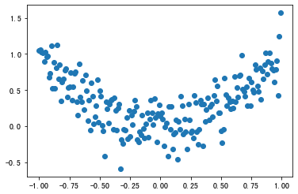
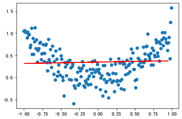
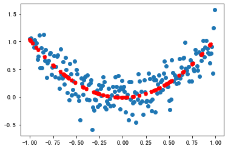

```python
import numpy as np
import pandas as pd
import matplotlib.pyplot as plt #导入绘图工具
df = pd.read_csv('/Users/zheyiwang/Downloads/特征构建示意数据集.csv')
df.head(5)
```


<div>
<style scoped>
    .dataframe tbody tr th:only-of-type {
        vertical-align: middle;
    }

    .dataframe tbody tr th {
        vertical-align: top;
    }

    .dataframe thead th {
        text-align: right;
    }
</style>
<table border="1" class="dataframe">
  <thead>
    <tr style="text-align: right;">
      <th></th>
      <th>X</th>
      <th>Y</th>
    </tr>
  </thead>
  <tbody>
    <tr>
      <th>0</th>
      <td>0.27</td>
      <td>-0.16</td>
    </tr>
    <tr>
      <th>1</th>
      <td>-0.80</td>
      <td>0.65</td>
    </tr>
    <tr>
      <th>2</th>
      <td>-0.46</td>
      <td>-0.42</td>
    </tr>
    <tr>
      <th>3</th>
      <td>-0.69</td>
      <td>0.34</td>
    </tr>
    <tr>
      <th>4</th>
      <td>-0.16</td>
      <td>-0.12</td>
    </tr>
  </tbody>
</table>
</div>


```python
plt.scatter(df.X, df.Y) #X，Y散点图
plt.rc('axes', unicode_minus=False) # 解决字符显示不正确问题
```


    

    


```python
from sklearn.model_selection import train_test_split #导入train_test_split 
df_x = df['X'].to_frame() #特征集
df_y = df['Y'] #标签集
X_train, X_test, y_train, y_test = train_test_split(df_x,df_y,test_size=0.3, random_state = 0) #拆分数据集
from sklearn.linear_model import LinearRegression #导入LinearRegression
model = LinearRegression() #创建模型
model.fit(X_train, y_train) #拟合模型
plt.scatter(df.X, df.Y) #散点图
plt.plot(X_test, model.predict(X_test),linestyle='--', color = 'red') #显示拟合曲线
```


    [<matplotlib.lines.Line2D at 0x7fdfe7e5a220>]


    

    


```python
#们从图中可以观察到，X-Y 之间的关系其实更接近多项式回归（polynomial regression）中的二项式回归，也就是说，Y 是 X 的二次函数。那么，我们就在 X 的基础上做个平方，构建出一个新特征。
```


```python
X2_train = X_train.copy() #新特征训练集
X2_test = X_test.copy() #新特征测试集
X2_train['X2'] = X2_train['X']**2 #构建新特征X2
X2_test['X2'] = X2_test['X']**2 #构建新特征X2
model2 = LinearRegression() #创建新模型
model2.fit(X2_train, y_train) #拟合新模型
plt.scatter(df.X, df.Y) #散点图
plt.scatter(X_test, model2.predict(X2_test), linestyle='--', color = 'red') #新拟合函数曲线
```


    <matplotlib.collections.PathCollection at 0x7fdfe7e7e940>


    

    


```python

```
