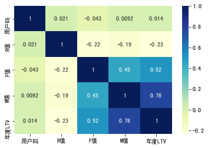

```python
import numpy as np
import pandas as pd
df_sales = pd.read_csv('/Users/zheyiwang/Downloads/易速鲜花订单记录.csv')
df_sales.head(5)
```


<div>
<style scoped>
    .dataframe tbody tr th:only-of-type {
        vertical-align: middle;
    }

    .dataframe tbody tr th {
        vertical-align: top;
    }

    .dataframe thead th {
        text-align: right;
    }
</style>
<table border="1" class="dataframe">
  <thead>
    <tr style="text-align: right;">
      <th></th>
      <th>订单号</th>
      <th>产品码</th>
      <th>消费日期</th>
      <th>产品说明</th>
      <th>数量</th>
      <th>单价</th>
      <th>用户码</th>
      <th>城市</th>
    </tr>
  </thead>
  <tbody>
    <tr>
      <th>0</th>
      <td>536374</td>
      <td>21258</td>
      <td>6/1/2020 9:09</td>
      <td>五彩玫瑰五支装</td>
      <td>32</td>
      <td>10.95</td>
      <td>15100</td>
      <td>北京</td>
    </tr>
    <tr>
      <th>1</th>
      <td>536376</td>
      <td>22114</td>
      <td>6/1/2020 9:32</td>
      <td>茉莉花白色25枝</td>
      <td>48</td>
      <td>3.45</td>
      <td>15291</td>
      <td>上海</td>
    </tr>
    <tr>
      <th>2</th>
      <td>536376</td>
      <td>21733</td>
      <td>6/1/2020 9:32</td>
      <td>教师节向日葵3枝尤加利5枝</td>
      <td>64</td>
      <td>2.55</td>
      <td>15291</td>
      <td>上海</td>
    </tr>
    <tr>
      <th>3</th>
      <td>536378</td>
      <td>22386</td>
      <td>6/1/2020 9:37</td>
      <td>百合粉色10花苞</td>
      <td>10</td>
      <td>1.95</td>
      <td>14688</td>
      <td>北京</td>
    </tr>
    <tr>
      <th>4</th>
      <td>536378</td>
      <td>85099C</td>
      <td>6/1/2020 9:37</td>
      <td>橙黄香槟色康乃馨</td>
      <td>10</td>
      <td>1.95</td>
      <td>14688</td>
      <td>北京</td>
    </tr>
  </tbody>
</table>
</div>


```python
df_sales['消费日期'] = pd.to_datetime(df_sales['消费日期'])
df_sales.head(5)
```


<div>
<style scoped>
    .dataframe tbody tr th:only-of-type {
        vertical-align: middle;
    }

    .dataframe tbody tr th {
        vertical-align: top;
    }

    .dataframe thead th {
        text-align: right;
    }
</style>
<table border="1" class="dataframe">
  <thead>
    <tr style="text-align: right;">
      <th></th>
      <th>订单号</th>
      <th>产品码</th>
      <th>消费日期</th>
      <th>产品说明</th>
      <th>数量</th>
      <th>单价</th>
      <th>用户码</th>
      <th>城市</th>
    </tr>
  </thead>
  <tbody>
    <tr>
      <th>0</th>
      <td>536374</td>
      <td>21258</td>
      <td>2020-06-01 09:09:00</td>
      <td>五彩玫瑰五支装</td>
      <td>32</td>
      <td>10.95</td>
      <td>15100</td>
      <td>北京</td>
    </tr>
    <tr>
      <th>1</th>
      <td>536376</td>
      <td>22114</td>
      <td>2020-06-01 09:32:00</td>
      <td>茉莉花白色25枝</td>
      <td>48</td>
      <td>3.45</td>
      <td>15291</td>
      <td>上海</td>
    </tr>
    <tr>
      <th>2</th>
      <td>536376</td>
      <td>21733</td>
      <td>2020-06-01 09:32:00</td>
      <td>教师节向日葵3枝尤加利5枝</td>
      <td>64</td>
      <td>2.55</td>
      <td>15291</td>
      <td>上海</td>
    </tr>
    <tr>
      <th>3</th>
      <td>536378</td>
      <td>22386</td>
      <td>2020-06-01 09:37:00</td>
      <td>百合粉色10花苞</td>
      <td>10</td>
      <td>1.95</td>
      <td>14688</td>
      <td>北京</td>
    </tr>
    <tr>
      <th>4</th>
      <td>536378</td>
      <td>85099C</td>
      <td>2020-06-01 09:37:00</td>
      <td>橙黄香槟色康乃馨</td>
      <td>10</td>
      <td>1.95</td>
      <td>14688</td>
      <td>北京</td>
    </tr>
  </tbody>
</table>
</div>


```python
print('日期: %s -~ %s'% (df_sales['消费日期'].min(), df_sales['消费日期'].max() ))
```

    日期: 2020-06-01 09:09:00 -~ 2021-06-09 12:31:00


```python
df_sales['总价']=df_sales['单价']*df_sales['数量']
df_sales.head(5)
```


<div>
<style scoped>
    .dataframe tbody tr th:only-of-type {
        vertical-align: middle;
    }

    .dataframe tbody tr th {
        vertical-align: top;
    }

    .dataframe thead th {
        text-align: right;
    }
</style>
<table border="1" class="dataframe">
  <thead>
    <tr style="text-align: right;">
      <th></th>
      <th>订单号</th>
      <th>产品码</th>
      <th>消费日期</th>
      <th>产品说明</th>
      <th>数量</th>
      <th>单价</th>
      <th>用户码</th>
      <th>城市</th>
      <th>总价</th>
    </tr>
  </thead>
  <tbody>
    <tr>
      <th>0</th>
      <td>536374</td>
      <td>21258</td>
      <td>2020-06-01 09:09:00</td>
      <td>五彩玫瑰五支装</td>
      <td>32</td>
      <td>10.95</td>
      <td>15100</td>
      <td>北京</td>
      <td>350.4</td>
    </tr>
    <tr>
      <th>1</th>
      <td>536376</td>
      <td>22114</td>
      <td>2020-06-01 09:32:00</td>
      <td>茉莉花白色25枝</td>
      <td>48</td>
      <td>3.45</td>
      <td>15291</td>
      <td>上海</td>
      <td>165.6</td>
    </tr>
    <tr>
      <th>2</th>
      <td>536376</td>
      <td>21733</td>
      <td>2020-06-01 09:32:00</td>
      <td>教师节向日葵3枝尤加利5枝</td>
      <td>64</td>
      <td>2.55</td>
      <td>15291</td>
      <td>上海</td>
      <td>163.2</td>
    </tr>
    <tr>
      <th>3</th>
      <td>536378</td>
      <td>22386</td>
      <td>2020-06-01 09:37:00</td>
      <td>百合粉色10花苞</td>
      <td>10</td>
      <td>1.95</td>
      <td>14688</td>
      <td>北京</td>
      <td>19.5</td>
    </tr>
    <tr>
      <th>4</th>
      <td>536378</td>
      <td>85099C</td>
      <td>2020-06-01 09:37:00</td>
      <td>橙黄香槟色康乃馨</td>
      <td>10</td>
      <td>1.95</td>
      <td>14688</td>
      <td>北京</td>
      <td>19.5</td>
    </tr>
  </tbody>
</table>
</div>


```python
df_sales_3m= df_sales[(df_sales.消费日期>'2020-06-01') & (df_sales.消费日期<='2020-08-30')]
df_sales_3m.reset_index(drop=True)
df_sales_3m.head(5)
```


<div>
<style scoped>
    .dataframe tbody tr th:only-of-type {
        vertical-align: middle;
    }

    .dataframe tbody tr th {
        vertical-align: top;
    }

    .dataframe thead th {
        text-align: right;
    }
</style>
<table border="1" class="dataframe">
  <thead>
    <tr style="text-align: right;">
      <th></th>
      <th>订单号</th>
      <th>产品码</th>
      <th>消费日期</th>
      <th>产品说明</th>
      <th>数量</th>
      <th>单价</th>
      <th>用户码</th>
      <th>城市</th>
      <th>总价</th>
    </tr>
  </thead>
  <tbody>
    <tr>
      <th>0</th>
      <td>536374</td>
      <td>21258</td>
      <td>2020-06-01 09:09:00</td>
      <td>五彩玫瑰五支装</td>
      <td>32</td>
      <td>10.95</td>
      <td>15100</td>
      <td>北京</td>
      <td>350.4</td>
    </tr>
    <tr>
      <th>1</th>
      <td>536376</td>
      <td>22114</td>
      <td>2020-06-01 09:32:00</td>
      <td>茉莉花白色25枝</td>
      <td>48</td>
      <td>3.45</td>
      <td>15291</td>
      <td>上海</td>
      <td>165.6</td>
    </tr>
    <tr>
      <th>2</th>
      <td>536376</td>
      <td>21733</td>
      <td>2020-06-01 09:32:00</td>
      <td>教师节向日葵3枝尤加利5枝</td>
      <td>64</td>
      <td>2.55</td>
      <td>15291</td>
      <td>上海</td>
      <td>163.2</td>
    </tr>
    <tr>
      <th>3</th>
      <td>536378</td>
      <td>22386</td>
      <td>2020-06-01 09:37:00</td>
      <td>百合粉色10花苞</td>
      <td>10</td>
      <td>1.95</td>
      <td>14688</td>
      <td>北京</td>
      <td>19.5</td>
    </tr>
    <tr>
      <th>4</th>
      <td>536378</td>
      <td>85099C</td>
      <td>2020-06-01 09:37:00</td>
      <td>橙黄香槟色康乃馨</td>
      <td>10</td>
      <td>1.95</td>
      <td>14688</td>
      <td>北京</td>
      <td>19.5</td>
    </tr>
  </tbody>
</table>
</div>


```python
df_user_LTV =pd.DataFrame(df_sales['用户码'].unique())
df_user_LTV.columns= ['用户码']
df_user_LTV.head(5)
```


<div>
<style scoped>
    .dataframe tbody tr th:only-of-type {
        vertical-align: middle;
    }

    .dataframe tbody tr th {
        vertical-align: top;
    }

    .dataframe thead th {
        text-align: right;
    }
</style>
<table border="1" class="dataframe">
  <thead>
    <tr style="text-align: right;">
      <th></th>
      <th>用户码</th>
    </tr>
  </thead>
  <tbody>
    <tr>
      <th>0</th>
      <td>15100</td>
    </tr>
    <tr>
      <th>1</th>
      <td>15291</td>
    </tr>
    <tr>
      <th>2</th>
      <td>14688</td>
    </tr>
    <tr>
      <th>3</th>
      <td>15311</td>
    </tr>
    <tr>
      <th>4</th>
      <td>15862</td>
    </tr>
  </tbody>
</table>
</div>


```python
df_R_value = df_sales_3m.groupby('用户码').消费日期.max().reset_index() #找到每个用户的最近消费日期，构建df_R_value对象
df_R_value.columns = ['用户码','最近购买日期'] #设定字段名
df_R_value['R值'] = (df_R_value['最近购买日期'].max() - df_R_value['最近购买日期']).dt.days #计算最新日期与上次消费日期的天数
df_user_LTV = pd.merge(df_user_LTV, df_R_value[['用户码','R值']], on='用户码') #把上次消费距最新日期的天数（R值）合并至df_user结构
df_F_value = df_sales_3m.groupby('用户码').消费日期.count().reset_index() #计算每个用户消费次数，构建df_F_value对象
df_F_value.columns = ['用户码','F值'] #设定字段名
df_user_LTV = pd.merge(df_user_LTV, df_F_value[['用户码','F值']], on='用户码') #把消费频率(F值)整合至df_user结构
df_M_value = df_sales_3m.groupby('用户码').总价.sum().reset_index() #计算每个用户三个月消费总额，构建df_M_value对象
df_M_value.columns = ['用户码','M值'] #设定字段名
df_user_LTV = pd.merge(df_user_LTV, df_M_value, on='用户码') #把消费总额整合至df_user结构
df_user_LTV #显示用户表结构
```


<div>
<style scoped>
    .dataframe tbody tr th:only-of-type {
        vertical-align: middle;
    }

    .dataframe tbody tr th {
        vertical-align: top;
    }

    .dataframe thead th {
        text-align: right;
    }
</style>
<table border="1" class="dataframe">
  <thead>
    <tr style="text-align: right;">
      <th></th>
      <th>用户码</th>
      <th>R值</th>
      <th>F值</th>
      <th>M值</th>
    </tr>
  </thead>
  <tbody>
    <tr>
      <th>0</th>
      <td>15100</td>
      <td>45</td>
      <td>6</td>
      <td>635.10</td>
    </tr>
    <tr>
      <th>1</th>
      <td>15291</td>
      <td>35</td>
      <td>35</td>
      <td>1329.95</td>
    </tr>
    <tr>
      <th>2</th>
      <td>14688</td>
      <td>6</td>
      <td>85</td>
      <td>1472.28</td>
    </tr>
    <tr>
      <th>3</th>
      <td>15311</td>
      <td>5</td>
      <td>718</td>
      <td>12730.01</td>
    </tr>
    <tr>
      <th>4</th>
      <td>15862</td>
      <td>89</td>
      <td>64</td>
      <td>354.23</td>
    </tr>
    <tr>
      <th>...</th>
      <td>...</td>
      <td>...</td>
      <td>...</td>
      <td>...</td>
    </tr>
    <tr>
      <th>365</th>
      <td>15951</td>
      <td>1</td>
      <td>22</td>
      <td>375.17</td>
    </tr>
    <tr>
      <th>366</th>
      <td>14745</td>
      <td>1</td>
      <td>7</td>
      <td>240.60</td>
    </tr>
    <tr>
      <th>367</th>
      <td>15724</td>
      <td>0</td>
      <td>5</td>
      <td>103.65</td>
    </tr>
    <tr>
      <th>368</th>
      <td>15874</td>
      <td>0</td>
      <td>5</td>
      <td>584.35</td>
    </tr>
    <tr>
      <th>369</th>
      <td>15656</td>
      <td>0</td>
      <td>15</td>
      <td>920.35</td>
    </tr>
  </tbody>
</table>
<p>370 rows × 4 columns</p>
</div>


```python
df_user_1y = df_sales.groupby('用户码')['总价'].sum().reset_index()
df_user_1y.columns = ['用户码','年度LTV']
df_user_1y.head(5)
```


<div>
<style scoped>
    .dataframe tbody tr th:only-of-type {
        vertical-align: middle;
    }

    .dataframe tbody tr th {
        vertical-align: top;
    }

    .dataframe thead th {
        text-align: right;
    }
</style>
<table border="1" class="dataframe">
  <thead>
    <tr style="text-align: right;">
      <th></th>
      <th>用户码</th>
      <th>年度LTV</th>
    </tr>
  </thead>
  <tbody>
    <tr>
      <th>0</th>
      <td>14681</td>
      <td>498.95</td>
    </tr>
    <tr>
      <th>1</th>
      <td>14682</td>
      <td>52.00</td>
    </tr>
    <tr>
      <th>2</th>
      <td>14684</td>
      <td>1236.28</td>
    </tr>
    <tr>
      <th>3</th>
      <td>14687</td>
      <td>628.38</td>
    </tr>
    <tr>
      <th>4</th>
      <td>14688</td>
      <td>5107.38</td>
    </tr>
  </tbody>
</table>
</div>


```python
df_LTV = pd.merge(df_user_LTV,df_user_1y,on='用户码',how='left')
df_LTV
```


<div>
<style scoped>
    .dataframe tbody tr th:only-of-type {
        vertical-align: middle;
    }

    .dataframe tbody tr th {
        vertical-align: top;
    }

    .dataframe thead th {
        text-align: right;
    }
</style>
<table border="1" class="dataframe">
  <thead>
    <tr style="text-align: right;">
      <th></th>
      <th>用户码</th>
      <th>R值</th>
      <th>F值</th>
      <th>M值</th>
      <th>年度LTV</th>
    </tr>
  </thead>
  <tbody>
    <tr>
      <th>0</th>
      <td>15100</td>
      <td>45</td>
      <td>6</td>
      <td>635.10</td>
      <td>635.10</td>
    </tr>
    <tr>
      <th>1</th>
      <td>15291</td>
      <td>35</td>
      <td>35</td>
      <td>1329.95</td>
      <td>4596.51</td>
    </tr>
    <tr>
      <th>2</th>
      <td>14688</td>
      <td>6</td>
      <td>85</td>
      <td>1472.28</td>
      <td>5107.38</td>
    </tr>
    <tr>
      <th>3</th>
      <td>15311</td>
      <td>5</td>
      <td>718</td>
      <td>12730.01</td>
      <td>59419.34</td>
    </tr>
    <tr>
      <th>4</th>
      <td>15862</td>
      <td>89</td>
      <td>64</td>
      <td>354.23</td>
      <td>832.88</td>
    </tr>
    <tr>
      <th>...</th>
      <td>...</td>
      <td>...</td>
      <td>...</td>
      <td>...</td>
      <td>...</td>
    </tr>
    <tr>
      <th>365</th>
      <td>15951</td>
      <td>1</td>
      <td>22</td>
      <td>375.17</td>
      <td>669.57</td>
    </tr>
    <tr>
      <th>366</th>
      <td>14745</td>
      <td>1</td>
      <td>7</td>
      <td>240.60</td>
      <td>1167.16</td>
    </tr>
    <tr>
      <th>367</th>
      <td>15724</td>
      <td>0</td>
      <td>5</td>
      <td>103.65</td>
      <td>212.30</td>
    </tr>
    <tr>
      <th>368</th>
      <td>15874</td>
      <td>0</td>
      <td>5</td>
      <td>584.35</td>
      <td>4330.67</td>
    </tr>
    <tr>
      <th>369</th>
      <td>15656</td>
      <td>0</td>
      <td>15</td>
      <td>920.35</td>
      <td>1425.90</td>
    </tr>
  </tbody>
</table>
<p>370 rows × 5 columns</p>
</div>


```python
X=df_LTV.drop(['用户码','年度LTV'],axis=1)
y=df_LTV['年度LTV']
```


```python
from sklearn.model_selection import train_test_split

X_train, X_rem, y_train, y_rem = train_test_split(X,y,train_size=0.7,random_state=36)
X_valid,X_test,y_valid,y_test = train_test_split(X_rem,y_rem,train_size=0.5, random_state=36)
```


```python
from sklearn.linear_model import LinearRegression
from sklearn.tree import DecisionTreeRegressor
from sklearn.ensemble import RandomForestRegressor

model_lr = LinearRegression()
model_dtr = DecisionTreeRegressor()
model_rfr = RandomForestRegressor()
```


```python
model_lr.fit(X_train,y_train)
model_dtr.fit(X_train,y_train)
model_rfr.fit(X_train,y_train)
```


    RandomForestRegressor()


```python
y_valid_preds_lr = model_lr.predict(X_valid)
y_valid_preds_dtr = model_dtr.predict(X_valid)
y_valid_preds_rfr = model_rfr.predict(X_valid)
```


```python
print('真值:', y_valid.iloc[2])  #真值
print('线性回归预测值:',y_valid_preds_lr[2])  #线性回归模型预测值
print('决策树预测值:',y_valid_preds_dtr[2])  #决策树模型预测值
print('随机森林预测值:',y_valid_preds_rfr[2]) #随机森林模型预测值
```

    真值: 4954.839999999991
    线性回归预测值: 7644.977472264428
    决策树预测值: 2247.5099999999998
    随机森林预测值: 4152.6458


```python
from sklearn.metrics import r2_score, median_absolute_error
print('LR R方:%0.4f' % r2_score(y_valid,y_valid_preds_lr))
print('DTR R方:%0.4f' % r2_score(y_valid,y_valid_preds_dtr))
print('RFR R方:%0.4f' % r2_score(y_valid,y_valid_preds_rfr))
```

    LR R方:0.4351
    DTR R方:0.2203
    RFR R方:0.5162


```python
# 特征工程
```


```python
# 对所有的标签和特征两两显示其相关性热力图(heatmap)
import seaborn as sns
from matplotlib import pyplot as plt
sns.heatmap(df_LTV.corr(), cmap="YlGnBu", annot = True)
plt.rc('axes', unicode_minus=False) # 解决字符显示不正确问题
```


    

    


```python
#我们还会发现，M 值、F 值和 LTV 的相关度比较高，而 R 值和 LTV 的相关度比较低。这时候，我们就可以选择丢弃“R 值”这个字段。这就是一个特征选择。
```


```python
X_train_less_feature = X_train.drop(['R值'], axis=1) #特征训练集
X_valid_less_feature = X_valid.drop(['R值'], axis=1) #特征验证集
model_lr_less_feature = LinearRegression() #创建线性回归模型
model_lr_less_feature.fit(X_train_less_feature, y_train) #拟合线性回归模型
print('测试集上的R平方分数-线性回归: %0.4f' % r2_score(y_valid, model_lr.predict(X_valid)))
print('测试集上的R平方分数-少R值特征的线性回归: %0.4f' % r2_score(y_valid, model_lr_less_feature.predict(X_valid_less_feature)))
```

    测试集上的R平方分数-线性回归: 0.4351
    测试集上的R平方分数-少R值特征的线性回归: 0.4299


```python
#自动进行特征选择：单变量特征选择工具，SelectKBest
```


```python
from sklearn.feature_selection import SelectKBest, mutual_info_regression  #导入特征选择工具
selector = SelectKBest(mutual_info_regression, k = 2) #选择最重要的两个特征
selector.fit(X, y) #用特征选择模型拟合数据集
X.columns[selector.get_support()] #输出选中的两个特征
```


    Index(['F值', 'M值'], dtype='object')


```python
#调用 StandardScaler，进行数值特征的标准化缩放
```


```python
from sklearn.preprocessing import StandardScaler #导入标准化缩放器
scaler = StandardScaler() #创建标准化缩放器
X_train_standard = scaler.fit_transform(X_train) #拟合并转换训练集数据
X_valid_standard = scaler.transform(X_valid) #转换验证集数据
X_test_standard = scaler.transform(X_test) #转换测试集数据
```


```python
#fit_transform 这个 API，这是 fit 和 transform 两个 API 的整合，它的意思是先根据训练集拟合数据，找到合适的标准化参数，然后再把参数应用在训练集上，给数据做缩放
```


```python
#用缩放后的特征训练模型，得到一个随机森林模型 model_rfr_standard
```


```python
model_rfr_standard = RandomForestRegressor() #创建随机森林回归模型
model_rfr_standard.fit(X_train_standard, y_train) #拟合随机森林模型
```


    RandomForestRegressor()


```python
#用 MinMaxScaler
```


```python
from sklearn.preprocessing import MinMaxScaler #导入归一化缩放器
scaler = MinMaxScaler() #创建归一化缩放器
X_train_minmax = scaler.fit_transform(X_train) #拟合并转换训练集数据
X_valid_minmax = scaler.transform(X_valid) #转换验证集数据
X_test_minmax = scaler.transform(X_test) #转换测试集数据
```


```python
model_rfr_minmax = RandomForestRegressor() #创建随机森林回归模型
model_rfr_minmax.fit(X_train_minmax, y_train) #拟合随机森林模型
```


    RandomForestRegressor()


```python
#对类别型特征的变换：虚拟变量和独热编码
```


```python
# 把多分类字段转换为二分类虚拟变量 
category_features = ['城市'] #要转换的特征列表
df_sales = pd.get_dummies(df_sales, drop_first=False, columns=category_features) #创建哑变量
df_sales #显示数据
```


<div>
<style scoped>
    .dataframe tbody tr th:only-of-type {
        vertical-align: middle;
    }

    .dataframe tbody tr th {
        vertical-align: top;
    }

    .dataframe thead th {
        text-align: right;
    }
</style>
<table border="1" class="dataframe">
  <thead>
    <tr style="text-align: right;">
      <th></th>
      <th>订单号</th>
      <th>产品码</th>
      <th>消费日期</th>
      <th>产品说明</th>
      <th>数量</th>
      <th>单价</th>
      <th>用户码</th>
      <th>总价</th>
      <th>城市_上海</th>
      <th>城市_北京</th>
      <th>城市_广州</th>
      <th>城市_成都</th>
      <th>城市_深圳</th>
      <th>城市_苏州</th>
      <th>城市_西安</th>
    </tr>
  </thead>
  <tbody>
    <tr>
      <th>0</th>
      <td>536374</td>
      <td>21258</td>
      <td>2020-06-01 09:09:00</td>
      <td>五彩玫瑰五支装</td>
      <td>32</td>
      <td>10.95</td>
      <td>15100</td>
      <td>350.4</td>
      <td>0</td>
      <td>1</td>
      <td>0</td>
      <td>0</td>
      <td>0</td>
      <td>0</td>
      <td>0</td>
    </tr>
    <tr>
      <th>1</th>
      <td>536376</td>
      <td>22114</td>
      <td>2020-06-01 09:32:00</td>
      <td>茉莉花白色25枝</td>
      <td>48</td>
      <td>3.45</td>
      <td>15291</td>
      <td>165.6</td>
      <td>1</td>
      <td>0</td>
      <td>0</td>
      <td>0</td>
      <td>0</td>
      <td>0</td>
      <td>0</td>
    </tr>
    <tr>
      <th>2</th>
      <td>536376</td>
      <td>21733</td>
      <td>2020-06-01 09:32:00</td>
      <td>教师节向日葵3枝尤加利5枝</td>
      <td>64</td>
      <td>2.55</td>
      <td>15291</td>
      <td>163.2</td>
      <td>1</td>
      <td>0</td>
      <td>0</td>
      <td>0</td>
      <td>0</td>
      <td>0</td>
      <td>0</td>
    </tr>
    <tr>
      <th>3</th>
      <td>536378</td>
      <td>22386</td>
      <td>2020-06-01 09:37:00</td>
      <td>百合粉色10花苞</td>
      <td>10</td>
      <td>1.95</td>
      <td>14688</td>
      <td>19.5</td>
      <td>0</td>
      <td>1</td>
      <td>0</td>
      <td>0</td>
      <td>0</td>
      <td>0</td>
      <td>0</td>
    </tr>
    <tr>
      <th>4</th>
      <td>536378</td>
      <td>85099C</td>
      <td>2020-06-01 09:37:00</td>
      <td>橙黄香槟色康乃馨</td>
      <td>10</td>
      <td>1.95</td>
      <td>14688</td>
      <td>19.5</td>
      <td>0</td>
      <td>1</td>
      <td>0</td>
      <td>0</td>
      <td>0</td>
      <td>0</td>
      <td>0</td>
    </tr>
    <tr>
      <th>...</th>
      <td>...</td>
      <td>...</td>
      <td>...</td>
      <td>...</td>
      <td>...</td>
      <td>...</td>
      <td>...</td>
      <td>...</td>
      <td>...</td>
      <td>...</td>
      <td>...</td>
      <td>...</td>
      <td>...</td>
      <td>...</td>
      <td>...</td>
    </tr>
    <tr>
      <th>87175</th>
      <td>581585</td>
      <td>21684</td>
      <td>2021-06-09 12:31:00</td>
      <td>产品说明掩码</td>
      <td>12</td>
      <td>5.00</td>
      <td>15804</td>
      <td>60.0</td>
      <td>0</td>
      <td>0</td>
      <td>0</td>
      <td>0</td>
      <td>1</td>
      <td>0</td>
      <td>0</td>
    </tr>
    <tr>
      <th>87176</th>
      <td>581585</td>
      <td>22398</td>
      <td>2021-06-09 12:31:00</td>
      <td>产品说明掩码</td>
      <td>12</td>
      <td>499.00</td>
      <td>15804</td>
      <td>5988.0</td>
      <td>0</td>
      <td>0</td>
      <td>0</td>
      <td>0</td>
      <td>1</td>
      <td>0</td>
      <td>0</td>
    </tr>
    <tr>
      <th>87177</th>
      <td>581585</td>
      <td>23328</td>
      <td>2021-06-09 12:31:00</td>
      <td>产品说明掩码</td>
      <td>4</td>
      <td>58.00</td>
      <td>15804</td>
      <td>232.0</td>
      <td>0</td>
      <td>0</td>
      <td>0</td>
      <td>0</td>
      <td>1</td>
      <td>0</td>
      <td>0</td>
    </tr>
    <tr>
      <th>87178</th>
      <td>581585</td>
      <td>23145</td>
      <td>2021-06-09 12:31:00</td>
      <td>产品说明掩码</td>
      <td>12</td>
      <td>88.90</td>
      <td>15804</td>
      <td>1066.8</td>
      <td>0</td>
      <td>0</td>
      <td>0</td>
      <td>0</td>
      <td>1</td>
      <td>0</td>
      <td>0</td>
    </tr>
    <tr>
      <th>87179</th>
      <td>581585</td>
      <td>22466</td>
      <td>2021-06-09 12:31:00</td>
      <td>产品说明掩码</td>
      <td>12</td>
      <td>78.00</td>
      <td>15804</td>
      <td>936.0</td>
      <td>0</td>
      <td>0</td>
      <td>0</td>
      <td>0</td>
      <td>1</td>
      <td>0</td>
      <td>0</td>
    </tr>
  </tbody>
</table>
<p>87180 rows × 15 columns</p>
</div>


```python

```
