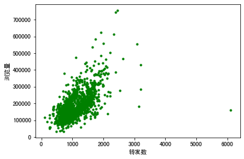

```python
import pandas as pd
```


```python
df_ads= pd.read_csv('/Users/zheyiwang/Downloads/易速鲜花微信软文.csv')   
df_ads.head(10)
```


<div>
<style scoped>
    .dataframe tbody tr th:only-of-type {
        vertical-align: middle;
    }

    .dataframe tbody tr th {
        vertical-align: top;
    }

    .dataframe thead th {
        text-align: right;
    }
</style>
<table border="1" class="dataframe">
  <thead>
    <tr style="text-align: right;">
      <th></th>
      <th>点赞数</th>
      <th>转发数</th>
      <th>热度指数</th>
      <th>文章评级</th>
      <th>浏览量</th>
    </tr>
  </thead>
  <tbody>
    <tr>
      <th>0</th>
      <td>2646</td>
      <td>1347.0</td>
      <td>7</td>
      <td>5</td>
      <td>260004</td>
    </tr>
    <tr>
      <th>1</th>
      <td>816</td>
      <td>816.0</td>
      <td>4</td>
      <td>6</td>
      <td>100004</td>
    </tr>
    <tr>
      <th>2</th>
      <td>1224</td>
      <td>612.0</td>
      <td>6</td>
      <td>5</td>
      <td>164502</td>
    </tr>
    <tr>
      <th>3</th>
      <td>1261</td>
      <td>1261.0</td>
      <td>6</td>
      <td>6</td>
      <td>163001</td>
    </tr>
    <tr>
      <th>4</th>
      <td>1720</td>
      <td>1720.0</td>
      <td>7</td>
      <td>5</td>
      <td>260401</td>
    </tr>
    <tr>
      <th>5</th>
      <td>1541</td>
      <td>1541.0</td>
      <td>7</td>
      <td>5</td>
      <td>220002</td>
    </tr>
    <tr>
      <th>6</th>
      <td>827</td>
      <td>NaN</td>
      <td>5</td>
      <td>7</td>
      <td>107503</td>
    </tr>
    <tr>
      <th>7</th>
      <td>866</td>
      <td>686.0</td>
      <td>5</td>
      <td>9</td>
      <td>110504</td>
    </tr>
    <tr>
      <th>8</th>
      <td>1314</td>
      <td>1300.0</td>
      <td>8</td>
      <td>5</td>
      <td>229461</td>
    </tr>
    <tr>
      <th>9</th>
      <td>1431</td>
      <td>1099.0</td>
      <td>6</td>
      <td>5</td>
      <td>165004</td>
    </tr>
  </tbody>
</table>
</div>


```python
#导入数据可视化所需要的库
import matplotlib.pyplot as plt # Matplotlib – Python画图工具库
import seaborn as sns # Seaborn – 统计学数据可视化工具库
```


```python
plt.plot(df_ads['点赞数'],df_ads['浏览量'],'r.',label='Training data')
plt.xlabel('点赞数') # x轴Label
plt.ylabel('浏览量') # y轴Label
plt.legend()
plt.show()
```


    

    


```python
plt.plot(df_ads['转发数'],df_ads['浏览量'],'g.',label='Training data')
plt.xlabel('转发数')
plt.ylabel('浏览量')
plt.legend
plt.show
```


    <function matplotlib.pyplot.show(close=None, block=None)>


    

    


```python
data = pd.concat([df_ads['浏览量'], df_ads['热度指数']], axis=1) # 浏览量和热度指数
data.head()

```


<div>
<style scoped>
    .dataframe tbody tr th:only-of-type {
        vertical-align: middle;
    }

    .dataframe tbody tr th {
        vertical-align: top;
    }

    .dataframe thead th {
        text-align: right;
    }
</style>
<table border="1" class="dataframe">
  <thead>
    <tr style="text-align: right;">
      <th></th>
      <th>浏览量</th>
      <th>热度指数</th>
    </tr>
  </thead>
  <tbody>
    <tr>
      <th>0</th>
      <td>260004</td>
      <td>7</td>
    </tr>
    <tr>
      <th>1</th>
      <td>100004</td>
      <td>4</td>
    </tr>
    <tr>
      <th>2</th>
      <td>164502</td>
      <td>6</td>
    </tr>
    <tr>
      <th>3</th>
      <td>163001</td>
      <td>6</td>
    </tr>
    <tr>
      <th>4</th>
      <td>260401</td>
      <td>7</td>
    </tr>
  </tbody>
</table>
</div>


```python
fig = sns.boxplot(x='热度指数', y="浏览量", data=data) # 用seaborn的箱线图画图
fig.axis(ymin=0, ymax=800000); #设定y轴坐标
```


    

    


```python
df_ads.isna().sum() # NaN出现的次数
```


    点赞数      0
    转发数     37
    热度指数     0
    文章评级     0
    浏览量      0
    dtype: int64


```python
df_ads = df_ads.dropna() # 把出现了NaN的数据行删掉
```


```python
X = df_ads.drop(['浏览量'],axis=1) # 特征集，Drop掉标签相关字段
```


```python
y = df_ads.浏览量 # 标签集
```


```python
X.head() # 显示前几行数据
```


<div>
<style scoped>
    .dataframe tbody tr th:only-of-type {
        vertical-align: middle;
    }

    .dataframe tbody tr th {
        vertical-align: top;
    }

    .dataframe thead th {
        text-align: right;
    }
</style>
<table border="1" class="dataframe">
  <thead>
    <tr style="text-align: right;">
      <th></th>
      <th>点赞数</th>
      <th>转发数</th>
      <th>热度指数</th>
      <th>文章评级</th>
    </tr>
  </thead>
  <tbody>
    <tr>
      <th>0</th>
      <td>2646</td>
      <td>1347.0</td>
      <td>7</td>
      <td>5</td>
    </tr>
    <tr>
      <th>1</th>
      <td>816</td>
      <td>816.0</td>
      <td>4</td>
      <td>6</td>
    </tr>
    <tr>
      <th>2</th>
      <td>1224</td>
      <td>612.0</td>
      <td>6</td>
      <td>5</td>
    </tr>
    <tr>
      <th>3</th>
      <td>1261</td>
      <td>1261.0</td>
      <td>6</td>
      <td>6</td>
    </tr>
    <tr>
      <th>4</th>
      <td>1720</td>
      <td>1720.0</td>
      <td>7</td>
      <td>5</td>
    </tr>
  </tbody>
</table>
</div>


```python
y.head() #显示前几行数据
```


    0    260004
    1    100004
    2    164502
    3    163001
    4    260401
    Name: 浏览量, dtype: int64


```python
#将数据集进行80%（训练集）和20%（验证集）的分割
from sklearn.model_selection import train_test_split #导入train_test_split工具
X_train, X_test,y_train,y_test = train_test_split(X,y,test_size=0.2, random_state=0)
```


```python
from sklearn.linear_model import LinearRegression
linereg_model = LinearRegression()
```


```python
linereg_model.fit(X_train, y_train)
```


    LinearRegression()


```python
y_pred = linereg_model.predict(X_test)
```


```python
df_ads_pred = X_test.copy() # 测试集特征数据
df_ads_pred['浏览量真值'] = y_test # 测试集标签真值
df_ads_pred['浏览量预测值'] = y_pred # 测试集标签预测值
df_ads_pred #显示数据
```


<div>
<style scoped>
    .dataframe tbody tr th:only-of-type {
        vertical-align: middle;
    }

    .dataframe tbody tr th {
        vertical-align: top;
    }

    .dataframe thead th {
        text-align: right;
    }
</style>
<table border="1" class="dataframe">
  <thead>
    <tr style="text-align: right;">
      <th></th>
      <th>点赞数</th>
      <th>转发数</th>
      <th>热度指数</th>
      <th>文章评级</th>
      <th>浏览量真值</th>
      <th>浏览量预测值</th>
    </tr>
  </thead>
  <tbody>
    <tr>
      <th>1074</th>
      <td>1709</td>
      <td>970.0</td>
      <td>6</td>
      <td>5</td>
      <td>130003</td>
      <td>181499.180492</td>
    </tr>
    <tr>
      <th>404</th>
      <td>1440</td>
      <td>1440.0</td>
      <td>4</td>
      <td>4</td>
      <td>118005</td>
      <td>122478.101604</td>
    </tr>
    <tr>
      <th>1375</th>
      <td>1434</td>
      <td>1454.0</td>
      <td>7</td>
      <td>5</td>
      <td>189003</td>
      <td>214815.847941</td>
    </tr>
    <tr>
      <th>1317</th>
      <td>832</td>
      <td>832.0</td>
      <td>6</td>
      <td>6</td>
      <td>105504</td>
      <td>137486.350468</td>
    </tr>
    <tr>
      <th>145</th>
      <td>923</td>
      <td>876.0</td>
      <td>5</td>
      <td>5</td>
      <td>119501</td>
      <td>110710.382414</td>
    </tr>
    <tr>
      <th>...</th>
      <td>...</td>
      <td>...</td>
      <td>...</td>
      <td>...</td>
      <td>...</td>
      <td>...</td>
    </tr>
    <tr>
      <th>420</th>
      <td>1790</td>
      <td>873.0</td>
      <td>7</td>
      <td>5</td>
      <td>193004</td>
      <td>211755.243385</td>
    </tr>
    <tr>
      <th>1338</th>
      <td>2622</td>
      <td>1463.0</td>
      <td>8</td>
      <td>5</td>
      <td>325002</td>
      <td>301982.291922</td>
    </tr>
    <tr>
      <th>542</th>
      <td>1342</td>
      <td>1372.0</td>
      <td>6</td>
      <td>5</td>
      <td>161502</td>
      <td>177814.080182</td>
    </tr>
    <tr>
      <th>311</th>
      <td>1663</td>
      <td>1364.0</td>
      <td>4</td>
      <td>6</td>
      <td>256002</td>
      <td>136460.539585</td>
    </tr>
    <tr>
      <th>887</th>
      <td>1442</td>
      <td>1442.0</td>
      <td>6</td>
      <td>6</td>
      <td>185001</td>
      <td>188003.240929</td>
    </tr>
  </tbody>
</table>
<p>285 rows × 6 columns</p>
</div>


```python
print('当前模型的4个特征的权重分别是: ', linereg_model.coef_)
print('当前模型的截距（偏置）是: ', linereg_model.intercept_)
```

    当前模型的4个特征的权重分别是:  [   48.08395224    34.73062229 29730.13312489  2949.62196343]
    当前模型的截距（偏置）是:  -127493.90606857173


```python

```
