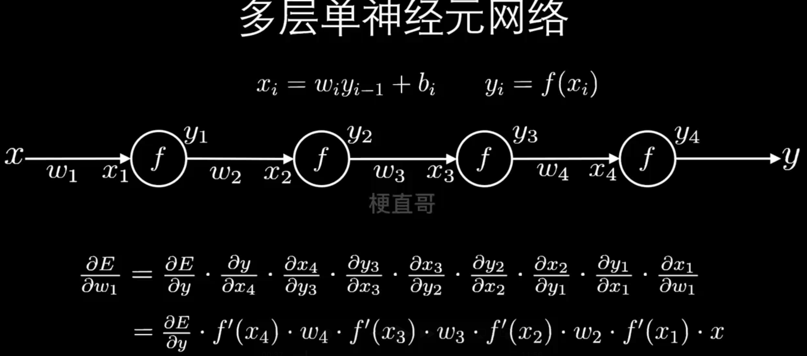
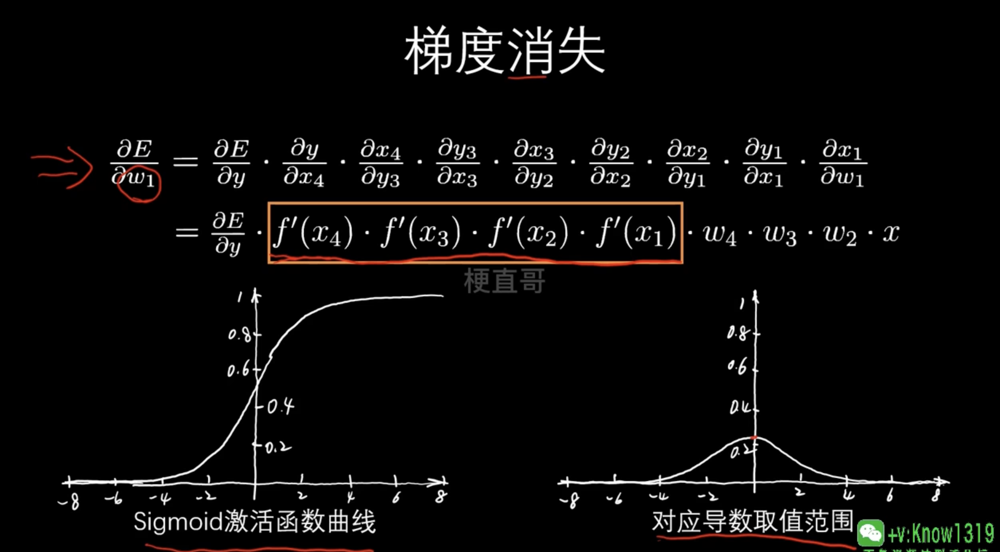
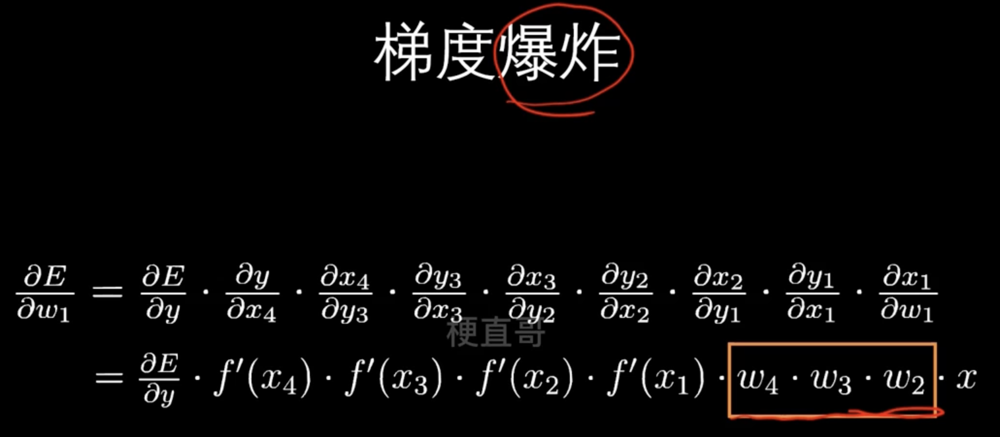

# 梯度消失和梯度爆炸





## 梯度消失



比如激活函数都是sigmoid，橘色筐住的部分连续求导（右下图为取值范围），

```
0.25*0.25*0.25*0.25 
```

传导到最前面的时候，就比较小了。


## 梯度爆炸





前向传播时候，随机数较大，导致了橘色筐住的部分数字较大


## 形成原因

- 神经网络串联式的结构
- 反向传播算法
- 不合适的激活函数
- 权重初始化值不合适


## 引发问题

- 梯度消失，导致网络退化
- 梯度爆炸，导致网络不稳定