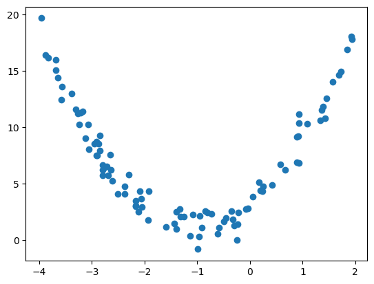
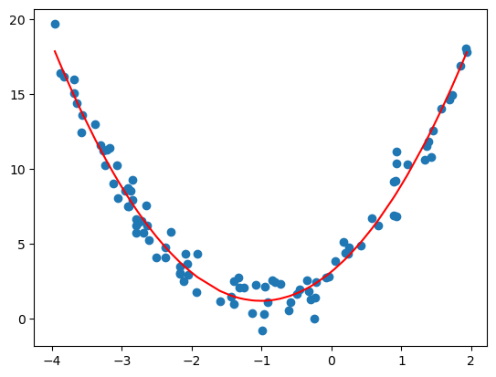

```python
import numpy as np
import matplotlib.pyplot as plt
```


```python
x = np.random.uniform(-4,2,size=(100))
y = 2*x**2 + 4*x + 3 + np.random.randn(100)

X = x.reshape(-1,1)
```


```python
plt.scatter(x,y)
plt.show()
```


    

    


# 多项式回归


```python
from sklearn.preprocessing import PolynomialFeatures
```


```python
polynomial_features = PolynomialFeatures(degree=2) # 2次幂
```


```python
X_poly = polynomial_features.fit_transform(X)
```


```python
from sklearn.linear_model import LinearRegression
model = LinearRegression()
model.fit(X_poly, y)
y_poly_pred = model.predict(X_poly)
```


```python
plt.scatter(x,y)
plt.plot(np.sort(x),y_poly_pred[np.argsort(x)],color='red')
plt.show()
```


    

    


```python

```
