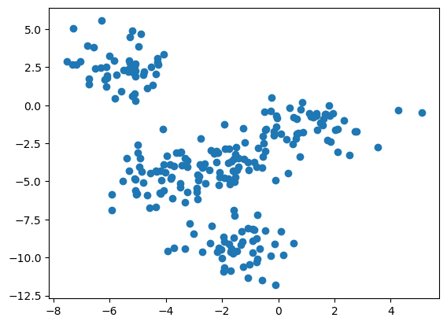

# 准备数据


```python
import numpy as np
import matplotlib.pyplot as plt
```


```python
from sklearn.datasets import make_blobs
X,y = make_blobs(n_samples=250, centers=5, n_features=2, random_state=2) # centers簇的数量，n_features是维度数量
plt.scatter(X[:,0],X[:,1])
plt.show()
```


    

    


# KMeans


```python
from sklearn.cluster import KMeans
kmeans = KMeans(n_clusters=5, random_state=0, n_init=10).fit(X)
```


```python
z= kmeans.labels_
kmeans.cluster_centers_

```


    array([[-4.29652036, -4.93390293],
           [-5.58999731,  2.51599379],
           [ 1.18660376, -1.28955305],
           [-1.46308464, -9.29766253],
           [-1.87390824, -3.65217934]])


# 评估模型效果

## 已知标签


```python
from sklearn.metrics import adjusted_mutual_info_score
adjusted_mutual_info_score(y,z)
```


    0.8900135197101819


```python
from sklearn.metrics import adjusted_rand_score
adjusted_rand_score(y,z)
```


    0.8813742091267537


```python
from sklearn.metrics import v_measure_score
v_measure_score(y,z)
```


    0.8922588882516964


## 未知标签

### 轮廓系数


```python
from sklearn.metrics import silhouette_score
kmeans = KMeans(n_clusters=5, random_state=0, n_init=10).fit(X)
cluster_labels = kmeans.labels_
si= silhouette_score(X, cluster_labels)
si
```


    0.5456836305956513


