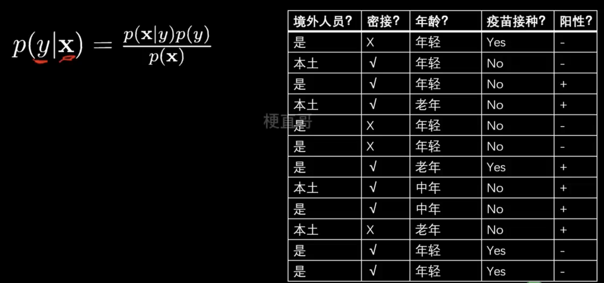
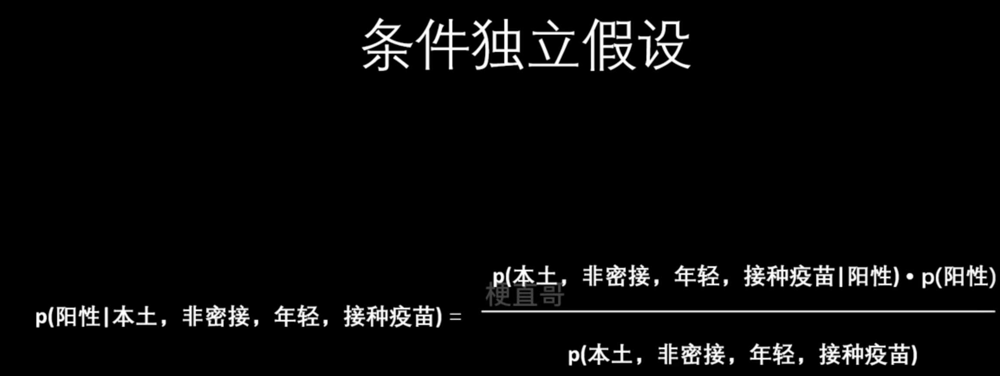
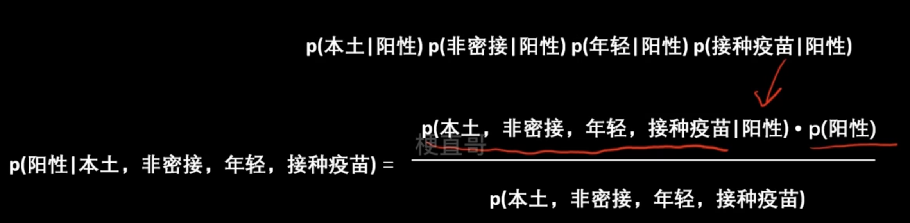
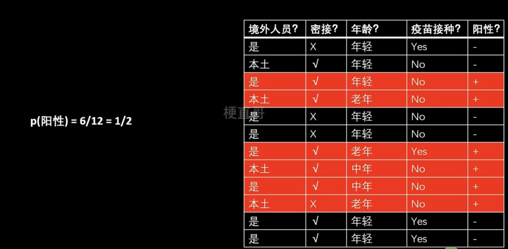
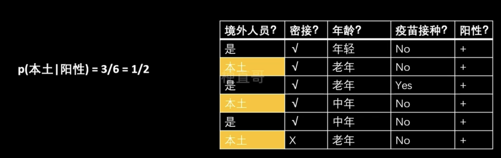
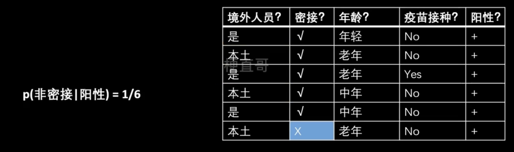
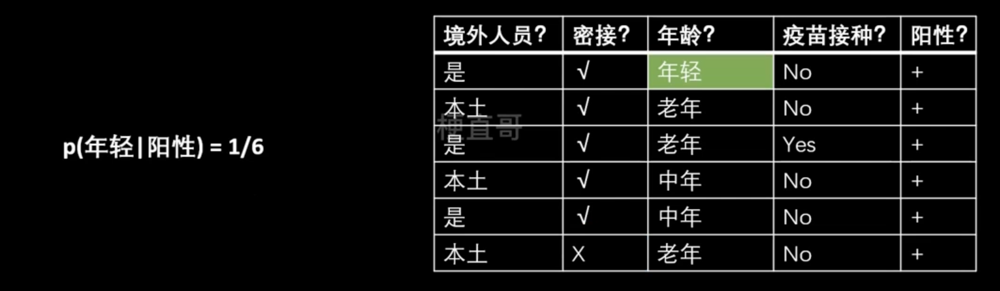
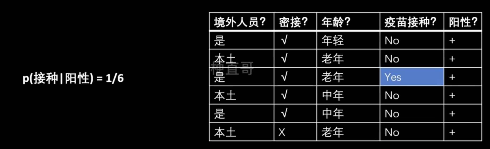
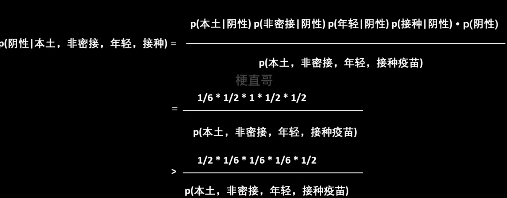

# 朴素贝叶斯

## 例子

按照贝叶斯公式，得到公式如下：

假设条件独立，则等于概率的连乘:

公式变为下面的内容：

### 计算过程

#### 阳性的计算过程

套入上面的计算结果，公式变为：

### 阴性的计算结果

(计算工程类似，略)

#### 比较结果

P（阴性｜本土，非密接，年轻，接种） 》 P（阳性性｜本土，非密接，年轻，接种， 所以此人没有感染新冠。

## 总结

- 逻辑简单，容易实现
- 效率高，时空开销小
- 条件独立假设不成立则分类效果一般
- 适用于特征相关性较小的时候