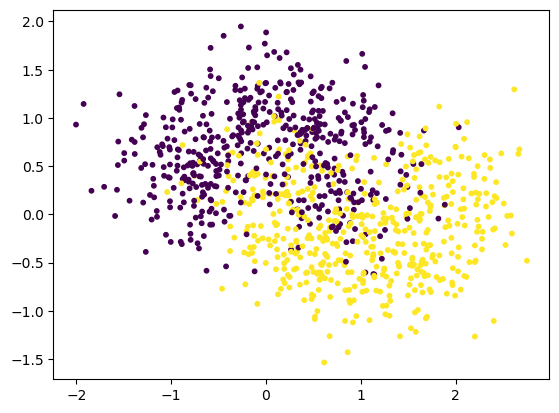

# 数据集


```python
import numpy as np
import matplotlib.pyplot as plt
```


```python
from sklearn.datasets import make_moons
```


```python
x,y= make_moons(
    n_samples=1000,
    noise=0.4,
    random_state=20
)
x.shape,y.shape
```


    ((1000, 2), (1000,))


```python
plt.scatter(x[:,0],x[:,1],c=y,s=10)
plt.show()
```


    

    


```python
from sklearn.model_selection import train_test_split
x_train,x_test,y_train,y_test = train_test_split(x,y,random_state=0)
```

## Bagging


```python
from sklearn.ensemble import BaggingClassifier
from sklearn.tree import DecisionTreeClassifier
```


```python
bagging = BaggingClassifier(
    estimator=DecisionTreeClassifier(),
    n_estimators=100,
    bootstrap=True, # ture是有放回取样
    max_samples=500,
    n_jobs=-1,
    random_state=20
)
```


```python
bagging.fit(x_train,y_train)
bagging.score(x_test,y_test)
```


    0.848


# OOB


```python
bagging = BaggingClassifier(
    estimator=DecisionTreeClassifier(),
    n_estimators=100,
    bootstrap=True, # ture是有放回取样
    max_samples=500,
    n_jobs=-1,
    oob_score= True,
    random_state=20
)
```


```python
bagging.fit(x,y)
bagging.oob_score_
```


    0.841


