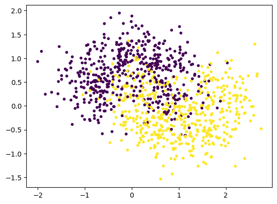

# 数据集


```python
import numpy as np
import matplotlib.pyplot as plt
```


```python
from sklearn.datasets import make_moons
```


```python
x,y= make_moons(
    n_samples=1000,
    noise=0.4,
    random_state=20
)
x.shape,y.shape
```


    ((1000, 2), (1000,))


```python
plt.scatter(x[:,0],x[:,1],c=y,s=10)
plt.show()
```


    

    


```python
from sklearn.model_selection import train_test_split
x_train,x_test,y_train,y_test = train_test_split(x,y,random_state=0)
```

# ADABOSST


```python
from sklearn.ensemble import AdaBoostClassifier
from sklearn.tree import DecisionTreeClassifier

ada_clf = AdaBoostClassifier(
    estimator= DecisionTreeClassifier(max_leaf_nodes=16),
    n_estimators=100
)

ada_clf.fit(x_train,y_train)
ada_clf.score(x_test,y_test)
```


    0.828


# Gradient Boosting


```python
from sklearn.ensemble import GradientBoostingClassifier
gb_clf = GradientBoostingClassifier(n_estimators=100)
gb_clf.fit(x_train,y_train)
gb_clf.score(x_test,y_test)
```


    0.86


