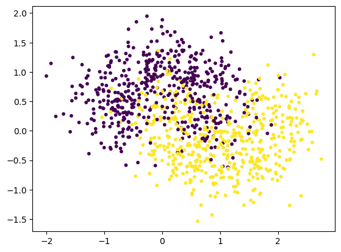

# 数据集


```python
import numpy as np
import matplotlib.pyplot as plt
```


```python
from sklearn.datasets import make_moons
```


```python
x,y= make_moons(
    n_samples=1000,
    noise=0.4,
    random_state=20
)
x.shape,y.shape
```


    ((1000, 2), (1000,))


```python
plt.scatter(x[:,0],x[:,1],c=y,s=10)
plt.show()
```


    

    


```python
from sklearn.model_selection import train_test_split
x_train,x_test,y_train,y_test = train_test_split(x,y,random_state=0)
```

## 查看某个算法的评分


```python
from sklearn.neighbors import KNeighborsClassifier
from sklearn.linear_model import LogisticRegression
from sklearn.naive_bayes import GaussianNB
```


```python
clf = [
    KNeighborsClassifier(n_neighbors=3),
    LogisticRegression(),
    GaussianNB()
]
```


```python
for i in range(len(clf)): # 打印每个模型的评分
    clf[i].fit(x_train,y_train)
    print(clf[i].score(x_test,y_test))
```

    0.832
    0.848
    0.848


## 集成学习


```python
from sklearn.ensemble import VotingClassifier
```


```python
clf = [
    KNeighborsClassifier(n_neighbors=3),
    LogisticRegression(),
    GaussianNB()
]
```


```python
vclf = VotingClassifier(
    estimators =[
        ("knn",clf[0]),clf[1]),
        ("gnb"
        ("lr",,clf[2])
    ],
    voting="hard", # 基于票数投票是hard voting， 基于概率投票是soft voting
    n_jobs=-1 # 并行执行
)
```


```python
vclf.fit(x_train,y_train)
vclf.score(x_test,y_test)
```


    0.852


