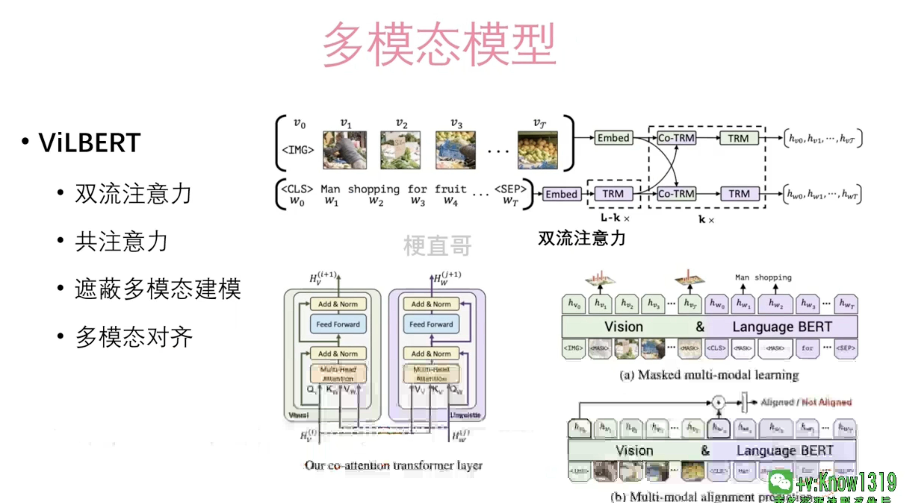

# 预训练模型

## 迁移学习

## 大语言模型

## Bert系列模型

## GPT 系列模型

## 多模态模型

多模态模型通常涉及以下步骤：

1. **特征提取**：对每种模态的数据进行特征提取。例如，使用卷积神经网络（CNN）提取图像特征，使用循环神经网络（RNN）或Transformer模型提取文本特征。
2. **特征融合**：将不同模态的特征整合到一起。这一步骤可以通过简单的拼接、加权和或更复杂的融合机制（如注意力机制）实现。
3. **任务特定处理**：将融合的特征用于特定任务，如分类、回归或序列生成。
4. **训练与优化**：多模态模型通常需要大量的标注数据进行训练，以确保模型能够有效地理解和处理不同模态的数据。

### 挑战

1. **数据对齐**：不同模态的数据可能具有不同的时间或空间分辨率，对齐这些数据是一个挑战。
2. **模态融合**：如何有效地融合不同模态的信息，使模型能够充分利用所有可用数据，是设计多模态模型时的关键考虑因素。
3. **数据稀缺**：对于一些特定任务，可能很难获取足够的多模态数据进行训练。

