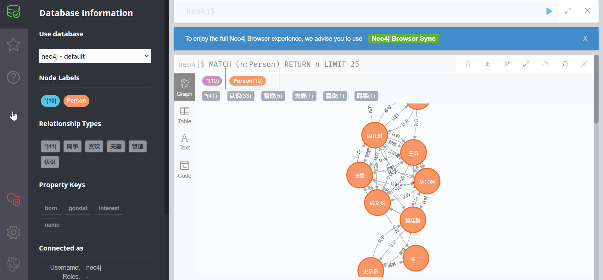

# Docker 搭建 Neo4j

## 启动镜像

	docker run -it -d -p 7474:7474 -p 7687:7687 neo4j

## 管理页面

	http://47.112.142.231:7474/

默认账号、密码：neo4j

## 示例代码

	CREATE 
	 (p1:Person {name:'胡兴炯', born:1991, interest:'mac,ios,旅游', goodat:'java,swift,objectiveC'}),
	 (p2:Person {name:'张勇', born:1990,  interest:'android', goodat:'java,android'}),
	 (p3:Person {name:'成文龙', born:1990, interest:'linux,hadoop', goodat:'linux,java,android'}),
	 (p4:Person {name:'王昕', born:1978, interest:'wpf,noSQL,旅游', goodat:'java,c#'}),
	 (p5:Person {name:'周开琪', born:1977 , interest:'管理', goodat:'管理,'}),
	 (p6:Person {name:'徐锦亮', born:1985,  interest:'前端', goodat:'前端，html5,hadoop'}),
	 (p7:Person {name:'张三', born:1993,  interest:'大数据', goodat:'hadoop，html5,java,lucene,elasticsearch,solr'}),
	 (p8:Person {name:'徐辉霞', born:1990,  interest:'管理,旅游', goodat:'管理,采购'}),
	 (p9:Person {name:'黄廷鹏', born:1992,  interest:'OA', goodat:'java'}),
	 (p10:Person {name:'史乐乐', born:1991,  interest:'OA,旅游', goodat:'管理'}),
	 (p1)-[:认识]->(p2),
	 (p1)-[:认识]->(p3),
	 (p1)-[:认识]->(p4),
	 (p1)-[:认识]->(p5),
	 (p1)-[:认识]->(p9),
	 (p2)-[:认识]->(p1),
	 (p2)-[:认识]->(p3),
	 (p2)-[:认识]->(p4),
	 (p2)-[:认识]->(p5),
	 (p2)-[:认识]->(p9),
	 (p3)-[:认识]->(p1),
	 (p3)-[:认识]->(p2),
	 (p3)-[:认识]->(p4),
	 (p3)-[:认识]->(p5),
	 (p3)-[:认识]->(p7),
	 (p4)-[:认识]->(p1),
	 (p4)-[:认识]->(p2),
	 (p4)-[:认识]->(p3),
	 (p4)-[:认识]->(p5),
	 (p4)-[:认识]->(p9),
	 (p5)-[:认识]->(p1),
	 (p5)-[:认识]->(p2),
	 (p5)-[:认识]->(p3),
	 (p5)-[:认识]->(p4),
	 (p5)-[:认识]->(p6),
	 (p5)-[:认识]->(p8),
	 (p5)-[:管理]->(p1),
	 (p5)-[:管理]->(p2),
	 (p5)-[:管理]->(p3),
	 (p5)-[:管理]->(p4),
	 (p5)-[:管理]->(p6),
	 (p6)-[:认识]->(p5),
	 (p6)-[:认识]->(p4),
	 (p6)-[:夫妻]->(p8),
	 (p9)-[:认识]->(p1),
	 (p9)-[:认识]->(p2),
	 (p9)-[:认识]->(p3),
	 (p9)-[:认识]->(p10),
	 (p9)-[:喜欢]->(p10),
	 (p10)-[:认识]->(p9),
	 (p10)-[:同事]->(p7)

