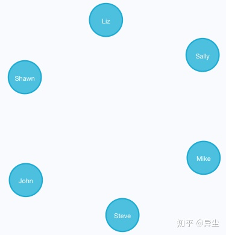
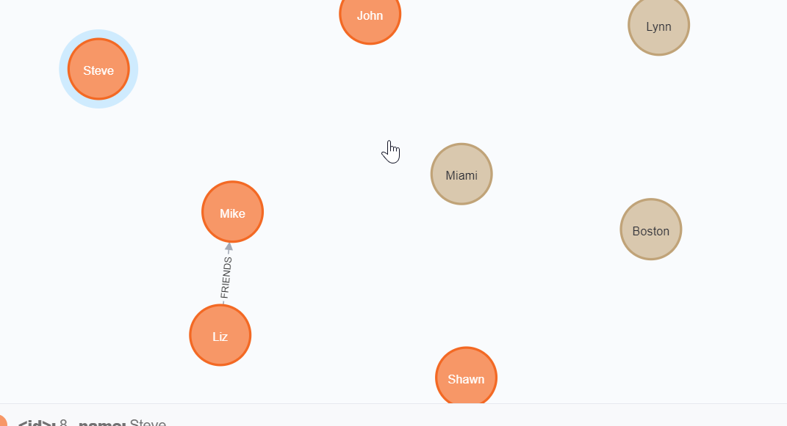
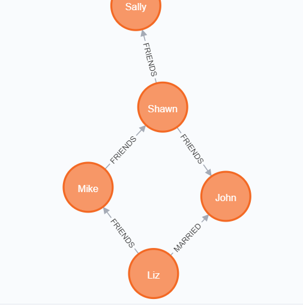
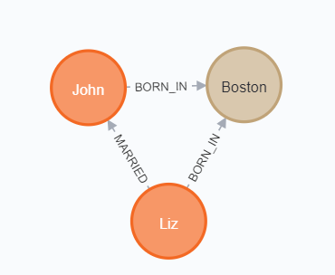
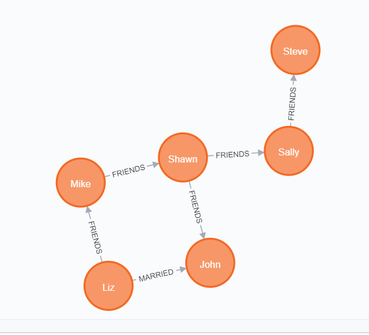
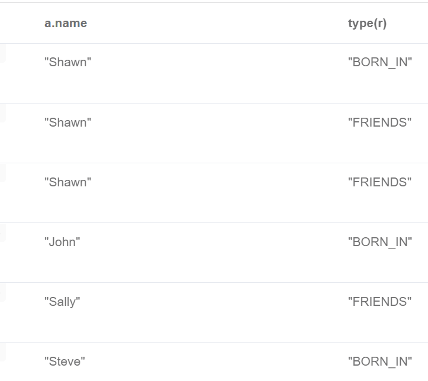
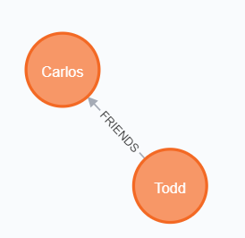
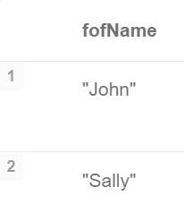

# 知识图谱Demo

参考：https://zhuanlan.zhihu.com/p/88745411

## 步骤

### 删除数据库中以往的图

	MATCH (n) DETACH DELETE n

这里，MATCH是匹配操作，而小括号()代表一个节点node（可理解为括号类似一个圆形），括号里面的n为标识符。

### 创建一个人物节点

	CREATE (n:Person {name:'John'}) RETURN n

CREATE是创建操作，Person是标签，代表节点的类型。花括号{}代表节点的属性，属性类似Python的字典。这条语句的含义就是创建一个标签为Person的节点，该节点具有一个name属性，属性值是John

### 创建更多的人物节点，并分别命名

需单条执行

	CREATE (n:Person {name:'Sally'}) RETURN n
	CREATE (n:Person {name:'Steve'}) RETURN n
	CREATE (n:Person {name:'Mike'}) RETURN n
	CREATE (n:Person {name:'Liz'}) RETURN n
	CREATE (n:Person {name:'Shawn'}) RETURN n

### 创建地区节点

需单条执行

	CREATE (n:Location {city:'Miami', state:'FL'}) 
	CREATE (n:Location {city:'Boston', state:'MA'})
	CREATE (n:Location {city:'Lynn', state:'MA'}) 
	CREATE (n:Location {city:'Portland', state:'ME'}) 
	CREATE (n:Location {city:'San Francisco', state:'CA'}) 

### 创建关系

	MATCH (a:Person {name:'Liz'}), 
	      (b:Person {name:'Mike'}) 
	MERGE (a)-[:FRIENDS]->(b)

### 创建关系（加属性）

	MATCH (a:Person {name:'Shawn'}), 
	      (b:Person {name:'Sally'}) 
	MERGE (a)-[:FRIENDS {since:2001}]->(b)

### 增加更多

	MATCH (a:Person {name:'Shawn'}), (b:Person {name:'John'}) MERGE (a)-[:FRIENDS {since:2012}]->(b)
	MATCH (a:Person {name:'Mike'}), (b:Person {name:'Shawn'}) MERGE (a)-[:FRIENDS {since:2006}]->(b)
	MATCH (a:Person {name:'Sally'}), (b:Person {name:'Steve'}) MERGE (a)-[:FRIENDS {since:2006}]->(b)
	MATCH (a:Person {name:'Liz'}), (b:Person {name:'John'}) MERGE (a)-[:MARRIED {since:1998}]->(b)

### 建立不同类型节点之间的关系-人物和地点的关系

	MATCH (a:Person {name:'John'}), (b:Location {city:'Boston'}) MERGE (a)-[:BORN_IN {year:1978}]->(b)

### 同样建立更多人的出生地

	MATCH (a:Person {name:'Liz'}), (b:Location {city:'Boston'}) MERGE (a)-[:BORN_IN {year:1981}]->(b)
	MATCH (a:Person {name:'Mike'}), (b:Location {city:'San Francisco'}) MERGE (a)-[:BORN_IN {year:1960}]->(b)
	MATCH (a:Person {name:'Shawn'}), (b:Location {city:'Miami'}) MERGE (a)-[:BORN_IN {year:1960}]->(b)
	MATCH (a:Person {name:'Steve'}), (b:Location {city:'Lynn'}) MERGE (a)-[:BORN_IN {year:1970}]->(b)

### 查询下所有在Boston出生的人物

	MATCH (a:Person)-[:BORN_IN]->(b:Location {city:'Boston'}) RETURN a,b

### 查询所有对外有关系的节点

	MATCH (a)-->() RETURN a

注意这里箭头的方向，返回结果不含任何地区节点，因为地区并没有指向其他节点（只是被指向）

### 查询所有有关系的节点

	MATCH (a)--() RETURN a

### 查询所有有结婚关系的节点

	MATCH (n)-[:MARRIED]-() RETURN n

### 创建节点的时候就建好关系

	CREATE (a:Person {name:'Todd'})-[r:FRIENDS]->(b:Person {name:'Carlos'})

### 查找某人的朋友的朋友

	MATCH (a:Person {name:'Mike'})-[r1:FRIENDS]-()-[r2:FRIENDS]-(friend_of_a_friend) RETURN friend_of_a_friend.name AS fofName

Mike的朋友是Shawn，Shawn的朋友是John和Sally

### 增加/修改节点的属性

	MATCH (a:Person {name:'Liz'}) SET a.age=34
	MATCH (a:Person {name:'Shawn'}) SET a.age=32
	MATCH (a:Person {name:'John'}) SET a.age=44
	MATCH (a:Person {name:'Mike'}) SET a.age=25

### 删除节点的属性

	MATCH (a:Person {name:'Mike'}) SET a.test='test'
	MATCH (a:Person {name:'Mike'}) REMOVE a.test

### 删除节点

	MATCH (a:Location {city:'Portland'}) DELETE a

### 删除有关系的节点

	MATCH (a:Person {name:'Todd'})-[rel]-(b:Person) DELETE a,b,rel