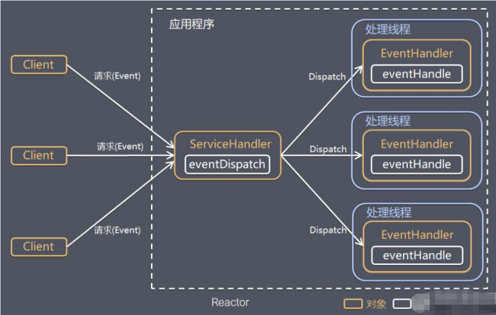
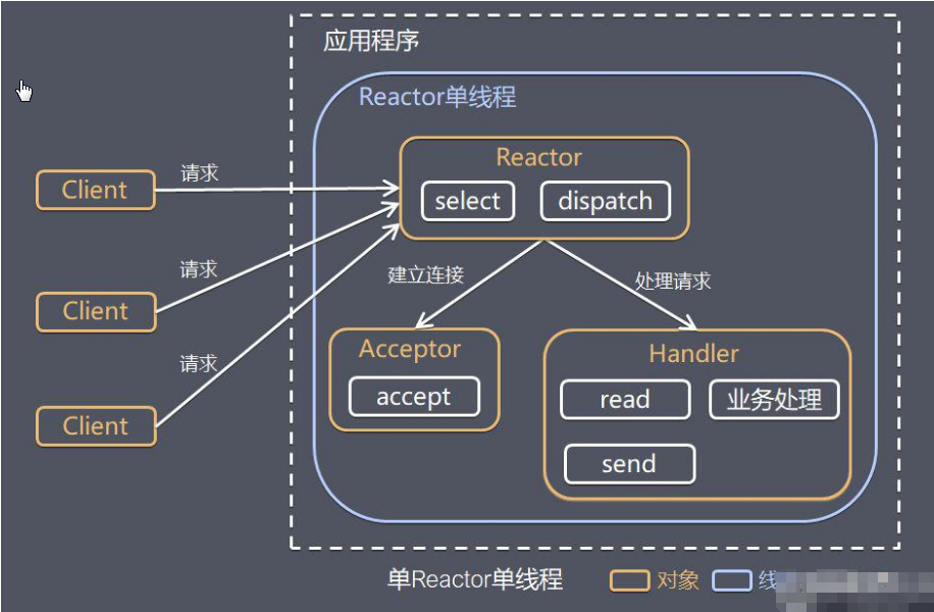
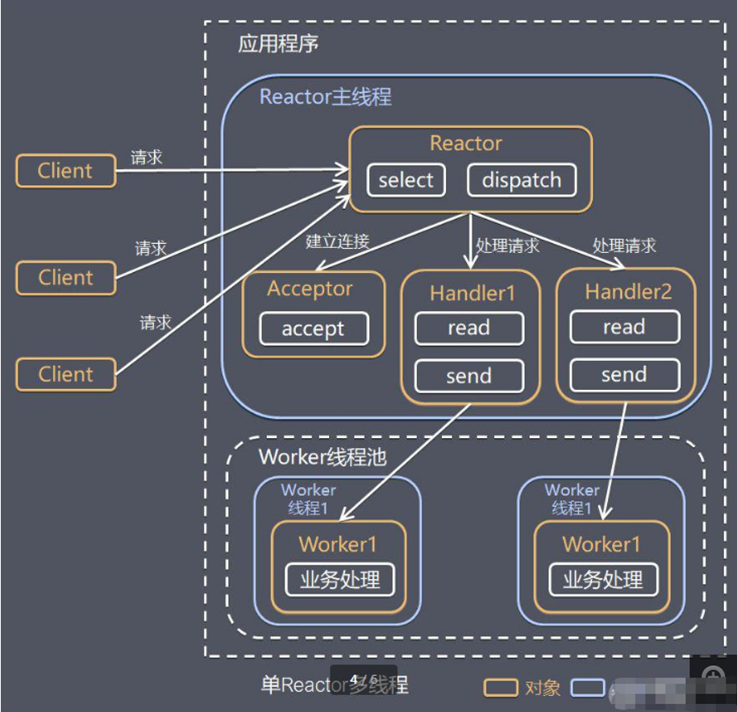
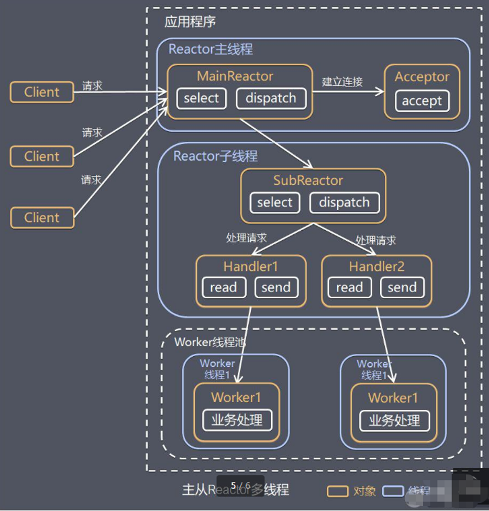

# Netty Reactor模式

## 简介

### Reactor 模式中 核心组成：

#### Reactor：

Reactor 在一个单独的线程中运行，负责监听和分发事件，分发给适当的处理程序来对 IO 事件做出反应。 它就像公司的电话接线员，它接听来自客户的电话并将线路转移到适当的联系人；

#### Handlers：

处理程序执行 I/O 事件要完成的实际事件，类似于客户想要与之交谈的公司中的实际官员。Reactor 通过调度适当的处理程序来响应 I/O 事件，处理程序执行非阻塞操作。

## 单reactor 单线程

单 Reactor 单线程，前台接待员和服务员是同一个人，全程为顾客服

## 单reactor 多线程

单 Reactor 单线程，前台接待员和服务员是同一个人，全程为顾客服

## 主从reactor 多线程

主从 Reactor 多线程，多个前台接待员，多个服务生。

Netty就是由这种模式演变而来
