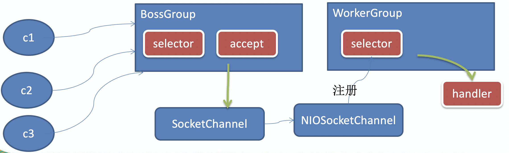
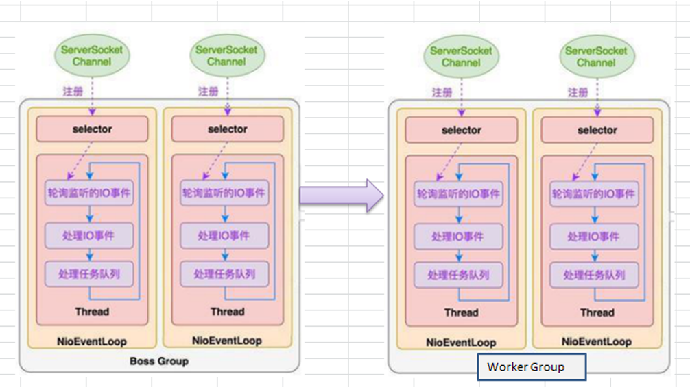

# Netty 模型

## 简单版

1. BossGroup 线程维护Selector , 只关注Accecpt
1. 当接收到Accept事件，获取到对应的SocketChannel, 封装成 NIOScoketChannel并注册到Worker 线程(事件循环), 并进行维护
1. 当Worker线程监听到selector 中通道发生自己感兴趣的事件后，就进行处理(就由handler)， 注意handler 已经加入到通道

## 进阶版

	1.Netty抽象出两组线程池 BossGroup 专门负责接收客户端的连接, WorkerGroup 专门负责网络的读写
	
	2.BossGroup 和 WorkerGroup 类型都是 NioEventLoopGroup
	
	3.NioEventLoopGroup 相当于一个事件循环组, 这个组中含有多个事件循环 ，每一个事件循环是 NioEventLoop

	4.NioEventLoop 表示一个不断循环的执行处理任务的线程， 每个NioEventLoop 都有一个selector , 用于监听绑定在其上的socket的网络通讯

	5.NioEventLoopGroup 可以有多个线程, 即可以含有多个NioEventLoop
	
	6.每个Boss NioEventLoop 循环执行的步骤有3步
	(1)轮询accept 事件
	(2)处理accept 事件 , 与client建立连接 , 生成NioScocketChannel , 并将其注册到某个worker NIOEventLoop 上的 selector 
	(3)处理任务队列的任务 ， 即 runAllTasks
	
	7. 每个 Worker NIOEventLoop 循环执行的步骤
	(1)轮询read, write 事件
	(2)处理i/o事件， 即read , write 事件，在对应NioScocketChannel 处理
	(3)处理任务队列的任务 ， 即 runAllTasks
	
	8. 每个Worker NIOEventLoop  处理业务时，会使用pipeline(管道), pipeline 中包含了 channel , 即通过pipeline 可以获取到对应通道, 管道中维护了很多的 处理器
