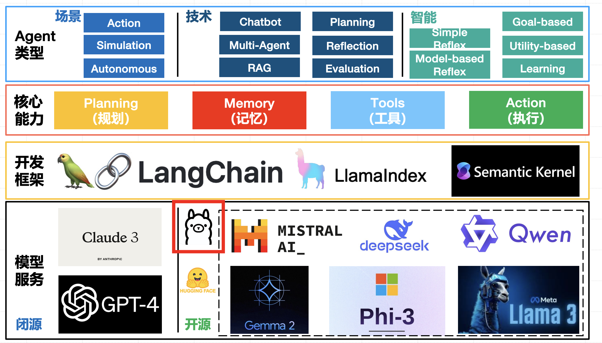
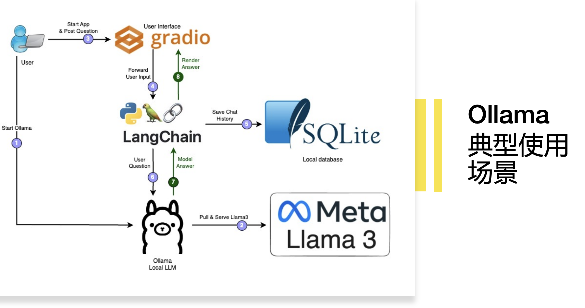
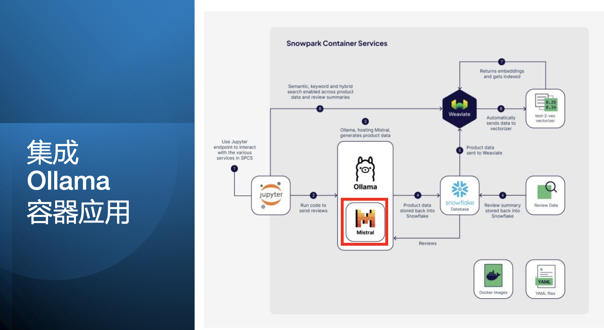
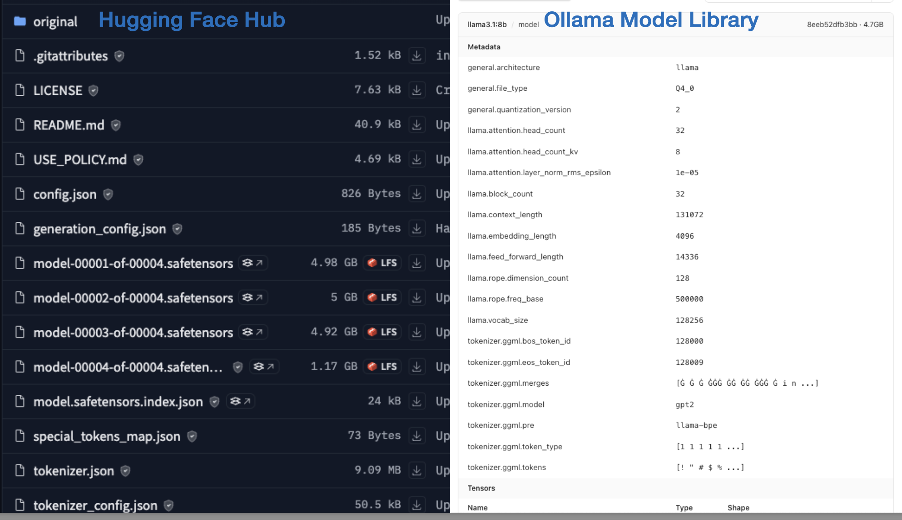
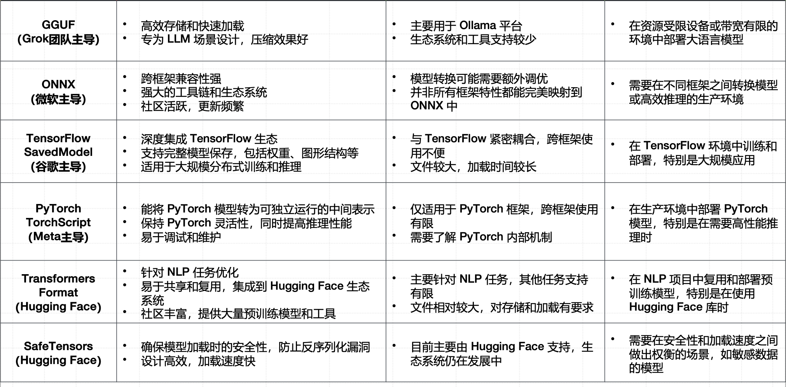
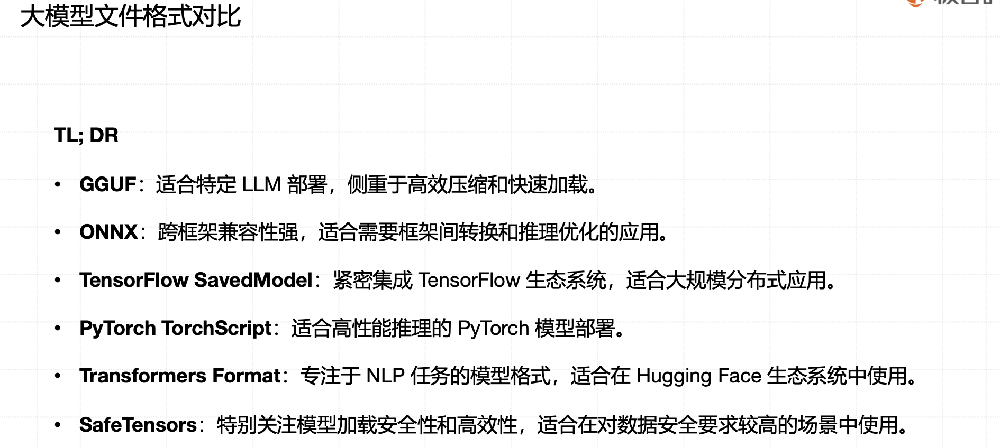

# Ollma 是什么

## 定位

最简单好用的LLMOps

## 核心功能和特点

### 核心功能

• 模型导入: 支持多种模型格式（GGUF、SafeTensors等）。

 • 高效运行: 优化模型的运行效率，支持大规模模型的快速部署。

 • 模型管理: 支持多模型管理，方便快速切换和调整。

### 特点

• 易用性：简化操作流程，适合各种技术水平的用户。

 • 扩展性：支持集成第三方工具，满足定制化需求。

## 容器服务示例图

## Ollama 模型管理与 Modelfile

### 模型文件的样子

### 模型权重文件的格式

