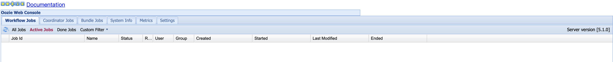

# Oozie 安装

## 前提条件

### 依赖环境
安装好hadoop,JDK

hadoop版本：2.7.7

### 下载安装包
	apache-maven-3.6.3-bin.tar.gz 
	oozie-5.1.0.tar.gz
	mysql-connector-java-8.0.18.jar
	ext-2.2.zip  (下载地址：http://archive.cloudera.com/gplextras/misc/ext-2.2.zip)
		
		
## 安装步骤

### 修改hadoop配置文件

cd /root/hadoop-2.7.7/etc/hadoop
vim  core-site.xml

	<property>
        <name>hadoop.proxyuser.root.hosts</name>
        <value>*</value>
    </property>
    <property>
        <name>hadoop.proxyuser.root.groups</name>
        <value>*</value>
    </property>

### 启动hadoop

除了启动hadoop外，还需要启动historyserver

	sbin/mr-jobhistory-daemon.sh start historyserver

### 安装Maven

	tar -zxvf apache-maven-3.6.3-bin.tar.gz
	
添加参数文件

vi /etc/profile

	export MAVEN_HOME=/root/apache-maven-3.6.3
	export PATH=$MAVEN_HOME/bin:$PATH

source /etc/profile
	
验证：

	mvn -version

#### 配置仓库镜像

在conf/settings.xml文件下，修改mirror（自己配置阿里云）：

    <mirrors>
        <mirror>
          <id>alimaven</id>
          <name>aliyun maven</name>
          <url>http://maven.aliyun.com/nexus/content/groups/public/</url>
          <mirrorOf>central</mirrorOf>
        </mirror>
    </mirrors>	
	

### 安装OOzie

	tar -zxvf oozie-5.1.0.tar.gz
	
#### 修改pom

	vi /root/oozie-5.1.0/pom.xml	
	
将hadoop版本修改为2.7.7

#### 限制内存（非必须）

	export MAVEN_OPTS="-Xmx512m -XX:MaxPermSize=128m"
	echo 1 > /proc/sys/vm/drop_caches	

#### 编译
	
	cd /root/oozie-5.1.0
	#编译
	bin/mkdistro.sh -DskipTests -Puber -Phadoop-2 -Dhadoop.version=2.7.7 -Dhadoop.auth.version=2.7.7 -Ddistcp.version=2.7.7 
	
#### 如果出现内存不足的编译失败提示

	[INFO] --- maven-compiler-plugin:3.7.0:compile (default-compile) @ oozie-core ---
	[INFO] Changes detected - recompiling the module!
	[INFO] Compiling 575 source files to /root/oozie-5.2.0/core/target/classes
	OpenJDK 64-Bit Server VM warning: INFO: os::commit_memory(0x00000000fa4f3000, 58576896, 0) failed; error='Cannot allocate memory' (errno=12)
	#
	# There is insufficient memory for the Java Runtime Environment to continue.
	# Native memory allocation (mmap) failed to map 58576896 bytes for committing reserved memory.
	# An error report file with more information is saved as:
	# /root/oozie-5.2.0/hs_err_pid3467.log
	
清理内存

	echo 1 > /proc/sys/vm/drop_caches	
	
修改Maven文件夹下mvn文件，添加如下内容：

	export MAVEN_OPTS="-Xmx512m -XX:MaxPermSize=128m"	

### 执行成功界面

	[INFO] Reactor Summary for Apache Oozie Main 5.1.0:
	[INFO] 
	[INFO] Apache Oozie Main .................................. SUCCESS [10:02 min]
	[INFO] Apache Oozie Fluent Job ............................ SUCCESS [  0.449 s]
	[INFO] Apache Oozie Fluent Job API ........................ SUCCESS [05:52 min]
	[INFO] Apache Oozie Client ................................ SUCCESS [ 41.855 s]
	[INFO] Apache Oozie Share Lib Oozie ....................... SUCCESS [02:36 min]
	[INFO] Apache Oozie Share Lib HCatalog .................... SUCCESS [ 42.147 s]
	[INFO] Apache Oozie Share Lib Distcp ...................... SUCCESS [  1.431 s]
	[INFO] Apache Oozie Core .................................. SUCCESS [02:26 min]
	[INFO] Apache Oozie Share Lib Streaming ................... SUCCESS [  7.159 s]
	[INFO] Apache Oozie Share Lib Pig ......................... SUCCESS [ 13.034 s]
	[INFO] Apache Oozie Share Lib Git ......................... SUCCESS [ 54.661 s]
	[INFO] Apache Oozie Share Lib Hive ........................ SUCCESS [  5.776 s]
	[INFO] Apache Oozie Share Lib Hive 2 ...................... SUCCESS [  6.341 s]
	[INFO] Apache Oozie Share Lib Sqoop ....................... SUCCESS [  2.599 s]
	[INFO] Apache Oozie Examples .............................. SUCCESS [ 29.398 s]
	[INFO] Apache Oozie Share Lib Spark ....................... SUCCESS [ 41.167 s]
	[INFO] Apache Oozie Share Lib ............................. SUCCESS [ 23.455 s]
	[INFO] Apache Oozie Docs .................................. SUCCESS [ 47.358 s]
	[INFO] Apache Oozie WebApp ................................ SUCCESS [03:01 min]
	[INFO] Apache Oozie Tools ................................. SUCCESS [  7.037 s]
	[INFO] Apache Oozie MiniOozie ............................. SUCCESS [  3.194 s]
	[INFO] Apache Oozie Fluent Job Client ..................... SUCCESS [  2.176 s]
	[INFO] Apache Oozie Server ................................ SUCCESS [ 40.666 s]
	[INFO] Apache Oozie Distro ................................ SUCCESS [01:17 min]
	[INFO] Apache Oozie ZooKeeper Security Tests .............. SUCCESS [ 30.385 s]
	[INFO] ------------------------------------------------------------------------
	[INFO] BUILD SUCCESS
	[INFO] ------------------------------------------------------------------------
	[INFO] Total time:  36:05 min
	[INFO] Finished at: 2020-10-10T17:48:36+08:00
	[INFO] ------------------------------------------------------------------------
	[WARNING] The requested profile "hadoop-2" could not be activated because it does not exist.	

文件被安装到了 /root/oozie-5.1.0/distro/target 目录下

### 解压安装包

	cd /root/oozie-5.1.0/distro/target
	mkdir /root/bigdata
	tar -zxvf oozie-5.1.0-distro.tar.gz -C /root/bigdata

### 修改配置文件	

vi /etc/profile
	
	export OOZIE_HOME=/root/bigdata/oozie-5.1.0
	PATH=$OOZIE_HOME/bin:$PATH
	
## 安装mysql

参考安装mysql的文档

检查是否启动成功：

	service mysqld status

### 新增表

	create database oozie;
	create user 'oozieowner'@'%' identified by '1qa2ws#ED';              
	grant all on oozie.* TO 'oozieowner'@'%'; 
	flush privileges;

## 修改配置文件

vi /root/bigdata/oozie-5.1.0/conf/oozie-site.xml

在<configuration>标签中插入：

    <property>
        <name>oozie.service.JPAService.jdbc.driver</name>
        <value>com.mysql.jdbc.Drive</value>
    </property>
    
    <property>
        <name>oozie.service.JPAService.jdbc.url</name>
        <value>jdbc:mysql://localhost:3306/oozie</value>
    </property>
    
    <property>
        <name>oozie.service.JPAService.jdbc.username</name>
        <value>oozieowner</value>
    </property>
    
    <property>
        <name>oozie.service.JPAService.jdbc.password</name>
        <value>1qa2ws#ED</value>
    </property>
    
    <property>
        <name>oozie.service.HadoopAccessorService.hadoop.configurations</name>
        <value>*=/root/hadoop-2.7.7/etc/hadoop/</value>
    </property>

	<property>
		<name>mapreduce.jobhistory.address</name>
		<value>http://172.18.156.87:10020</value>
	</property> 

	<property>
		<name>oozie.service.WorkflowAppService.system.libpath</name>
		<value>hdfs://172.18.156.87:9000/user/root/share/lib</value>
	</property>

  
 
## 配置环境
    
### 上传插件

	mkdir /root/bigdata/oozie-5.1.0/libext

上传ext-2.2.zip和 mysql-connector-java-8.0.21.jar 上传到root/bigdata/oozie-5.1.0/libext

上传mysql-connector-java-8.0.21.jar 到 /root/bigdata/oozie-5.1.0/lib

unzip ext-2.2.zip

### 拷贝jar包

	cp /root/hadoop-2.7.7/share/hadoop/*/*.jar /root/bigdata/oozie-5.1.0/libext
	\cp -fr /root/hadoop-2.7.7/share/hadoop/*/lib/*.jar /root/bigdata/oozie-5.1.0/libext
	#上面的斜线表示不overwrite重复的jar包
	

## 初始化oozie

### 生成Oozie数据库相关表

 
 	bin/ooziedb.sh create -sqlfile oozie.sql -run DB Connection

### 启动

	bin/oozie-start.sh

成功启动界面：

	Oozie DB has been created for Oozie version '5.1.0'
	
	The SQL commands have been written to: /tmp/ooziedb-8717935146489701641.sql
	
	Oozie server started - PID: 28728.
	
	
访问：

	http://47.112.142.231:11000/oozie
	

### 错误

Oozie web console is disabled.

解决方案：

	wget http://public-repo-1.hortonworks.com/HDP-UTILS-GPL-1.1.0.22/repos/centos7-ppc/extjs/extjs-2.2-1.noarch.rpm
	rpm -ivh extjs-2.2-1.noarch.rpm
	
	#删掉这个/usr/hdp/current/oozie-server/.prepare_war_cmd
	rm /usr/hdp/current/oozie-server/.prepare_war_cmd
	
	
