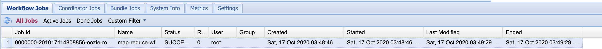

# Oozie 运行自带Demo

## 前置步骤

### 启动Hadoop的historyserver

	sbin/mr-jobhistory-daemon.sh start historyserver
	
	
### 解压example文件和share文件

	cd /root/bigdata/oozie-5.1.0
	tar -zxvf oozie-examples.tar.gz
	tar -zxvf oozie-sharelib-5.1.0.tar.gz
	
## 修改配置文件

### job.properties 

	cd /root/bigdata/oozie-5.1.0/examples/apps/map-reduce
	vi job.properties 
	
修改参数（namenode和resourcw）：
	
	nameNode=hdfs://172.18.156.87:9000
	resourceManager=http://172.18.156.87:8032
	queueName=default
	examplesRoot=examples
	
	oozie.wf.application.path=${nameNode}/user/${user.name}/${examplesRoot}/apps/map-reduce/workflow.xml
	outputDir=map-reduce	
	
注意：nameNode和resourceManager端口配错了可能会导致任务启动不了或者一直Runing
	
### workflow.xml

在该文件下可以定义工作流

## 部署测试项目

	hdfs dfs -mkdir -p /user/root/
	hdfs dfs -put examples/ /user/root/
	hdfs dfs -put share/ /user/root/
	
	oozie job -oozie http://172.18.156.87:11000/oozie/ -config /root/bigdata/oozie-5.1.0/examples/apps/map-reduce/job.properties -run
	
	
输出：
	
	[root@wangzheyi map-reduce]# oozie job -oozie http://172.18.156.87:11000/oozie/ -config /root/bigdata/oozie-5.1.0/examples/apps/map-reduce/job.properties -run
	job: 0000000-201017093429032-oozie-root-W
	
	
## 检查状态

	[root@wangzheyi ~]# oozie admin -oozie http://localhost:11000/oozie -status
	System mode: NORMAL
	
## 任务成功界面

访问：

	http://47.112.142.231:11000/oozie/

