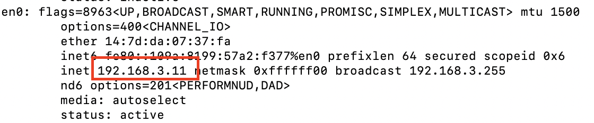
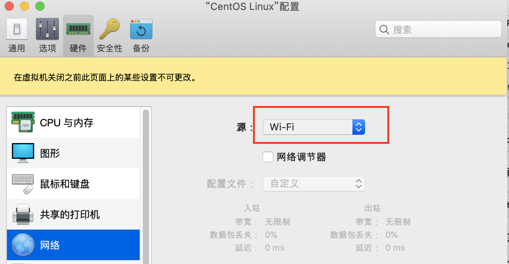
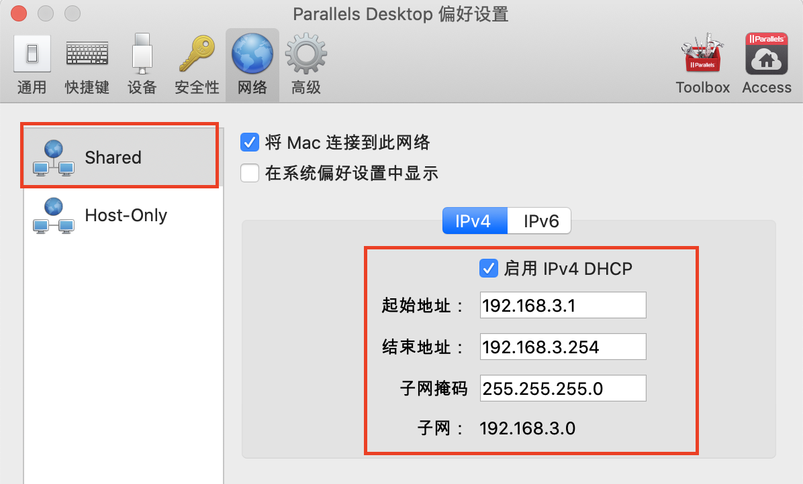

# Parallel Desktop 网络设置

系统：Mac

解决Parallel Desktop 安装的centos等镜像连接外网的问题

## 设置

### 设置虚拟机网络

vi /etc/sysconfig/network-scripts/ifcfg-eth0

修改：

	TYPE=Ethernet
	BOOTPROTO=static #修改为static
	DEFROUTE=yes
	PEERDNS=yes
	PEERROUTES=yes
	IPV4_FAILURE_FATAL=no
	IPV6INIT=yes
	IPV6_AUTOCONF=yes
	IPV6_DEFROUTE=yes
	IPV6_PEERDNS=yes
	IPV6_PEERROUTES=yes
	IPV6_FAILURE_FATAL=no
	NAME=eth0
	UUID=dc473b53-e434-4eba-b849-5cbc428da0e3
	DEVICE=eth0
	ONBOOT=yes  #修改为yes
	#新增
	IPADDR=192.168.3.100
	NETMASK=255.255.255.0
	GATEWAY=192.168.3.1
	DNS1=192.168.3.1
	
其中Gateway的地址来自于宿主机。在宿主机上执行：ifconfig

vi /etc/resolv.conf

	nameserver 192.168.3.1
		
	
## 设置parallel desktop

设置镜像的网络为wifi

设置parallel的网络为

## 安装插件

	yum update all
	yum install net-tools.x86_64

## 测试

在镜像内：

	ping www.baidu.com
	
在宿主机上：

	ssh root@192.168.3.100