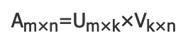
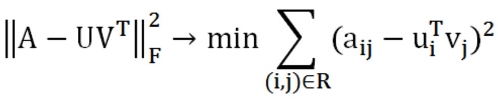

# ALS 算法

参考：

https://www.jianshu.com/p/1bc7e5fb243d?from=timeline

https://blog.csdn.net/pysense/article/details/103880967

## 定义

交替最小平方 (ALS) 矩阵分解:

ALS：Alternating Least Squares matrix factorization

ALS 尝试将评级矩阵 R 估计为两个较低级别矩阵(X 和 Y,即 X = Yt = R)的乘积。一般方法是迭代。在每次迭代期间,一个因子矩阵保持不变,而另一个因子矩阵使用最小二乘求解。然后,在求解另一个因子矩阵时,新求解的因子矩阵保持不变。

**它同时考虑了User和Item两个方面，即即可基于用户进行推荐又可基于物品，所以适合推荐型的场景。**

模型一般如下：

原始协同矩阵是一个m * n的矩阵，是由mk和kn两个矩阵相乘得到的，其中k<<m,n，U表示用户矩阵，V表示商品矩阵，k为U、V矩阵的的秩。学过线性代数应该知道A*B=C，两个矩阵相乘的结果，这就是所谓协同矩阵。

协同推荐就等同于C=A*B矩阵分解，矩阵分解（协同推荐矩阵是一个稀疏矩阵，因为不是所有的用户都对产品评分）最终又可以转换成了一个优化问题。将用户u对商品V的评分矩阵分解为两个矩阵：一个是用户对商品隐含特征的偏好矩阵，另一个是商品所包含的隐含特征的矩阵。在这个矩阵分解的训练过程中，评分缺失项得到了填充，那么这个填充的项就可以根据用户ID进行推荐。
