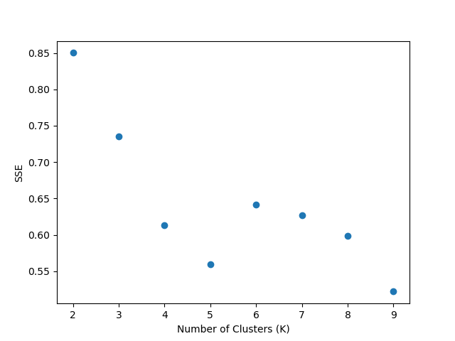
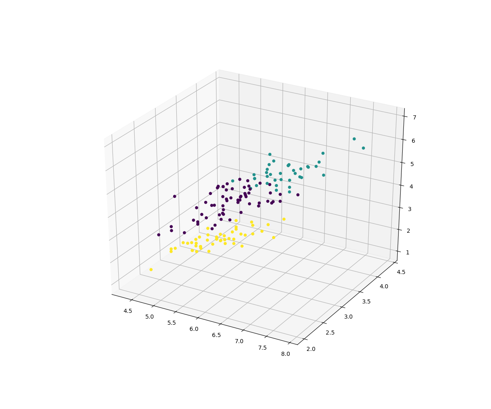

# 聚类 Demo

## 代码

	from pyspark.ml.evaluation import ClusteringEvaluator
	from pyspark.sql import SparkSession
	from pyspark.ml.feature import VectorAssembler
	from pyspark.ml.clustering import KMeans
	import pandas as pd
	import matplotlib.pyplot as plt
	
	if __name__ == '__main__':
	
	    spark = SparkSession.builder.appName("clustering").getOrCreate()
	    df = spark.read.csv('/Users/zheyiwang/Downloads/machine-learning-with-pyspark-master/chapter_7_Clustering/iris_dataset.csv'
	                        ,inferSchema=True, header= True)
	    print(df.show(10,False))
	
	    #特征工程
	    input_cols =['sepal_length','sepal_width','petal_length','petal_width']
	    vec_assembler =VectorAssembler(inputCols=input_cols, outputCol='features')
	    final_data = vec_assembler.transform(df)
	
	    # 构建k-mean clustering
	    errors = []
	    for k in range (2,10):
	        kmeans = KMeans(featuresCol='features', k=k)
	        model = kmeans.fit(final_data)
	        predictions = model.transform(final_data)
	        evaluator = ClusteringEvaluator()
	        intra_distance = evaluator.evaluate(predictions)
	        errors.append(intra_distance)
	
	    #绘制类内距离
	    cluster_number = range(2,10)
	    plt.xlabel("Number of Clusters (K)")
	    plt.ylabel("SSE")
	    plt.scatter(cluster_number,errors)
	    plt.show()
	
	    # 由上图得知k=3是最合适的聚类数量，因为3和4这两个值之间存在肘部形状
	    kmeans = KMeans(featuresCol='features',k=3)
	    model = kmeans.fit(final_data)
	    count = model.transform(final_data).groupBy("prediction").count()
	    print("新模型的分类分布：")
	    print(count.show())
	
	    # 验证分组
	    predictions = model.transform(final_data)
	    count2 = predictions.groupBy('species','prediction').count()
	    print("带种类的预测：")
	    print(count2.show()) # setosa、versicolor分类很好，virginica较差
	
	    # pandas图表
	    pd.set_option('display.width', 1000)  #调整显示宽度，以便整行显示
	    pd.set_option('display.max_columns', None) # 显示所有列
	    pd.set_option('display.max_rows', None) # 显示所有行
	    pandas_df = predictions.toPandas()
	    print("pandas可视化：")
	    print(pandas_df.head())
	
	    # 可视化
	    cluster_vis = plt.figure(figsize=(12,10)).gca(projection='3d')
	    cluster_vis.scatter(pandas_df.sepal_length,pandas_df.sepal_width,pandas_df.petal_length,
	                        c=pandas_df.prediction, depthshade=False)
	    plt.show()
	    
## 显示

	+------------+-----------+------------+-----------+-------+
	|sepal_length|sepal_width|petal_length|petal_width|species|
	+------------+-----------+------------+-----------+-------+
	|5.1         |3.5        |1.4         |0.2        |setosa |
	|4.9         |3.0        |1.4         |0.2        |setosa |
	|4.7         |3.2        |1.3         |0.2        |setosa |
	|4.6         |3.1        |1.5         |0.2        |setosa |
	|5.0         |3.6        |1.4         |0.2        |setosa |
	|5.4         |3.9        |1.7         |0.4        |setosa |
	|4.6         |3.4        |1.4         |0.3        |setosa |
	|5.0         |3.4        |1.5         |0.2        |setosa |
	|4.4         |2.9        |1.4         |0.2        |setosa |
	|4.9         |3.1        |1.5         |0.1        |setosa |
	+------------+-----------+------------+-----------+-------+
	
	新模型的分类分布：
	+----------+-----+
	|prediction|count|
	+----------+-----+
	|         1|   38|
	|         2|   50|
	|         0|   62|
	+----------+-----+

	带种类的预测：
	+----------+----------+-----+
	|   species|prediction|count|
	+----------+----------+-----+
	|    setosa|         2|   50|
	| virginica|         0|   14|
	| virginica|         1|   36|
	|versicolor|         1|    2|
	|versicolor|         0|   48|
	+----------+----------+-----+

	pandas可视化：
		 sepal_length  sepal_width  petal_length  petal_width  species          features          prediction
	0           5.1               3.5           1.4          	0.2           setosa    [5.1, 3.5, 1.4, 0.2]           2
	1           4.9               3.0           1.4          	0.2           setosa    [4.9, 3.0, 1.4, 0.2]           2
	2           4.7               3.2           1.3          	0.2           setosa    [4.7, 3.2, 1.3, 0.2]           2
	3           4.6               3.1           1.5          	0.2           setosa    [4.6, 3.1, 1.5, 0.2]           2
	4           5.0               3.6           1.4          	0.2           setosa    [5.0, 3.6, 1.4, 0.2]          2

## 图片

