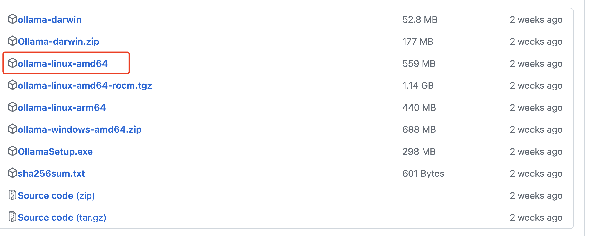

# Qwen2 本地化部署


## 下载


查看cup型号：

```
(base) [root@iZhp3d04dsxubzx7j4fz75Z ~]# lscpu


Architecture:          x86_64
CPU op-mode(s):        32-bit, 64-bit
Byte Order:            Little Endian
CPU(s):                4
On-line CPU(s) list:   0-3
Thread(s) per core:    2
Core(s) per socket:    2
Socket(s):             1
NUMA node(s):          1
Vendor ID:             GenuineIntel
CPU family:            6
Model:                 85
Model name:            Intel(R) Xeon(R) Platinum
Stepping:              4
CPU MHz:               2499.998
BogoMIPS:              4999.99
Hypervisor vendor:     KVM
Virtualization type:   full
L1d cache:             32K
L1i cache:             32K
L2 cache:              1024K
L3 cache:              33792K
NUMA node0 CPU(s):     0-3
```


下载：

https://github.com/ollama/ollama/releases/




