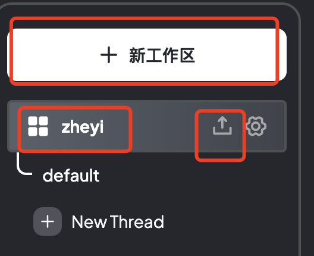

# Qwen2本地部署和接入知识库


## 下载LM studio


https://lmstudio.ai/


##  下载Qwen2 聊天模型


https://www.modelscope.cn/models/qwen/qwen2-7b-instruct-gguf/files


创建一个路径 

```
/modles/Qwen/Qwen2-7B-Instruct-GGUF
```

把qwen2-7b-instruct-q5_0.gguf 文件放进去


## LM studio中加载模型


打开LM studio，点击左侧“my models”, 选择模型本地路径“ models folder/Users/zheyiwang/Documents/models”，选择模型，保存。


## LM studio中选择chat配置


点击chat，右侧将Flash attention 勾选上。避免乱码


再在界面上方加载模型Qwen2


重新加载模型，配置就生效。


## 配置Ollama

为了分析文档，需要下载Ollma并安装

```
https://ollama.com/
```


命令行启动ollama:

```
ollama run llama3
```


命令行下载分词器：

```
ollama pull aerok/acge_text_embedding
```


## 启动 LM studio server


回到LM studio，启动server


获取服务器地址：


## 配置anythingLLM


下载anythingllm并安装

```
https://anythingllm.com/download
```


打开后，点击左下角设置


### 配置LLM提供者和URL


在anythingLLM中，选择LLM provider是LM studio， 填入获取的URL


点击保存配置。


## 配置Embedding

在anythingLLM中，配置embedding 为acge_text_embedding


## 本地知识库搭建


在anythingLLM中新建workspace，点击上传




上传文件或者URL


选择完毕后，加入右侧


点击保存。


## 知识库问答


上传的文档内有这些内容：


跟大模型提问,就可以获取内容：


