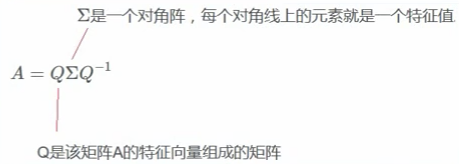

# MF矩阵分解 -- SVD、LFM、RSVD、SVD++

矩阵分解 （Matrix Factorization）

## 针对的问题

* 协同过滤处理【稀疏矩阵】的能力比较弱
* 协同过滤中，相似度矩阵的维护难度大

## 例子

* 上图表示分解为用户矩阵 * 物品矩阵
* 用隐向量，给每个用户与每首音乐打上标签

实际应用中：

* 矩阵是稀疏的
*  k的值可以自定义
* 这里的隐含特征是不可解释的，我们不知道具体含义，要模型自己去学
* k的大小决定了隐向量表达能力的强弱，k越大，表达信息就越强，就是把用户的兴趣和物品的分类划分的越具体

预测评分的计算公式：

* rui指的是哪个user对哪个item的评分
* pu指的是用户矩阵
* qi指的是物品矩阵
*  pu,k 指的是用户矩阵和k的内积
*  qk,1 指的是物品矩阵和k的内积

## MF的几种方式

基本假设

### 特征值分解

特征值、特征向量：

缺点：实际业务中，方阵的概率比较小

### 奇异值分解（SVD）  Singular Value Decomposition

参考：https://www.bilibili.com/video/BV16A411T7zX/?spm_id_from=333.337.search-card.all.click&vd_source=a267912a9cbb36e71ab719af20b7a8cb

* M：原始矩阵
* Sigma：对角线是奇异值，其他值为零

几何意义拆分

图解线性变换：

#### SVD 适用场景

#### 如何求解SVD

### Basic SVD

### RSVD

### SVD ++