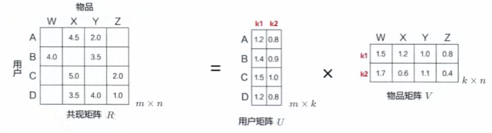

# MF矩阵分解 -- SVD、LFM、RSVD、SVD++

矩阵分解 （Matrix Factorization）

## 针对的问题

* 协同过滤处理【稀疏矩阵】的能力比较弱
* 协同过滤中，相似度矩阵的维护难度大

## 例子

* 上图表示分解为用户矩阵 * 物品矩阵
* 用隐向量，给每个用户与每首音乐打上标签

* 矩阵是稀疏的
* 这里的隐含特征是不可解释的，我们不知道具体含义，要模型自己去学
* k的大小决定了隐向量表达能力的强弱，k越大，表达信息就越强，就是把用户的兴趣和物品的分类划分的越具体

预测评分的计算公式：

rui指的是哪个user对哪个item的评分

## MF的几种方式

### 特征值分解

### 奇异值分解（SVD）  Singular Value Decomposition

### Basic SVD

### RSVD

### SVD ++