# 协同过滤（Collaborative-filtering）

## 基本思想

人以类聚，物以群分

## 演化关系图

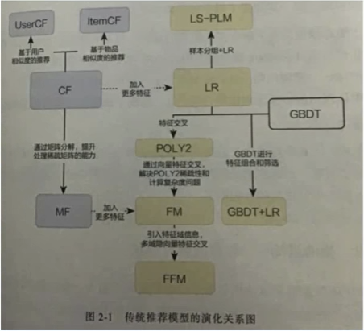

## 目标场景

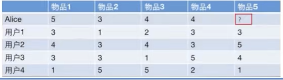

## 相似度计算方式

### Jaccard 杰卡德相似度

### 余弦相似度
比较常用，效果不差。局限性在于对于【评分数据不规范】的时候，有些用户喜欢打高分，有些用户喜欢打地方的情况，这时候用余弦相似度计算出来的结果就不准确了。

#### 计算公式

两个向量相乘 除以 两个向量模相乘。

#### 代码Demo

	from sklearn.metrics.pairwise import cosine_similarity
	i = [1,0,0,0]
	j = [1,0.5,0.5,0]
	cosine_similarity([i,j])

输出

	array([[1.        , 0.81649658],
	       [0.81649658, 1.        ]])

### 皮尔逊相关系数

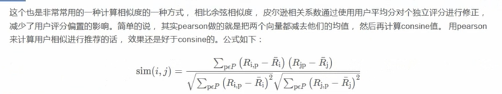

Ri, Rj 是两个向量 R上划线表示平均数

#### 代码Demo

	from scipy.stats import pearsonr
	i = [1,0,0,0]
	j = [1,0.5,0.5,0]
	pearsonr(i,j) 

输出

	PearsonRResult(statistic=0.816496580927726, pvalue=0.18350341907227397)

### 余弦相似度 VS 欧式距离？

欧式距离体现了数值上的绝对差异，而余弦相似度体现了方向上的差异。 余弦相似度强调夹角，而欧式距离强调绝对值。

举例：

* 如果统计两部剧的用户观看行为，用户A的观看向量（0，1），用户B为（1，0）。此时二者的余弦距离很大，而欧式距离很小。分析两个用户对于不同视频的偏好，更关注的是差异，所以用余弦距离。
* 如果分析用户活跃度，以登录次数和平均观看时长作为特征时，余弦距离会认为（1，10）和（10，100）两个用户距离很近。但是显然两者活跃度是有极大的差距的，所以应该用欧式距离。

## UserCF 基于User的协同过滤

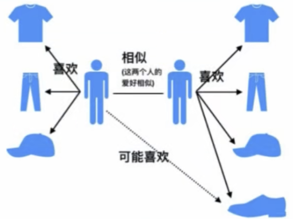

### Demo需求分析

计算过程

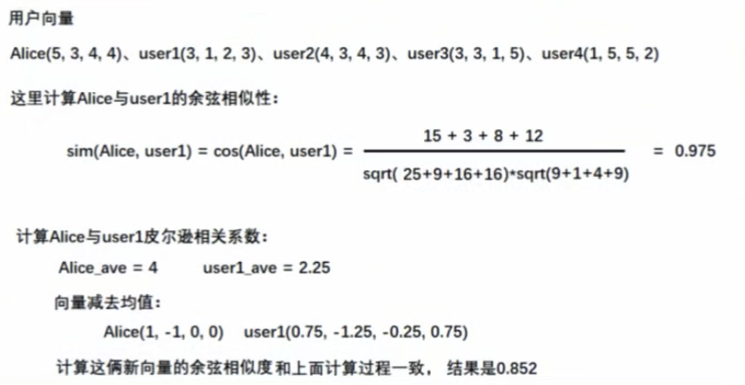

### 代码实现

	##余弦相似度
	import numpy as np
	from sklearn.metrics.pairwise import cosine_similarity
	
	users = np.array([[5,3,4,4],[3,1,2,3],[4,3,4,4],[3,3,1,5],[1,5,5,2]])
	cosine_similarity(users)

输出

	array([[1.        , 0.9753213 , 0.99453584, 0.89072354, 0.79668736],
	       [0.9753213 , 1.        , 0.96664431, 0.91160719, 0.67478587],
	       [0.99453584, 0.96664431, 1.        , 0.89856345, 0.83941956],
	       [0.89072354, 0.91160719, 0.89856345, 1.        , 0.67082039],
	       [0.79668736, 0.67478587, 0.83941956, 0.67082039, 1.        ]])

	#皮尔森系数
	np.corrcoef(users)

输出

	array([[ 1.        ,  0.85280287,  0.81649658,  0.        , -0.79211803],
	       [ 0.85280287,  1.        ,  0.87038828,  0.42640143, -0.88662069],
	       [ 0.81649658,  0.87038828,  1.        ,  0.        , -0.56591646],
	       [ 0.        ,  0.42640143,  0.        ,  1.        , -0.59408853],
	       [-0.79211803, -0.88662069, -0.56591646, -0.59408853,  1.        ]])

得出结论，Alice跟用户1和用户2最相似。

### 预测分数

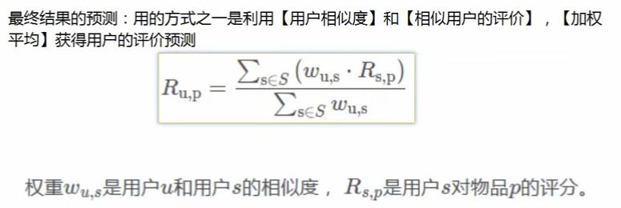

在Demo中套公式：

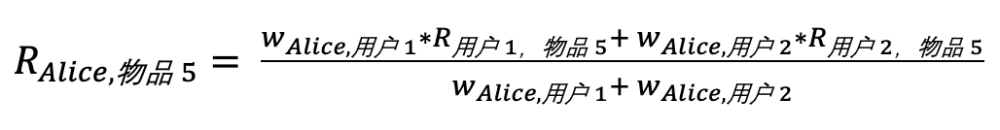

R是分数，w是相似度。

####优化方案：

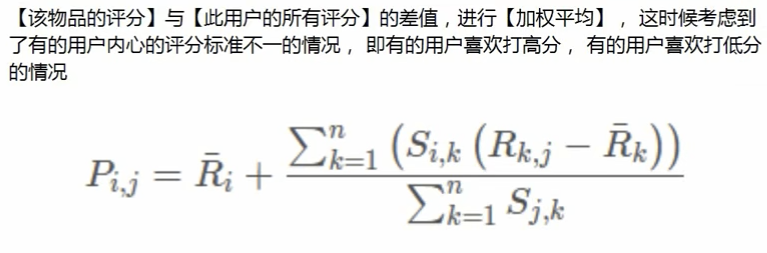

在Demo中套公式：

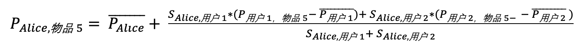

P是分数，S是相似度。

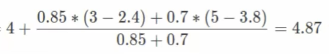

在推荐系统中，可以设置评分超过某一个阈值，则认为用户感兴趣，可以推荐给用户。

### 缺点

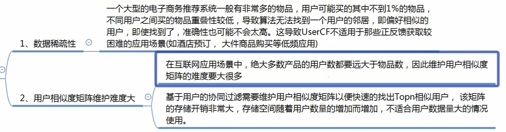

### 适用场景

用户少，物品多，时效性强的场合。比如新闻推荐场景。

## ItemCF 基于Item的协同过滤

因为UserCF的以上两点缺陷，导致了电商平台没有采用这种算法，而是采用了ItemCF算法实现最初的推荐系统。

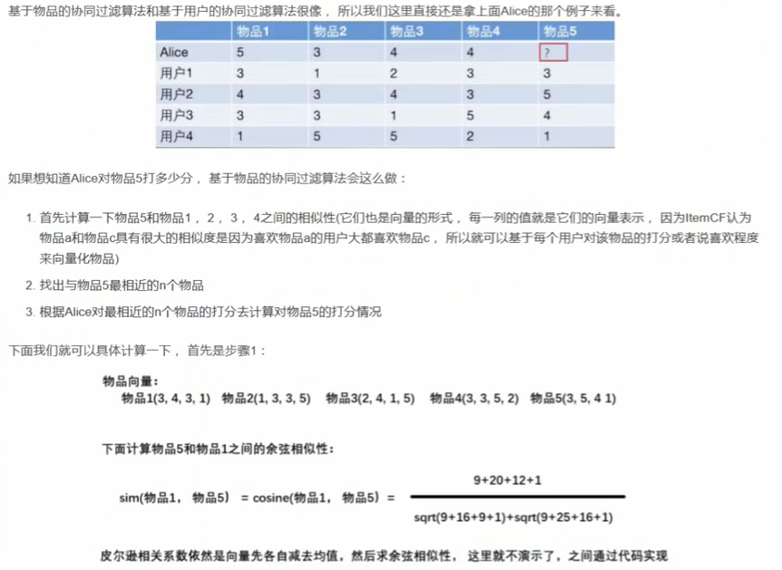

####代码：

	##余弦相似度
	import pandas as pd
	from sklearn.metrics.pairwise import cosine_similarity
	
	items = np.array([[3,4,3,1],[1,3,3,5],[2,4,1,5],[3,3,5,2],[3,5,4,1]])
	cols = ['item'+ str(i) for i in range(1,6)]
	pd.DataFrame(np.corrcoef(items),columns=cols,index=cols)

输出：

		      item1	      item2	    item3	     item4	      item5
	item1	1.000000	-0.648886	-0.435286	0.473684	0.969458
	item2	-0.648886	1.000000	0.670820	-0.324443	-0.478091
	item3	-0.435286	0.670820	1.000000	-0.870572	-0.427618
	item4	0.473684	-0.324443	-0.870572	1.000000	0.581675
	item5	0.969458	-0.478091	-0.427618	0.581675	1.000000

从上图看出，item5跟item1, item4比较类似。

####预测分数：

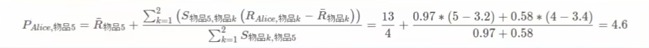

#### 优点

* Item based 算法的预测结果比user based算法的质量高
* 由于Item based 算法可以预先计算好物品的相似度，所以在线的预测性比user based算法的高

#### 缺点

* 数据稀疏性
* 物品相似度矩阵维护难度大

#### 适用场景

* 兴趣变换较为稳定的应用，更接近个性化的推荐
* 适合物品少，用户多，用户兴趣固定持久，物体更新速度不是太快的场合。比如推荐艺术品，音乐，电影。

## 数据稀疏性的解释

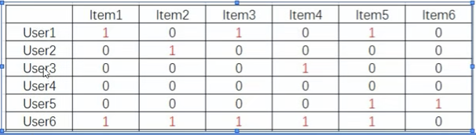

比如item1 和 item6的内积就是0 ，无法做预测。

## UserCF 和 ItemCF的区别

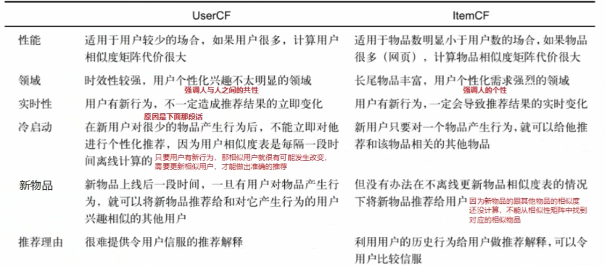

## UserCF 和 ItemCF的共同缺点

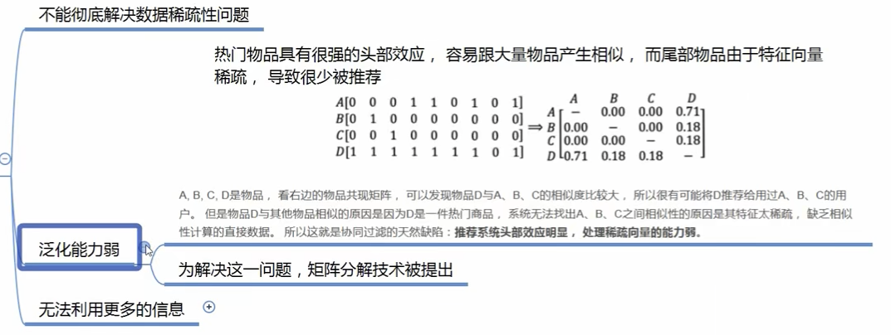
