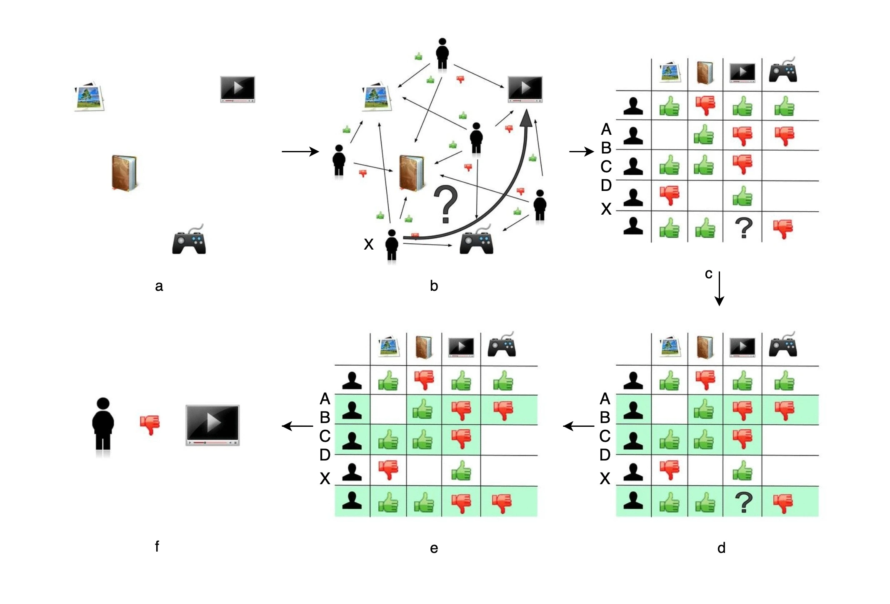
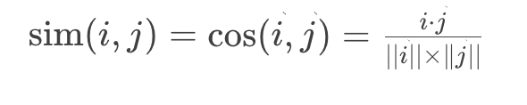
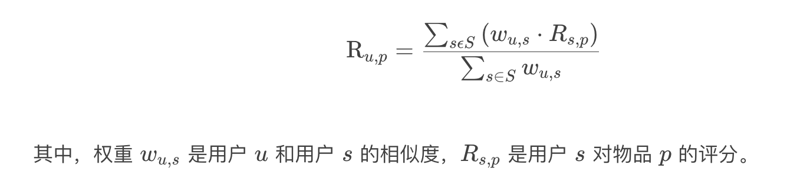
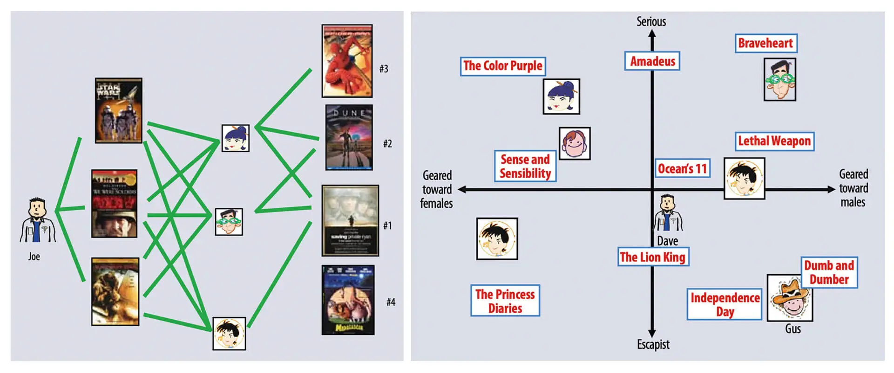
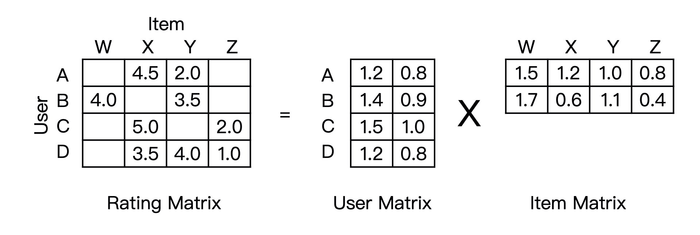
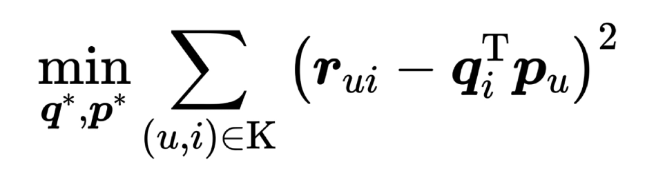
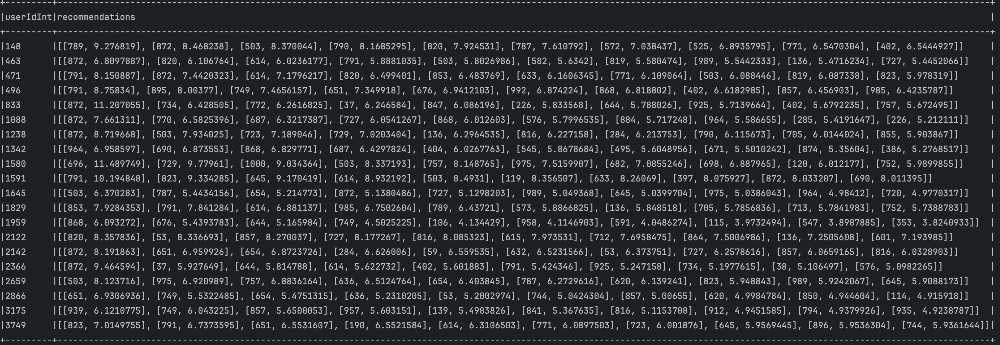
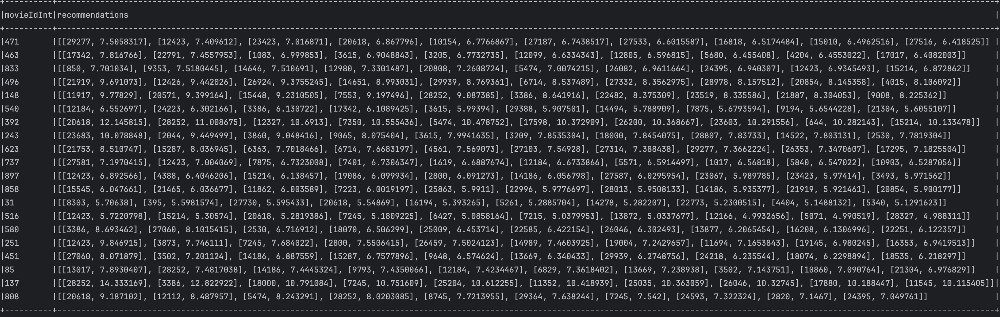
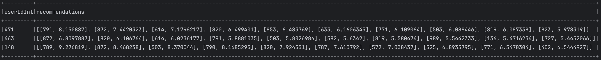
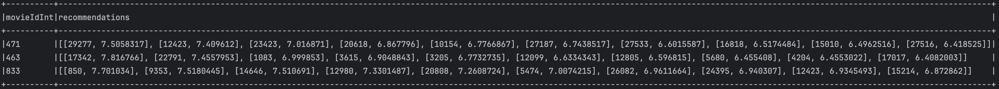

# ALS 协同过滤


## 概念

电商推荐系统从得到原始数据到生成最终推荐分数，全过程一共可以总结为 6 个步骤，如下所示。



电商网站的商品库里一共有 4 件商品：一个游戏机、一本小说、一本杂志，以及一台电视机。


假设，现在有一名用户 X 访问了这个电商网站，电商网站的推荐系统需要决定是否推荐电视机给用户 X。


为了进行这项预测，推荐系统可以利用的数据有用户 X 对其他商品的历史评价数据，以及其他用户对这些商品的历史评价数据。我在图 1(b) 中用绿色“点赞”的标志表示好评，用红色“踩”的标志表示了差评。这样一来，用户、商品和评价记录就构成了带有标识的有向图。


接下来，为了方便计算，我们将有向图转换成矩阵的形式。这个矩阵表示了物品共同出现的情况，因此被称为“共现矩阵”。其中，用户作为矩阵行坐标，物品作为列坐标，我们再把“点赞”和“踩”的用户行为数据转换为矩阵中相应的元素值。这里，我们将“点赞”的值设为 1，将“踩”的值设为 -1，“没有数据”置为 0（如果用户对物品有具体的评分，那么共现矩阵中的元素值可以取具体的评分值，没有数据时的默认评分也可以取评分的均值）。


成共现矩阵之后，推荐问题就转换成了预测矩阵中问号元素（图 1(d) 所示）的值的问题。由于在“协同”过滤算法中，推荐的原理是让用户考虑与自己兴趣相似用户的意见。因此，我们预测的第一步就是找到与用户 X 兴趣最相似的 n（Top n 用户，这里的 n 是一个超参数）个用户，然后综合相似用户对“电视机”的评价，得出用户 X 对“电视机”评价的预测。


从共现矩阵中我们可以知道，用户 B 和用户 C 由于跟用户 X 的行向量近似，被选为 Top n（这里假设 n 取 2）相似用户，接着在图 1(e) 中我们可以看到，用户 B 和用户 C 对“电视机”的评价均是负面的。因为相似用户对“电视机”的评价是负面的，所以我们可以预测出用户 X 对“电视机”的评价也是负面的。在实际的推荐过程中，推荐系统不会向用户 X 推荐“电视机”这一物品。


## 计算用户相似度


首先，我们来解决计算用户相似度的问题。计算用户相似度其实并不是什么难事，因为在共现矩阵中，每个用户对应的行向量其实就可以当作一个用户的 Embedding 向量。相信你早已经熟悉 Embedding 相似度的计算方法，那我们这里依葫芦画瓢就可以知道基于共现矩阵的用户相似度计算方法啦。最经典的方法就是利用余弦相似度了，它衡量了用户向量 i 和用户向量 j 之间的向量夹角大小。夹角越小，余弦相似度越大，两个用户越相似，它的定义如下：





## 用户评分的预测


接下来，我们再来看看推荐分数的计算。在获得 Top n 个相似用户之后，利用 Top n 用户生成最终的用户 u 对物品 p 的评分是一个比较直接的过程。这里，我们假设的是“目标用户与其相似用户的喜好是相似的”，根据这个假设，我们可以利用相似用户的已有评价对目标用户的偏好进行预测。最常用的方式是，利用用户相似度和相似用户评价的加权平均值，来获得目标用户的评价预测，公式如下所示。





## 矩阵分解算法的原理


虽然说协同过滤是目前公认的最经典的推荐算法，但我们还是可以轻松找出它的缺点，那就是共现矩阵往往非常稀疏，在用户历史行为很少的情况下，寻找相似用户的过程并不准确。于是，著名的视频流媒体公司 Netflix 对协同过滤算法进行了改进，提出了矩阵分解算法，加强了模型处理稀疏矩阵的能力。


这里，我们还是用一个直观的例子来理解一下什么叫做矩阵分解。这次我从 Netflix 的矩阵分解论文中截取了两张示意图（图 2），来比较协同过滤和矩阵分解的原理。




如图 2(a) 所示，协同过滤算法找到用户可能喜欢的视频的方式很直观，就是利用用户的观看历史，找到跟目标用户 Joe 看过同样视频的相似用户，然后找到这些相似用户喜欢看的其他视频，推荐给目标用户 Joe。


矩阵分解算法则是期望为每一个用户和视频生成一个隐向量，将用户和视频定位到隐向量的表示空间上（如图 2(b) 所示），距离相近的用户和视频表明兴趣特点接近，在推荐过程中，我们就应该把距离相近的视频推荐给目标用户。例如，如果希望为图 2(b) 中的用户 Dave 推荐视频，我们可以找到离 Dave 的用户向量最近的两个视频向量，它们分别是《Ocean’s 11》和《The Lion King》，然后我们可以根据向量距离由近到远的顺序生成 Dave 的推荐列表。


**矩阵分解的主要过程，就是先分解协同过滤生成的共现矩阵，生成用户和物品的隐向量，再通过用户和物品隐向量间的相似性进行推荐。**


那这个过程的关键就在于如何分解这个共现矩阵了。从形式上看，矩阵分解的过程是直观的，就是把一个 mxn 的共现矩阵，分解成一个 mxk 的用户矩阵和 kxn 的物品矩阵相乘的形式（如图 3）




那关键问题就剩下一个，也就是我们该通过什么方法把共现矩阵分解开呢？最常用的方法就是梯度下降。为了实现梯度下降，最重要的一步是定义损失函数 L，定义好损失函数我们才能够通过求导的方式找到梯度方向，这里我们就给出矩阵分解损失函数的定义如下。




这个目标函数里面，rui 是共现矩阵里面用户 u 对物品 i 的评分，qi 是物品向量，pu 是用户向量，K 是所有用户评分物品的全体集合。


通过目标函数的定义我们可以看到，我们要求的物品向量和用户向量，是希望让物品向量和用户向量之积跟原始的评分之差的平方尽量小。简单来说就是，我们希望用户矩阵和物品矩阵的乘积尽量接近原来的共现矩阵。


## 关键代码-矩阵分解代码实现


```scala
// 建立矩阵分解模型
val als = new ALS()
  .setMaxIter(5)
  .setRegParam(0.01)
  .setUserCol("userIdInt")
  .setItemCol("movieIdInt")
  .setRatingCol("ratingFloat")


//训练模型
val model = als.fit(training)


//得到物品向量和用户向量
model.itemFactors.show(10, truncate = false)
model.userFactors.show(10, truncate = false

```

- `.setMaxIter(5)`：设置算法的最大迭代次数为 5。这是优化问题的迭代次数，迭代次数越多，模型越有可能收敛到更好的结果，但计算成本也更高。
- `.setRegParam(0.01)`：设置正则化参数为 0.01。正则化用于防止模型过拟合，通过在优化过程中加入一个惩罚项来控制模型复杂度


## 关键代码-设置冷启动策略

```scala
model.setColdStartStrategy("drop")
```

- `setColdStartStrategy("drop")`: 这行代码设置了冷启动策略为 "drop"。在推荐系统中，冷启动问题指的是如何处理那些在训练数据中没有足够信息的新用户或新物品（即用户或物品的评分历史很少或没有）。当模型试图为这些新用户或物品生成推荐时，它可能无法生成有效的预测。
- 选择 "drop" 策略意味着在生成预测时，如果遇到了没有足够数据支持预测的用户或物品，这些用户或物品的预测会被从最终结果中删除。这可以避免产生基于非常有限信息的低质量推荐。


## 关键代码 -初始化回归评估器&使用评估器计算 RMSE

```scala
val evaluator = new RegressionEvaluator()
  .setMetricName("rmse")
  .setLabelCol("ratingFloat")
  .setPredictionCol("prediction")
val rmse = evaluator.evaluate(predictions)
```


- `new RegressionEvaluator()`: 创建一个新的 `RegressionEvaluator` 对象，这是一个用于评估回归模型性能的工具。
- `.setMetricName("rmse")`: 设置评估指标为均方根误差（Root Mean Squared Error, RMSE）。RMSE 是评估回归任务中常用的性能指标，用于测量预测值与实际值之间的差异。值越小，表明模型的预测准确性越高。
- `.setLabelCol("ratingFloat")`: 指定数据集中包含实际评分（标签）的列名为 "ratingFloat"。
- `.setPredictionCol("prediction")`: 指定包含模型预测值的列名为 "prediction"。

- `evaluate(predictions)`: 此方法应用之前定义的评估器配置来计算提供的 `predictions` 数据集的 RMSE。这里的 `predictions` 数据集应该是之前通过 ALS 模型生成的包含预测评分的 DataFram


## 电影推荐


### 为所有用户生成电影推荐

```scala
val userRecs = model.recommendForAllUsers(10)
```

- `recommendForAllUsers(10)`: 这个方法为每个用户生成前 10 个推荐电影。这些推荐基于用户的潜在特征和电影的潜在特征，是通过模型预测每个用户对每部电影的评分来实现的。返回的数据集包含两列：`userId` 和 `recommendations`，后者是一个包含电影 ID 和预测评分的数组。

### 为所有电影生成用户推荐

```scala
val movieRecs = model.recommendForAllItems(10)
```

- `recommendForAllItems(10)`: 这个方法为每部电影生成前 10 个推荐用户。这意味着模型试图找出最有可能喜欢每部电影的用户。类似地，返回的数据集包含 `movieId` 和一个包含用户 ID 和预测评分的 `recommendations` 数组。

### 为指定用户生成电影推荐

```scala
val users = ratingSamples.select(als.getUserCol).distinct().limit(3)
val userSubsetRecs = model.recommendForUserSubset(users, 10)
```

- `users`: 首先选出数据集中独特的一些用户，通过选择 `userId` 列并使用 `distinct()` 和 `limit(3)` 限制结果为 3 个用户。
- `recommendForUserSubset(users, 10)`: 对这个用户子集生成每个用户的前 10 个电影推荐。这允许针对特定用户群体生成个性化推荐，适用于情况如特定用户群体促销活动或特定行为分析。

### 为指定电影生成用户推荐

```scala
val movies = ratingSamples.select(als.getItemCol).distinct().limit(3)
val movieSubSetRecs = model.recommendForItemSubset(movies, 10)
```

- `movies`: 选择数据集中的一些独特电影，通过选择 `movieId` 列并使用 `distinct()` 和 `limit(3)` 来限制结果为 3 部电影。
- `recommendForItemSubset(movies, 10)`: 对这个电影子集生成每部电影的前 10 个用户推荐。这种方法可以用于分析特定电影对不同用户群体的吸引力或为即将上映的电影寻找潜在感兴趣的观众。


## 全量代码

```scala
package com.sparrowrecsys.offline.spark.model

import org.apache.spark.SparkConf
import org.apache.spark.ml.evaluation.{BinaryClassificationEvaluator, RegressionEvaluator}
import org.apache.spark.ml.recommendation.ALS
import org.apache.spark.ml.tuning.{CrossValidator, ParamGridBuilder}
import org.apache.spark.sql.SparkSession
import org.apache.spark.sql.functions._

object CollaborativeFiltering {

  def main(args: Array[String]): Unit = {
    val conf = new SparkConf()
      .setMaster("local")
      .setAppName("collaborativeFiltering")
      .set("spark.submit.deployMode", "client")

    val spark = SparkSession.builder.config(conf).getOrCreate()
    spark.sparkContext.setLogLevel("ERROR")
    val ratingResourcesPath = this.getClass.getResource("/webroot/sampledata/ratings.csv")
    val toInt = udf[Int, String]( _.toInt)
    val toFloat = udf[Double, String]( _.toFloat)
    val ratingSamples = spark.read.format("csv").option("header", "true").load(ratingResourcesPath.getPath)
      .withColumn("userIdInt", toInt(col("userId")))
      .withColumn("movieIdInt", toInt(col("movieId")))
      .withColumn("ratingFloat", toFloat(col("rating")))
    ratingSamples.printSchema()
    ratingSamples.take(5).foreach(println)
    
    val Array(training, test) = ratingSamples.randomSplit(Array(0.8, 0.2))

    // Build the recommendation model using ALS on the training data
    val als = new ALS()
      .setMaxIter(5)
      .setRegParam(0.01)
      .setUserCol("userIdInt")
      .setItemCol("movieIdInt")
      .setRatingCol("ratingFloat")

    val model = als.fit(training)

    // Evaluate the model by computing the RMSE on the test data
    // Note we set cold start strategy to 'drop' to ensure we don't get NaN evaluation metrics
    model.setColdStartStrategy("drop")
    val predictions = model.transform(test)

    model.itemFactors.show(10, truncate = false)
    model.userFactors.show(10, truncate = false)

    val evaluator = new RegressionEvaluator()
      .setMetricName("rmse")
      .setLabelCol("ratingFloat")
      .setPredictionCol("prediction")
    val rmse = evaluator.evaluate(predictions)
    println(s"Root-mean-square error = $rmse")

    // Generate top 10 movie recommendations for each user
    val userRecs = model.recommendForAllUsers(10)
    // Generate top 10 user recommendations for each movie
    val movieRecs = model.recommendForAllItems(10)

    // Generate top 10 movie recommendations for a specified set of users
    val users = ratingSamples.select(als.getUserCol).distinct().limit(3)
    val userSubsetRecs = model.recommendForUserSubset(users, 10)
    // Generate top 10 user recommendations for a specified set of movies
    val movies = ratingSamples.select(als.getItemCol).distinct().limit(3)
    val movieSubSetRecs = model.recommendForItemSubset(movies, 10)
    // $example off$
    userRecs.show(false)
    movieRecs.show(false)
    userSubsetRecs.show(false)
    movieSubSetRecs.show(false)

    val paramGrid = new ParamGridBuilder()
      .addGrid(als.regParam, Array(0.01))
      .build()

    val cv = new CrossValidator()
      .setEstimator(als)
      .setEvaluator(evaluator)
      .setEstimatorParamMaps(paramGrid)
      .setNumFolds(10)  // Use 3+ in practice
    val cvModel = cv.fit(test)
    val avgMetrics = cvModel.avgMetrics

    spark.stop()
  }
}
```


## 打印


ratingSamples:

```
root
 |-- userId: string (nullable = true)
 |-- movieId: string (nullable = true)
 |-- rating: string (nullable = true)
 |-- timestamp: string (nullable = true)
 |-- userIdInt: integer (nullable = false)
 |-- movieIdInt: integer (nullable = false)
 |-- ratingFloat: double (nullable = false)

[1,2,3.5,1112486027,1,2,3.5]
[1,29,3.5,1112484676,1,29,3.5]
[1,32,3.5,1112484819,1,32,3.5]
[1,47,3.5,1112484727,1,47,3.5]
[1,50,3.5,1112484580,1,50,3.5]
```


Item embedding：	

	+---+---------------------------------------------------------------------------------------------------------------------------------+
	|id |features                                                                                                                         |
	+---+---------------------------------------------------------------------------------------------------------------------------------+
	|10 |[-0.03908938, -0.122823596, 0.12843409, 0.094280854, -0.13538545, -0.6335315, -0.051677316, 0.19910605, -0.1278034, 0.10128482]  |
	|20 |[0.06220399, -0.028828762, -0.3538859, -0.039154135, -0.38280553, -0.18311538, 0.135493, 0.014354266, -0.40467232, 0.40037316]   |
	|30 |[-0.3556966, -0.18822405, -0.62073296, 0.17484184, 0.32630926, -0.07081877, -0.12100714, 0.41575754, 0.07282739, 0.37962228]     |
	|40 |[-0.5451631, -0.77148646, -0.06142046, 0.04143146, -0.20027101, -0.284929, -0.046237122, 0.1511117, 0.42496526, 0.5866094]       |
	|50 |[-0.39734924, 0.34614187, -0.02515076, -0.02292168, 0.16056295, -0.35531557, 0.010965625, 0.30112398, -0.1669048, 0.30190626]    |
	|60 |[-0.24074872, -0.32198453, -0.533113, -0.031546112, 0.21827042, -0.16696064, 0.1660228, -0.106247514, -0.10856441, 0.42986736]   |
	|70 |[-0.057054307, -0.012827729, 0.18145962, -0.40170953, 0.030374527, 0.086509354, -0.08691471, 0.27671173, -0.25380787, 0.96413195]|
	|80 |[-0.29926723, 0.103542626, -0.6777982, 0.037004024, 0.6598614, 0.27894056, -0.26713634, 0.9663561, 0.17457785, 0.42273796]       |
	|90 |[-0.25428316, 0.17343369, -0.9263782, 1.0246421, -0.49993235, -0.09361567, 0.10113861, 0.7519703, -0.61980855, -0.21372111]      |
	|100|[-0.2927108, 0.11007541, -0.2550766, -0.047998305, -0.27114466, -0.3453799, -0.11498396, -0.07659699, -0.27608454, 0.27712882]   |
	+---+---------------------------------------------------------------------------------------------------------------------------------+
	only showing top 10 rows

user embedding：


	+---+------------------------------------------------------------------------------------------------------------------------+
	|id |features                                                                                                                |
	+---+------------------------------------------------------------------------------------------------------------------------+
	|10 |[-2.962079, 1.5854635, -2.00274, 0.0684647, 0.6272969, -3.4659457, -0.5068747, 1.8513217, -0.25526702, 2.2195458]       |
	|20 |[-3.3908377, 0.1796381, 0.07691779, -0.6121709, -0.9211682, -1.3060576, -0.9477944, 2.6622777, -0.8900832, 2.128403]    |
	|30 |[-3.733292, -2.3281863, -0.45952043, -0.22641025, 0.27463752, -3.1923304, 0.59648573, 0.59921575, 1.220202, 2.079367]   |
	|40 |[-4.959536, -0.5017102, -0.6470105, -1.5523341, -0.6068725, -3.1123054, -3.3798866, 0.7877704, -0.5261039, -0.7327593]  |
	|50 |[-2.861229, 0.2903087, -1.2557211, -1.9389164, 0.19948667, -4.2294354, 0.6191292, 1.6089135, -0.772039, 2.8109043]      |
	|60 |[-2.6755216, -1.8362383, -0.6284258, -0.36879793, -0.38982576, -3.8666453, 2.0221577, 2.164147, -1.1402708, 2.50259]    |
	|70 |[-3.3606808, 0.9588932, 0.36066133, -1.2672067, 0.087008536, -1.8484821, 0.6792191, 3.3066866, -2.0351915, 1.6871884]   |
	|80 |[-2.7880466, 1.135614, -0.8690157, 0.06441277, -0.7746153, -3.5667539, -1.0627538, 0.82386386, -0.14173831, 3.3543081]  |
	|90 |[-2.8288746, -0.4368149, -1.4375635, -0.22968812, -0.7955674, -4.1991315, 1.9033436, 0.93147546, -0.98576754, 3.0379384]|
	|100|[-2.5132782, 0.29577574, -1.172677, -0.059549082, 1.213817, -2.8842728, 0.6054671, 2.0589528, -0.73647356, 3.1007853]   |
	+---+------------------------------------------------------------------------------------------------------------------------+
	only showing top 10 rows


rmse	
		
	Root-mean-square error = 0.9091081015435355

top 10 movie recommendations for each user:



// Generate top 10 user recommendations for each movie:
	


Generate top 10 movie recommendations for a specified set of users:
	




Generate top 10 user recommendations for a specified set of movies:	


