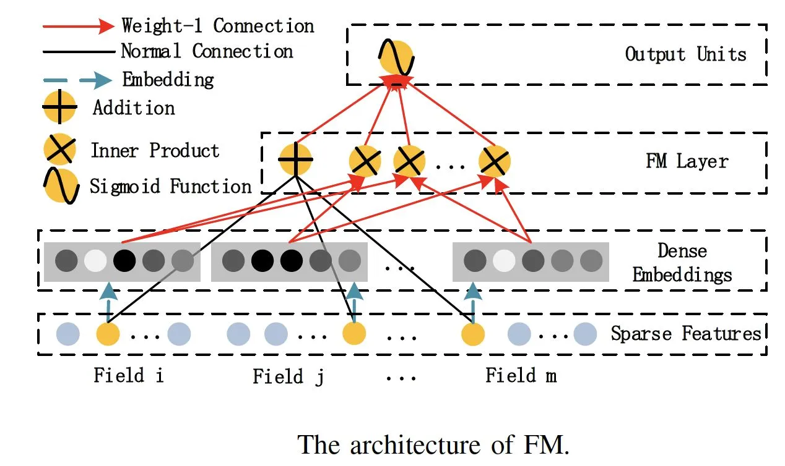
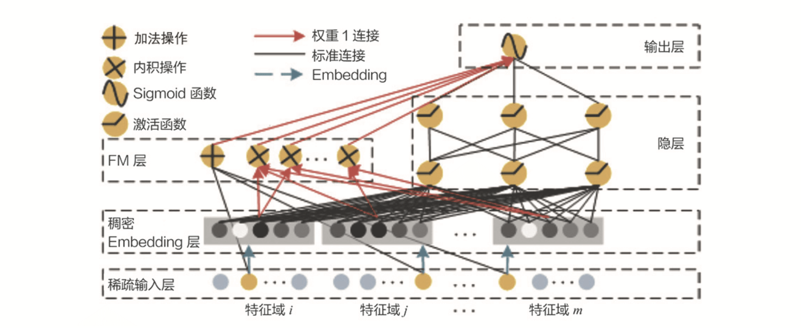
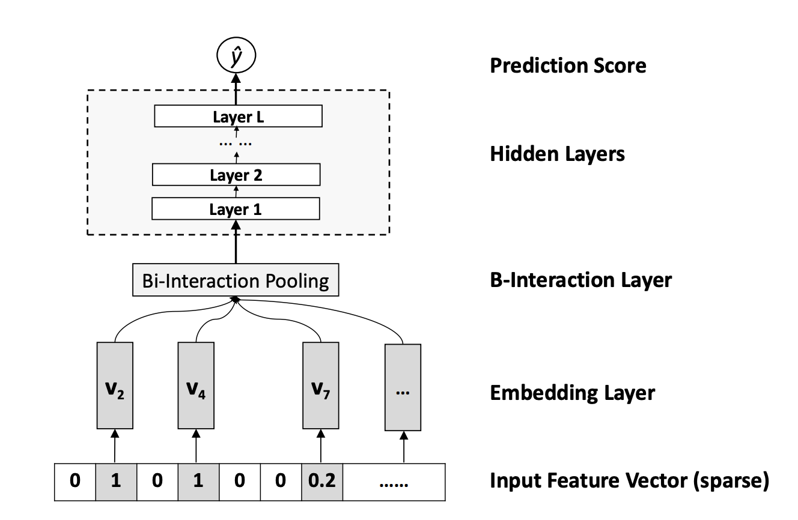
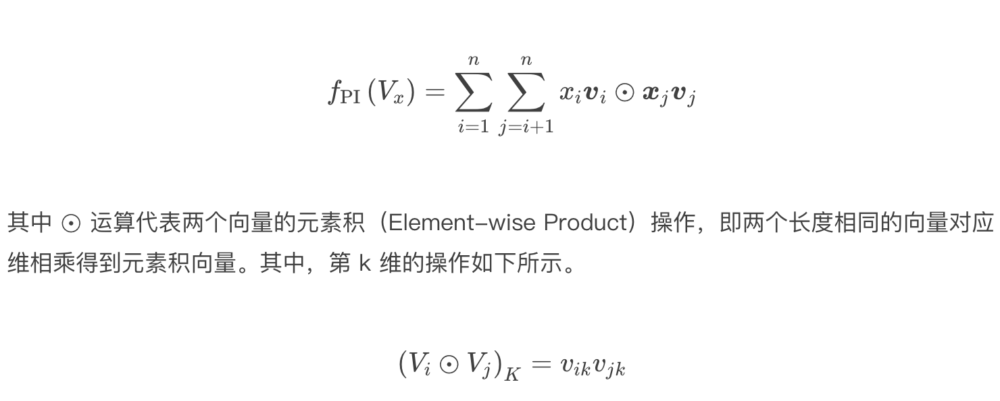

# DeepFM


## 背景

比如说，模型的输入有性别、年龄、电影风格这几个特征，在训练样本中我们发现有 25 岁男生喜欢科幻电影的样本，有 35 岁女生喜欢看恐怖电影的样本，那你觉得模型应该怎么推测“25 岁”的女生喜欢看的电影风格呢？


事实上，这类特征组合和特征交叉问题非常常见，而且在实际应用中，特征的种类还要多得多，特征交叉的复杂程度也要大得多。


**解决这类问题的关键，就是模型对于特征组合和特征交叉的学习能力，因为它决定了模型对于未知特征组合样本的预测能力，而这对于复杂的推荐问题来说，是决定其推荐效果的关键点之一。**


但无论是 Embedding MLP，还是 Wide&Deep 其实都没有对特征交叉进行特别的处理，而是直接把独立的特征扔进神经网络，让它们在网络里面进行自由组合，就算是 NeuralCF 也只在最后才把物品侧和用户侧的特征交叉起来。那这样的特征交叉方法是高效的吗？深度学习模型有没有更好的处理特征交叉的方法呢？


## 为什么深度学习模型需要加强处理特征交叉的能力？

在训练资源有限，调参时间有限的现实情况下，MLP 对于特征交叉的处理其实还比较低效。因为 MLP 是通过 concatenate 层把所有特征连接在一起成为一个特征向量的，这里面没有特征交叉，两两特征之间没有发生任何关系。


这个时候，在我们有先验知识的情况下，人为地加入一些负责特征交叉的模型结构，其实对提升模型效果会非常有帮助。比如，在我们 Sparrow RecSys 项目的训练样本中其实有两个这样的特征，一个是用户喜欢的电影风格，一个是电影本身的风格，这两个特征明显具有很强的相关性。如果我们能让模型利用起这样的相关性，肯定会对最后的推荐效果有正向的影响。


## 善于处理特征交叉的机器学习模型 FM

扫清了这个疑问，接下来，我们就要进入具体的深度学习模型的学习了，不过，先别着急，我想先和你聊聊传统的机器学习模型是怎么解决特征交叉问题的，看看深度学习模型能不能从中汲取到“养分”。


说到解决特征交叉问题的传统机器学习模型，我们就不得不提一下，曾经红极一时的机器学习模型因子分解机模型（Factorization Machine）了，我们可以简称它为 FM。




首先，我们看上图中模型的最下面，它的输入是由类别型特征转换成的 One-hot 向量，往上就是深度学习的常规操作，也就是把 One-hot 特征通过 Embedding 层转换成稠密 Embedding 向量。到这里，FM 跟其他深度学习模型其实并没有区别，但再往上区别就明显了。


FM 会使用一个独特的层 FM Layer 来专门处理特征之间的交叉问题。你可以看到，FM 层中有多个内积操作单元对不同特征向量进行两两组合，这些操作单元会把不同特征的内积操作的结果输入最后的输出神经元，以此来完成最后的预测。


这样一来，如果我们有两个特征是用户喜爱的风格和电影本身的风格，通过 FM 层的两两特征的内积操作，这两个特征就可以完成充分的组合，不至于像 Embedding MLP 模型一样，还要 MLP 内部像黑盒子一样进行低效的交叉。


## 深度学习模型和 FM 模型的结合 DeepFM


DeepFM 是由哈工大和华为公司联合提出的深度学习模型。




结合模型结构图，我们可以看到，DeepFM 利用了 Wide&Deep 组合模型的思想，用 FM 替换了 Wide&Deep 左边的 Wide 部分，加强了浅层网络部分特征组合的能力，而右边的部分跟 Wide&Deep 的 Deep 部分一样，主要利用多层神经网络进行所有特征的深层处理，最后的输出层是把 FM 部分的输出和 Deep 部分的输出综合起来，产生最后的预估结果。这就是 DeepFM 的结构。


## 特征交叉新方法：元素积操作




i-Interaction Pooling Layer 翻译成中文就是“两两特征交叉池化层”。假设 Vx 是所有特征域的 Embedding 集合，那么特征交叉池化层的具体操作如下所示。




在进行两两特征 Embedding 向量的元素积操作后，再求取所有交叉特征向量之和，我们就得到了池化层的输出向量。接着，我们再把该向量输入上层的多层全连接神经网络，就能得出最后的预测得分。


## DeepFM 的 TensorFlow 实战


```python
item_emb_layer = tf.keras.layers.DenseFeatures([movie_emb_col])(inputs)
user_emb_layer = tf.keras.layers.DenseFeatures([user_emb_col])(inputs)
item_genre_emb_layer = tf.keras.layers.DenseFeatures([item_genre_emb_col])(inputs)
user_genre_emb_layer = tf.keras.layers.DenseFeatures([user_genre_emb_col])(inputs)


# FM part, cross different categorical feature embeddings
product_layer_item_user = tf.keras.layers.Dot(axes=1)([item_emb_layer, user_emb_layer])
product_layer_item_genre_user_genre = tf.keras.layers.Dot(axes=1)([item_genre_emb_layer, user_genre_emb_layer])
product_layer_item_genre_user = tf.keras.layers.Dot(axes=1)([item_genre_emb_layer, user_emb_layer])
product_layer_user_genre_item = tf.keras.layers.Dot(axes=1)([item_emb_layer, user_genre_emb_layer])


# deep part, MLP to generalize all input features
deep = tf.keras.layers.DenseFeatures(deep_feature_columns)(inputs)
deep = tf.keras.layers.Dense(64, activation='relu')(deep)
deep = tf.keras.layers.Dense(64, activation='relu')(deep)


# concatenate fm part and deep part
concat_layer = tf.keras.layers.concatenate([product_layer_item_user, product_layer_item_genre_user_genre,
                                            product_layer_item_genre_user, product_layer_user_genre_item, deep], axis=1)
output_layer = tf.keras.layers.Dense(1, activation='sigmoid')(concat_layer)


model = tf.keras.Model(inputs, output_lay)
```

在构建 FM 部分的时候，我们先为 FM 部分选择了 4 个用于交叉的类别型特征，分别是用户 ID、电影 ID、用户喜欢的风格和电影自己的风格。接着，我们使用 Dot layer 把用户特征和电影特征两两交叉，这就完成了 FM 部分的构建。


而 Deep 部分的实现，其实和我们之前实现过的 Wide&Deep 模型的 Deep 部分完全一样。只不过，最终我们会使用 concatenate 层，去把 FM 部分的输出和 Deep 部分的输出连接起来，输入到输出层的 sigmoid 神经元，从而产生最终的预估分数。那关于 DeepFM 的全部代码，你可以参照 SparrowRecsys 项目中的 DeepFM.py 文件。