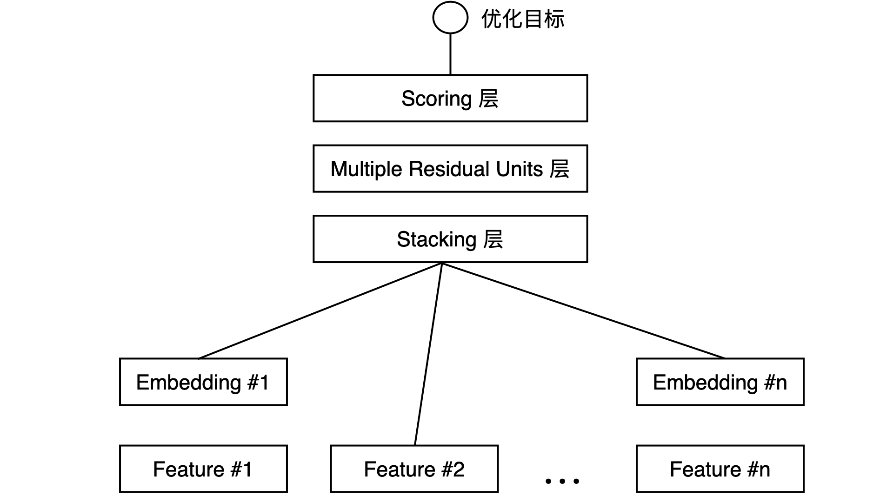
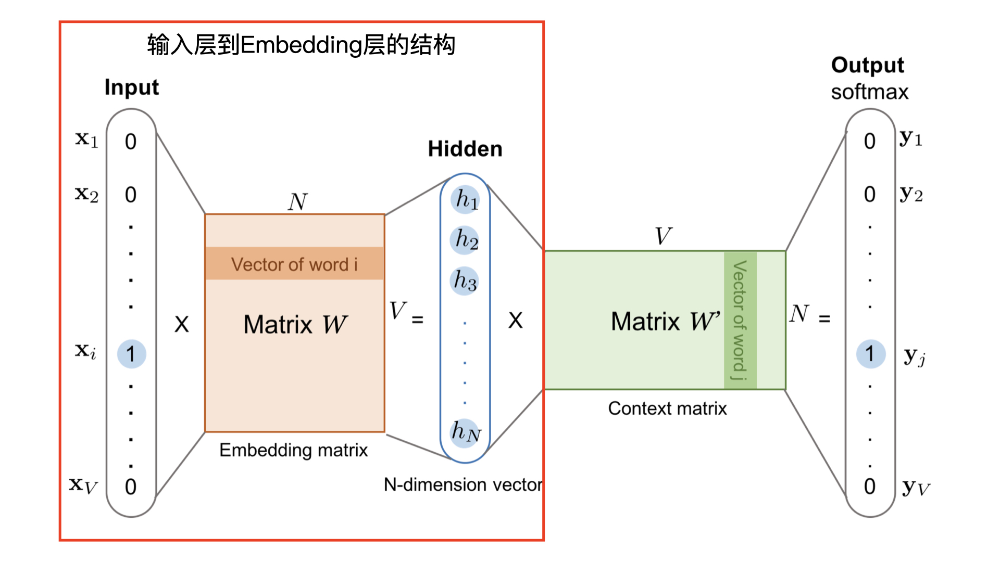
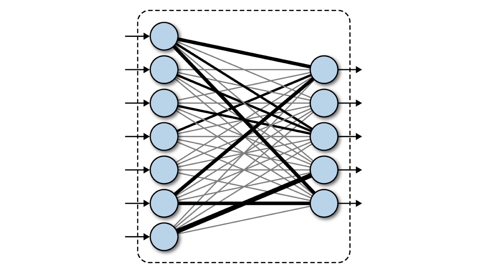
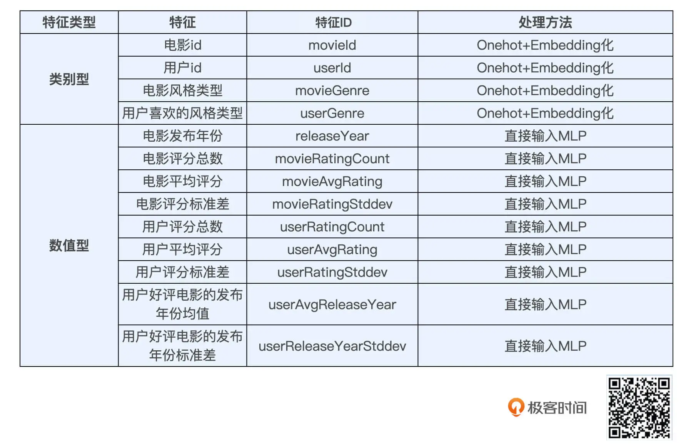
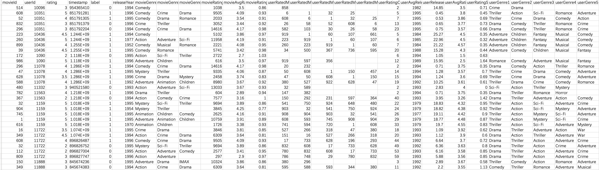

# Embedding+MLP：用TensorFlow实现经典的深度学习模型


## Embedding+MLP 模型的结构


图 1 展示的就是微软在 2016 年提出的深度学习模型 Deep Crossing，微软把它用于广告推荐这个业务场景上。它是一个经典的 Embedding+MLP 模型结构，我们可以看到，Deep Crossing 从下到上可以分为 5 层，分别是 Feature 层、Embedding 层、Stacking 层、MLP 层和 Scoring 层。





### Feature 层


eature 层也叫做输入特征层，它处于 Deep Crossing 的最底部，作为整个模型的输入。仔细看图 1 的话，你一定会发现不同特征在细节上的一些区别。比如 Feature#1 向上连接到了 Embedding 层，而 Feature#2 就直接连接到了更上方的 Stacking 层。这是怎么回事呢？


原因就在于 Feature#1 代表的是类别型特征经过 One-hot 编码后生成的特征向量，而 Feature#2 代表的是数值型特征。我们知道，One-hot 特征太稀疏了，不适合直接输入到后续的神经网络中进行训练，所以我们需要通过连接到 Embedding 层的方式，把这个稀疏的 One-hot 向量转换成比较稠密的 Embedding 向量。


### Embedding 层


mbedding 层就是为了把稀疏的 One-hot 向量转换成稠密的 Embedding 向量而设置的，我们需要注意的是，Embedding 层并不是全部连接起来的，而是每一个特征对应一个 Embedding 层，不同 Embedding 层之间互不干涉。


Embeding 层的结构就是 Word2vec 模型中从输入神经元到隐层神经元的部分（如图 2 红框内的部分）。参照下面的示意图，我们可以看到，这部分就是一个从输入层到隐层之间的全连接网络。




一般来说，Embedding 向量的维度应远小于原始的稀疏特征向量，按照经验，几十到上百维就能够满足需求，这样它才能够实现从稀疏特征向量到稠密特征向量的转换。


### Stacking 层


Stacking 层中文名是堆叠层，我们也经常叫它连接（Concatenate）层。它的作用比较简单，就是把不同的 Embedding 特征和数值型特征拼接在一起，形成新的包含全部特征的特征向量。


### MLP 层


在图 1 中指的是 Multiple Residual Units 层，中文叫多层残差网络。微软在实现 Deep Crossing 时针对特定的问题选择了残差神经元，但事实上，神经元的选择有非常多种，比如我们之前在深度学习基础知识中介绍的，以 Sigmoid 函数为激活函数的神经元，以及使用 tanh、ReLU 等其他激活函数的神经元。我们具体选择哪种是一个调参的问题，一般来说，ReLU 最经常使用在隐层神经元上，Sigmoid 则多使用在输出神经元，实践中也可以选择性地尝试其他神经元，根据效果作出最后的决定。


不过，不管选择哪种神经元，MLP 层的特点是全连接，就是不同层的神经元两两之间都有连接。就像图 3 中的两层神经网络一样，它们两两连接，只是连接的权重会在梯度反向传播的学习过程中发生改变。





MLP 层的作用是让特征向量不同维度之间做充分的交叉，让模型能够抓取到更多的非线性特征和组合特征的信息，这就使深度学习模型在表达能力上较传统机器学习模型大为增强。


### Scoring 层


最终我们要预测的目标就是一个分类的概率。如果是点击率预估，就是一个二分类问题，那我们就可以采用逻辑回归作为输出层神经元，而如果是类似图像分类这样的多分类问题，我们往往在输出层采用 softmax 这样的多分类模型。


## Embedding+MLP 模型的实战


### 特征选择和模型设计





选择好特征后，就是 MLP 部分的模型设计了。我们选择了一个三层的 MLP 结构，其中前两层是 128 维的全连接层。我们这里采用好评 / 差评标签作为样本标签，因此要解决的是一个类 CTR 预估的二分类问题，对于二分类问题，我们最后一层采用单个 sigmoid 神经元作为输出层就可以了。


### Embedding+MLP 模型的 TensorFlow 实现


#### 第一步，导入 TensorFlow 包


```python
import tensorflow as tf


TRAIN_DATA_URL = "file:///Users/zhewang/Workspace/SparrowRecSys/src/main/resources/webroot/sampledata/modelSamples.csv"
samples_file_path = tf.keras.utils.get_file("modelSamples.csv", TRAIN_DATA_URL)
```

modelSamples.csv：



取一行demo：

| movieId | userId | rating | timestamp | label | releaseYear | movieGenre1 | movieGenre2 | movieGenre3 | movieRatingCount | movieAvgRating | movieRatingStddev | userRatedMovie1 | userRatedMovie2 | userRatedMovie3 | userRatedMovie4 | userRatedMovie5 | userRatingCount | userAvgReleaseYear | userReleaseYearStddev | userAvgRating | userRatingStddev | userGenre1 | userGenre2 | userGenre3 | userGenre4 | userGenre5 |
| ------- | ------ | ------ | --------- | ----- | ----------- | ----------- | ----------- | ----------- | ---------------- | -------------- | ----------------- | --------------- | --------------- | --------------- | --------------- | --------------- | --------------- | ------------------ | --------------------- | ------------- | ---------------- | ---------- | ---------- | ---------- | ---------- | ---------- |
| 608     | 10351  | 5      | 851791281 | 1     | 1996        | Comedy      | Crime       | Drama       | 9505             | 4.09           | 0.93              | 6               | 1               | 32              | 25              |                 | 5               | 1995               | 0.45                  | 3.8           | 0.45             | Thriller   | Action     | Sci-Fi     | Romance    | Adventure  |


#### 第二步,载入训练数据

```python
def get_dataset(file_path):
    dataset = tf.data.experimental.make_csv_dataset(
        file_path,
        batch_size=12,
        label_name='label',
        na_value="?",
        num_epochs=1,
        ignore_errors=True)
    return dataset


# sample dataset size 110830/12(batch_size) = 9235
raw_samples_data = get_dataset(samples_file_path)


test_dataset = raw_samples_data.take(1000) #从数据集中取出前1000个批次。因为每个批次有12条记录，所以这相当于取出前12000条记录作为测试集。
train_dataset = raw_samples_data.skip(1000) #跳过数据集中的前1000个批次，从第1001个批次开始使用剩余的数据作为训练集。这意味着训练数据集包含除了前12000条记录之外的所有记录。
```

这段 Python 代码使用 TensorFlow 的 `tf.data.experimental.make_csv_dataset` 函数来加载和处理 CSV 文件数据，并进一步分割这些数据为训练集和测试集。

- **`file_path`**：指向 CSV 文件的路径。
- **`batch_size=12`**：每个批次包含12条数据。这是一次处理的数据量，用于训练过程中的批量梯度下降。
- **`label_name='label'`**：指定哪一列数据被用作标签（即目标变量）。
- **`na_value="?"`**：指定文件中表示缺失值的字符，这里是 `"?"`。
- **`num_epochs=1`**：指定数据集遍历的次数，这里设置为1，表示数据集被读取一次后不会重复。
- **`ignore_errors=True`**：如果遇到错误，如格式错误，将忽略这些错误并继续处理数据。


#### 第三步,载入类别型特征

我们用到的类别型特征主要有这三类，分别是 genre、userId 和 movieId。在载入 genre 类特征时，我们采用了 tf.feature_column.categorical_column_with_vocabulary_list 方法把字符串型的特征转换成了 One-hot 特征。在这个转换过程中我们需要用到一个词表，你可以看到我在开头就定义好了包含所有 genre 类别的词表 genre_vocab。


在转换 userId 和 movieId 特征时，我们又使用了 tf.feature_column.categorical_column_with_identity 方法把 ID 转换成 One-hot 特征，这个方法不用词表，它会直接把 ID 值对应的那个维度置为 1。比如，我们输入这个方法的 movieId 是 340，总的 movie 数量是 1001，使用这个方法，就会把这个 1001 维的 One-hot movieId 向量的第 340 维置为 1，剩余的维度都为 0。


为了把稀疏的 One-hot 特征转换成稠密的 Embedding 向量，我们还需要在 One-hot 特征外包裹一层 Embedding 层，你可以看到 tf.feature_column.embedding_column(movie_col, 10) 方法完成了这样的操作，它在把 movie one-hot 向量映射到了一个 10 维的 Embedding 层上。


```python
#这是一个包含各种电影类型的列表，将用于定义电影和用户喜好类型的类别特征。
genre_vocab = ['Film-Noir', 'Action', 'Adventure', 'Horror', 'Romance', 'War', 'Comedy', 'Western', 'Documentary',
               'Sci-Fi', 'Drama', 'Thriller',
               'Crime', 'Fantasy', 'Animation', 'IMAX', 'Mystery', 'Children', 'Musical']

#设置类别特征的词汇表映射：（这个字典将各类别特征（如用户的偏好类型和电影的类型）映射到对应的词汇表。）
GENRE_FEATURES = {
    'userGenre1': genre_vocab,
    'userGenre2': genre_vocab,
    'userGenre3': genre_vocab,
    'userGenre4': genre_vocab,
    'userGenre5': genre_vocab,
    'movieGenre1': genre_vocab,
    'movieGenre2': genre_vocab,
    'movieGenre3': genre_vocab
}

categorical_columns = []
for feature, vocab in GENRE_FEATURES.items():
    cat_col = tf.feature_column.categorical_column_with_vocabulary_list(
        key=feature, vocabulary_list=vocab)
    emb_col = tf.feature_column.embedding_column(cat_col, 10)
    categorical_columns.append(emb_col)


movie_col = tf.feature_column.categorical_column_with_identity(key='movieId', num_buckets=1001)
movie_emb_col = tf.feature_column.embedding_column(movie_col, 10)
categorical_columns.append(movie_emb_col)


user_col = tf.feature_column.categorical_column_with_identity(key='userId', num_buckets=30001)
user_emb_col = tf.feature_column.embedding_column(user_col, 10)
categorical_columns.append(user_emb_col)
```

上面这段代码的目的是在使用TensorFlow进行机器学习模型建设时，设置和配置特定的特征列。这些特征列将被用来处理用户和电影的类别数据。

具体来说，代码涉及到以下几个关键步骤：

1. **定义电影类型词汇**：`genre_vocab` 包含了各种电影类型，如动作片、喜剧片等。这些类型用于定义电影和用户的偏好。
2. **设置类别特征的词汇表映射**：`GENRE_FEATURES` 字典将用户的偏好类型和电影的类型与 `genre_vocab` 相映射，这样每个特征都有一个明确的类别词汇表。
3. **创建类别特征列**：使用 `tf.feature_column.categorical_column_with_vocabulary_list` 创建基于词汇表的类别特征列，这些特征列用于处理具有明确文本类别的数据。之后，这些类别列被转换为嵌入列（`embedding_column`），这是一种将类别特征转换为可以被机器学习模型处理的连续数值特征的技术。
4. **处理电影ID和用户ID**：
   - `movieId`：为电影ID创建一个身份特征列，设定了1001个桶（bucket），这意味着它假定电影ID的范围从0到1000。然后，也为它创建一个嵌入列。
   - `userId`：为用户ID创建一个身份特征列，设定了30001个桶，假定用户ID范围从0到30000。同样为它创建一个嵌入列。
5. **将所有特征列加入列表**：最终，所有的嵌入列（包括处理类别数据的嵌入列和处理ID数据的嵌入列）都添加到 `categorical_columns` 列表中。这个列表可以在后续的模型建设中用来引用所有需要的特征列。


GENRE_FEATURES:

```
{'userGenre1': ['Film-Noir',
  'Action',
  'Adventure',
  'Horror',
  'Romance',
  'War',
  'Comedy',
  'Western',
  'Documentary',
  'Sci-Fi',
  'Drama',
  'Thriller',
  'Crime',
  'Fantasy',
  'Animation',
  'IMAX',
  'Mystery',
  'Children',
  'Musical'],
 ...
```

cat_col:

```python
VocabularyListCategoricalColumn(key='movieGenre3', vocabulary_list=('Film-Noir', 'Action', 'Adventure', 'Horror', 'Romance', 'War', 'Comedy', 'Western', 'Documentary', 'Sci-Fi', 'Drama', 'Thriller', 'Crime', 'Fantasy', 'Animation', 'IMAX', 'Mystery', 'Children', 'Musical'), dtype=tf.string, default_value=-1, num_oov_buckets=0)
```

emb_col:

```python
EmbeddingColumn(categorical_column=VocabularyListCategoricalColumn(key='movieGenre3', vocabulary_list=('Film-Noir', 'Action', 'Adventure', 'Horror', 'Romance', 'War', 'Comedy', 'Western', 'Documentary', 'Sci-Fi', 'Drama', 'Thriller', 'Crime', 'Fantasy', 'Animation', 'IMAX', 'Mystery', 'Children', 'Musical'), dtype=tf.string, default_value=-1, num_oov_buckets=0), dimension=10, combiner='mean', initializer=<tensorflow.python.ops.init_ops.TruncatedNormal object at 0x7f86e7fd9e40>, ckpt_to_load_from=None, tensor_name_in_ckpt=None, max_norm=None, trainable=True, use_safe_embedding_lookup=True)
```

categorical_columns:

```
[EmbeddingColumn(categorical_column=VocabularyListCategoricalColumn(key='userGenre1', vocabulary_list=('Film-Noir', 'Action', 'Adventure', 'Horror', 'Romance', 'War', 'Comedy', 'Western', 'Documentary', 'Sci-Fi', 'Drama', 'Thriller', 'Crime', 'Fantasy', 'Animation', 'IMAX', 'Mystery', 'Children', 'Musical'), dtype=tf.string, default_value=-1, num_oov_buckets=0), dimension=10, combiner='mean', initializer=<tensorflow.python.ops.init_ops.TruncatedNormal object at 0x7f86e8136da0>, ckpt_to_load_from=None, tensor_name_in_ckpt=None, max_norm=None, trainable=True, use_safe_embedding_lookup=True),
 EmbeddingColumn(categorical_column=VocabularyListCategoricalColumn(key='userGenre2', vocabulary_list=('Film-Noir', 'Action', 'Adventure', 'Horror', 'Romance', 'War', 'Comedy', 'Western', 'Documentary', 'Sci-Fi', 'Drama', 'Thriller', 'Crime', 'Fantasy', 'Animation', 'IMAX', 'Mystery', 'Children', 'Musical'), dtype=tf.string, default_value=-1, num_oov_buckets=0), dimension=10, combiner='mean', initializer=<tensorflow.python.ops.init_ops.TruncatedNormal object at 0x7f86e7fda020>, ckpt_to_load_from=None, tensor_name_in_ckpt=None, max_norm=None, trainable=True, use_safe_embedding_lookup=True),
 EmbeddingColumn(categorical_column=VocabularyListCategoricalColumn(key='userGenre3', vocabulary_list=('Film-Noir', 'Action', 'Adventure', 'Horror', 'Romance', 'War', 'Comedy', 'Western', 'Documentary', 'Sci-Fi', 'Drama', 'Thriller', 'Crime', 'Fantasy', 'Animation', 'IMAX', 'Mystery', 'Children', 'Musical'), dtype=tf.string, default_value=-1, num_oov_buckets=0), dimension=10, combiner='mean', initializer=<tensorflow.python.ops.init_ops.TruncatedNormal object at 0x7f86e7fdb490>, ckpt_to_load_from=None, tensor_name_in_ckpt=None, max_norm=None, trainable=True, use_safe_embedding_lookup=True),
 EmbeddingColumn(categorical_column=VocabularyListCategoricalColumn(key='userGenre4', vocabulary_list=('Film-Noir', 'Action', 'Adventure', 'Horror', 'Romance', 'War', 'Comedy', 'Western', 'Documentary', 'Sci-Fi', 'Drama', 'Thriller', 'Crime', 'Fantasy', 'Animation', 'IMAX', 'Mystery', 'Children', 'Musical'), dtype=tf.string, default_value=-1, num_oov_buckets=0), dimension=10, combiner='mean', initializer=<tensorflow.python.ops.init_ops.TruncatedNormal object at 0x7f86e7fdb310>, ckpt_to_load_from=None, tensor_name_in_ckpt=None, max_norm=None, trainable=True, use_safe_embedding_lookup=True),
 EmbeddingColumn(categorical_column=VocabularyListCategoricalColumn(key='userGenre5', vocabulary_list=('Film-Noir', 'Action', 'Adventure', 'Horror', 'Romance', 'War', 'Comedy', 'Western', 'Documentary', 'Sci-Fi', 'Drama', 'Thriller', 'Crime', 'Fantasy', 'Animation', 'IMAX', 'Mystery', 'Children', 'Musical'), dtype=tf.string, default_value=-1, num_oov_buckets=0), dimension=10, combiner='mean', initializer=<tensorflow.python.ops.init_ops.TruncatedNormal object at 0x7f86e7fdbd60>, ckpt_to_load_from=None, tensor_name_in_ckpt=None, max_norm=None, trainable=True, use_safe_embedding_lookup=True),
 EmbeddingColumn(categorical_column=VocabularyListCategoricalColumn(key='movieGenre1', vocabulary_list=('Film-Noir', 'Action', 'Adventure', 'Horror', 'Romance', 'War', 'Comedy', 'Western', 'Documentary', 'Sci-Fi', 'Drama', 'Thriller', 'Crime', 'Fantasy', 'Animation', 'IMAX', 'Mystery', 'Children', 'Musical'), dtype=tf.string, default_value=-1, num_oov_buckets=0), dimension=10, combiner='mean', initializer=<tensorflow.python.ops.init_ops.TruncatedNormal object at 0x7f86e7fd9c60>, ckpt_to_load_from=None, tensor_name_in_ckpt=None, max_norm=None, trainable=True, use_safe_embedding_lookup=True),
 EmbeddingColumn(categorical_column=VocabularyListCategoricalColumn(key='movieGenre2', vocabulary_list=('Film-Noir', 'Action', 'Adventure', 'Horror', 'Romance', 'War', 'Comedy', 'Western', 'Documentary', 'Sci-Fi', 'Drama', 'Thriller', 'Crime', 'Fantasy', 'Animation', 'IMAX', 'Mystery', 'Children', 'Musical'), dtype=tf.string, default_value=-1, num_oov_buckets=0), dimension=10, combiner='mean', initializer=<tensorflow.python.ops.init_ops.TruncatedNormal object at 0x7f86e7fdaf50>, ckpt_to_load_from=None, tensor_name_in_ckpt=None, max_norm=None, trainable=True, use_safe_embedding_lookup=True),
 EmbeddingColumn(categorical_column=VocabularyListCategoricalColumn(key='movieGenre3', vocabulary_list=('Film-Noir', 'Action', 'Adventure', 'Horror', 'Romance', 'War', 'Comedy', 'Western', 'Documentary', 'Sci-Fi', 'Drama', 'Thriller', 'Crime', 'Fantasy', 'Animation', 'IMAX', 'Mystery', 'Children', 'Musical'), dtype=tf.string, default_value=-1, num_oov_buckets=0), dimension=10, combiner='mean', initializer=<tensorflow.python.ops.init_ops.TruncatedNormal object at 0x7f86e7fd9e40>, ckpt_to_load_from=None, tensor_name_in_ckpt=None, max_norm=None, trainable=True, use_safe_embedding_lookup=True),
 EmbeddingColumn(categorical_column=IdentityCategoricalColumn(key='movieId', number_buckets=1001, default_value=None), dimension=10, combiner='mean', initializer=<tensorflow.python.ops.init_ops.TruncatedNormal object at 0x7f86e7fd95a0>, ckpt_to_load_from=None, tensor_name_in_ckpt=None, max_norm=None, trainable=True, use_safe_embedding_lookup=True),
 EmbeddingColumn(categorical_column=IdentityCategoricalColumn(key='userId', number_buckets=30001, default_value=None), dimension=10, combiner='mean', initializer=<tensorflow.python.ops.init_ops.TruncatedNormal object at 0x7f86e7fdab00>, ckpt_to_load_from=None, tensor_name_in_ckpt=None, max_norm=None, trainable=True, use_safe_embedding_lookup=True)]
```


#### 第四步,数值型特征的处理

```python
numerical_columns = [tf.feature_column.numeric_column('releaseYear'),
                   tf.feature_column.numeric_column('movieRatingCount'),
                     tf.feature_column.numeric_column('movieAvgRating'),
                     tf.feature_column.numeric_column('movieRatingStddev'),
                     tf.feature_column.numeric_column('userRatingCount'),
                     tf.feature_column.numeric_column('userAvgRating'),
                     tf.feature_column.numeric_column('userRatingStddev')]

```

这段代码用于设置和配置数值特征列，是在使用TensorFlow进行机器学习模型建设时处理数值数据的一个重要部分。数值特征列直接处理连续的数值数据，不需要像类别特征那样进行编码。

numerical_columns：

```python
[NumericColumn(key='releaseYear', shape=(1,), default_value=None, dtype=tf.float32, normalizer_fn=None),
 NumericColumn(key='movieRatingCount', shape=(1,), default_value=None, dtype=tf.float32, normalizer_fn=None),
 NumericColumn(key='movieAvgRating', shape=(1,), default_value=None, dtype=tf.float32, normalizer_fn=None),
 NumericColumn(key='movieRatingStddev', shape=(1,), default_value=None, dtype=tf.float32, normalizer_fn=None),
 NumericColumn(key='userRatingCount', shape=(1,), default_value=None, dtype=tf.float32, normalizer_fn=None),
 NumericColumn(key='userAvgRating', shape=(1,), default_value=None, dtype=tf.float32, normalizer_fn=None),
 NumericColumn(key='userRatingStddev', shape=(1,), default_value=None, dtype=tf.float32, normalizer_fn=None)]
```


#### 第五步,定义模型结构

```python
preprocessing_layer = tf.keras.layers.DenseFeatures(numerical_columns + categorical_columns)

model = tf.keras.Sequential([
    preprocessing_layer,
    tf.keras.layers.Dense(128, activation='relu'),
    tf.keras.layers.Dense(128, activation='relu'),
    tf.keras.layers.Dense(1, activation='sigmoid'),
])
```

`preprocessing_layer` 是一个 `tf.keras.layers.DenseFeatures` 层，它用于将定义好的数值和类别特征列直接输入到模型中。这一层能够自动处理特征列的输入，并将它们转换为模型可以使用的格式。在TensorFlow中，`tf.keras.layers.DenseFeatures` 是一个用于处理来自`feature_columns`的数据并将其转换为神经网络可以使用的密集（dense）形式的层。


#### 第六步,定义模型训练相关的参数

```python
model.compile(
    loss='binary_crossentropy',
    optimizer='adam',
    metrics=['accuracy'])
```


#### 第七步,模型的训练和评估

```python
model.fit(train_dataset, epochs=10)
test_loss, test_accuracy = model.evaluate(test_dataset)
print('\n\nTest Loss {}, Test Accuracy {}'.format(test_loss, test_accuracy)

```


