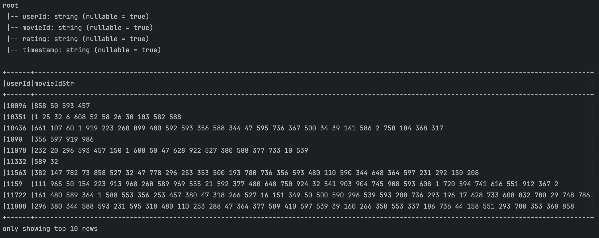
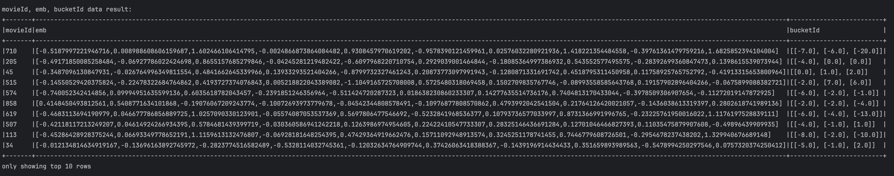
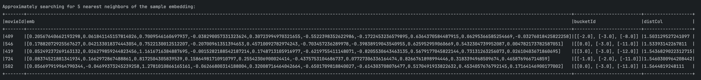

#  Embedding代码解释


## 代码


```scala
package com.sparrowrecsys.offline.spark.embedding

import java.io.{BufferedWriter, File, FileWriter}

import org.apache.log4j.{Level, Logger}
import org.apache.spark.SparkConf
import org.apache.spark.ml.feature.BucketedRandomProjectionLSH
import org.apache.spark.ml.linalg.Vectors
import org.apache.spark.mllib.feature.{Word2Vec, Word2VecModel}
import org.apache.spark.rdd.RDD
import org.apache.spark.sql.expressions.UserDefinedFunction
import org.apache.spark.sql.functions._
import org.apache.spark.sql.{Row, SparkSession}
import redis.clients.jedis.Jedis
import redis.clients.jedis.params.SetParams

import scala.collection.mutable
import scala.collection.mutable.ArrayBuffer
import scala.util.Random
import scala.util.control.Breaks.{break, breakable}

object Embedding {

  val redisEndpoint = "localhost"
  val redisPort = 6379

  def processItemSequence(sparkSession: SparkSession, rawSampleDataPath: String): RDD[Seq[String]] ={

    //path of rating data
    val ratingsResourcesPath = this.getClass.getResource(rawSampleDataPath)
    val ratingSamples = sparkSession.read.format("csv").option("header", "true").load(ratingsResourcesPath.getPath)

    //sort by timestamp udf
    val sortUdf: UserDefinedFunction = udf((rows: Seq[Row]) => {
      rows.map { case Row(movieId: String, timestamp: String) => (movieId, timestamp) }
        .sortBy { case (_, timestamp) => timestamp }
        .map { case (movieId, _) => movieId }
    })

    ratingSamples.printSchema()

    //process rating data then generate rating movie sequence data
    val userSeq = ratingSamples
      .where(col("rating") >= 3.5)
      .groupBy("userId")
      .agg(sortUdf(collect_list(struct("movieId", "timestamp"))) as "movieIds")
      .withColumn("movieIdStr", array_join(col("movieIds"), " "))

    userSeq.select("userId", "movieIdStr").show(10, truncate = false)
    userSeq.select("movieIdStr").rdd.map(r => r.getAs[String]("movieIdStr").split(" ").toSeq)
  }

  def generateUserEmb(sparkSession: SparkSession, rawSampleDataPath: String, word2VecModel: Word2VecModel, embLength:Int, embOutputFilename:String, saveToRedis:Boolean, redisKeyPrefix:String): Unit ={
    val ratingsResourcesPath = this.getClass.getResource(rawSampleDataPath)
    val ratingSamples = sparkSession.read.format("csv").option("header", "true").load(ratingsResourcesPath.getPath)
    ratingSamples.show(10, false)

    val userEmbeddings = new ArrayBuffer[(String, Array[Float])]()

    ratingSamples.collect().groupBy(_.getAs[String]("userId"))
      .foreach(user => {
        val userId = user._1
        var userEmb = new Array[Float](embLength)

        var movieCount = 0
        userEmb = user._2.foldRight[Array[Float]](userEmb)((row, newEmb) => {
          val movieId = row.getAs[String]("movieId")
          val movieEmb = word2VecModel.getVectors.get(movieId)
          movieCount += 1
          if(movieEmb.isDefined){
            newEmb.zip(movieEmb.get).map { case (x, y) => x + y }
          }else{
            newEmb
          }
        }).map((x: Float) => x / movieCount)
        userEmbeddings.append((userId,userEmb))
      })


    val embFolderPath = this.getClass.getResource("/webroot/modeldata/")
    val file = new File(embFolderPath.getPath + embOutputFilename)
    val bw = new BufferedWriter(new FileWriter(file))

    for (userEmb <- userEmbeddings) {
      bw.write(userEmb._1 + ":" + userEmb._2.mkString(" ") + "\n")
    }
    bw.close()

    if (saveToRedis) {
      val redisClient = new Jedis(redisEndpoint, redisPort)
      val params = SetParams.setParams()
      //set ttl to 24hs
      params.ex(60 * 60 * 24)

      for (userEmb <- userEmbeddings) {
        redisClient.set(redisKeyPrefix + ":" + userEmb._1, userEmb._2.mkString(" "), params)
      }
      redisClient.close()
    }
  }

  def trainItem2vec(sparkSession: SparkSession, samples : RDD[Seq[String]], embLength:Int, embOutputFilename:String, saveToRedis:Boolean, redisKeyPrefix:String): Word2VecModel = {
    val word2vec = new Word2Vec()
      .setVectorSize(embLength)
      .setWindowSize(5)
      .setNumIterations(10)

    val model = word2vec.fit(samples)


    val synonyms = model.findSynonyms("158", 20)
    for ((synonym, cosineSimilarity) <- synonyms) {
      println(s"$synonym $cosineSimilarity")
    }

    val embFolderPath = this.getClass.getResource("/webroot/modeldata/")
    val file = new File(embFolderPath.getPath + embOutputFilename)
    val bw = new BufferedWriter(new FileWriter(file))
    for (movieId <- model.getVectors.keys) {
      bw.write(movieId + ":" + model.getVectors(movieId).mkString(" ") + "\n")
    }
    bw.close()

    if (saveToRedis) {
      val redisClient = new Jedis(redisEndpoint, redisPort)
      val params = SetParams.setParams()
      //set ttl to 24hs
      params.ex(60 * 60 * 24)
      for (movieId <- model.getVectors.keys) {
        redisClient.set(redisKeyPrefix + ":" + movieId, model.getVectors(movieId).mkString(" "), params)
      }
      redisClient.close()
    }

    embeddingLSH(sparkSession, model.getVectors)
    model
  }

  def oneRandomWalk(transitionMatrix : mutable.Map[String, mutable.Map[String, Double]], itemDistribution : mutable.Map[String, Double], sampleLength:Int): Seq[String] ={
    val sample = mutable.ListBuffer[String]()

    //pick the first element
    val randomDouble = Random.nextDouble()
    var firstItem = ""
    var accumulateProb:Double = 0D
    breakable { for ((item, prob) <- itemDistribution) {
      accumulateProb += prob
      if (accumulateProb >= randomDouble){
        firstItem = item
        break
      }
    }}

    sample.append(firstItem)
    var curElement = firstItem

    breakable { for(_ <- 1 until sampleLength) {
      if (!itemDistribution.contains(curElement) || !transitionMatrix.contains(curElement)){
        break
      }

      val probDistribution = transitionMatrix(curElement)
      val randomDouble = Random.nextDouble()
      var accumulateProb: Double = 0D
      breakable { for ((item, prob) <- probDistribution) {
        accumulateProb += prob
        if (accumulateProb >= randomDouble){
          curElement = item
          break
        }
      }}
      sample.append(curElement)
    }}
    Seq(sample.toList : _*)
  }

  def randomWalk(transitionMatrix : mutable.Map[String, mutable.Map[String, Double]], itemDistribution : mutable.Map[String, Double], sampleCount:Int, sampleLength:Int): Seq[Seq[String]] ={
    val samples = mutable.ListBuffer[Seq[String]]()
    for(_ <- 1 to sampleCount) {
      samples.append(oneRandomWalk(transitionMatrix, itemDistribution, sampleLength))
    }
    Seq(samples.toList : _*)
  }

  def generateTransitionMatrix(samples : RDD[Seq[String]]): (mutable.Map[String, mutable.Map[String, Double]], mutable.Map[String, Double]) ={
    val pairSamples = samples.flatMap[(String, String)]( sample => {
      var pairSeq = Seq[(String,String)]()
      var previousItem:String = null
      sample.foreach((element:String) => {
        if(previousItem != null){
          pairSeq = pairSeq :+ (previousItem, element)
        }
        previousItem = element
      })
      pairSeq
    })

    val pairCountMap = pairSamples.countByValue()
    var pairTotalCount = 0L
    val transitionCountMatrix = mutable.Map[String, mutable.Map[String, Long]]()
    val itemCountMap = mutable.Map[String, Long]()

    pairCountMap.foreach( pair => {
      val pairItems = pair._1
      val count = pair._2

      if(!transitionCountMatrix.contains(pairItems._1)){
        transitionCountMatrix(pairItems._1) = mutable.Map[String, Long]()
      }

      transitionCountMatrix(pairItems._1)(pairItems._2) = count
      itemCountMap(pairItems._1) = itemCountMap.getOrElse[Long](pairItems._1, 0) + count
      pairTotalCount = pairTotalCount + count
    })

    val transitionMatrix = mutable.Map[String, mutable.Map[String, Double]]()
    val itemDistribution = mutable.Map[String, Double]()

    transitionCountMatrix foreach {
      case (itemAId, transitionMap) =>
        transitionMatrix(itemAId) = mutable.Map[String, Double]()
        transitionMap foreach { case (itemBId, transitionCount) => transitionMatrix(itemAId)(itemBId) = transitionCount.toDouble / itemCountMap(itemAId) }
    }

    itemCountMap foreach { case (itemId, itemCount) => itemDistribution(itemId) = itemCount.toDouble / pairTotalCount }
    (transitionMatrix, itemDistribution)
  }

  def embeddingLSH(spark:SparkSession, movieEmbMap:Map[String, Array[Float]]): Unit ={

    val movieEmbSeq = movieEmbMap.toSeq.map(item => (item._1, Vectors.dense(item._2.map(f => f.toDouble))))
    val movieEmbDF = spark.createDataFrame(movieEmbSeq).toDF("movieId", "emb")

    //LSH bucket model
    val bucketProjectionLSH = new BucketedRandomProjectionLSH()
      .setBucketLength(0.1)
      .setNumHashTables(3)
      .setInputCol("emb")
      .setOutputCol("bucketId")

    val bucketModel = bucketProjectionLSH.fit(movieEmbDF)
    val embBucketResult = bucketModel.transform(movieEmbDF)
    println("movieId, emb, bucketId schema:")
    embBucketResult.printSchema()
    println("movieId, emb, bucketId data result:")
    embBucketResult.show(10, truncate = false)

    println("Approximately searching for 5 nearest neighbors of the sample embedding:")
    val sampleEmb = Vectors.dense(0.795,0.583,1.120,0.850,0.174,-0.839,-0.0633,0.249,0.673,-0.237)
    bucketModel.approxNearestNeighbors(movieEmbDF, sampleEmb, 5).show(truncate = false)
  }

  def graphEmb(samples : RDD[Seq[String]], sparkSession: SparkSession, embLength:Int, embOutputFilename:String, saveToRedis:Boolean, redisKeyPrefix:String): Word2VecModel ={
    val transitionMatrixAndItemDis = generateTransitionMatrix(samples)

    println(transitionMatrixAndItemDis._1.size)
    println(transitionMatrixAndItemDis._2.size)

    val sampleCount = 20000
    val sampleLength = 10
    val newSamples = randomWalk(transitionMatrixAndItemDis._1, transitionMatrixAndItemDis._2, sampleCount, sampleLength)

    val rddSamples = sparkSession.sparkContext.parallelize(newSamples)
    trainItem2vec(sparkSession, rddSamples, embLength, embOutputFilename, saveToRedis, redisKeyPrefix)
  }

  def main(args: Array[String]): Unit = {
    Logger.getLogger("org").setLevel(Level.ERROR)

    val conf = new SparkConf()
      .setMaster("local")
      .setAppName("ctrModel")
      .set("spark.submit.deployMode", "client")

    val spark = SparkSession.builder.config(conf).getOrCreate()

    val rawSampleDataPath = "/webroot/sampledata/ratings.csv"
    val embLength = 10

    val samples = processItemSequence(spark, rawSampleDataPath)
    val model = trainItem2vec(spark, samples, embLength, "item2vecEmb.csv", saveToRedis = false, "i2vEmb")
    //graphEmb(samples, spark, embLength, "itemGraphEmb.csv", saveToRedis = true, "graphEmb")
    //generateUserEmb(spark, rawSampleDataPath, model, embLength, "userEmb.csv", saveToRedis = false, "uEmb")
  }
}

```


## 打印

##### 




```
48 0.9615504145622253
256 0.950366199016571
31 0.9177243709564209
186 0.9008796811103821
168 0.8791472911834717
355 0.8580567836761475
552 0.856834888458252
520 0.8498541116714478
277 0.8464483618736267
252 0.8431810736656189
276 0.833158016204834
432 0.8230131268501282
44 0.8146494030952454
455 0.784973680973053
236 0.7688605189323425
2 0.7658259868621826
237 0.7627450823783875
204 0.7623107433319092
370 0.7609168291091919
333 0.759945273399353
movieId, emb, bucketId schema:
root
 |-- movieId: string (nullable = true)
 |-- emb: vector (nullable = true)
 |-- bucketId: array (nullable = true)
 |    |-- element: vector (containsNull = true)
```








## 解释


### 用户观影历史预处理


目的是为每个用户创建一个根据时间戳排序的电影ID序列。这种处理对于构建推荐系统模型特别有用，因为它可以用来捕捉用户的观影历史和偏好。

```scala
val userSeq = ratingSamples
  .where(col("rating") >= 3.5)
  .groupBy("userId")
  .agg(sortUdf(collect_list(struct("movieId", "timestamp"))) as "movieIds")
  .withColumn("movieIdStr", array_join(col("movieIds"), " "))


userSeq.select("userId", "movieIdStr").show(10, truncate = false)
userSeq.select("movieIdStr").rdd.map(r => r.getAs[String]("movieIdStr").split(" ").toSeq)
```


输出：


#### 1. **过滤和分组**

- `ratingSamples.where(col("rating") >= 3.5)`
  - 这行代码从 `ratingSamples` DataFrame 中筛选出评分大于或等于 3.5 的记录。这个阈值通常用来确定用户对电影的喜好（即只考虑用户喜欢的电影）。
- `.groupBy("userId")`
  - 接着，对筛选后的数据按 `userId` 进行分组，以便为每个用户生成电影序列。

#### 2. **聚合和排序**

- ```
  .agg(sortUdf(collect_list(struct("movieId", "timestamp"))) as "movieIds")
  ```

  - 在这里，`collect_list(struct("movieId", "timestamp"))` 将每个用户的所有电影ID和相应的观看时间戳收集到一个列表中。
  - `sortUdf` 是一个用户定义的函数，它接受由电影ID和时间戳组成的结构体列表，返回一个按时间戳排序的电影ID列表。这样可以确保电影序列按用户观看的顺序排列。

#### 3. **连接电影ID序列**

- ```
  .withColumn("movieIdStr", array_join(col("movieIds"), " "))
  ```

  - 这行代码使用 `array_join` 函数将排序后的电影ID数组连接成一个由空格分隔的字符串，存储在新的列 `movieIdStr` 中。这样做的目的是为了后续处理方便，特别是在使用如 Word2Vec 这类需要序列输入的模型时。

#### 4. **展示结果**

- ```
  userSeq.select("userId", "movieIdStr").show(10, truncate = false)
  ```

  - 这行代码展示了处理后的数据的前10行，显示每个用户的ID和其对应的电影ID字符串。这有助于验证数据处理流程是否按预期执行。

#### 5. **转换为 RDD 并分割字符串**

- ```
  userSeq.select("movieIdStr").rdd.map(r => r.getAs[String]("movieIdStr").split(" ").toSeq)
  ```

  - 最后，代码将 `movieIdStr` 列选择出来，并将 DataFrame 转换为 RDD。
  - 使用 `map` 函数对每一行的 `movieIdStr` 进行分割，将由空格分隔的字符串转换成字符串序列（即 Scala 中的 `Seq[String]`），这为进一步的分析或模型训练准备数据。


### Sample 演变过程


原始数据：

```
[1,2,3.5,1112486027]
[1,29,3.5,1112484676]
[1,32,3.5,1112484819]
[1,47,3.5,1112484727]
[1,50,3.5,1112484580]
......
```


原始数据schema：

```
root
 |-- userId: string (nullable = true)
 |-- movieId: string (nullable = true)
 |-- rating: string (nullable = true)
 |-- timestamp: string (nullable = true)
```


val sample的数据：(movieidstr的集合)

```
WrappedArray(858, 50, 593, 457)
WrappedArray(1, 25, 32, 6, 608, 52, 58, 26, 30, 103, 582, 588)
WrappedArray(661, 107, 60, 1, 919, 223, 260, 899, 480, 592, 593, 356, 588, 344, 47, 595, 736, 367, 500, 34, 39, 141, 586, 2, 750, 104, 368, 317)
WrappedArray(356, 597, 919, 986)
WrappedArray(232, 20, 296, 593, 457, 150, 1, 608, 50, 47, 628, 922, 527, 380, 588, 377, 733, 10, 539)
```


### Word2Vec初始化


```scala
    val word2vec = new Word2Vec()
      .setVectorSize(embLength)
      .setWindowSize(5)
      .setNumIterations(10)
```

1. **初始化 Word2Vec**：
   - `val word2vec = new Word2Vec()`
   - 创建一个 `Word2Vec` 实例，这是一个用于计算向量空间模型的工具，通常用于文本数据，但在这里应用于电影ID作为序列的元素。
2. **配置参数**：
   - `.setVectorSize(embLength)`
   - 设置每个词向量的维度（即每个电影ID的嵌入向量长度）。
   - `.setWindowSize(5)`
   - 设置窗口大小为5，这意味着在训练时，每个电影ID将与其前后各5个电影ID一起考虑，以学习上下文关系。
   - `.setNumIterations(10)`
   - 设置迭代次数为10，即训练过程中整个数据集将被重复遍历10次。


### model.findSynonyms


```scala
    val synonyms = model.findSynonyms("158", 20)
    for ((synonym, cosineSimilarity) <- synonyms) {
      println(s"$synonym $cosineSimilarity")
    }
```


这段代码使用 Apache Spark MLlib 的 Word2Vec 模型从训练后的词向量中查找与特定词（在本例中是电影ID "158"）最相似的词，即找出与电影ID "158" 最相似的其他电影ID。相似度是通过计算向量之间的余弦相似性来确定的。这在推荐系统中特别有用，可以用来推荐相似的电影。


#### 查找同义词（相似的电影ID）

- ```
  val synonyms = model.findSynonyms("158", 20)
  ```

  - 这行代码调用 `findSynonyms` 方法，传入两个参数：目标词（电影ID "158"）和要返回的同义词（相似电影ID）数量（20个）。
  - 方法返回一个元组的数组，每个元组包含一个同义词和与目标词的余弦相似度。
  - 余弦相似度是一种衡量两个向量间夹角的余弦值，用于确定向量在方向上的相似度，其值的范围是从 -1（完全相反）到 1（完全相同）。

#### 打印同义词及其余弦相似度

- ```scala
      for ((synonym, cosineSimilarity) <- synonyms) {
        println(s"$synonym $cosineSimilarity")
      }
  ```

  - 这是一个 for 循环，遍历 `findSynonyms` 方法返回的结果。
  - 在循环中，每个元组被解构为 `synonym`（同义词，即相似的电影ID）和 `cosineSimilarity`（与目标电影ID "158" 的余弦相似度）。
  - `println(s"$synonym $cosineSimilarity")` 将每个同义词及其相似度打印出来，这样可以直观地看到哪些电影与电影ID "158" 最相似，以及它们的相似度。


#### 计算逻辑


- **Word2Vec 训练**：Word2Vec 模型通过观察电影ID在用户的电影观看序列中的上下文来训练每个电影ID的向量表示。具体来说，模型学习将每个电影ID映射到一个连续的向量空间中，使得语义上或行为上相似的电影ID（即经常一起被观看或在类似的观看模式中出现的电影）在向量空间中彼此接近。
- **向量空间**：在这个向量空间中，每个电影ID都是由一个固定维度的实数向量表示的，这个向量捕捉了电影ID的隐含特征。


输出结果：

```
48 0.9615504145622253
256 0.950366199016571
31 0.9177243709564209
186 0.9008796811103821
168 0.8791472911834717
355 0.8580567836761475
552 0.856834888458252
520 0.8498541116714478
277 0.8464483618736267
252 0.8431810736656189
276 0.833158016204834
432 0.8230131268501282
44 0.8146494030952454
455 0.784973680973053
236 0.7688605189323425
2 0.7658259868621826
237 0.7627450823783875
204 0.7623107433319092
370 0.7609168291091919
333 0.759945273399353
```


### Item2Vec

```scala
    val embFolderPath = this.getClass.getResource("/webroot/modeldata/")
    val file = new File(embFolderPath.getPath + embOutputFilename)
    println("file:"+file)
    val bw = new BufferedWriter(new FileWriter(file))
    for (movieId <- model.getVectors.keys) {
      bw.write(movieId + ":" + model.getVectors(movieId).mkString(" ") + "\n")
    }
    bw.close()
```


写入的文件：

item2vecEmb.csv：

```
710:-1.1897237 0.48152843 -0.6113423 -0.40622446 -0.5651619 1.6490159 -0.5101197 1.1188633 -1.3080181 1.0282396
205:-0.14030996 0.5204045 0.17422475 -0.4775851 -0.43006703 0.32816073 0.5624423 -0.32813558 -0.59627944 0.47975075
45:-0.120712325 0.6442333 0.543116 -0.0995046 -0.06853201 0.067111835 0.57725173 -0.5776311 -0.2613962 0.30674386
515:0.2573589 0.7277482 0.0013648871 -0.051061254 -0.019521488 -0.45553866 0.7483928 -0.536813 -0.061678737 0.46185136
574:-0.3858237 0.59998846 0.35771218 -0.35738832 -0.59491336 0.3734975 0.107587546 -0.622095 -0.59450984 0.24376808
858:-0.23340839 0.24161702 -0.28251317 0.28404364 -0.40120864 0.16893262 -0.4156768 -0.036739565 0.5135293 0.04444979
619:-0.71868604 0.33917373 -0.46611887 -0.2844045 -0.46401203 0.9724685 -0.3218764 0.6533825 -0.87909615 0.65068054
507:0.35353023 0.27804774 0.5267468 0.16527832 -0.311744 0.032786407 -0.077768736 -0.042850632 -0.54051447 0.18134736
113:-0.26848578 0.3035844 -0.82901394 -0.19770047 -0.75959945 0.8984613 -0.20668028 0.48116443 -0.9782726 1.0067943
34:0.10327757 0.050252605 -0.35545877 -0.28847975 -0.37388572 0.27571735 0.16521856 -0.3886541 -0.08134439 -0.57618254
563:-0.024113819 0.91450226 0.07604879 -0.08496823 -0.60962796 -0.23303588 0.17501402 -0.022016438 -0.5494749 0.33064783
381:0.31005028 0.56043583 0.29634088 0.019788245 0.38274977 0.021618351 0.92924374 0.148852 -0.4378266 0.33393872
455:-0.56608766 0.37795317 0.19661802 0.39154637 0.34179407 0.4407064 0.85475254 0.6556147 -0.48619917 0.15897399
67:-0.73153234 1.2195241 -0.8549552 -1.4734352 -0.70449525 0.02349735 -0.5634983 0.7345983 -1.4881699 1.2279557
388:0.16182984 0.759051 -0.35374698 -0.26156485 -0.71521264 -0.22628136 0.25956115 -0.34986 -0.14508931 0.37625661
974:-0.057016622 0.24095309 -0.57707036 0.3445156 -1.104152 -0.51303536 0.06378135 -0.00854108 -0.66178834 0.30062038
```
