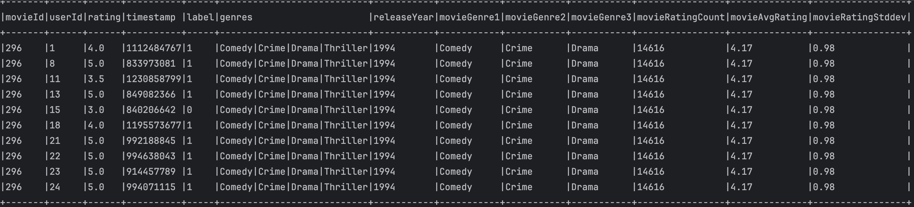

# FeatureEngForRecModel 代码解析


## 读取原始数据


```scala
    val spark = SparkSession.builder.config(conf).getOrCreate()
    val movieResourcesPath = this.getClass.getResource("/webroot/sampledata/movies.csv")
    val movieSamples = spark.read.format("csv").option("header", "true").load(movieResourcesPath.getPath)
    println("movieSamples：")
    movieSamples.take(5).foreach(println)

    val ratingsResourcesPath = this.getClass.getResource("/webroot/sampledata/ratings.csv")
    val ratingSamples = spark.read.format("csv").option("header", "true").load(ratingsResourcesPath.getPath)
    println("ratingSamples：")
    ratingSamples.take(5).foreach(println)

```

打印：

```scala
movieSamples：
[1,Toy Story (1995),Adventure|Animation|Children|Comedy|Fantasy]
[2,Jumanji (1995),Adventure|Children|Fantasy]
[3,Grumpier Old Men (1995),Comedy|Romance]
[4,Waiting to Exhale (1995),Comedy|Drama|Romance]
[5,Father of the Bride Part II (1995),Comedy]

ratingSamples：
[1,2,3.5,1112486027]
[1,29,3.5,1112484676]
[1,32,3.5,1112484819]
[1,47,3.5,1112484727]
[1,50,3.5,1112484580]

```


## 增加label（评分相关）


```scala
  def addSampleLabel(ratingSamples:DataFrame): DataFrame ={
    ratingSamples.show(10, truncate = false)
    ratingSamples.printSchema()
    val sampleCount = ratingSamples.count()
    ratingSamples.groupBy(col("rating")).count().orderBy(col("rating"))
      .withColumn("percentage", col("count")/sampleCount).show(100,truncate = false)

    ratingSamples.withColumn("label", when(col("rating") >= 3.5, 1).otherwise(0))
  }
```


- `groupBy(col("rating")).count()`: 这部分代码首先按照 `rating` 列（即评分）对数据进行分组，并计算每个组（每个不同的评分）中的记录数（即每个评分的出现次数）。
- `orderBy(col("rating"))`: 接着，结果按照评分值进行排序，从低到高。
- `withColumn("percentage", col("count")/sampleCount)`: 在排序后的结果中添加一个新列 `percentage`，它计算每个评分占总样本数（`sampleCount`）的比例。这里 `sampleCount` 应是数据集中总的记录数，不过这个变量需要在外部定义或计算。
- `show(100, truncate = false)`: 最后，显示结果的前100行，并设置 `truncate = false` 来确保在控制台输出时不截断数据。
- `withColumn("label", when(col("rating") >= 3.5, 1).otherwise(0))`: 这行代码在 `ratingSamples` 数据集上添加一个新列 `label`。这里使用了 `when` 函数来实现条件语句，当 `rating` 列的值大于等于 3.5 时，`label` 列的值为 1，否则为 0。
- 这种处理方式常用于推荐系统中的隐式反馈转化，其中将用户的评分转换为喜好（1）和不喜好（0），通常用于更简单的分类模型训练。


打印：

```scala
+------+-------+------+----------+
|userId|movieId|rating|timestamp |
+------+-------+------+----------+
|1     |2      |3.5   |1112486027|
|1     |29     |3.5   |1112484676|
|1     |32     |3.5   |1112484819|
|1     |47     |3.5   |1112484727|
|1     |50     |3.5   |1112484580|
|1     |112    |3.5   |1094785740|
|1     |151    |4.0   |1094785734|
|1     |223    |4.0   |1112485573|
|1     |253    |4.0   |1112484940|
|1     |260    |4.0   |1112484826|
+------+-------+------+----------+
only showing top 10 rows

root
 |-- userId: string (nullable = true)
 |-- movieId: string (nullable = true)
 |-- rating: string (nullable = true)
 |-- timestamp: string (nullable = true)


+------+------+--------------------+
|rating|count |percentage          |
+------+------+--------------------+
|0.5   |9788  |0.008375561978987506|
|1.0   |45018 |0.03852176636392108 |
|1.5   |11794 |0.010092090108314123|
|2.0   |87084 |0.07451751526135553 |
|2.5   |34269 |0.029323879593167432|
|3.0   |323616|0.27691723185451783 |
|3.5   |74376 |0.06364331811904114 |
|4.0   |324804|0.2779337998593234  |
|4.5   |53388 |0.04568395003414231 |
|5.0   |204501|0.17499088682722966 |
+------+------+--------------------+


# 增加完了label后的输出

+------+-------+------+----------+-----+
|userId|movieId|rating|timestamp |label|
+------+-------+------+----------+-----+
|1     |2      |3.5   |1112486027|1    |
|1     |29     |3.5   |1112484676|1    |
|1     |32     |3.5   |1112484819|1    |
|1     |47     |3.5   |1112484727|1    |
|1     |50     |3.5   |1112484580|1    |
|1     |112    |3.5   |1094785740|1    |
|1     |151    |4.0   |1094785734|1    |
|1     |223    |4.0   |1112485573|1    |
|1     |253    |4.0   |1112484940|1    |
|1     |260    |4.0   |1112484826|1    |
+------+-------+------+----------+-----+
only showing top 10 rows

```


## 增加影片特征


```scala
    val samplesWithMovieFeatures = addMovieFeatures(movieSamples, ratingSamplesWithLabel)
```


```scala
  def addMovieFeatures(movieSamples:DataFrame, ratingSamples:DataFrame): DataFrame ={

    //add movie basic features
    val samplesWithMovies1 = ratingSamples.join(movieSamples, Seq("movieId"), "left")
    //add release year
    val extractReleaseYearUdf = udf({(title: String) => {
      if (null == title || title.trim.length < 6) {
        1990 // default value
      }
      else {
        val yearString = title.trim.substring(title.length - 5, title.length - 1)
        yearString.toInt
      }
    }})

    //add title
    val extractTitleUdf = udf({(title: String) => {title.trim.substring(0, title.trim.length - 6).trim}})

    val samplesWithMovies2 = samplesWithMovies1.withColumn("releaseYear", extractReleaseYearUdf(col("title")))
      .withColumn("title", extractTitleUdf(col("title")))
      .drop("title")  //title is useless currently

    //split genres
    val samplesWithMovies3 = samplesWithMovies2.withColumn("movieGenre1",split(col("genres"),"\\|").getItem(0))
      .withColumn("movieGenre2",split(col("genres"),"\\|").getItem(1))
      .withColumn("movieGenre3",split(col("genres"),"\\|").getItem(2))

    //add rating features
    val movieRatingFeatures = samplesWithMovies3.groupBy(col("movieId"))
      .agg(count(lit(1)).as("movieRatingCount"),
        format_number(avg(col("rating")), NUMBER_PRECISION).as("movieAvgRating"),
        stddev(col("rating")).as("movieRatingStddev"))
    .na.fill(0).withColumn("movieRatingStddev",format_number(col("movieRatingStddev"), NUMBER_PRECISION))


    //join movie rating features
    val samplesWithMovies4 = samplesWithMovies3.join(movieRatingFeatures, Seq("movieId"), "left")
    samplesWithMovies4.printSchema()
    samplesWithMovies4.show(10, truncate = false)

    samplesWithMovies4
  }
```

#### 1. 加入电影基本特征

- ratingSamples.join这行代码使用 SQL 类型的左连接（left join），把 `ratingSamples`（评分数据）和 `movieSamples`（电影数据）根据 `movieId` 进行关联。这样每条评分记录都会包含对应电影的详细信息。


合并前:

```scala
#movieSamples:
[1,Toy Story (1995),Adventure|Animation|Children|Comedy|Fantasy]
[2,Jumanji (1995),Adventure|Children|Fantasy]
[3,Grumpier Old Men (1995),Comedy|Romance]
[4,Waiting to Exhale (1995),Comedy|Drama|Romance]
[5,Father of the Bride Part II (1995),Comedy]

#ratingSamples:
[1,2,3.5,1112486027,1]
[1,29,3.5,1112484676,1]
[1,32,3.5,1112484819,1]
[1,47,3.5,1112484727,1]
[1,50,3.5,1112484580,1]
```

合并后：

```
[2,1,3.5,1112486027,1,Jumanji (1995),Adventure|Children|Fantasy]
[29,1,3.5,1112484676,1,City of Lost Children, The (Cité des enfants perdus, La) (1995),Adventure|Drama|Fantasy|Mystery|Sci-Fi]
[32,1,3.5,1112484819,1,Twelve Monkeys (a.k.a. 12 Monkeys) (1995),Mystery|Sci-Fi|Thriller]
[47,1,3.5,1112484727,1,Seven (a.k.a. Se7en) (1995),Mystery|Thriller]
[50,1,3.5,1112484580,1,Usual Suspects, The (1995),Crime|Mystery|Thriller]
```


#### 2. 添加发布年份

```
val extractReleaseYearUdf = udf({(title: String) => {
  if (null == title || title.trim.length < 6) {
    1990 // default value
  }
  else {
    val yearString = title.trim.substring(title.length - 5, title.length - 1)
    yearString.toInt
  }
}})

val samplesWithMovies2 = samplesWithMovies1.withColumn("releaseYear", extractReleaseYearUdf(col("title")))
```


#### 3. 提取并更新标题

增加title

```scala
		val extractTitleUdf = udf({(title: String) => {title.trim.substring(0, title.trim.length - 6).trim}})
```

另一个 UDF，用于从电影标题中删除年份部分，只保留实际的标题

```scala
    val samplesWithMovies2 = samplesWithMovies1.withColumn("releaseYear", extractReleaseYearUdf(col("title")))
      .withColumn("title", extractTitleUdf(col("title")))
      .drop("title")  //title is useless currently
```

更新 `title` 列，并随即将其删除，因为在这里假设新的 `title` 列在后续分析中不再需要.


此时的数据内容&格式如下：

```scala
[2,1,3.5,1112486027,1,Adventure|Children|Fantasy,1995]
[29,1,3.5,1112484676,1,Adventure|Drama|Fantasy|Mystery|Sci-Fi,1995]
[32,1,3.5,1112484819,1,Mystery|Sci-Fi|Thriller,1995]
[47,1,3.5,1112484727,1,Mystery|Thriller,1995]
[50,1,3.5,1112484580,1,Crime|Mystery|Thriller,1995]

root
 |-- movieId: string (nullable = true)
 |-- userId: string (nullable = true)
 |-- rating: string (nullable = true)
 |-- timestamp: string (nullable = true)
 |-- label: integer (nullable = false)
 |-- genres: string (nullable = true)
 |-- releaseYear: integer (nullable = false)
```


#### 4. 分割类型字段


```scala
val samplesWithMovies3 = samplesWithMovies2.withColumn("movieGenre1", split(col("genres"), "\\|").getItem(0))
  .withColumn("movieGenre2", split(col("genres"), "\\|").getItem(1))
  .withColumn("movieGenre3", split(col("genres"), "\\|").getItem(2))

```

- 电影类型（`genres`）字段通常包含多个由 "|" 分隔的类型。这部分代码将 `genres` 字段分割，并分别提取前三个类型到新的列 `movieGenre1`, `movieGenre2`, `movieGenre3`。


此时的数据结构是：

```
[2,1,3.5,1112486027,1,Adventure|Children|Fantasy,1995,Adventure,Children,Fantasy]
[29,1,3.5,1112484676,1,Adventure|Drama|Fantasy|Mystery|Sci-Fi,1995,Adventure,Drama,Fantasy]
[32,1,3.5,1112484819,1,Mystery|Sci-Fi|Thriller,1995,Mystery,Sci-Fi,Thriller]
[47,1,3.5,1112484727,1,Mystery|Thriller,1995,Mystery,Thriller,null]
[50,1,3.5,1112484580,1,Crime|Mystery|Thriller,1995,Crime,Mystery,Thriller]

root
 |-- movieId: string (nullable = true)
 |-- userId: string (nullable = true)
 |-- rating: string (nullable = true)
 |-- timestamp: string (nullable = true)
 |-- label: integer (nullable = false)
 |-- genres: string (nullable = true)
 |-- releaseYear: integer (nullable = false)
 |-- movieGenre1: string (nullable = true)
 |-- movieGenre2: string (nullable = true)
 |-- movieGenre3: string (nullable = true)
```


#### 5. 添加评分特征


```scala
    val movieRatingFeatures = samplesWithMovies3.groupBy(col("movieId"))
      .agg(count(lit(1)).as("movieRatingCount"),
        format_number(avg(col("rating")), NUMBER_PRECISION).as("movieAvgRating"),
        stddev(col("rating")).as("movieRatingStddev"))
    .na.fill(0).withColumn("movieRatingStddev",format_number(col("movieRatingStddev"), NUMBER_PRECISION))
```

- 针对每部电影，计算其评分的数量（`movieRatingCount`）、平均评分（`movieAvgRating`）和评分的标准差（`movieRatingStddev`）。`format_number` 用于格式化数字到指定的精度。


数据此时为：


```scala
[296,14616,4.17,0.98]
[467,174,3.44,1.23]
[829,402,2.62,1.22]
[691,254,3.12,1.04]
[675,6,2.33,0.82]

root
 |-- movieId: string (nullable = true)
 |-- movieRatingCount: long (nullable = false)
 |-- movieAvgRating: string (nullable = true)
 |-- movieRatingStddev: string (nullable = true)
```


#### 6. 将评分特征合并回数据集

```scala
		val samplesWithMovies4 = samplesWithMovies3.join(movieRatingFeatures, Seq("movieId"), "left")
    samplesWithMovies4.printSchema()
    samplesWithMovies4.show(10, truncate = false)
```


```
root
 |-- movieId: string (nullable = true)
 |-- userId: string (nullable = true)
 |-- rating: string (nullable = true)
 |-- timestamp: string (nullable = true)
 |-- label: integer (nullable = false)
 |-- genres: string (nullable = true)
 |-- releaseYear: integer (nullable = false)
 |-- movieGenre1: string (nullable = true)
 |-- movieGenre2: string (nullable = true)
 |-- movieGenre3: string (nullable = true)
 |-- movieRatingCount: long (nullable = true)
 |-- movieAvgRating: string (nullable = true)
 |-- movieRatingStddev: string (nullable = true)
```




## 增加用户特征


```scala
val samplesWithUserFeatures = addUserFeatures(samplesWithMovieFeatures)
```


```scala
  def addUserFeatures(ratingSamples:DataFrame): DataFrame ={
    val samplesWithUserFeatures = ratingSamples
      .withColumn("userPositiveHistory", collect_list(when(col("label") === 1, col("movieId")).otherwise(lit(null)))
        .over(Window.partitionBy("userId")
          .orderBy(col("timestamp")).rowsBetween(-100, -1)))
      .withColumn("userPositiveHistory", reverse(col("userPositiveHistory")))
      .withColumn("userRatedMovie1",col("userPositiveHistory").getItem(0))
      .withColumn("userRatedMovie2",col("userPositiveHistory").getItem(1))
      .withColumn("userRatedMovie3",col("userPositiveHistory").getItem(2))
      .withColumn("userRatedMovie4",col("userPositiveHistory").getItem(3))
      .withColumn("userRatedMovie5",col("userPositiveHistory").getItem(4))
      .withColumn("userRatingCount", count(lit(1))
        .over(.partitionBy("userId")
          .orderBy(col("timestamp")).rowsBetween(-100, -1)))
      .withColumn("userAvgReleaseYear", avg(col("releaseYear"))
        .over(Window.partitionBy("userId")
          .orderBy(col("timestamp")).rowsBetween(-100, -1)).cast(IntegerType))
      .withColumn("userReleaseYearStddev", stddev(col("releaseYear"))
        .over(Window.partitionBy("userId")
          .orderBy(col("timestamp")).rowsBetween(-100, -1)))
      .withColumn("userAvgRating", format_number(avg(col("rating"))
        .over(Window.partitionBy("userId")
          .orderBy(col("timestamp")).rowsBetween(-100, -1)), NUMBER_PRECISION))
      .withColumn("userRatingStddev", stddev(col("rating"))
        .over(Window.partitionBy("userId")
          .orderBy(col("timestamp")).rowsBetween(-100, -1)))
      .withColumn("userGenres", extractGenres(collect_list(when(col("label") === 1, col("genres")).otherwise(lit(null)))
        .over(Window.partitionBy("userId")
          .orderBy(col("timestamp")).rowsBetween(-100, -1))))
      .na.fill(0)
      .withColumn("userRatingStddev",format_number(col("userRatingStddev"), NUMBER_PRECISION))
      .withColumn("userReleaseYearStddev",format_number(col("userReleaseYearStddev"), NUMBER_PRECISION))
      .withColumn("userGenre1",col("userGenres").getItem(0))
      .withColumn("userGenre2",col("userGenres").getItem(1))
      .withColumn("userGenre3",col("userGenres").getItem(2))
      .withColumn("userGenre4",col("userGenres").getItem(3))
      .withColumn("userGenre5",col("userGenres").getItem(4))
      .drop("genres", "userGenres", "userPositiveHistory")
      .filter(col("userRatingCount") > 1)

    samplesWithUserFeatures.printSchema()
    samplesWithUserFeatures.show(100, truncate = false)

    samplesWithUserFeatures
  }
```

代码中广泛使用了 Spark SQL 的 `Window` 函数来计算基于用户的历史数据的统计信息，如用户评分的平均值、标准差等。窗口定义了按 `userId` 分区，按 `timestamp` 排序，并且考虑从当前行的前100行到前1行（`rowsBetween(-100, -1)`）的范围，这意味着每个计算是基于用户的最近100次历史记录（不包括当前记录）。


#### 添加用户特征


1. **用户正面评价历史**
   - 通过 `collect_list` 收集用户标记为正面（`label` 等于 1）的电影 ID，形成一个列表。
   - 列表被反转，使得最近的评分位于列表前端。
   - 从这个列表中提取前5部电影，作为 `userRatedMovie1` 到 `userRatedMovie5`。
2. **用户评分统计**
   - `userRatingCount`: 计算用户的评分次数。
   - `userAvgRating`: 计算用户评分的平均值，并格式化到指定精度。
   - `userRatingStddev`: 计算评分的标准差，并格式化到指定精度。
3. **用户电影发布年份特征**
   - `userAvgReleaseYear`: 计算用户评价的电影平均发布年份，并转换为整数类型。
   - `userReleaseYearStddev`: 计算发布年份的标准差，并格式化。
4. **用户偏好电影类型**
   - 类似于电影 ID 的收集方式，这里收集用户标记为正面的电影类型。
   - 使用自定义函数 `extractGenres`（未在代码中给出定义，需要用户自行实现）提取和处理类型信息。
   - 提取前5个最常见的类型作为 `userGenre1` 到 `userGenre5`。


#### 清理和过滤

- 删除不再需要的中间列：`genres`, `userGenres`, `userPositiveHistory`。
- 过滤掉评分历史少于2次的用户。


#### 输出和展示

- 使用 `printSchema()` 和 `show(100, truncate = false)` 输出处理后的 DataFrame 的结构和前100行数据，以便检查添加的特征。


#### 返回值

- 函数最终返回 `samplesWithUserFeatures`，这是一个经过丰富且清洗后包含多个用户特征的 DataFrame，适用于进一步的分析或模型训练。


打印：


```
root
 |-- movieId: string (nullable = true)
 |-- userId: string (nullable = true)
 |-- rating: string (nullable = true)
 |-- timestamp: string (nullable = true)
 |-- label: integer (nullable = false)
 |-- releaseYear: integer (nullable = false)
 |-- movieGenre1: string (nullable = true)
 |-- movieGenre2: string (nullable = true)
 |-- movieGenre3: string (nullable = true)
 |-- movieRatingCount: long (nullable = false)
 |-- movieAvgRating: string (nullable = true)
 |-- movieRatingStddev: string (nullable = true)
 |-- userRatedMovie1: string (nullable = true)
 |-- userRatedMovie2: string (nullable = true)
 |-- userRatedMovie3: string (nullable = true)
 |-- userRatedMovie4: string (nullable = true)
 |-- userRatedMovie5: string (nullable = true)
 |-- userRatingCount: long (nullable = false)
 |-- userAvgReleaseYear: integer (nullable = false)
 |-- userReleaseYearStddev: string (nullable = true)
 |-- userAvgRating: string (nullable = true)
 |-- userRatingStddev: string (nullable = true)
 |-- userGenre1: string (nullable = true)
 |-- userGenre2: string (nullable = true)
 |-- userGenre3: string (nullable = true)
 |-- userGenre4: string (nullable = true)
 |-- userGenre5: string (nullable = true)
```


```
+-----------+-----------+-----------+----------------+--------------+-----------------+---------------+---------------+---------------+---------------+---------------+---------------+------------------+---------------------+-------------+----------------+----------+----------+----------+----------+----------+
|movieId|userId|rating|timestamp |label|releaseYear|movieGenre1|movieGenre2|movieGenre3|movieRatingCount|movieAvgRating|movieRatingStddev|userRatedMovie1|userRatedMovie2|userRatedMovie3|userRatedMovie4|userRatedMovie5|userRatingCount|userAvgReleaseYear|userReleaseYearStddev|userAvgRating|userRatingStddev|userGenre1|userGenre2|userGenre3|userGenre4|userGenre5|
+-------+------+------+----------+-----+-----------+-----------+-----------+-----------+----------------+--------------+-----------------+---------------+---------------+---------------+---------------+---------------+---------------+------------------+---------------------+-------------+----------------+----------+----------+----------+----------+----------+
|514    |10096 |3.0   |954365410 |0    |1994       |Comedy     |null       |null       |1038            |3.50          |0.86             |858            |null           |null           |null           |null           |2              |1982              |14.85                |3.50         |0.71            |Crime     |Drama     |null      |null      |null      |
|608    |10096 |3.0   |954365515 |0    |1996       |Comedy     |Crime      |Drama      |9505            |4.09          |0.93             |858            |null           |null           |null           |null           |3              |1986              |12.42                |3.33         |0.58            |Crime     |Drama     |null      |null      |null      |
|50     |10096 |5.0   |954365515 |1    |1995       |Crime      |Mystery    |Thriller   |10221           |4.35          |0.75             |858            |null           |null           |null           |null           |4              |1988              |11.24                |3.25         |0.50            |Crime     |Drama     |null      |null      |null      |
|593    |10096 |4.0   |954365552 |1    |1991       |Crime      |Horror     |Thriller   |13692           |4.18          |0.85             |50             |858            |null           |null           |null           |5              |1990              |10.12                |3.60         |0.89            |Crime     |Thriller  |Mystery   |Drama     |null      |
|25     |10096 |2.0   |954365571 |0    |1995       |Drama      |Romance    |null       |4684            |3.69          |1.04             |593            |50             |858            |null           |null           |6              |1990              |9.06                 |3.67         |0.82            |Crime     |Thriller  |Horror    |Mystery   |Drama     |
|457    |10096 |5.0   |954365571 |1    |1993       |Thriller   |null       |null       |10736           |3.97          |0.78             |593            |50             |858            |null           |null           |7              |1990              |8.47                 |3.43         |0.98            |Crime     |Thriller  |Horror    |Mystery   |Drama     |
|541    |10096 |3.0   |954365664 |0    |1982       |Action     |Sci-Fi     |Thriller   |6635            |4.14          |0.88             |457            |593            |50             |858            |null           |8              |1991              |7.88                 |3.62         |1.06            |Thriller  |Crime     |Horror    |Mystery   |Drama     |
|32     |10351 |4.0   |851791255 |1    |1995       |Mystery    |Sci-Fi     |Thriller   |9694            |3.89          |0.86             |25             |null           |null           |null           |null           |2              |1995              |0.71                 |3.50         |0.71            |Romance   |Drama     |null      |null      |null      |
|1      |10351 |4.0   |851791255 |1    |1995       |Adventure  |Animation  |Children   |10759           |3.91          |0.89             |32             |25             |null           |null           |null           |3              |1995              |0.58                 |3.67         |0.58            |Sci-Fi    |Thriller  |Romance   |Mystery   |Drama     |
|6      |10351 |4.0   |851791281 |1    |1995       |Action     |Crime      |Thriller   |5245            |3.84          |0.86             |1              |32             |25             |null           |null           |4              |1995              |0.50                 |3.75         |0.50            |Sci-Fi    |Thriller  |Romance   |Adventure |Mystery   |
|608    |10351 |5.0   |851791281 |1    |1996       |Comedy     |Crime      |Drama      |9505            |4.09          |0.93             |6              |1              |32             |25             |null           |5              |1995              |0.45                 |3.80         |0.45            |Thriller  |Action    |Sci-Fi    |Romance   |Adventure |
|786    |10351 |3.0   |851791305 |0    |1996       |Action     |Drama      |Thriller   |3445            |3.15          |0.99             |608            |6              |1              |32             |25             |6              |1995              |0.52                 |4.00         |0.63            |Thriller  |Crime     |Drama     |Comedy    |Action    |
|52     |10351 |4.0   |851791305 |1    |1995       |Comedy     |Drama      |Romance    |2033            |3.54          |0.91             |608            |6              |1              |32             |25             |7              |1995              |0.53                 |3.86         |0.69            |Thriller  |Crime     |Drama     |Comedy    |Action    |
|58     |10351 |5.0   |851791305 |1    |1994       |Comedy     |Drama      |Romance    |2498            |3.95          |0.99             |52             |608            |6              |1              |32             |8              |1995              |0.52                 |3.88         |0.64            |Thriller  |Drama     |Comedy    |Romance   |Crime     |
|100    |10351 |3.0   |851791340 |0    |1996       |Drama      |Thriller   |null       |905             |3.21          |0.83             |58             |52             |608            |6              |1              |9              |1995              |0.67                 |4.00         |0.71            |Drama     |Comedy    |Thriller  |Romance   |Crime     |
|719    |10351 |3.0   |851791360 |0    |1996       |Comedy     |null       |null       |1683            |2.94          |0.96             |58             |52             |608            |6              |1              |10             |1995              |0.67                 |3.90         |0.74            |Drama     |Comedy    |Thriller  |Romance   |Crime     |
|707    |10351 |3.0   |851791360 |0    |1996       |Crime      |Drama      |Thriller   |1005            |3.06          |0.88             |58             |52             |608            |6              |1              |11             |1995              |0.67                 |3.82         |0.75            |Drama     |Comedy    |Thriller  |Romance   |Crime     |
|26     |10351 |4.0   |851791379 |1    |1995       |Drama      |null       |null       |581             |3.63          |0.94             |58             |52             |608            |6              |1              |12             |1995              |0.67                 |3.75         |0.75            |Drama     |Comedy    |Thriller  |Romance   |Crime     |
|832    |10351 |3.0   |851791379 |0    |1996       |Crime      |Thriller   |null       |3052            |3.44          |0.92             |26             |58             |52             |608            |6              |13             |1995              |0.65                 |3.77         |0.73            |Drama     |Comedy    |Thriller  |Romance   |Crime     |
|85     |10351 |3.0   |851791395 |0    |1995       |Drama      |Romance    |null       |592             |3.56          |0.95             |26             |58             |52             |608            |6              |14             |1995              |0.65                 |3.71         |0.73            |Drama     |Comedy    |Thriller  |Romance   |Crime     |
|82     |10351 |3.0   |851791413 |0    |1995       |Comedy     |Drama      |null       |587             |4.00          |1.03             |26             |58             |52             |608            |6              |15             |1995              |0.63                 |3.67         |0.72            |Drama     |Comedy    |Thriller  |Romance   |Crime     |
|30     |10351 |4.0   |851791434 |1    |1995       |Crime      |Drama      |null       |270             |3.68          |0.98             |26             |58             |52             |608            |6              |16             |1995              |0.62                 |3.62         |0.72            |Drama     |Comedy    |Thriller  |Romance   |Crime     |
|103    |10351 |4.0   |851791454 |1    |1996       |Mystery    |Sci-Fi     |Thriller   |268             |3.22          |1.02             |30             |26             |58             |52             |608            |17             |1995              |0.61                 |3.65         |0.70            |Drama     |Comedy    |Thriller  |Romance   |Crime     |
|68     |10351 |3.0   |851791455 |0    |1995       |Comedy     |Romance    |null       |268             |3.37          |0.93             |103            |30             |26             |58             |52             |18             |1995              |0.61                 |3.67         |0.69            |Drama     |Thriller  |Comedy    |Romance   |Crime     |
|78     |10351 |3.0   |851791484 |0    |1995       |Action     |Crime      |Drama      |288             |3.11          |0.94             |103            |30             |26             |58             |52             |19             |1995              |0.60                 |3.63         |0.68            |Drama     |Thriller  |Comedy    |Romance   |Crime     |
|617    |10351 |3.0   |851791515 |0    |1995       |Comedy     |Drama      |null       |119             |3.50          |1.00             |103            |30             |26             |58             |52             |20             |1995              |0.59                 |3.60         |0.68            |Drama     |Thriller  |Comedy    |Romance   |Crime     |
|582    |10351 |4.0   |851791690 |1    |1993       |Comedy     |Drama      |null       |34              |3.37          |1.05             |103            |30             |26             |58             |52             |21             |1995              |0.58                 |3.57         |0.68            |Drama     |Thriller  |Comedy    |Romance   |Crime     |
|893    |10351 |3.0   |851791736 |0    |1996       |Drama      |null       |null       |131             |3.61          |0.99             |582            |103            |30             |26             |58             |22             |1995              |0.75                 |3.59         |0.67            |Drama     |Comedy    |Thriller  |Romance   |Crime     |
|296    |10351 |3.0   |851792204 |0    |1994       |Comedy     |Crime      |Drama      |14616           |4.17          |0.98             |582            |103            |30             |26             |58             |23             |1995              |0.75                 |3.57         |0.66            |Drama     |Comedy    |Thriller  |Romance   |Crime     |
|588    |10351 |5.0   |851792205 |1    |1992       |Adventure  |Animation  |Children   |8980            |3.67          |0.92             |582            |103            |30             |26             |58             |24             |1995              |0.78                 |3.54         |0.66            |Drama     |Comedy    |Thriller  |Romance   |Crime     |
|60     |10436 |4.5   |1244447744|1    |1995       |Adventure  |Children   |Fantasy    |1376            |3.09          |1.03             |107            |661            |null           |null           |null           |2              |1996              |0.00                 |4.25         |0.35            |Adventure |Musical   |Children  |Fantasy   |Comedy    |
|1      |10436 |5.0   |1244447997|1    |1995       |Adventure  |Animation  |Children   |10759           |3.91          |0.89             |60             |107            |661            |null           |null           |3              |1995              |0.58                 |4.33         |0.29            |Adventure |Children  |Musical   |Fantasy   |Comedy    |
|919    |10436 |4.5   |1244448177|1    |1939       |Adventure  |Children   |Fantasy    |5138            |3.98          |0.94             |1              |60             |107            |661            |null           |4              |1995              |0.58                 |4.50         |0.41            |Adventure |Children  |Fantasy   |Musical   |Comedy    |
|223    |10436 |4.5   |1244448270|1    |1994       |Comedy     |null       |null       |5102            |3.86          |0.97             |919            |1              |60             |107            |661            |5              |1984              |25.27                |4.50         |0.35            |Adventure |Children  |Fantasy   |Musical   |Comedy    |
|260    |10436 |5.0   |1244448500|1    |1977       |Action     |Adventure  |Sci-Fi     |11958           |4.19          |0.91             |223            |919            |1              |60             |107            |6              |1985              |22.96                |4.50         |0.32            |Adventure |Children  |Fantasy   |Musical   |Comedy    |
|899    |10436 |4.0   |1254723905|1    |1952       |Comedy     |Musical    |Romance    |2221            |4.08          |0.95             |260            |223            |919            |1              |60             |7              |1984              |21.22                |4.57         |0.35            |Adventure |Children  |Fantasy   |Musical   |Comedy    |
|480    |10436 |4.5   |1254724535|1    |1993       |Action     |Adventure  |Sci-Fi     |13033           |3.67          |0.93             |899            |260            |223            |919            |1              |8              |1980              |22.77                |4.50         |0.38            |Adventure |Children  |Musical   |Fantasy   |Comedy    |
|592    |10436 |4.5   |1254724542|1    |1989       |Action     |Crime      |Thriller   |10028           |3.40          |0.84             |480            |899            |260            |223            |919            |9              |1981              |21.71                |4.50         |0.35            |Adventure |Children  |Musical   |Fantasy   |Comedy    |
|593    |10436 |4.5   |1254724552|1    |1991       |Crime      |Horror     |Thriller   |13692           |4.18          |0.85             |592            |480            |899            |260            |223            |10             |1982              |20.59                |4.50         |0.33            |Adventure |Children  |Musical   |Fantasy   |Comedy    |
|356    |10436 |4.5   |1254724555|1    |1994       |Comedy     |Drama      |Romance    |14426           |4.03          |0.95             |593            |592            |480            |899            |260            |11             |1983              |19.69                |4.50         |0.32            |Adventure |Children  |Musical   |Fantasy   |Comedy    |
|588    |10436 |4.5   |1254724566|1    |1992       |Adventure  |Animation  |Children   |8980            |3.67          |0.92             |356            |593            |592            |480            |899            |12             |1984              |19.03                |4.50         |0.30            |Adventure |Children  |Comedy    |Musical   |Fantasy   |
|344    |10436 |3.5   |1254724585|1    |1994       |Comedy     |null       |null       |8273            |2.98          |1.11             |588            |356            |593            |592            |480            |13             |1984              |18.34                |4.50         |0.29            |Adventure |Children  |Comedy    |Musical   |Fantasy   |
|47     |10436 |4.5   |1254724600|1    |1995       |Mystery    |Thriller   |null       |9335            |4.06          |0.87             |344            |588            |356            |593            |592            |14             |1985              |17.79                |4.43         |0.39            |Adventure |Comedy    |Children  |Musical   |Fantasy   |
|595    |10436 |4.5   |1254724608|1    |1991       |Animation  |Children   |Fantasy    |7539            |3.65          |0.98             |47             |344            |588            |356            |593            |15             |1986              |17.32                |4.43         |0.37            |Adventure |Comedy    |Children  |Musical   |Thriller  |
|736    |10436 |3.5   |1254724611|1    |1996       |Action     |Adventure  |Romance    |6990            |3.18          |1.02             |595            |47             |344            |588            |356            |16             |1986              |16.78                |4.44         |0.36            |Adventure |Children  |Comedy    |Musical   |Fantasy   |
|367    |10436 |4.0   |1254724619|1    |1994       |Action     |Comedy     |Crime      |7577            |3.16          |1.00             |736            |595            |47             |344            |588            |17             |1987              |16.41                |4.38         |0.42            |Adventure |Children  |Comedy    |Musical   |Thriller  |
|500    |10436 |4.0   |1254724628|1    |1993       |Comedy     |Drama      |null       |7349            |3.39          |0.96             |367            |736            |595            |47             |344            |18             |1987              |16.00                |4.36         |0.41            |Adventure |Comedy    |Children  |Musical   |Fantasy   |
|34     |10436 |3.5   |1254724652|1    |1995       |Children   |Drama      |null       |7042            |3.63          |1.11             |500            |367            |736            |595            |47             |19             |1987              |15.61                |4.34         |0.41            |Adventure |Comedy    |Children  |Musical   |Fantasy   |
|39     |10436 |4.5   |1254724710|1    |1995       |Comedy     |Romance    |null       |5741            |3.42          |0.98             |34             |500            |367            |736            |595            |20             |1988              |15.28                |4.30         |0.44            |Adventure |Comedy    |Children  |Musical   |Fantasy   |
|141    |10436 |3.5   |1254724712|1    |1996       |Comedy     |null       |null       |4859            |3.52          |0.96             |39             |34             |500            |367            |736            |21             |1988              |14.97                |4.31         |0.43            |Comedy    |Adventure |Children  |Musical   |Fantasy   |
|586    |10436 |4.0   |1254724718|1    |1990       |Children   |Comedy     |null       |6155            |3.09          |1.00             |141            |39             |34             |500            |367            |22             |1988              |14.70                |4.27         |0.46            |Comedy    |Adventure |Children  |Musical   |Fantasy   |
|2      |10436 |4.0   |1254724857|1    |1995       |Adventure  |Children   |Fantasy    |4853            |3.21          |0.96             |586            |141            |39             |34             |500            |23             |1988              |14.36                |4.26         |0.45            |Comedy    |Adventure |Children  |Musical   |Fantasy   |
|750    |10436 |4.5   |1254724879|1    |1964       |Comedy     |War        |null       |5151            |4.24          |0.88             |2              |586            |141            |39             |34             |24             |1989              |14.10                |4.25         |0.44            |Comedy    |Adventure |Children  |Fantasy   |Musical   |
|104    |10436 |3.5   |1254725234|1    |1996       |Comedy     |null       |null       |3954            |3.40          |1.06             |750            |2              |586            |141            |39             |25             |1988              |14.69                |4.26         |0.44            |Comedy    |Adventure |Children  |Fantasy   |Musical   |
|368    |10436 |5.0   |1254725253|1    |1994       |Adventure  |Comedy     |Western    |3756            |3.39          |0.89             |104            |750            |2              |586            |141            |26             |1988              |14.47                |4.23         |0.45            |Comedy    |Adventure |Children  |Fantasy   |Musical   |
|317    |10436 |3.5   |1254725306|1    |1994       |Comedy     |Drama      |Fantasy    |3486            |3.14          |1.00             |368            |104            |750            |2              |586            |27             |1988              |14.24                |4.26         |0.47            |Comedy    |Adventure |Children  |Fantasy   |Musical   |
|151    |1090  |1.0   |1117852465|0    |1995       |Action     |Drama      |Romance    |2767            |3.57          |0.92             |null           |null           |null           |null           |null           |2              |1995              |1.41                 |2.00         |0.71            |null      |null      |null      |null      |null      |
|236    |1090  |1.0   |1117852479|0    |1995       |Action     |Comedy     |Romance    |2607            |3.31          |0.92             |null           |null           |null           |null           |null           |3              |1995              |1.00                 |1.67         |0.76            |null      |null      |null      |null      |null      |
|466    |1090  |1.0   |1117852482|0    |1993       |Action     |Comedy     |War        |2919            |2.91          |1.02             |null           |null           |null           |null           |null           |4              |1995              |0.82                 |1.50         |0.71            |null      |null      |null      |null      |null      |
|370    |1090  |2.0   |1117852491|0    |1994       |Action     |Comedy     |null       |3087            |2.96          |1.05             |null           |null           |null           |null           |null           |5              |1994              |1.14                 |1.40         |0.65            |null      |null      |null      |null      |null      |
|172    |1090  |2.0   |1117852516|0    |1995       |Action     |Sci-Fi     |Thriller   |2722            |2.70          |1.03             |null           |null           |null           |null           |null           |6              |1994              |1.05                 |1.50         |0.63            |null      |null      |null      |null      |null      |
|282    |1090  |1.0   |1117852519|0    |1994       |Drama      |null       |null       |2426            |3.39          |1.00             |null           |null           |null           |null           |null           |7              |1994              |0.98                 |1.57         |0.61            |null      |null      |null      |null      |null      |
|356    |1090  |5.0   |1117853085|1    |1994       |Comedy     |Drama      |Romance    |14426           |4.03          |0.95             |null           |null           |null           |null           |null           |8              |1994              |0.93                 |1.50         |0.60            |null      |null      |null      |null      |null      |
|597    |1090  |5.0   |1117853279|1    |1990       |Comedy     |Romance    |null       |7314            |3.41          |0.98             |356            |null           |null           |null           |null           |9              |1994              |0.88                 |1.89         |1.29            |Romance   |War       |Drama     |Comedy    |null      |
|344    |1090  |3.0   |1117853499|0    |1994       |Comedy     |null       |null       |8273            |2.98          |1.11             |597            |356            |null           |null           |null           |10             |1994              |1.63                 |2.20         |1.57            |Romance   |Comedy    |War       |Drama     |null      |
|919    |1090  |5.0   |1117853687|1    |1939       |Adventure  |Children   |Fantasy    |5138            |3.98          |0.94             |597            |356            |null           |null           |null           |11             |1994              |1.55                 |2.27         |1.51            |Romance   |Comedy    |War       |Drama     |null      |
|986    |1090  |5.0   |1118303261|1    |1996       |Adventure  |Children   |null       |616             |3.50          |0.97             |919            |597            |356            |null           |null           |12             |1989              |15.95                |2.50         |1.64            |Romance   |Comedy    |Adventure |Musical   |Fantasy   |
|296    |11078 |4.0   |1286031630|1    |1994       |Comedy     |Crime      |Drama      |14616           |4.17          |0.98             |20             |232            |null           |null           |null           |2              |1994              |0.71                 |3.75         |0.35            |Drama     |Comedy    |Action    |Thriller  |Romance   |
|356    |11078 |2.0   |1286031632|0    |1994       |Comedy     |Drama      |Romance    |14426           |4.03          |0.95             |296            |20             |232            |null           |null           |3              |1994              |0.58                 |3.83         |0.29            |Drama     |Comedy    |Thriller  |Crime     |Action    |
|593    |11078 |4.0   |1286031635|1    |1991       |Crime      |Horror     |Thriller   |13692           |4.18          |0.85             |296            |20             |232            |null           |null           |4              |1994              |0.50                 |3.38         |0.95            |Drama     |Comedy    |Thriller  |Crime     |Action    |
|318    |11078 |3.0   |1286031639|0    |1994       |Crime      |Drama      |null       |13826           |4.45          |0.72             |593            |296            |20             |232            |null           |5              |1993              |1.52                 |3.50         |0.87            |Thriller  |Crime     |Drama     |Comedy    |Action    |
|110    |11078 |3.0   |1286031644|0    |1995       |Action     |Drama      |War        |11637           |4.04          |0.97             |593            |296            |20             |232            |null           |6              |1993              |1.37                 |3.42         |0.80            |Thriller  |Crime     |Drama     |Comedy    |Action    |
|457    |11078 |4.5   |1286031647|1    |1993       |Thriller   |null       |null       |10736           |3.97          |0.78             |593            |296            |20             |232            |null           |7              |1993              |1.35                 |3.36         |0.75            |Thriller  |Crime     |Drama     |Comedy    |Action    |
|150    |11078 |4.0   |1286031651|1    |1995       |Adventure  |Drama      |IMAX       |10324           |3.86          |0.86             |457            |593            |296            |20             |232            |8              |1993              |1.28                 |3.50         |0.80            |Thriller  |Crime     |Drama     |Comedy    |Action    |
|1      |11078 |4.0   |1286031656|1    |1995       |Adventure  |Animation  |Children   |10759           |3.91          |0.89             |150            |457            |593            |296            |20             |9              |1993              |1.27                 |3.56         |0.77            |Thriller  |Drama     |Crime     |Comedy    |Action    |
|780    |11078 |3.0   |1286031660|0    |1996       |Action     |Adventure  |Sci-Fi     |10271           |3.37          |1.06             |1              |150            |457            |593            |296            |10             |1994              |1.25                 |3.60         |0.74            |Thriller  |Drama     |Comedy    |Crime     |Adventure |
|293    |11078 |3.0   |1286031858|0    |1994       |Action     |Crime      |Drama      |5587            |4.06          |0.81             |1              |150            |457            |593            |296            |11             |1994              |1.33                 |3.55         |0.72            |Thriller  |Drama     |Comedy    |Crime     |Adventure |
|608    |11078 |4.5   |1286031874|1    |1996       |Comedy     |Crime      |Drama      |9505            |4.09          |0.93             |1              |150            |457            |593            |296            |12             |1994              |1.27                 |3.50         |0.71            |Thriller  |Drama     |Comedy    |Crime     |Adventure |
|50     |11078 |3.5   |1286031899|1    |1995       |Crime      |Mystery    |Thriller   |10221           |4.35          |0.75             |608            |1              |150            |457            |593            |13             |1994              |1.32                 |3.58         |0.73            |Thriller  |Drama     |Comedy    |Crime     |Adventure |
|47     |11078 |4.0   |1286031902|1    |1995       |Mystery    |Thriller   |null       |9335            |4.06          |0.87             |50             |608            |1              |150            |457            |14             |1994              |1.28                 |3.57         |0.70            |Thriller  |Crime     |Drama     |Comedy    |Adventure |
|628    |11078 |3.5   |1286031917|1    |1996       |Crime      |Drama      |Mystery    |2458            |3.74          |0.83             |47             |50             |608            |1              |150            |15             |1994              |1.24                 |3.60         |0.69            |Thriller  |Crime     |Drama     |Comedy    |Adventure |
|922    |11078 |3.5   |1286032042|1    |1950       |Drama      |Film-Noir  |Romance    |1397            |4.26          |0.79             |628            |47             |50             |608            |1              |16             |1994              |1.26                 |3.59         |0.66            |Thriller  |Crime     |Drama     |Comedy    |Mystery   |
|527    |11078 |4.0   |1286033640|1    |1993       |Drama      |War        |null       |11017           |4.30          |0.83             |922            |628            |47             |50             |608            |17             |1991              |10.86                |3.59         |0.64            |Thriller  |Drama     |Crime     |Comedy    |Mystery   |
|380    |11078 |3.5   |1286033644|1    |1994       |Action     |Adventure  |Comedy     |9364            |3.48          |0.93             |527            |922            |628            |47             |50             |18             |1991              |10.54                |3.61         |0.63            |Thriller  |Drama     |Crime     |Comedy    |Mystery   |
|588    |11078 |4.0   |1286033647|1    |1992       |Adventure  |Animation  |Children   |8980            |3.67          |0.92             |380            |527            |922            |628            |47             |19             |1992              |10.25                |3.61         |0.61            |Thriller  |Drama     |Crime     |Comedy    |Romance   |
|377    |11078 |4.0   |1286033655|1    |1994       |Action     |Romance    |Thriller   |9053            |3.49          |0.94             |588            |380            |527            |922            |628            |20             |1992              |9.98                 |3.62         |0.60            |Thriller  |Drama     |Comedy    |Crime     |Adventure |
|648    |11078 |3.0   |1286033667|0    |1996       |Action     |Adventure  |Mystery    |8117            |3.37          |0.90             |377            |588            |380            |527            |922            |21             |1992              |9.74                 |3.64         |0.59            |Thriller  |Drama     |Comedy    |Crime     |Romance   |
|736    |11078 |3.0   |1286033672|0    |1996       |Action     |Adventure  |Romance    |6990            |3.18          |1.02             |377            |588            |380            |527            |922            |22             |1992              |9.54                 |3.61         |0.60            |Thriller  |Drama     |Comedy    |Crime     |Romance   |
|733    |11078 |4.0   |1286033684|1    |1996       |Action     |Adventure  |Thriller   |6837            |3.65          |0.92             |377            |588            |380            |527            |922            |23             |1992              |9.35                 |3.59         |0.60            |Thriller  |Drama     |Comedy    |Crime     |Romance   |
|367    |11078 |3.0   |1286033689|0    |1994       |Action     |Comedy     |Crime      |7577            |3.16          |1.00             |733            |377            |588            |380            |527            |24             |1992              |9.17                 |3.60         |0.59            |Thriller  |Drama     |Comedy    |Crime     |Adventure |
|10     |11078 |3.5   |1286033697|1    |1995       |Action     |Adventure  |Thriller   |6330            |3.42          |0.87             |733            |377            |588            |380            |527            |25             |1992              |8.98                 |3.58         |0.59            |Thriller  |Drama     |Comedy    |Crime     |Adventure |
|539    |11078 |3.5   |1286034624|1    |1993       |Comedy     |Drama      |Romance    |6177            |3.50          |0.97             |10             |733            |377            |588            |380            |26             |1992              |8.82                 |3.58         |0.58            |Thriller  |Drama     |Comedy    |Adventure |Crime     |
|480    |11332 |3.0   |940521580 |0    |1993       |Action     |Adventure  |Sci-Fi     |13033           |3.67          |0.93             |32             |589            |null           |null           |null           |2              |1993              |2.83                 |4.00         |0.00            |Sci-Fi    |Action    |Thriller  |Mystery   |null      |
|671    |11332 |3.0   |940521671 |0    |1996       |Comedy     |Sci-Fi     |null       |1382            |3.65          |1.08             |32             |589            |null           |null           |null           |3              |1993              |2.00                 |3.67         |0.58            |Sci-Fi    |Action    |Thriller  |Mystery   |null      |
|782    |11563 |4.0   |1217542741|1    |1996       |Drama      |Thriller   |null       |604             |2.89          |0.94             |147            |382            |null           |null           |null           |2              |1994              |0.71                 |3.75         |0.35            |Drama     |Thriller  |Romance   |Horror    |null      |
|73     |11563 |3.5   |1217542750|1    |1995       |Drama      |War        |null       |670             |3.77          |1.06             |782            |147            |382            |null           |null           |3              |1995              |1.00                 |3.83         |0.29            |Drama     |Thriller  |Romance   |Horror    |null      |
|711    |11563 |1.0   |1217542802|0    |1996       |Adventure  |Children   |null       |461             |2.71          |1.14             |73             |782            |147            |382            |null           |4              |1995              |0.82                 |3.75         |0.29            |Drama     |Thriller  |Romance   |Horror    |War       |
|858    |11563 |4.0   |1217542849|1    |1972       |Crime      |Drama      |null       |8996            |4.35          |0.86             |73             |782            |147            |382            |null           |5              |1995              |0.84                 |3.20         |1.25            |Drama     |Thriller  |Romance   |Horror    |War       |
|527    |11563 |4.0   |1217542885|1    |1993       |Drama      |War        |null       |11017           |4.30          |0.83             |858            |73             |782            |147            |382            |6              |1991              |9.50                 |3.33         |1.17            |Drama     |Thriller  |Romance   |Horror    |Crime     |
|32     |11563 |4.5   |1217543101|1    |1995       |Mystery    |Sci-Fi     |Thriller   |9694            |3.89          |0.86             |527            |858            |73             |782            |147            |7              |1991              |8.70                 |3.43         |1.10            |Drama     |Thriller  |War       |Romance   |Horror    |
+-------+------+------+----------+-----+-----------+-----------+-----------+-----------+----------------+--------------+-----------------+---------------+---------------+---------------+---------------+---------------+---------------+------------------+---------------------+-------------+----------------+----------+----------+----------+----------+----------+
only showing top 100 rows


Process finished with exit code 0
```


##### 窗口函数解释


```scala
      .withColumn("userRatingCount", count(lit(1))
        .over(Window.partitionBy("userId")
          .orderBy(col("timestamp")).rowsBetween(-100, -1)))
```

##### 代码分析

- **`.withColumn("userRatingCount", ...)`:** 这个方法用于向现有的 DataFrame 添加一个新的列，或者替换一个已有的同名列。这里添加的新列名为 `userRatingCount`。
- **`count(lit(1))`:** 这里使用的 `count` 是一个聚合函数，用于统计数量。`lit(1)` 表示字面量1，这是一个常用的技巧，用来简单地对行进行计数。
- **`.over(Window.partitionBy("userId")...)`:** 这部分定义了一个“窗口规范”：
  - **`Window.partitionBy("userId")`:** 指定窗口函数的分区键是 `userId`，这意味着窗口内的计算将按照 `userId` 分组进行，即每个用户的数据是独立计算的。
  - **`.orderBy(col("timestamp"))`:** 指定在每个用户分区内部，数据行应该按照 `timestamp` 列（即时间戳）进行排序。这确保了时间顺序，对于处理时间序列数据非常重要。
  - **`.rowsBetween(-100, -1)`:** 这定义了窗口的范围。`-100` 到 `-1` 表示窗口将包括从当前行往前的100行数据，直到前1行结束（不包括当前行）。这意味着对于每个用户的每条记录，都将计算其最近100条记录的统计数据
