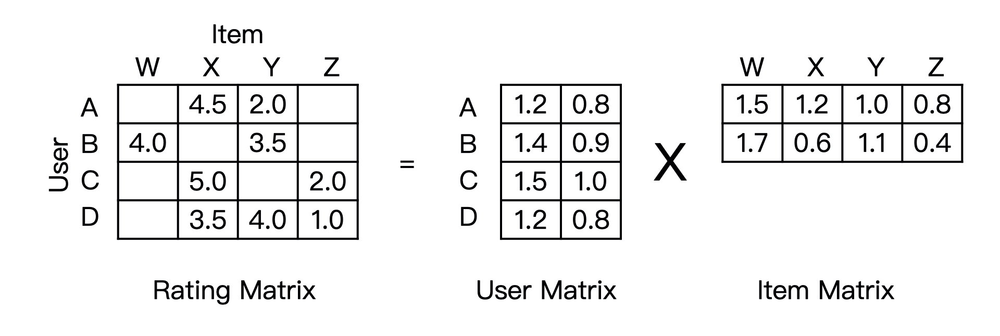
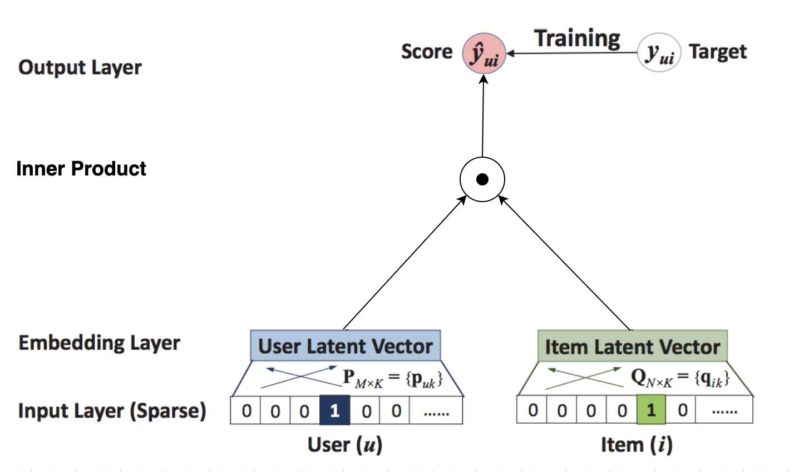
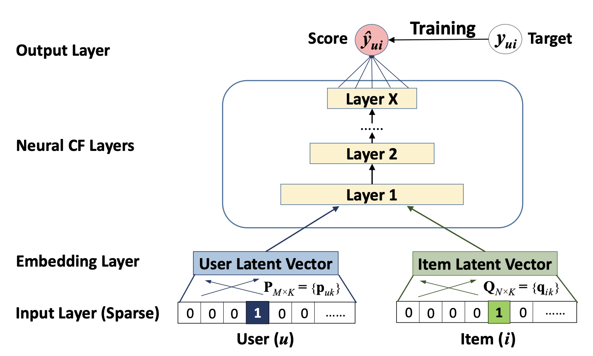
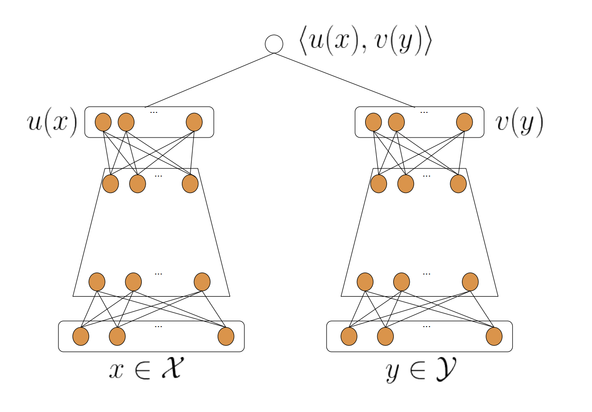
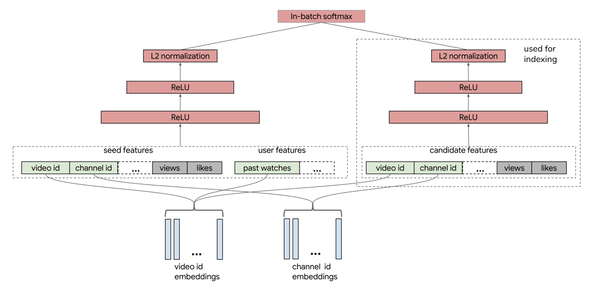

# NeuralCF 利用深度学习改造协同过滤


2017年，新加坡国立的研究者就使用深度学习网络来改进了传统的协同过滤算法，取名 NeuralCF（神经网络协同过滤）。NeuralCF 大大提高了协同过滤算法的泛化能力和拟合能力。


## NeuralCF 模型的结构


回顾一下协同过滤和矩阵分解的原理。协同过滤是利用用户和物品之间的交互行为历史，构建出一个像图 1 左一样的共现矩阵。在共现矩阵的基础上，利用每一行的用户向量相似性，找到相似用户，再利用相似用户喜欢的物品进行推荐。




矩阵分解则进一步加强了协同过滤的泛化能力，它把协同过滤中的共现矩阵分解成了用户矩阵和物品矩阵，从用户矩阵中提取出用户隐向量，从物品矩阵中提取出物品隐向量，再利用它们之间的内积相似性进行推荐排序。如果用神经网络的思路来理解矩阵分解，它的结构图就是图 2 这样的。




图 2 中的输入层是由用户 ID 和物品 ID 生成的 One-hot 向量，Embedding 层是把 One-hot 向量转化成稠密的 Embedding 向量表达，这部分就是矩阵分解中的用户隐向量和物品隐向量。输出层使用了用户隐向量和物品隐向量的内积作为最终预测得分，之后通过跟目标得分对比，进行反向梯度传播，更新整个网络。


把矩阵分解神经网络化之后，把它跟 Embedding+MLP 以及 Wide&Deep 模型做对比，我们可以一眼看出网络中的薄弱环节：矩阵分解在 Embedding 层之上的操作好像过于简单了，就是直接利用内积得出最终结果。这会导致特征之间还没有充分交叉就直接输出结果，模型会有欠拟合的风险。针对这一弱点，NeuralCF 对矩阵分解进行了改进，它的结构图是图 3 这样的。




NeuralCF 用一个多层的神经网络替代掉了原来简单的点积操作。这样就可以让用户和物品隐向量之间进行充分的交叉，提高模型整体的拟合能力。


## NeuralCF 模型的扩展，双塔模型


事实上，NeuralCF 的模型结构之中，蕴含了一个非常有价值的思想，就是我们可以把模型分成用户侧模型和物品侧模型两部分，然后用互操作层把这两部分联合起来，产生最后的预测得分。


这里的用户侧模型结构和物品侧模型结构，可以是简单的 Embedding 层，也可以是复杂的神经网络结构，最后的互操作层可以是简单的点积操作，也可以是比较复杂的 MLP 结构。但只要是这种物品侧模型 + 用户侧模型 + 互操作层的模型结构，我们把它统称为“双塔模型”结构。




对于 NerualCF 来说，它只利用了用户 ID 作为“用户塔”的输入特征，用物品 ID 作为“物品塔”的输入特征。事实上，我们完全可以把其他用户和物品相关的特征也分别放入用户塔和物品塔，让模型能够学到的信息更全面。比如说，YouTube 在构建用于召回层的双塔模型时，就分别在用户侧和物品侧输入了多种不同的特征，如图 5 所示。




我们看到，YouTube 召回双塔模型的用户侧特征包括了用户正在观看的视频 ID、频道 ID（图中的 seed features）、该视频的观看数、被喜欢的次数，以及用户历史观看过的视频 ID 等等。物品侧的特征包括了候选视频的 ID、频道 ID、被观看次数、被喜欢次数等等。在经过了多层 ReLU 神经网络的学习之后，双塔模型最终通过 softmax 输出层连接两部分，输出最终预测分数。


**双塔模型最重要的优势就在于它易上线、易服务。**


物品塔和用户塔最顶端的那层神经元，那层神经元的输出其实就是一个全新的物品 Embedding 和用户 Embedding。拿图 4 来说，物品塔的输入特征向量是 x，经过物品塔的一系列变换，生成了向量 u(x)，那么这个 u(x) 就是这个物品的 Embedding 向量。同理，v(y) 是用户 y 的 Embedding 向量，这时，我们就可以把 u(x) 和 v(y) 存入特征数据库，这样一来，线上服务的时候，我们只要把 u(x) 和 v(y) 取出来，再对它们做简单的互操作层运算就可以得出最后的模型预估结果了！


所以使用双塔模型，我们不用把整个模型都部署上线，只需要预存物品塔和用户塔的输出，以及在线上实现互操作层就可以了。如果这个互操作层是点积操作，那么这个实现可以说没有任何难度，这是实际应用中非常容易落地的，也是工程师们喜闻乐见的，这也正是双塔模型在业界巨大的优势所在。


正是因为这样的优势，双塔模型被广泛地应用在 YouTube、Facebook、百度等各大公司的推荐场景中，持续发挥着它的能量。


## NeuralCF 的 TensorFlow 实现


```python
# neural cf model arch two. only embedding in each tower, then MLP as the interaction layers
def neural_cf_model_1(feature_inputs, item_feature_columns, user_feature_columns, hidden_units):
    # 物品侧特征层
    item_tower = tf.keras.layers.DenseFeatures(item_feature_columns)(feature_inputs)
    # 用户侧特征层
    user_tower = tf.keras.layers.DenseFeatures(user_feature_columns)(feature_inputs)
    # 连接层及后续多层神经网络
    interact_layer = tf.keras.layers.concatenate([item_tower, user_tower])
    for num_nodes in hidden_units:
        interact_layer = tf.keras.layers.Dense(num_nodes, activation='relu')(interact_layer)
    # sigmoid单神经元输出层
    output_layer = tf.keras.layers.Dense(1, activation='sigmoid')(interact_layer)
    # 定义keras模型
    neural_cf_model = tf.keras.Model(feature_inputs, output_layer)
    return neural_cf_model
```

你可以看到代码中定义的生成 NeuralCF 模型的函数，它接收了四个输入变量。其中 feature_inputs 代表着所有的模型输入， item_feature_columns 和 user_feature_columns 分别包含了物品侧和用户侧的特征。在训练时，如果我们只在 item_feature_columns 中放入 movie_id ，在 user_feature_columns 放入 user_id， 就是 NeuralCF 的经典实现了。


通过 DenseFeatures 层创建好用户侧和物品侧输入层之后，我们会再利用 concatenate 层将二者连接起来，然后输入多层神经网络进行训练。如果想要定义多层神经网络的层数和神经元数量，我们可以通过设置 hidden_units 数组来实现。


#### 代码解释


这段代码定义了一个基于神经协同过滤（Neural Collaborative Filtering, 简称NCF）的推荐系统模型。NCF 是一种混合了深度学习技术的推荐系统框架，能够学习用户和物品（项目）之间的交互特征。这里，模型使用了分开的特征塔（tower）结构来分别处理物品侧和用户侧的特征，然后将这些特征合并，并通过多层感知机（MLP）进行深层特征交互和学习，以预测用户对物品的喜好。下面是详细的解释：

#### 输入和特征层

- **`feature_inputs`**：这是一个字典，包含所有输入特征的Keras Input层，每个特征都有其对应的Tensor。这种结构使得模型能够灵活处理多种类型的输入数据。
- **`item_feature_columns` 和 `user_feature_columns`**：这两个参数分别代表物品和用户的特征列。这些特征列可以包括各种类型，例如数值列、类别列、嵌入列等。`DenseFeatures`层将这些特征列处理成密集的向量输出，分别代表每个物品和用户的特征表示。

#### 特征塔

- **物品侧特征层（`item_tower`）**：专门处理与物品相关的特征，并将它们转换为一个密集的向量表示。
- **用户侧特征层（`user_tower`）**：同样地，处理与用户相关的特征，转换为另一个密集的向量表示。

#### 交互和多层感知机（MLP）

- **交互层**：将物品和用户的特征向量通过`concatenate`层合并，这一步是为了让模型能够在接下来的层中学习用户和物品特征之间的复杂交互关系。
- **MLP 层**：通过`hidden_units`参数定义的一系列密集层，每层使用ReLU激活函数。这些层的目的是进一步学习和抽象用户和物品特征的交互，从而提取对预测任务有用的深层表示。

#### 输出层

- **输出层**：最后一个`Dense`层，只有一个神经元，使用sigmoid激活函数，输出预测用户对某物品的兴趣程度（如购买或喜欢的概率）。

#### 模型定义

- **模型构建**：使用`tf.keras.Model`将输入和输出连接起来，定义整个模型的输入输出流。这种方式非常适合处理复杂的模型结构，并提供了良好的灵活性和扩展性。


## NeuralCF 的 TensorFlow 实现（优化） 


除了经典的 NeuralCF 实现，我还基于双塔模型的原理实现了一个 NeuralCF 的双塔版本。你可以参考下面的模型定义。与上面的经典 NerualCF 实现不同，我把多层神经网络操作放到了物品塔和用户塔内部，让塔内的特征进行充分交叉，最后使用内积层作为物品塔和用户塔的交互层。具体的步骤你可以参考下面代码中的注释，实现过程很好理解，我就不再赘述了。


```python
# neural cf model arch one. embedding+MLP in each tower, then dot product layer as the output
def neural_cf_model_2(feature_inputs, item_feature_columns, user_feature_columns, hidden_units):
    # 物品侧输入特征层
    item_tower = tf.keras.layers.DenseFeatures(item_feature_columns)(feature_inputs)
    # 物品塔结构
    for num_nodes in hidden_units:
        item_tower = tf.keras.layers.Dense(num_nodes, activation='relu')(item_tower)
    # 用户侧输入特征层
    user_tower = tf.keras.layers.DenseFeatures(user_feature_columns)(feature_inputs)
    # 用户塔结构
    for num_nodes in hidden_units:
        user_tower = tf.keras.layers.Dense(num_nodes, activation='relu')(user_tower)
    # 使用内积操作交互物品塔和用户塔，产生最后输出
    output = tf.keras.layers.Dot(axes=1)([item_tower, user_tower])
    # 定义keras模型
    neural_cf_model = tf.keras.Model(feature_inputs, output)
    return neural_cf_model
```

在实现了 Embedding MLP、Wide&Deep 和 NeuralCF 之后，相信你可以感觉到，实现甚至创造一个深度学习模型并不难，基于 TensorFlow 提供的 Keras 接口，我们可以根据我们的设计思路，像搭积木一样实现模型的不同结构，以此来验证我们的想法，这也正是深度推荐模型的魅力和优势。相信随着课程的进展，你不仅对这一点能够有更深刻的感受，同时，你设计和实现模型的能力也会进一步加强。