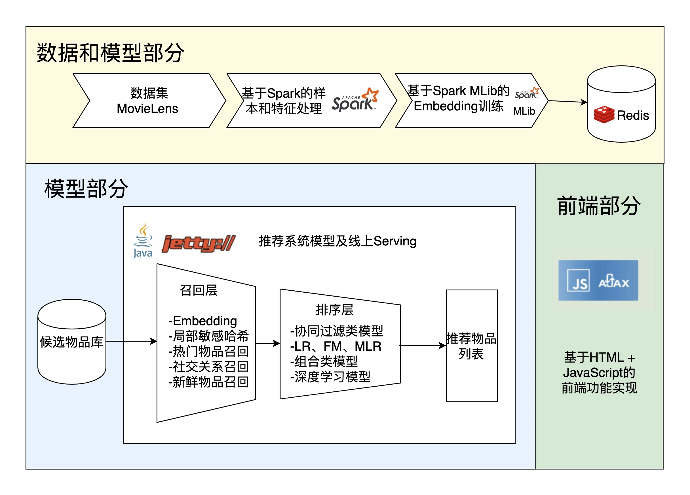
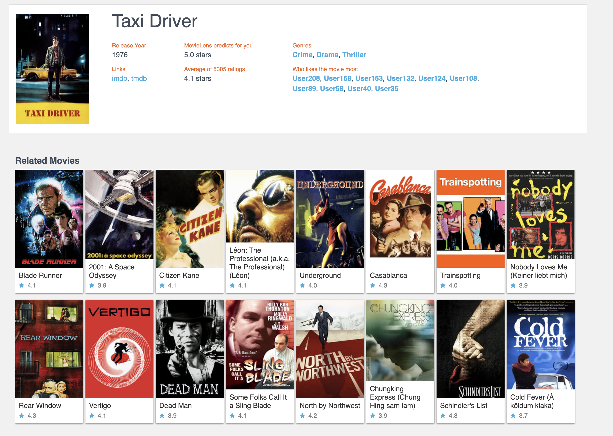

# Sparrow RecSys中的电影相似推荐功能实现


## 技术架构



## 数据和模型部分


选用 Item2vec、Deep Walk 等不同的 Embedding 方法，来生成物品 Embedding 向量。


## 线上服务部分


首先是候选物品库的建立。Sparrow Recsys 中候选物品库的建立采用了非常简单的方式，就是直接把 MovieLens 数据集中的物品数据载入到内存中。但对于业界比较复杂的推荐业务来说，候选集的选取往往是有很多条件的， 比如物品可不可用，有没有过期，有没有其他过滤条件等等，所以，工业级推荐系统往往会通过比较复杂的 SQL 查询，或者 API 查询来获取候选集。


第二步是召回层的实现。因为物品的 Embedding 向量已经在离线生成，所以我们可以自然而然的使用 Embedding 召回的方法来完成召回层的实现。同时，Sparrow Recsys 也实现了基于物品 metadata（元信息）的多路召回方法。参考com.wzhe.sparrowrecsys.online.recprocess.SimilarMovieProcess类中的 multipleRetrievalCandidates 函数和 retrievalCandidatesByEmbedding 函数。


第三步是排序层的实现。根据 Embedding 相似度来进行“相似物品推荐”，是深度学习推荐系统最主流的解决方案，所以在 Sparrow Recsys 中，我们当然也是先根据召回层过滤出候选集，再从 Redis 中取出相应的 Embedding 向量，然后计算目标物品和候选物品之间的相似度，最后进行排序就可以了。


## 前端部分


Sparrow Recsys 的前端部分采用了最简单的 HTML+AJAX 请求的方式。AJAX 的全称是 Asynchronous JavaScript and XML，异步 JavaScript 和 XML 请求。它指的是不刷新整体页面，用 JavaScript 异步请求服务器端，更新页面中部分元素的技术。当前流行的 JavaScript 前端框架 React、Vue 等等也大多是基于 AJAX 来进行数据交互的。


## 测试


```
http://localhost:6010/movie.html?movieId=111
```


显示影片id为111的类似电影



