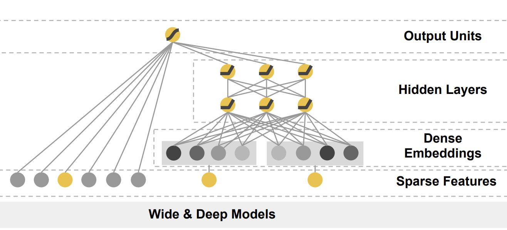
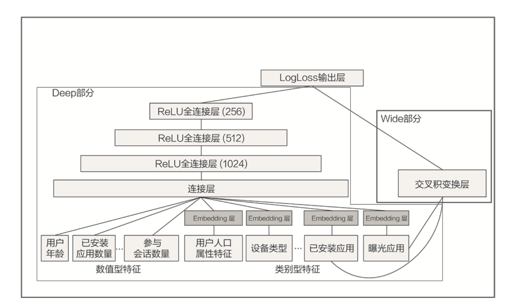

# Wide&Deep


## Wide&Deep 模型的结构




它是由左侧的 Wide 部分和右侧的 Deep 部分组成的。Wide 部分的结构太简单了，就是把输入层直接连接到输出层，中间没有做任何处理。Deep 层的结构是 Embedding+MLP 的模型结构。


Wide 部分的主要作用是让模型具有较强的“记忆能力”（Memorization），而 Deep 部分的主要作用是让模型具有“泛化能力”（Generalization），因为只有这样的结构特点，才能让模型兼具逻辑回归和深度神经网络的优点，也就是既能快速处理和记忆大量历史行为特征，又具有强大的表达能力。


## 模型的记忆能力

**所谓的 “记忆能力”，可以被宽泛地理解为模型直接学习历史数据中物品或者特征的“共现频率”，并且把它们直接作为推荐依据的能力 。**就像我们在电影推荐中可以发现一系列的规则，比如，看了 A 电影的用户经常喜欢看电影 B，这种“因为 A 所以 B”式的规则，非常直接也非常有价值。


但这类规则有两个特点：一是数量非常多，一个“记性不好”的推荐模型很难把它们都记住；二是没办法推而广之，因为这类规则非常具体，没办法或者说也没必要跟其他特征做进一步的组合。就像看了电影 A 的用户 80% 都喜欢看电影 B，这个特征已经非常强了，我们就没必要把它跟其他特征再组合在一起。


## 模型的泛化能力


**“泛化能力”指的是模型对于新鲜样本、以及从未出现过的特征组合的预测能力。**


看一个例子。假设，我们知道 25 岁的男性用户喜欢看电影 A，35 岁的女性用户也喜欢看电影 A。如果我们想让一个只有记忆能力的模型回答，“35 岁的男性喜不喜欢看电影 A”这样的问题，这个模型就会“说”，我从来没学过这样的知识啊，没法回答你。


矩阵分解算法，就是为了解决协同过滤“泛化能力”不强而诞生的。因为协同过滤只会“死板”地使用用户的原始行为特征，而矩阵分解因为生成了用户和物品的隐向量，所以就可以计算任意两个用户和物品之间的相似度了。这就是泛化能力强的另一个例子。


## Wide&Deep 模型的应用场景

例子：



从右边 Wide 部分的特征看起。这部分很简单，只利用了两个特征的交叉，这两个特征是“已安装应用”和“当前曝光应用”。这样一来，Wide 部分想学到的知识就非常直观啦，就是希望记忆好“如果 A 所以 B”这样的简单规则。在 Google Play 的场景下，就是希望记住“如果用户已经安装了应用 A，是否会安装 B”这样的规则。


再来看看左边的 Deep 部分，它就是一个非常典型的 Embedding+MLP 结构了。我们看到其中的输入特征很多，有用户年龄、属性特征、设备类型，还有已安装应用的 Embedding 等等。我们把这些特征一股脑地放进多层神经网络里面去学习之后，它们互相之间会发生多重的交叉组合，这最终会让模型具备很强的泛化能力。


比如说，我们把用户年龄、人口属性和已安装应用组合起来。假设，样本中有 25 岁男性安装抖音的记录，也有 35 岁女性安装抖音的记录，那我们该怎么预测 25 岁女性安装抖音的概率呢？这就需要用到已有特征的交叉来实现了。虽然我们没有 25 岁女性安装抖音的样本，但模型也能通过对已有知识的泛化，经过多层神经网络的学习，来推测出这个概率。


总的来说，Wide&Deep 通过组合 Wide 部分的线性模型和 Deep 部分的深度网络，取各自所长，就能得到一个综合能力更强的组合模型。


## Wide&Deep 模型的 TensorFlow 实现


使用 TensorFlow 的 Keras 接口来构建 Wide&Deep 模型。具体的代码如下：

```python
# wide and deep model architecture
# deep part for all input features
deep = tf.keras.layers.DenseFeatures(numerical_columns + categorical_columns)(inputs)
deep = tf.keras.layers.Dense(128, activation='relu')(deep)
deep = tf.keras.layers.Dense(128, activation='relu')(deep)
# wide part for cross feature
wide = tf.keras.layers.DenseFeatures(crossed_feature)(inputs)
both = tf.keras.layers.concatenate([deep, wide])
output_layer = tf.keras.layers.Dense(1, activation='sigmoid')(both)
model = tf.keras.Model(inputs, output_layer)
```

从代码中我们可以看到，在创建模型的时候，我们依次配置了模型的 Deep 部分和 Wide 部分。我们先来看 Deep 部分，它是输入层加两层 128 维隐层的结构，它的输入是类别型 Embedding 向量和数值型特征，实际上这跟Embedding+MLP 模型所用的特征是一样的。

```python
movie_feature = tf.feature_column.categorical_column_with_identity(key='movieId', num_buckets=1001)
rated_movie_feature = tf.feature_column.categorical_column_with_identity(key='userRatedMovie1', num_buckets=1001)
crossed_feature = tf.feature_column.crossed_column([movie_feature, rated_movie_feature], 10000)
```

