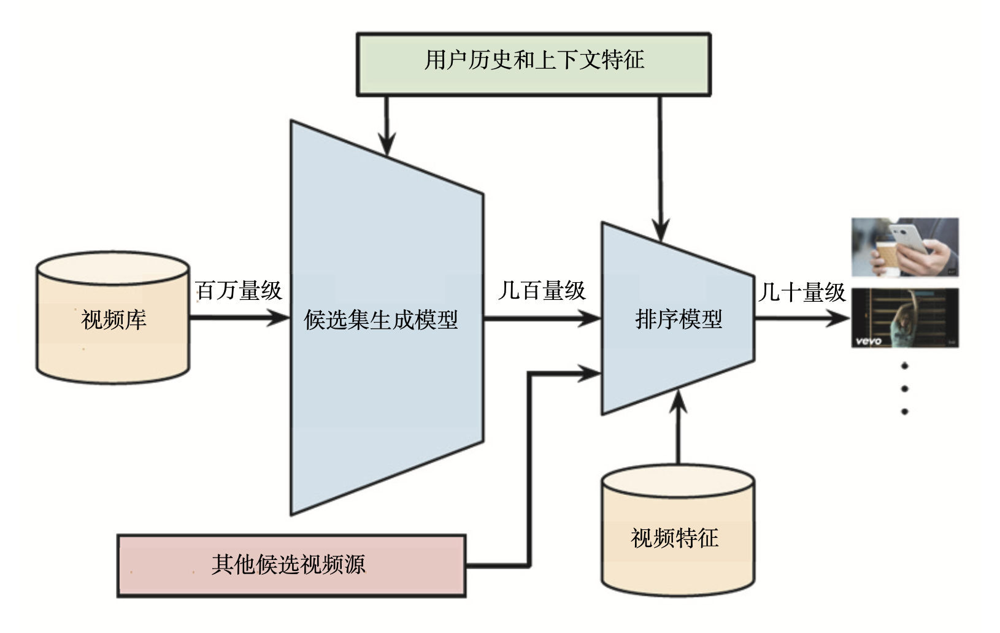
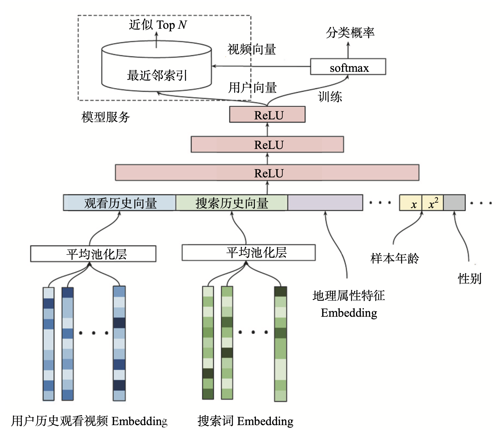
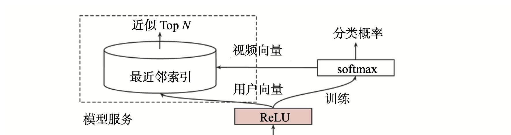

# 业界经典： Youtube 推荐系统

## 背景

作为全球最大的视频分享网站，YouTube 平台中几乎所有的视频都来自 UGC（User Generated Content，用户原创内容），这样的内容产生模式有两个特点：

- 一是其商业模式不同于 Netflix，以及国内的腾讯视频、爱奇艺这样的流媒体，这些流媒体的大部分内容都是采购或自制的电影、剧集等头部内容，而 YouTube 的内容都是用户上传的自制视频，种类风格繁多，头部效应没那么明显；
- 二是由于 YouTube 的视频基数巨大，用户难以发现喜欢的内容。

## Yourube 的架构

**它的推荐过程可以分成二级。第一级是用候选集生成模型（Candidate Generation Model）完成候选视频的快速筛选，在这一步，候选视频集合由百万降低到几百量级，这就相当于经典推荐系统架构中的召回层。第二级是用排序模型（Ranking Model）完成几百个候选视频的精排，这相当于经典推荐系统架构中的排序层。**

## 候选集生成模型

首先，是用于视频召回的候选集生成模型，它的模型架构如下图所示。

最底层是它的输入层，输入的特征包括用户历史观看视频的 Embedding 向量，以及搜索词的 Embedding 向量。对于这些 Embedding 特征，YouTube 是利用用户的观看序列和搜索序列，采用了类似 Item2vec 的预训练方式生成的。

除了视频和搜索词 Embedding 向量，特征向量中还包括用户的地理位置 Embedding、年龄、性别等特征。这里我们需要注意的是，对于样本年龄这个特征，YouTube 不仅使用了原始特征值，还把经过平方处理的特征值也作为一个新的特征输入模型。

确定好了特征，跟我们之前实践过的深度学习模型一样，这些特征会在 concat 层中连接起来，输入到上层的 ReLU 神经网络进行训练。

三层 ReLU 神经网络过后，YouTube 又使用了 softmax 函数作为输出层。值得一提的是，**这里的输出层不是要预测用户会不会点击这个视频，而是要预测用户会点击哪个视频**，这就跟我们之前实现过的深度推荐模型不一样了。

比如说，YouTube 上有 100 万个视频，因为输出层要预测用户会点击哪个视频，所以这里的 sofmax 就有 100 万个输出。因此，这个候选集生成模型的最终输出，就是一个在所有候选视频上的概率分布。为什么要这么做呢？它其实是为了更好、更快地进行线上服务。

总的来讲，YouTube 推荐系统的候选集生成模型，是一个标准的利用了 Embedding 预训练特征的深度推荐模型，它遵循我们之前实现的 Embedding MLP 模型的架构，只是在最后的输出层有所区别。

## 候选集生成模型独特的线上服务方法

为什么候选集生成模型要用“视频 ID”这个标签，来代替“用户会不会点击视频”这个标签作为预测目标。事实上，这跟候选集生成模型独特的线上服务方式紧密相关。

架构图左上角的模型服务（Serving）方法与模型训练方法完全不同。在候选集生成模型的线上服务过程中，YouTube 并没有直接采用训练时的模型进行预测，而是采用了一种最近邻搜索的方法

**因此，在通过“候选集生成模型”得到用户和视频的 Embedding 后，我们再通过 Embedding 最近邻搜索的方法，就可以提高模型服务的效率了。这样一来，我们甚至不用把模型推断的逻辑搬上服务器，只需要将用户 Embedding 和视频 Embedding 存到特征数据库就行了。**

