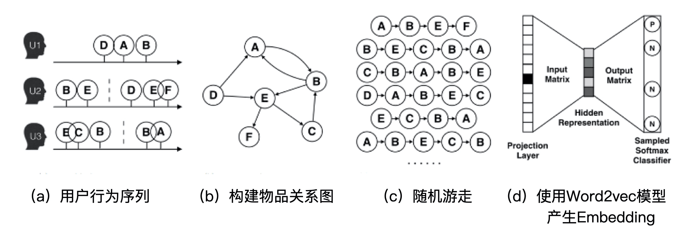

# 使用Spark生成Graph Embedding

## Deep walk 方法实现

Deep Walk 方法中，我们需要准备的最关键数据是物品之间的转移概率矩阵。上图是 Deep Walk 的算法流程图，转移概率矩阵表达了图 (b) 中的物品关系图，它定义了随机游走过程中，从物品 A 到物品 B 的跳转概率。

通过随机游走产生了我们训练所需的 sampleCount 个样本之后，下面的过程就和 Item2vec 的过程完全一致了，就是把这些训练样本输入到 Word2vec 模型中，完成最终 Graph Embedding 的生成。你也可以通过同样的方法去验证一下通过 Graph Embedding 方法生成的 Embedding 的效果。

## 代码

	//随机游走采样函数
	//transferMatrix 转移概率矩阵
	//itemCount 物品出现次数的分布
	def randomWalk(transferMatrix : scala.collection.mutable.Map[String, scala.collection.mutable.Map[String, Long]], itemCount : scala.collection.mutable.Map[String, Long]): Seq[Seq[String]] ={
	  //样本的数量
	  val sampleCount = 20000
	  //每个样本的长度
	  val sampleLength = 10
	  val samples = scala.collection.mutable.ListBuffer[Seq[String]]()
	  
	  //物品出现的总次数
	  var itemTotalCount:Long = 0
	  for ((k,v) <- itemCount) itemTotalCount += v
	
	
	  //随机游走sampleCount次，生成sampleCount个序列样本
	  for( w <- 1 to sampleCount) {
	    samples.append(oneRandomWalk(transferMatrix, itemCount, itemTotalCount, sampleLength))
	  }
	
	
	  Seq(samples.toList : _*)
	}
	
	
	//通过随机游走产生一个样本的过程
	//transferMatrix 转移概率矩阵
	//itemCount 物品出现次数的分布
	//itemTotalCount 物品出现总次数
	//sampleLength 每个样本的长度
	def oneRandomWalk(transferMatrix : scala.collection.mutable.Map[String, scala.collection.mutable.Map[String, Long]], itemCount : scala.collection.mutable.Map[String, Long], itemTotalCount:Long, sampleLength:Int): Seq[String] ={
	  val sample = scala.collection.mutable.ListBuffer[String]()
	
	
	  //决定起始点
	  val randomDouble = Random.nextDouble()
	  var firstElement = ""
	  var culCount:Long = 0
	  //根据物品出现的概率，随机决定起始点
	  breakable { for ((item, count) <- itemCount) {
	    culCount += count
	    if (culCount >= randomDouble * itemTotalCount){
	      firstElement = item
	      break
	    }
	  }}
	
	
	  sample.append(firstElement)
	  var curElement = firstElement
	  //通过随机游走产生长度为sampleLength的样本
	  breakable { for( w <- 1 until sampleLength) {
	    if (!itemCount.contains(curElement) || !transferMatrix.contains(curElement)){
	      break
	    }
	    //从curElement到下一个跳的转移概率向量
	    val probDistribution = transferMatrix(curElement)
	    val curCount = itemCount(curElement)
	    val randomDouble = Random.nextDouble()
	    var culCount:Long = 0
	    //根据转移概率向量随机决定下一跳的物品
	    breakable { for ((item, count) <- probDistribution) {
	      culCount += count
	      if (culCount >= randomDouble * curCount){
	        curElement = item
	        break
	      }
	    }}
	    sample.append(curElement)
	  }}
	  Seq(sample.toList : _

