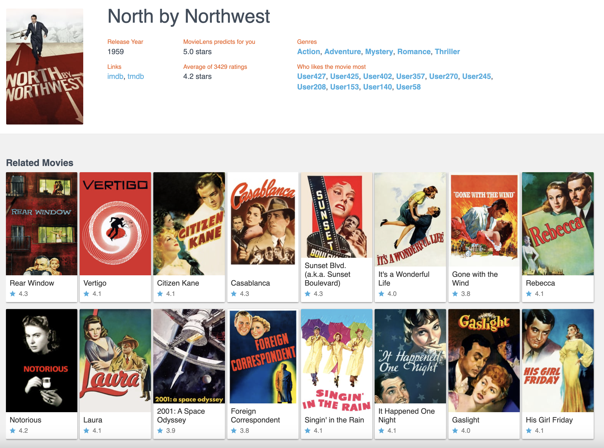

# 使用Spark生成Item2vec

## 代码

### 步骤一：过滤掉他评分低的电影，再把他评论过的电影按照时间戳排序

* 读取 ratings 原始数据到 Spark 平台；
* 用 where 语句过滤评分低的评分记录；
* 用 groupBy userId 操作聚合每个用户的评分记录，DataFrame 中每条记录是一个用户的评分序列；
* 定义一个自定义操作 sortUdf，用它实现每个用户的评分记录按照时间戳进行排序；
* 把每个用户的评分记录处理成一个字符串的形式，供后续训练过程使用。

#### 代码

	def processItemSequence(sparkSession: SparkSession): RDD[Seq[String]] ={
	  //设定rating数据的路径并用spark载入数据
	  val ratingsResourcesPath = this.getClass.getResource("/webroot/sampledata/ratings.csv")
	  val ratingSamples = sparkSession.read.format("csv").option("header", "true").load(ratingsResourcesPath.getPath)
	
	
	  //实现一个用户定义的操作函数(UDF)，用于之后的排序
	  val sortUdf: UserDefinedFunction = udf((rows: Seq[Row]) => {
	    rows.map { case Row(movieId: String, timestamp: String) => (movieId, timestamp) }
	      .sortBy { case (movieId, timestamp) => timestamp }
	      .map { case (movieId, timestamp) => movieId }
	  })
	  
	  ratingSamples.printSchema()
	
	
	  //把原始的rating数据处理成序列数据
	  val userSeq = ratingSamples
	    .where(col("rating") >= 3.5)  //过滤掉评分在3.5一下的评分记录
	    .groupBy("userId")            //按照用户id分组
	    .agg(sortUdf(collect_list(struct("movieId", "timestamp"))) as "movieIds")     //每个用户生成一个序列并用刚才定义好的udf函数按照timestamp排序
	    .withColumn("movieIdStr", array_join(col("movieIds"), " "))
	                //把所有id连接成一个String，方便后续word2vec模型处理
	
	  println(userSeq.show(10))
	
	  //把序列数据筛选出来，丢掉其他过程数据
	  userSeq.select("movieIdStr").rdd.map(r => r.getAs[String]("movieIdStr").split(" ").toSeq)

#### 打印

	root
	 |-- userId: string (nullable = true)
	 |-- movieId: string (nullable = true)
	 |-- rating: string (nullable = true)
	 |-- timestamp: string (nullable = true)
	 
	 
	 +------+--------------------+--------------------+
	|userId|            movieIds|          movieIdStr|
	+------+--------------------+--------------------+
	| 10096| [858, 50, 593, 457]|      858 50 593 457|
	| 10351|[1, 25, 32, 6, 60...|1 25 32 6 608 52 ...|
	| 10436|[661, 107, 60, 1,...|661 107 60 1 919 ...|
	|  1090|[356, 597, 919, 986]|     356 597 919 986|
	| 11078|[232, 20, 296, 59...|232 20 296 593 45...|
	| 11332|           [589, 32]|              589 32|
	| 11563|[382, 147, 782, 7...|382 147 782 73 85...|
	|  1159|[111, 965, 50, 15...|111 965 50 154 22...|
	| 11722|[161, 480, 589, 3...|161 480 589 364 1...|
	| 11888|[296, 380, 344, 5...|296 380 344 588 5...|
	+------+--------------------+--------------------+
	
	
### 步骤二:Item2vec：模型训练

#### 代码

	def trainItem2vec(samples : RDD[Seq[String]]): Unit ={
	    //设置模型参数
	    val word2vec = new Word2Vec()
	    .setVectorSize(10)
	    .setWindowSize(5)
	    .setNumIterations(10)
	
	
	  //训练模型
	  val model = word2vec.fit(samples)
	
	
	  //训练结束，用模型查找与item"592"最相似的20个item
	  val synonyms = model.findSynonyms("592", 20)
	  for((synonym, cosineSimilarity) <- synonyms) {
	    println(s"$synonym $cosineSimilarity")
	  }
	 
	  //保存模型
	  val embFolderPath = this.getClass.getResource("/webroot/sampledata/")
	  val file = new File(embFolderPath.getPath + "embedding.txt")
	  val bw = new BufferedWriter(new FileWriter(file))
	  var id = 0
	  //用model.getVectors获取所有Embedding向量
	  for (movieId <- model.getVectors.keys){
	    id+=1
	    bw.write( movieId + ":" + model.getVectors(movieId).mkString(" ") + "\n")
	  }
	  bw.close()

#### 关键步骤解释

* setVectorSize 用于设定生成的 Embedding 向量的维度
* setWindowSize 用于设定在序列数据上采样的滑动窗口大小
* setNumIterations 用于设定训练时的迭代次数。

最后一步就是提取和保存 Embedding 向量，我们可以从最后的几行代码中看到，调用 getVectors 接口就可以提取出某个电影 ID 对应的 Embedding 向量，之后就可以把它们保存到文件或者其他数据库中，供其他模块使用了。

#### 关键输出

embedding.txt：

	710:0.7224512 -0.30651325 -0.5657207 0.5200287 0.18510857 -1.1102543 0.7903719 -0.6149358 0.02446188 0.039651047
	205:0.2620467 0.3950139 0.08172831 0.108753 0.17899399 -1.0865806 -0.0520004 0.0017919338 0.20713842 0.14855699
	45:-0.15584214 0.42630064 -0.16839266 -0.1401844 0.2885304 -0.77104616 -0.12271258 0.32648852 0.096698545 -0.015961891
	515:-0.12042418 -0.013449253 -0.008910115 -0.2333298 0.4139603 -0.62149715 -0.423584 0.050249 0.58590543 -0.41326705
	574:-0.18759745 0.28202757 0.31370315 0.07656884 0.21282408 -0.9502721 0.06634987 -0.18909879 0.26578012 -0.0027911663
	858:-0.31697953 -0.08130734 0.30292636 -0.014567435 0.33066803 0.3273393 0.08887665 -0.23738578 0.020054754 0.27273858
	619:0.10506344 0.18574215 -0.8077123 0.33538777 0.31283572 -0.7773605 1.084129 -0.87289697 -0.1877768 0.06578425
	507:0.24512827 0.28230557 -0.5648285 0.19333227 0.25768277 -0.18860008 0.059517678 0.34570092 0.058042258 0.31877893
	113:0.05614848 -0.15259162 -0.49173334 0.34466818 0.4065799 -1.1110468 0.63911355 -0.6587879 -0.10842022 0.21221311
	
samples: 

	WrappedArray(163, 260, 50, 318, 527, 541, 858, 750, 296, 356, 480, 592, 110, 589, 32, 608, 344, 165, 316, 500, 733, 364, 47, 434, 288, 628, 111, 442, 293, 21, 180, 353, 440, 223, 16, 553, 514, 333, 70, 996, 610, 413, 319, 542)
	WrappedArray(303, 318, 924, 965, 926, 296, 356, 593, 110, 457, 150, 589, 1, 590, 527, 380, 32, 608, 50, 47, 858, 165, 364, 349, 231, 597, 733, 539, 208, 357, 541, 434, 6, 288, 25, 293, 778, 300, 750, 440, 508, 474, 104, 786, 509, 368, 337, 16, 923, 266, 350, 920, 904, 908, 784, 832, 553, 555, 48, 903, 953, 39, 454, 141, 21, 912, 36, 19, 173)
	WrappedArray(1, 32, 17, 36, 260, 494, 14, 858, 100, 647, 300, 50, 318, 527, 595, 593, 150, 588, 529, 720, 11, 111, 282, 471, 497, 475, 912, 261, 151, 594, 904, 349, 750, 596, 908, 292, 412, 923, 899, 919, 448, 969, 154, 410, 913, 914, 149, 926)
	WrappedArray(318, 50, 593, 858, 47, 260, 296, 364, 457)
	WrappedArray(150, 296, 590, 165, 344, 349, 231, 316, 318, 329, 595, 593, 161, 434, 185, 208, 300, 110, 288, 225, 47, 266, 111, 315, 282, 337, 252)

##  通过Item2vec方法找出相似电影

