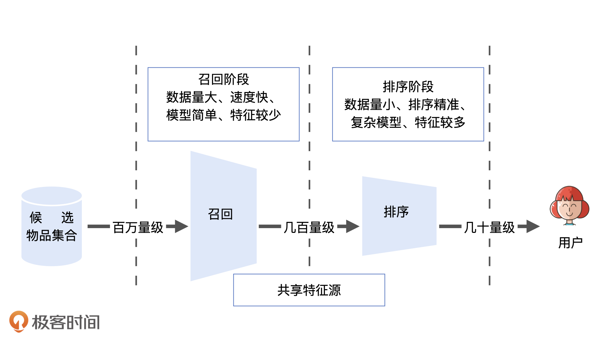
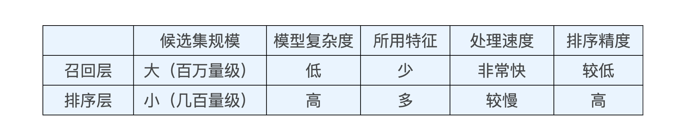
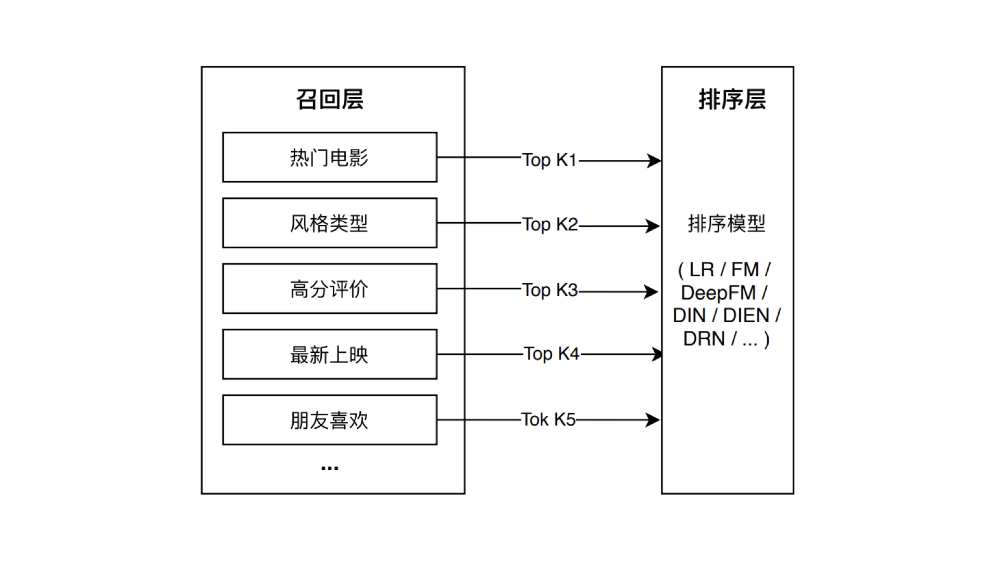
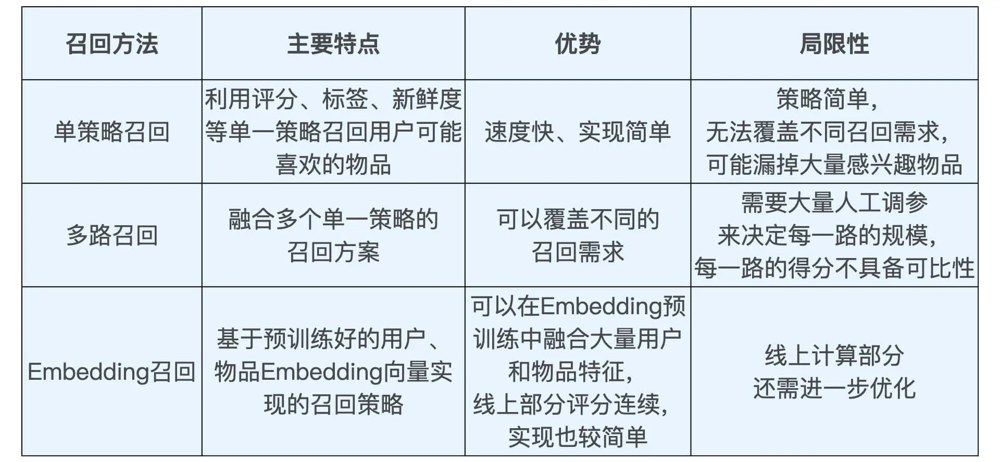

# 召回层

## 定义

为了弄清楚召回层是什么，我们先试着解决一下这个问题：如果你是一名快手的推荐工程师，你的任务是从 500 万个候选短视频中，为一名用户推荐 10 个他最感兴趣的。你会怎么做？

我想最直接最暴力的做法，就是对这 500 万个短视频挨个打分、排序，取出得分最高的 10 个推荐给用户。如果这个打分的算法非常靠谱的话，我们肯定能够选出用户最感兴趣的 Top 10 视频。但这个过程会涉及一个非常棘手的工程问题：如果利用比较复杂的推荐模型，特别是深度学习推荐模型，对 500 万个短视频打分，这个过程是非常消耗计算资源的。

而且你要知道，这还只是计算了一个用户的推荐结果，在工业级的线上服务中，每秒可是有几十万甚至上百万的用户同时请求服务器，逐个候选视频打分产生的计算量，是任何集群都承受不了的。

那在推荐物品候选集规模非常大的时候，我们该如何快速又准确地筛选掉不相关物品，从而节约排序时所消耗的计算资源呢？这其实就是推荐系统召回层要解决的问题。

## 召回层和排序层的功能特点

从技术架构的角度来说，“召回层”处于推荐系统的线上服务模块之中，推荐服务器从数据库或内存中拿到所有候选物品集合后，会依次经过召回层、排序层、再排序层（也被称为补充算法层），才能够产生用户最终看到的推荐列表。既然线上服务需要这么多“层”才能产生最终的结果，不同层之间的功能特点有什么区别呢？

特点：

## 代码

### 单策略召回
单策略召回指的是，通过制定一条规则或者利用一个简单模型来快速地召回可能的相关物品。这里的规则其实就是用户可能感兴趣的物品的特点，我们拿 SparrowRecSys 里面的电影推荐为例。在推荐电影的时候，我们首先要想到用户可能会喜欢什么电影。按照经验来说，很有可能是这三类，分别是大众口碑好的、近期非常火热的，以及跟我之前喜欢的电影风格类似的。

基于其中任何一条，我们都可以快速实现一个单策略召回层。比如在 SparrowRecSys 中，我就制定了这样一条召回策略：如果用户对电影 A 的评分较高，比如超过 4 分，那么我们就将与 A 风格相同，并且平均评分在前 50 的电影召回，放入排序候选集中。

代码：

	//详见SimilarMovieFlow class
	public static List<Movie> candidateGenerator(Movie movie){
	    ArrayList<Movie> candidates = new ArrayList<>();
	    //使用HashMap去重
	    HashMap<Integer, Movie> candidateMap = new HashMap<>();
	    //电影movie包含多个风格标签
	    for (String genre : movie.getGenres()){
	        //召回策略的实现
	        List<Movie> oneCandidates = DataManager.getInstance().getMoviesByGenre(genre, 100, "rating"); 
	        for (Movie candidate : oneCandidates){
	            candidateMap.put(candidate.getMovieId(), candidate);
	        }
	    }
	    //去掉movie本身
	    if (candidateMap.containsKey(movie.getMovieId())){
	        candidateMap.remove(movie.getMovieId());
	    }
	    //最终的候选集
	    return new ArrayList<>(candidateMap.values());
	}

getMoviesByGenre：

	    //get movies by genre, and order the movies by sortBy method
	    public List<Movie> getMoviesByGenre(String genre, int size, String sortBy){
	        if (null != genre){
	            List<Movie> movies = new ArrayList<>(this.genreReverseIndexMap.get(genre));
	            switch (sortBy){
	                case "rating":movies.sort((m1, m2) -> Double.compare(m2.getAverageRating(), m1.getAverageRating()));break;
	                case "releaseYear": movies.sort((m1, m2) -> Integer.compare(m2.getReleaseYear(), m1.getReleaseYear()));break;
	                default:
	            }
	
	            if (movies.size() > size){
	                return movies.subList(0, size);
	            }
	            return movies;
	        }
	        return null;
	    }

### 多路召回

所谓“多路召回策略”，就是指采用不同的策略、特征或简单模型，分别召回一部分候选集，然后把候选集混合在一起供后续排序模型使用的策略。

下面是我给出的电影推荐中常用的多路召回策略，包括热门电影、风格类型、高分评价、最新上映以及朋友喜欢等等。除此之外，我们也可以把一些推断速度比较快的简单模型（比如逻辑回归，协同过滤等）生成的推荐结果放入多路召回层中，形成综合性更好的候选集。具体的操作过程就是，我们分别执行这些策略，让每个策略选取 Top K 个物品，最后混合多个 Top K 物品，就形成了最终的多路召回候选集。整个过程就如下所示：

	public static List<Movie> multipleRetrievalCandidates(List<Movie> userHistory){
	    HashSet<String> genres = new HashSet<>();
	    //根据用户看过的电影，统计用户喜欢的电影风格
	    for (Movie movie : userHistory){
	        genres.addAll(movie.getGenres());
	    }
	    //根据用户喜欢的风格召回电影候选集
	    HashMap<Integer, Movie> candidateMap = new HashMap<>();
	    for (String genre : genres){
	        List<Movie> oneCandidates = DataManager.getInstance().getMoviesByGenre(genre, 20, "rating");
	        for (Movie candidate : oneCandidates){
	            candidateMap.put(candidate.getMovieId(), candidate);
	        }
	    }
	    //召回所有电影中排名最高的100部电影
	    List<Movie> highRatingCandidates = DataManager.getInstance().getMovies(100, "rating");
	    for (Movie candidate : highRatingCandidates){
	        candidateMap.put(candidate.getMovieId(), candidate);
	    }
	    //召回最新上映的100部电影
	    List<Movie> latestCandidates = DataManager.getInstance().getMovies(100, "releaseYear");
	    for (Movie candidate : latestCandidates){
	        candidateMap.put(candidate.getMovieId(), candidate);
	    }
	    //去除用户已经观看过的电影
	    for (Movie movie : userHistory){
	        candidateMap.remove(movie.getMovieId());
	    }
	    //形成最终的候选集
	    return new ArrayList<>(candidateMap.values());
	}

在实现的过程中，为了进一步优化召回效率，我们还可以通过多线程并行、建立标签 / 特征索引、建立常用召回集缓存等方法来进一步完善它。

## 基于 Embedding 的召回方法

利用物品和用户 Embedding 相似性来构建召回层，是深度学习推荐系统中非常经典的技术方案。

一方面，多路召回中使用的“兴趣标签”“热门度”“流行趋势”“物品属性”等信息都可以作为 Embedding 方法中的附加信息（Side Information），融合进最终的 Embedding 向量中 。

	public static List<Movie> retrievalCandidatesByEmbedding(User user){
	    if (null == user){
	        return null;
	    }
	    //获取用户embedding向量
	    double[] userEmbedding = DataManager.getInstance().getUserEmbedding(user.getUserId(), "item2vec");
	    if (null == userEmbedding){
	        return null;
	    }
	    //获取所有影片候选集(这里取评分排名前10000的影片作为全部候选集)
	    List<Movie> allCandidates = DataManager.getInstance().getMovies(10000, "rating");
	    HashMap<Movie,Double> movieScoreMap = new HashMap<>();
	    //逐一获取电影embedding，并计算与用户embedding的相似度
	    for (Movie candidate : allCandidates){
	        double[] itemEmbedding = DataManager.getInstance().getItemEmbedding(candidate.getMovieId(), "item2vec");
	        double similarity = calculateEmbeddingSimilarity(userEmbedding, itemEmbedding);
	        movieScoreMap.put(candidate, similarity);
	    }
	   
	    List<Map.Entry<Movie,Double>> movieScoreList = new ArrayList<>(movieScoreMap.entrySet());
	    //按照用户-电影embedding相似度进行候选电影集排序
	    movieScoreList.sort(Map.Entry.comparingByValue());
	
	
	    //生成并返回最终的候选集
	    List<Movie> candidates = new ArrayList<>();
	    for (Map.Entry<Movie,Double> movieScoreEntry : movieScoreList){
	        candidates.add(movieScoreEntry.getKey());
	    }
	    return candidates.subList(0, Math.min(candidates.size(), size));
	}

总的来说，我们通过三步生成了最终的候选集。第一步，我们获取用户的 Embedding。第二步，我们获取所有物品的候选集，并且逐一获取物品的 Embedding，计算物品 Embedding 和用户 Embedding 的相似度。第三步，我们根据相似度排序，返回规定大小的候选集。

