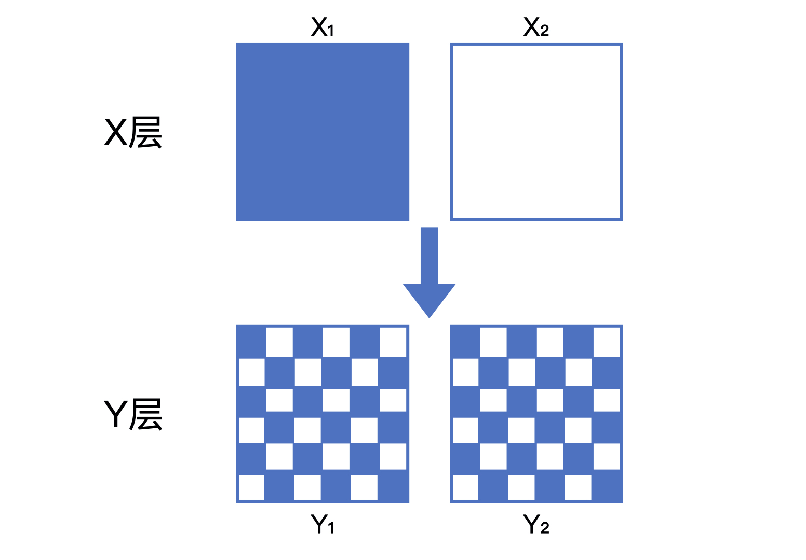
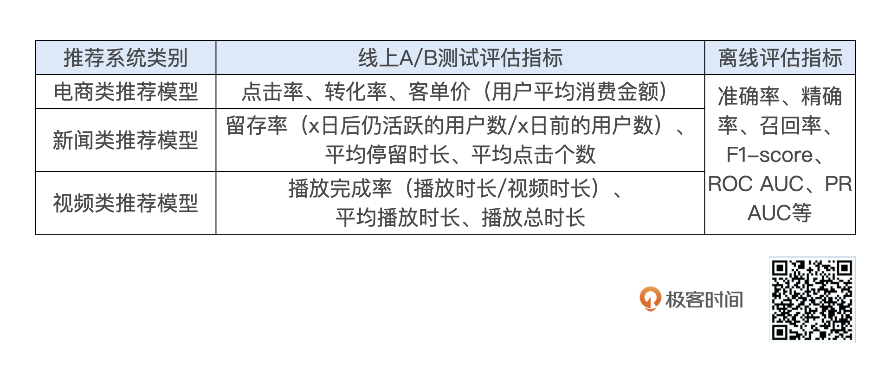

# 在推荐服务器内部实现A/B测试


## 如何理解 A/B 测试？

A/B 测试又被称为“分流测试”或“分桶测试”，它通过把被测对象随机分成 A、B 两组，分别对它们进行对照测试的方法得出实验结论。具体到推荐模型测试的场景下，它的流程是这样的：先将用户随机分成实验组和对照组，然后给实验组的用户施以新模型，给对照组的用户施以旧模型，再经过一定时间的测试后，计算出实验组和对照组各项线。


### A/B 测试的优势：


**首先，离线评估无法完全还原线上的工程环境。** 一般来讲，离线评估往往不考虑线上环境的延迟、数据丢失、标签数据缺失等情况，或者说很难还原线上环境的这些细节。因此，离线评估环境只能说是理想状态下的工程环境，得出的评估结果存在一定的失真现象


**其次，线上系统的某些商业指标在离线评估中无法计算。** 离线评估一般是针对模型本身进行评估的，无法直接获得与模型相关的其他指标，特别是商业指标。像我们上节课讲的，离线评估关注的往往是 ROC 曲线、PR 曲线的改进，而线上评估却可以全面了解推荐模型带来的用户点击率、留存时长、PV 访问量这些指标的变化。


**最后是离线评估无法完全消除数据有偏（Data Bias）现象的影响。**什么叫“数据有偏”呢？因为离线数据都是系统利用当前算法生成的数据，因此这些数据本身就不是完全客观中立的，它是用户在当前模型下的反馈。所以说，用户本身有可能已经被当前的模型“带跑偏了”，你再用这些有偏的数据来衡量你的新模型，得到的结果就可能不客观。


## A/B 测试的“分桶”和“分层”原则


难点：比如到底怎样才能对用户进行一个公平公正的分桶呢？如果有多组实验在同时做 A/B 测试，怎样做才能让它们互不干扰？


在 A/B 测试分桶的过程中，我们需要注意的是**样本的独立性和分桶过程的无偏性。**这里的“独立性”指的是同一个用户在测试的全程只能被分到同一个桶中。“无偏性”指的是在分桶过程中用户被分到哪个实验桶中应该是一个纯随机的过程。


举个简单的例子，我们把用户 ID 是奇数的用户分到对照组，把用户 ID 是偶数的用户分到实验组，这个策略只有在用户 ID 完全是随机生成的前提下才能说是无偏的，如果用户 ID 的奇偶分布不均，我们就无法保证分桶过程的无偏性。所以在实践的时候，我们经常会使用一些比较复杂的 Hash 函数，让用户 ID 尽量随机地映射到不同的桶中。


说完了分桶，那什么是分层呢？要知道，在实际的 A/B 测试场景下，同一个网站或应用往往要同时进行多组不同类型的 A/B 测试。比如，前端组正在进行不同 App 界面的 A/B 测试的时候，后端组也在进行不同中间件效率的 A/B 测试，同时算法组还在进行推荐场景 1 和推荐场景 2 的 A/B 测试。这个时候问题就来了，这么多 A/B 测试同时进行，我们怎么才能让它们互相不干扰呢？


你可能会说，这还不简单，我们全都并行地做这些实验，用户都不重叠不就行了。这样做当然可以，但非常低效。你如果在工作中进行过 A/B 测试的话肯定会知道，线上测试资源是非常紧张的，如果不进行合理的设计，很快所有流量资源都会被 A/B 测试占满。


Google 在一篇关于实验测试平台的论文《Overlapping Experiment Infrastructure: More, Better, Faster Experimentation》中，总结出**层与层之间的流量“正交”，同层之间的流量“互斥”。**


首先，我们来看层与层之间的流量“正交”，它指的是层与层之间的独立实验的流量是正交的，一批实验用的流量穿越每层实验时，都会再次随机打散，然后再用于下一层的实验。


这么说好像还是太抽象，我们来看下面的示意图。假设，在一个 X 层的实验中，流量被随机平均分为 X1（蓝色）和 X2（白色）两部分。当它们穿越到 Y 层的实验之后，X1 和 X2 的流量会被随机且均匀地分配给 Y 层的两个桶 Y1 和 Y2。


如果 Y1 和 Y2 的 X 层流量分配不均匀，那么 Y 层的样本就是有偏的，Y 层的实验结果就会被 X 层的实验影响，也就无法客观地反映 Y 层实验组和对照组变量的影响。




同层之间的流量“互斥”。这里的“互斥”具体有 2 层含义：

- 如果同层之间进行多组 A/B 测试，不同测试之间的流量不可以重叠，这是第一个“互斥”；
- 一组 A/B 测试中实验组和对照组的流量是不重叠的，这是第二个“互斥”


在基于用户的 A/B 测试中，“互斥”的含义可以被进一步解读为，不同实验之间以及 A/B 测试的实验组和对照组之间的用户是不重叠的。特别是对推荐系统来说，用户体验的一致性是非常重要的。也就是说我们不可以让同一个用户在不同的实验组之间来回“跳跃”，这样会严重损害用户的实际体验，也会让不同组的实验结果相互影响。因此在 A/B 测试中，保证同一用户始终分配到同一个组是非常有必要的。


### ## 线上 A/B 测试的评估指标


一般来说，A/B 测试是模型上线前的最后一道测试，通过 A/B 测试检验的模型会直接服务于线上用户，来完成公司的商业目标。因此，**A/B 测试的指标应该与线上业务的核心指标保持一致。**





线上 A/B 测试的指标和离线评估的指标（诸如 AUC、F1- score 等），它们之间的差异非常大。这主要是因为，离线评估不具备直接计算业务核心指标的条件，因此退而求其次，选择了偏向于技术评估的模型相关指标，但公司更关心的是能够驱动业务发展的核心指标，这也是 A/B 测试评估指标的选取原则。


## SparrowRecSys 中 A/B 测试的实现方法


```scala
public class ABTest {
    final static int trafficSplitNumber = 5;
    final static String bucketAModel = "emb";
    final static String bucketBModel = "nerualcf";
    final static String defaultModel = "emb";
    public static String getConfigByUserId(String userId){
        if (null == userId || userId.isEmpty()){
            return defaultModel;
        }
        if(userId.hashCode() % trafficSplitNumber == 0){
            System.out.println(userId + " is in bucketA.");
            return bucketAModel;
        }else if(userId.hashCode() % trafficSplitNumber == 1){
            System.out.println(userId + " is in bucketB.");
            return bucketBModel;
        }else{
            System.out.println(userId + " isn't in AB test.");
            return defaultModel;
        }
    }
}
```


 类包含一些静态成员变量来定义测试参数和模型名称：

- **`trafficSplitNumber`**：用于确定流量分配的基数，这里设置为5，意味着用户ID哈希值将被5除以确定用户的分组。
- **`bucketAModel`** 和 **`bucketBModel`**：这两个变量分别存储分配给A桶和B桶用户的模型名称。
- **`defaultModel`**：如果用户不属于A桶或B桶，则默认使用这个模型。

- 分桶逻辑
  - 使用 `userId.hashCode()` 方法获取用户ID的哈希值，然后用这个哈希值对 `trafficSplitNumber` 取模。
  - 如果结果为0，说明用户ID对应的哈希值模5的结果为0，用户被分配到A桶，方法返回A桶的模型，并打印相应的日志。
  - 如果结果为1，用户被分配到B桶，方法返回B桶的模型，并打印相应的日志。
  - 对于其他结果（即模5结果为2、3或4的情况），用户不参与A/B测试，使用默认模型，同样打印日志说明用户不在测试中。


上面是 A/B 测试模块的主要实现。在实际要进行 A/B 测试的业务逻辑中，我们需要调用 A/B 测试模块来获得正确的实验设置。比如，我们这次选用了猜你喜欢这个功能进行 A/B 测试，就需要在相应的实现 RecForYoService 类中添加 A/B 测试的代码，具体的实现如下：


```scala
if (Config.IS_ENABLE_AB_TEST){
    model = ABTest.getConfigByUserId(userId);
}
//a simple method, just fetch all the movie in the genre
List<Movie> movies = RecForYouProcess.getRecList(Integer.parseInt(userId), Integer.parseInt(size), model);
```

实现非常简单，就是调用 ABTest.getConfigByUserId 函数获取用户对应的实验设置，然后把得到的参数 model 传入后续的业务逻辑代码。需要注意的是，我设置了一个全局的 A/B 测试使能标识 Config.IS_ENABLE_AB_TEST，你在测试这部分代码的时候，要把这个使能标识改为 true。