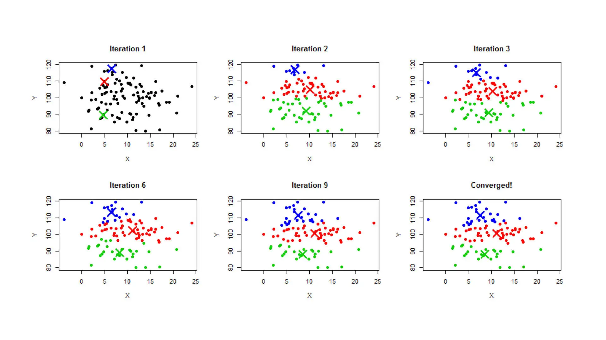
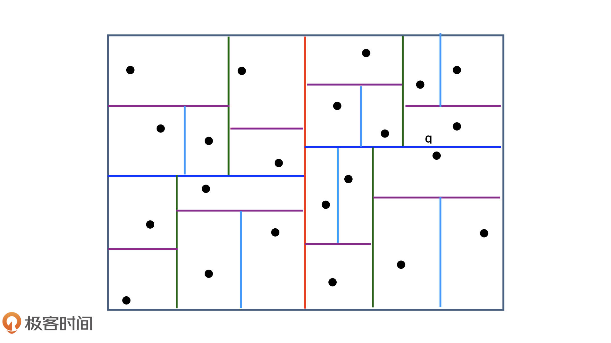
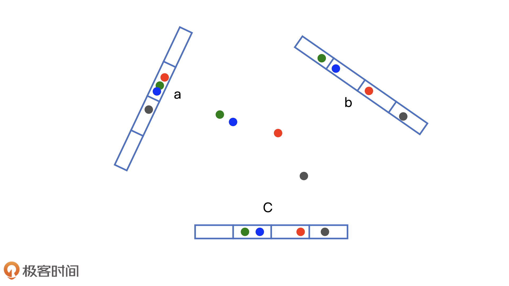
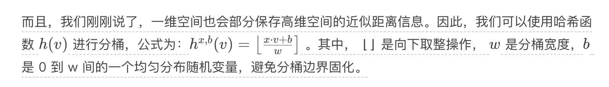

#  局部敏感哈希：搜索Embedding最近邻

## 背景

在深度学习推荐系统中，我们经常采用 Embedding 召回这一准确又便捷的方法。但是，在面对百万甚至更高量级的候选集时，线性地逐一计算 Embedding 间的相似度，往往会造成极大的服务延迟。这个时候，我们要解决的问题就是，如何快速找到与一个 Embedding 最相似的 Embedding？这直接决定了召回层的执行速度，进而会影响推荐服务器的响应延迟。

假设，用户和物品的 Embeding 都在一个 k 维的 Embedding 空间中，物品总数为 n，那么遍历计算一个用户和所有物品向量相似度的时间复杂度是多少呢？不难算出是 O(k×n)。虽然这一复杂度是线性的，但物品总数 n 达到百万甚至千万量级时，线性的时间复杂度也是线上服务不能承受的。

**召回与用户向量最相似的物品 Embedding 向量这一问题，其实就是在向量空间内搜索最近邻的过程。**

## 使用“聚类”还是“索引”来搜索最近邻？

### 聚类

 K-means。它完成聚类的过程主要有以下几步：

1. 随机指定 k 个中心点；
1. 每个中心点代表一个类，把所有的点按照距离的远近指定给距离最近的中心点代表的类；
1. 计算每个类包含点的平均值作为新的中心点位置；
1. 确定好新的中心点位置后，迭代进入第 2 步，直到中心点位置收敛，不再移动。

到这里，整个 K-means 的迭代更新过程就完成了，可以看下图

如果我们能够在离线计算好每个 Embedding 向量的类别，在线上我们只需要在同一个类别内的 Embedding 向量中搜索就可以了，这会大大缩小了 Embedding 的搜索范围，时间复杂度自然就下降了。

### 聚类的局限性

* 存在着一些边界情况：比如，聚类边缘的点的最近邻往往会包括相邻聚类的点，如果我们只在类别内搜索，就会遗漏这些近似点。
* 中心点的数量 k 也不那么好确定：k 选得太大，离线迭代的过程就会非常慢，k 选得太小，在线搜索的范围还是很大，并没有减少太多搜索时间。

### 向量空间索引

Kd-tree（K-dimension tree）：为空间中的点 / 向量建立一个索引。

下图 3中的点云，我们先用红色的线把点云一分为二，再用深蓝色的线把各自片区的点云一分为二，以此。/     
      ，直到每个片区只剩下一个点，这就完成了空间索引的构建。如果我们能够把这套索引“搬”到线上，就可以利用二叉树的结构快速找到邻接点。比如，希望找到点 q 的 m 个邻接点，我们就可以先搜索它相邻子树下的点，如果数量不够，我们可以向上回退一个层级，搜索它父片区下的其他点，直到数量凑够 m 个为止。

### 向量空间索引的缺陷

* 无法完全解决边缘点最近邻的问题：对于点 q 来说，它的邻接片区是右上角的片区，但是它的最近邻点却是深蓝色切分线下方的那个点。所以按照 Kd-tree 的索引方法，我们还是会遗漏掉最近邻点
* Kd-tree 索引的结构并不简单，离线和在线维护的过程也相对复杂

## 局部敏感哈希(Locality Sensitive Hashing,LSH)的基本原理 

一条直线分成w个等分，每一个等分为一个哈希桶。

局部敏感哈希的基本思想是希望让相邻的点落入同一个“桶”，这样在进行最近邻搜索时，我们仅需要在一个桶内，或相邻几个桶内的元素中进行搜索即可。如果保持每个桶中的元素个数在一个常数附近，我们就可以把最近邻搜索的时间复杂度降低到常数级别。

欧式空间中，将高维空间的点映射到低维空间，原本接近的点在低维空间中肯定依然接近，但原本远离的点则有一定概率变成接近的点。

我们可以采用 m 个哈希函数同时进行分桶。如果两个点同时掉进了 m 个桶，那它们是相似点的概率将大大增加。通过分桶找到相邻点的候选集合后，我们就可以在有限的候选集合中通过遍历找到目标点真正的 K 近邻了。

## 局部敏感哈希的多桶策略

上面讲到了可以使用多个分桶函数的方式来增加找到相似点的概率。那你可能有疑问，如果有多个分桶函数的话，具体应该如何处理不同桶之间的关系呢？这就涉及局部敏感哈希的多桶策略。

假设有 A、B、C、D、E 五个点，有 h1和 h2两个分桶函数。使用 h1来分桶时，A 和 B 掉到了一个桶里，C、D、E 掉到了一个桶里；使用 h2来分桶时，A、C、D 掉到了一个桶里，B、E 在一个桶。那么请问如果我们想找点 C 的最近邻点，应该怎么利用两个分桶结果来计算呢？

如果我们用“且”（And）操作来处理两个分桶结果之间的关系，那么结果是这样的，找到与点 C 在 h1函数下同一个桶的点，且在 h2函数下同一个桶的点，作为最近邻候选点。我们可以看到，满足条件的点只有一个，那就是点 D。也就是说，点 D 最有可能是点 C 的最近邻点。

用“且”操作作为多桶策略，可以最大程度地减少候选点数量。但是，由于哈希分桶函数不是一个绝对精确的操作，点 D 也只是最有可能的最近邻点，不是一定的最近邻点，因此，“且”操作其实也增大了漏掉最近邻点的概率。

那如果我们采用“或”（Or）操作作为多桶策略，又会是什么情况呢？具体操作就是，我们找到与点 C 在 h1函数下同一个桶的点，或在 h2函数下同一个桶的点。这个时候，我们可以看到候选集中会有三个点，分别是 A、D、E。这样一来，虽然我们增大了候选集的规模，减少了漏掉最近邻点的可能性，但增大了后续计算的开销。

当然，局部敏感哈希的多桶策略还可以更加复杂，比如使用 3 个分桶函数分桶，把同时落入两个桶的点作为最近邻候选点等等。

### 规则

* 点数越多，我们越应该增加每个分桶函数中桶的个数；相反，点数越少，我们越应该减少桶的个数；
* Embedding 向量的维度越大，我们越应该增加哈希函数的数量，尽量采用且的方式作为多桶策略；相反，Embedding 向量维度越小，我们越应该减少哈希函数的数量，多采用或的方式作为分桶策略。

## 局部敏感哈希实践

在将电影 Embedding 数据转换成 dense Vector 的形式之后，我们使用 Spark MLlib 自带的 LSH 分桶模型 BucketedRandomProjectionLSH（我们简称 LSH 模型）来进行 LSH 分桶。其中最关键的部分是设定 LSH 模型中的 BucketLength 和 NumHashTables 这两个参数。其中，BucketLength 指的就是分桶公式中的分桶宽度 w，NumHashTables 指的是多桶策略中的分桶次数。

	def embeddingLSH(spark:SparkSession, movieEmbMap:Map[String, Array[Float]]): Unit ={
	  //将电影embedding数据转换成dense Vector的形式，便于之后处理
	  val movieEmbSeq = movieEmbMap.toSeq.map(item => (item._1, Vectors.dense(item._2.map(f => f.toDouble))))
	  val movieEmbDF = spark.createDataFrame(movieEmbSeq).toDF("movieId", "emb")
	
	
	  //利用Spark MLlib创建LSH分桶模型
	  val bucketProjectionLSH = new BucketedRandomProjectionLSH()
	    .setBucketLength(0.1)
	    .setNumHashTables(3)
	    .setInputCol("emb")
	    .setOutputCol("bucketId")
	  //训练LSH分桶模型
	  val bucketModel = bucketProjectionLSH.fit(movieEmbDF)
	  //进行分桶
	  val embBucketResult = bucketModel.transform(movieEmbDF)
	  
	  //打印分桶结果
	  println("movieId, emb, bucketId schema:")
	  embBucketResult.printSchema()
	  println("movieId, emb, bucketId data result:")
	  embBucketResult.show(10, truncate = false)
	  
	  //尝试对一个示例Embedding查找最近邻
	  println("Approximately searching for 5 nearest neighbors of the sample embedding:")
	  val sampleEmb = Vectors.dense(0.795,0.583,1.120,0.850,0.174,-0.839,-0.0633,0.249,0.673,-0.237)
	  bucketModel.approxNearestNeighbors(movieEmbDF, sampleEmb, 5).show(truncate = false)
	}

### 打印结果

	+-------+-----------------------------+------------------------+
	|movieId|emb                          |bucketId                |
	+-------+-----------------------------+------------------------+
	|710    |[0.04211471602320671,..]     |[[-2.0], [14.0], [8.0]] |
	|205    |[0.6645985841751099,...]     |[[-4.0], [3.0], [5.0]]  |
	|45     |[0.4899883568286896,...]     |[[-6.0], [-1.0], [2.0]] |
	|515    |[0.6064003705978394,...]     |[[-3.0], [-1.0], [2.0]] |
	|574    |[0.5780771970748901,...]     |[[-5.0], [2.0], [0.0]]  |
	+-------+-----------------------------+------------------------+

在 BucketId 这一列，因为我们之前设置了 NumHashTables 参数为 3，所以每一个 Embedding 对应了 3 个 BucketId。在实际的最近邻搜索过程中，我们就可以利用刚才讲的多桶策略进行搜索了。