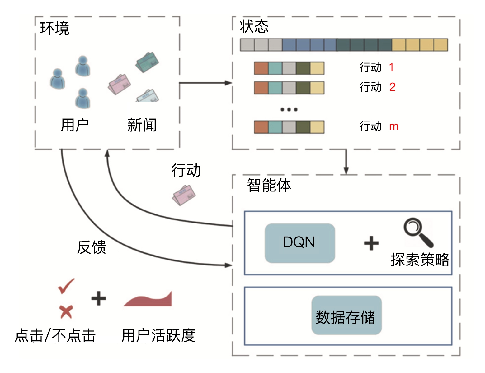

# 强化学习：让推荐系统像智能机器人一样自主学习

## 强化学习的基本概念

强化学习的基本原理，**简单来说，就是一个智能体通过与环境进行交互，不断学习强化自己的智力，来指导自己的下一步行动，以取得最大化的预期利益。**

实上，任何一个有智力的个体，它的学习过程都遵循强化学习所描述的原理。比如说，婴儿学走路就是通过与环境交互，不断从失败中学习，来改进自己的下一步的动作才最终成功的。再比如说，在机器人领域，一个智能机器人控制机械臂来完成一个指定的任务，或者协调全身的动作来学习跑步，本质上都符合强化学习的过程。

对于一个通用的强化学习框架来说，有这么六个元素是必须要有的：

- 智能体（Agent）：强化学习的主体也就是作出决定的“大脑”；
- 环境（Environment）：智能体所在的环境，智能体交互的对象；
- 行动（Action）：由智能体做出的行动；
- 奖励（Reward）：智能体作出行动后，该行动带来的奖励；
- 状态（State）：智能体自身当前所处的状态；
- 目标（Objective）：指智能体希望达成的目标。

## 强化学习推荐系统框架

强化学习推荐模型 DRN（Deep Reinforcement Learning Network，深度强化学习网络）是微软在 2018 年提出的，它被应用在了新闻推荐的场景上，下图 1 是 DRN 的框架图。事实上，它不仅是微软 DRN 的框架图，也是一个经典的强化学习推荐系统技术框图。

在新闻的推荐系统场景下，DRN 模型的第一步是初始化推荐系统，主要初始化的是推荐模型，我们可以利用离线训练好的模型作为初始化模型，其他的还包括我们之前讲过的特征存储、推荐服务器等等。

接下来，推荐系统作为智能体会根据当前已收集的用户行为数据，也就是当前的状态，对新闻进行排序这样的行动，并在新闻网站或者 App 这些环境中推送给用户。

用户收到新闻推荐列表之后，可能会产生点击或者忽略推荐结果的反馈。这些反馈都会作为正向或者负向奖励再反馈给推荐系统。

推荐系统收到奖励之后，会根据它改变、更新当前的状态，并进行模型训练来更新模型。接着，就是推荐系统不断重复“排序 - 推送 - 反馈”的步骤，直到达成提高新闻的整体点击率或者用户留存等目的为止。

## 深度强化学习推荐模型 DRN

智能体是强化学习框架的核心，作为推荐系统这一智能体来说，推荐模型就是推荐系统的“大脑”。在 DRN 框架中，扮演“大脑”角色的是 Deep Q-Network (深度 Q 网络，DQN)。其中，Q 是 Quality 的简称，指通过对行动进行质量评估，得到行动的效用得分，来进行行动决策。

DQN 的网络结构如图 2 所示，它就是一个典型的双塔结构。其中，用户塔的输入特征是用户特征和场景特征，物品塔的输入向量是所有的用户、环境、用户 - 新闻交叉特征和新闻特征。

强化学习的框架下，用户塔特征向量因为代表了用户当前所处的状态，所以也可被视为**状态向量**。物品塔特征向量则代表了系统下一步要选择的新闻，我们刚才说了，这个选择新闻的过程就是智能体的“行动”，所以物品塔特征向量也被称为**行动向量**。

双塔模型通过对状态向量和行动向量分别进行 MLP 处理，再用互操作层生成了最终的行动质量得分 Q(s,a)，智能体正是通过这一得分的高低，来选择到底做出哪些行动，也就是推荐哪些新闻给用户的。

## DRN 的学习过程

DRN 的学习过程是整个强化学习推荐系统框架的重点，正是因为可以在线更新，才使得强化学习模型相比其他“静态”深度学习模型有了更多实时性上的优势。下面，我们就按照下图中从左至右的时间轴，来描绘一下 DRN 学习过程中的重要步骤。

我们先来看离线部分。DRN 根据历史数据训练好 DQN 模型，作为智能体的初始化模型。

而在线部分根据模型更新的间隔分成 n 个时间段，这里以 t1 到 t5 时间段为例。首先在 t1 到 t2 阶段，DRN 利用初始化模型进行一段时间的推送服务，积累反馈数据。接着是在 t2 时间点，DRN 利用 t1 到 t2 阶段积累的用户点击数据，进行模型微更新（Minor update）。

这其中，我要重点强调两个操作，一个是在 t4 的时间点出现的模型主更新操作，我们可以理解为利用历史数据的重新训练，用训练好的模型来替代现有模型。另一个是 t2、t3 时间点提到的模型微更新操作，想要搞清楚它到底是怎么回事，还真不容易，必须要牵扯到 DRN 使用的一种新的**在线训练方法，Dueling Bandit Gradient Descent algorithm（竞争梯度下降算法）**。

## DRN 的在线学习方法：竞争梯度下降算法

竞争梯度下降算法Dueling Bandit Gradient Descent algorithm 的流程图：

第一步，对于已经训练好的当前网络 Q，对其模型参数 W 添加一个较小的随机扰动，得到一个新的模型参数，这里我们称对应的网络为探索网络 Q~。

在这一步中，由当前网络 Q 生成探索网络 ，产生随机扰动的公式 1 如下：

其中，α 是一个探索因子，决定探索力度的大小。rand(-1,1) 产生的是一个[-1,1]之间的随机数。

第二步，对于当前网络 Q 和探索网络 Q~，分别生成推荐列表 L 和 L~，再将两个推荐列表用间隔穿插（Interleaving）的方式融合，组合成一个推荐列表后推送给用户。

最后一步是实时收集用户反馈。如果探索网络 Q～生成内容的效果好于当前网络 Q，我们就用探索网络代替当前网络，进入下一轮迭代。反之，我们就保留当前网络。

总的来说，DRN 的在线学习过程利用了“探索”的思想，其调整模型的粒度可以精细到每次获得反馈之后，这一点很像随机梯度下降的思路：虽然一次样本的结果可能产生随机扰动，但只要总的下降趋势是正确的，我们就能够通过海量的尝试最终达到最优点。DRN 正是通过这种方式，让模型时刻与最“新鲜”的数据保持同步，实时地把最新的奖励信息融合进模型中。模型的每次“探索”和更新也就是我们之前提到的模型“微更新”。

### 通俗解释

可以将CGD想象成一场团队运动比赛，比如足球。在足球比赛中，每个队都有自己的战略目标（例如进球），而这些目标的达成通常会受到对方队伍的影响（对方防守）。每个队员（在我们的例子中，相当于一个"代理"）都必须在考虑对手可能的行动（防守策略或进攻策略）的情况下做出决策。

在竞争梯度下降中，每个代理都试图优化自己的"得分"（在算法中，这通常是某种形式的数学函数）。他们这样做的方法是：

1. **观察场上局势**：每个代理先评估自己当前的情况，这相当于计算自己目前的得分情况。
2. **计划下一步**：然后，他们根据自己的得分（目标函数的梯度）来计划下一步怎么走，就像足球运动员在场上决定传球还是射门。
3. **预测对手动作**：这一步很关键，代理需要尝试预测对手的下一步行动。在足球中，这就像是尝试预判对方门将会如何移动来阻挡射门。
4. **根据预测调整策略**：代理根据自己的计划和对对手的预测来调整自己的行动。在足球比赛中，这可能意味着改变射门角度或传球路线。

整个过程是一个动态的、互动的过程，每个代理都在不断调整自己的策略以应对对手的策略。这个过程会一直重复，直到比赛结束（或者在算法中，直到找到一个所有代理都相对满意的解决方案）。

简单来说，竞争梯度下降就是每个参与者都在尝试在对抗的环境中找到最佳策略的过程，他们需要不断地调整自己的策略，同时预测并反应对手的策略。这种算法在多方有不同目标和策略的情况下尤其有用。