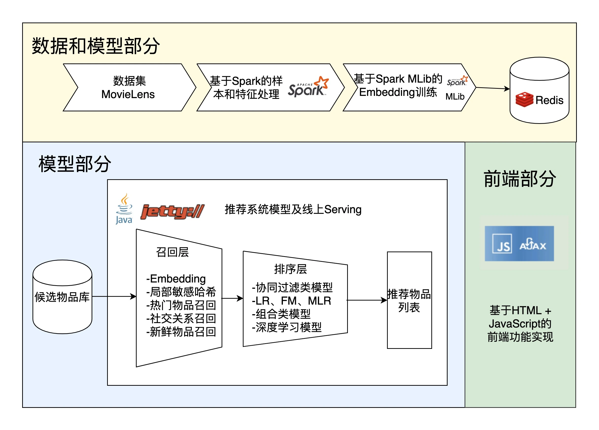

# 排序代码分析


## 背景




在模型部分，召回后，需要进行排序。


## 代码


SimilarMovieProcess.java:

```scala
    /**
     * rank candidates
     * @param movie    input movie
     * @param candidates    movie candidates
     * @param model     model name used for ranking
     * @return  ranked movie list
     */
    public static List<Movie> ranker(Movie movie, List<Movie> candidates, String model){
        HashMap<Movie, Double> candidateScoreMap = new HashMap<>();
        for (Movie candidate : candidates){
            double similarity;
            switch (model){
                case "emb":
                    similarity = calculateEmbSimilarScore(movie, candidate);
                    break;
                default:
                    similarity = calculateSimilarScore(movie, candidate);
            }
            candidateScoreMap.put(candidate, similarity);
        }
        List<Movie> rankedList = new ArrayList<>();
        candidateScoreMap.entrySet().stream().sorted(Map.Entry.comparingByValue(Comparator.reverseOrder())).forEach(m -> rankedList.add(m.getKey()));
        return rankedList;
    }


    /**
     * function to calculate similarity score based on embedding
     * @param movie     input movie
     * @param candidate candidate movie
     * @return  similarity score
     */
    public static double calculateEmbSimilarScore(Movie movie, Movie candidate){
        if (null == movie || null == candidate){
            return -1;
        }
        return movie.getEmb().calculateSimilarity(candidate.getEmb());
    }


    /**
     * function to calculate similarity score
     * @param movie     input movie
     * @param candidate candidate movie
     * @return  similarity score
     */
    public static double calculateSimilarScore(Movie movie, Movie candidate){
        int sameGenreCount = 0;
        for (String genre : movie.getGenres()){
            if (candidate.getGenres().contains(genre)){
                sameGenreCount++;
            }
        }
        double genreSimilarity = (double)sameGenreCount / (movie.getGenres().size() + candidate.getGenres().size()) / 2;
        double ratingScore = candidate.getAverageRating() / 5;

        double similarityWeight = 0.7;
        double ratingScoreWeight = 0.3;

        return genreSimilarity * similarityWeight + ratingScore * ratingScoreWeight;
    }
```

#### 方法逻辑

1. **统计相同类型的数量**：

   - `int sameGenreCount = 0;`：初始化一个计数器，用于记录两部电影共享的类型数量。
   - `for (String genre : movie.getGenres())`：遍历原始电影的类型列表。
   - `if (candidate.getGenres().contains(genre))`：检查候选电影的类型列表是否包含当前遍历到的类型。
   - 如果包含，`sameGenreCount++`：相同类型的计数器增加。

2. **计算类型相似度**：

   - ```
     double genreSimilarity = (double)sameGenreCount / (movie.getGenres().size() + candidate.getGenres().size()) / 2;
     ```

     ：

     - 计算相同类型的比例，方法是将相同类型的数量除以两部电影类型总数的平均值。这里先计算两部电影的类型总数之和，再除以 2，从而得到平均类型数，然后计算 `sameGenreCount` 占平均类型数的比例。

3. **计算评分比例**：

   - ```
     double ratingScore = candidate.getAverageRating() / 5;
     ```

     ：

     - 将候选电影的平均评分除以 5（假设评分满分为 5）。这样可以将评分标准化到 0 到 1 的范围内。

4. **设置权重并计算总相似度**：

   - `double similarityWeight = 0.7;`：为类型相似度设置一个权重，这里设为 0.7。

   - `double ratingScoreWeight = 0.3;`：为评分比例设置一个权重，这里设为 0.3。

   - ```
     return genreSimilarity * similarityWeight + ratingScore * ratingScoreWeight;
     ```

     ：

     - 最终的相似度得分是类型相似度乘以其权重加上评分比例乘以其权重。


Embedding.java:

```scala
    public double calculateSimilarity(Embedding otherEmb){
        if (null == embVector || null == otherEmb || null == otherEmb.getEmbVector()
                || embVector.size() != otherEmb.getEmbVector().size()){
            return -1;
        }
        double dotProduct = 0;
        double denominator1 = 0;
        double denominator2 = 0;
        for (int i = 0; i < embVector.size(); i++){
            dotProduct += embVector.get(i) * otherEmb.getEmbVector().get(i);
            denominator1 += embVector.get(i) * embVector.get(i);
            denominator2 += otherEmb.getEmbVector().get(i) * otherEmb.getEmbVector().get(i);
        }
        return dotProduct / (Math.sqrt(denominator1) * Math.sqrt(denominator2));
    }
```

#### 计算余弦相似度

- 初始化三个局部变量来存储计算中的中间结果：

  - `double dotProduct = 0;`：点积的初始值设为 0。
  - `double denominator1 = 0;`：第一个向量长度（模）的平方和的初始值设为 0。
  - `double denominator2 = 0;`：第二个向量长度（模）的平方和的初始值设为 0。

- 通过一个循环遍历嵌入向量的所有维度：

  - ```
    for (int i = 0; i < embVector.size(); i++)
    ```

    ：循环从 0 到嵌入向量的大小减一。

    - 在每次循环中，计算两个向量对应元素的乘积并累加到 `dotProduct`。
    - 同时，分别计算两个向量每个元素的平方并累加到 `denominator1` 和 `denominator2`。

- 最后，计算余弦相似度：

  - `return dotProduct / (Math.sqrt(denominator1) * Math.sqrt(denominator2));`：点积除以两个向量模的乘积的平方根。这是余弦相似度的公式，其中余弦相似度的值范围是从 -1 到 1。