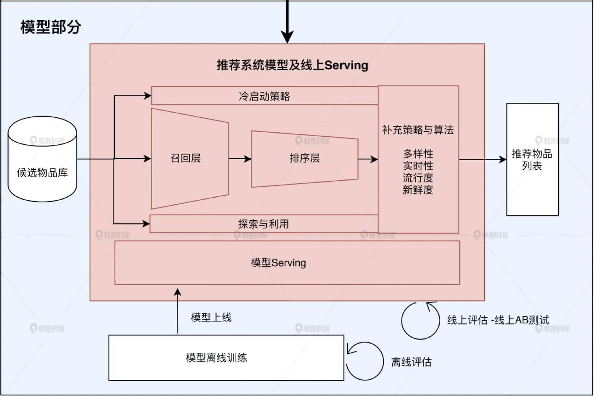

# 推荐系统技术架构图

## 系统架构图

## 代码

### 网页界面

	public class RecSysServer {
	
	    //主函数，创建推荐服务器并运行
	    public static void main(String[] args) throws Exception {
	        new RecSysServer().run();
	    }
	    
	    //推荐服务器的默认服务端口6010
	    private static final int DEFAULT_PORT = 6010;
	
	
	    //运行推荐服务器的函数
	    public void run() throws Exception{
	        int port = DEFAULT_PORT;
	        //绑定IP地址和端口，0.0.0.0代表本地运行
	        InetSocketAddress inetAddress = new InetSocketAddress("0.0.0.0", port);
	        //创建Jetty服务器
	        Server server = new Server(inetAddress);
	        //创建Jetty服务器的环境handler
	        ServletContextHandler context = new ServletContextHandler();
	        context.setContextPath("/");
	        context.setWelcomeFiles(new String[] { "index.html" });
	
	
	        //添加API，getMovie，获取电影相关数据
	        context.addServlet(new ServletHolder(new MovieService()), "/getmovie");
	        //添加API，getuser，获取用户相关数据
	        context.addServlet(new ServletHolder(new UserService()), "/getuser");
	        //添加API，getsimilarmovie，获取相似电影推荐
	        context.addServlet(new ServletHolder(new SimilarMovieService()), "/getsimilarmovie");
	        //添加API，getrecommendation，获取各类电影推荐
	        context.addServlet(new ServletHolder(new RecommendationService()), "/getrecommendation");
	        //设置Jetty的环境handler
	        server.setHandler(context);
	
	
	        //启动Jetty服务器
	        server.start();
	        server.join();
	    }

### MovieService

	//MovieService需要继承Jetty的HttpServlet
	public class MovieService extends HttpServlet {
	    //实现servlet中的get method
	    protected void doGet(HttpServletRequest request,
	                         HttpServletResponse response) throws IOException {
	        try {
	            //该接口返回json对象，所以设置json类型
	            response.setContentType("application/json");
	            response.setStatus(HttpServletResponse.SC_OK);
	            response.setCharacterEncoding("UTF-8");
	            response.setHeader("Access-Control-Allow-Origin", "*");
	            
	            //获得请求中的id参数，转换为movie id
	            String movieId = request.getParameter("id");
	            //从数据库中获取该movie的数据对象
	            Movie movie = DataManager.getInstance().getMovieById(Integer.parseInt(movieId));
	
	
	            if (null != movie) {
	                //使用fasterxml.jackson库把movie对象转换成json对象
	                ObjectMapper mapper = new ObjectMapper();
	                String jsonMovie = mapper.writeValueAsString(movie);
	                //返回json对象
	                response.getWriter().println(jsonMovie);
	            }else {
	                response.getWriter().println("");
	            }
	
	
	        } catch (Exception e) {
	            e.printStackTrace();
	            response.getWriter().println("");
	        }
	    }