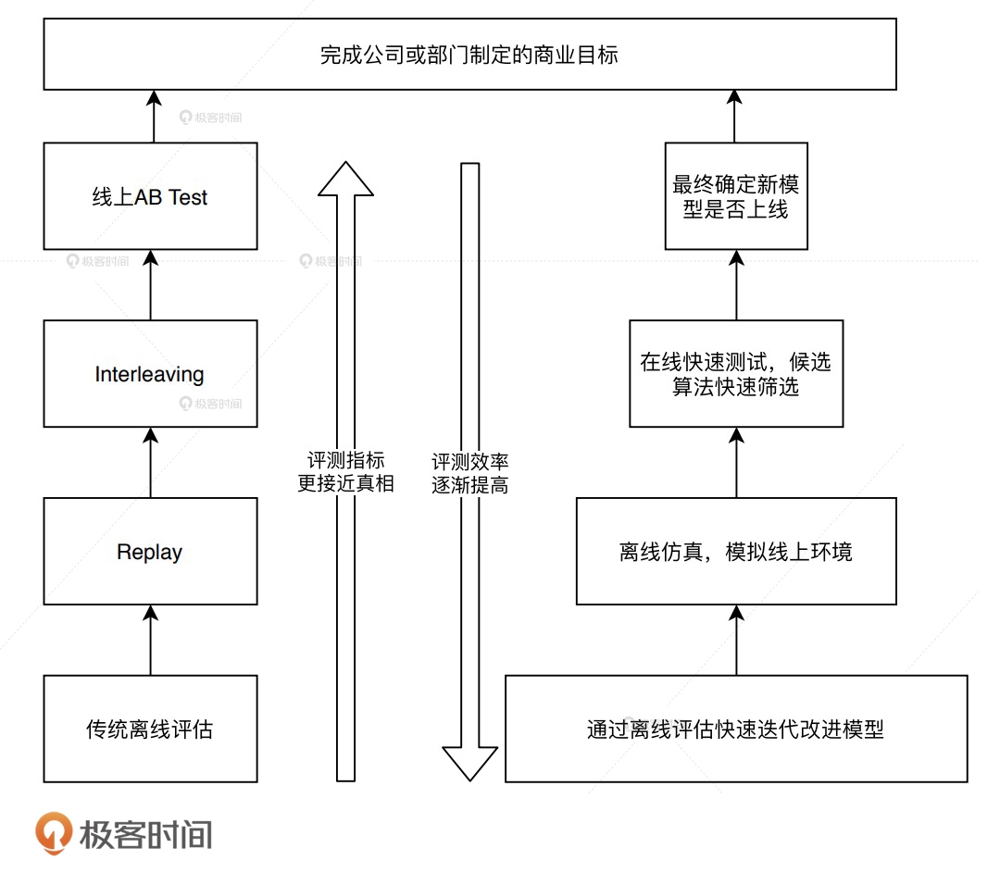
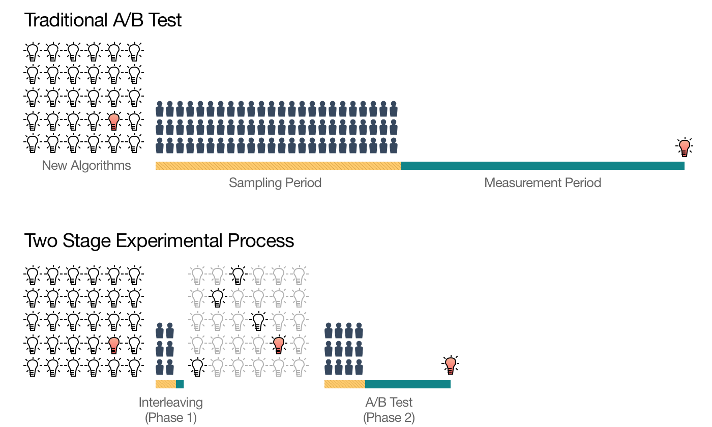
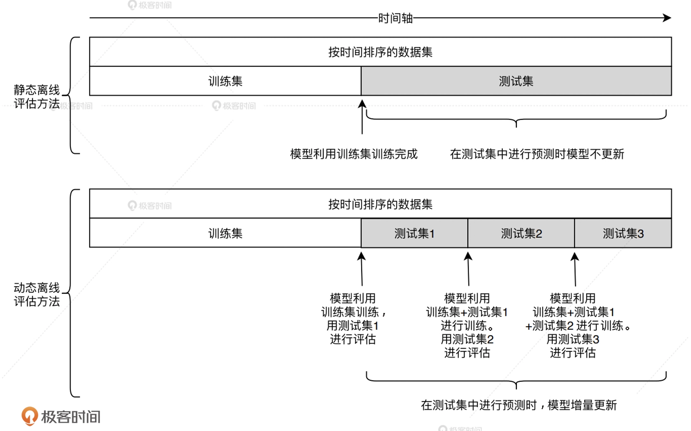
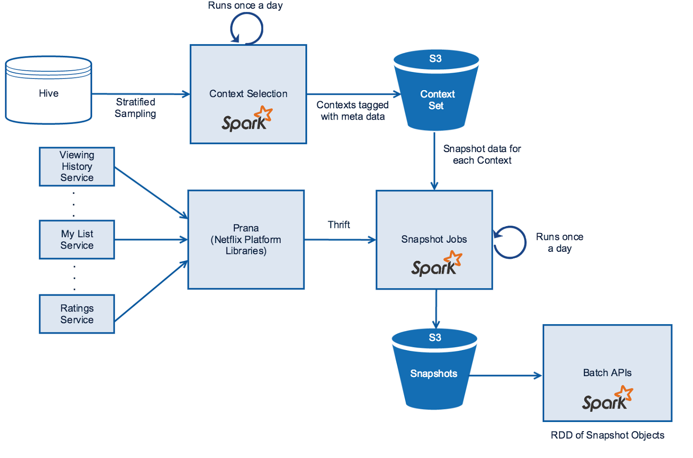
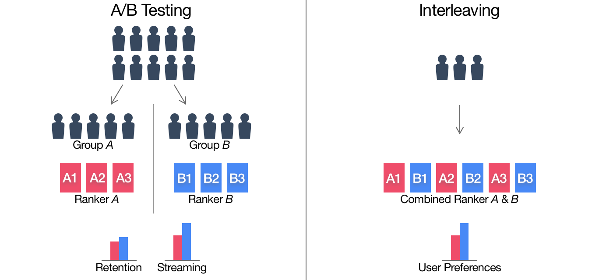

# 推荐系统线上资源紧张的解决方案

## 评估体系

这四层结构共同构成完整的评估体系，做到了评估效率和评估正确性之间的平衡，越是底层的方法就会承担越多筛选掉改进思路的任务，这时候“评估效率”就成了更关键的考虑因素，那对于“正确性”的评估，我们反而没有多么苛刻的要求了。

总的来说，离线评估由于有着更多可供利用的计算资源，可以更高效、快速地筛选掉那些“不靠谱”的模型来改进思路，所以被放在了第一层的位置。

随着候选模型被一层层筛选出来，越接近正式上线的阶段，评估方法对评估“正确性”的要求就越严格。因此，在模型正式上线前，我们应该以最接近真实产品体验的 A/B 测试，来做最后的模型评估，产生最具说服力的在线指标之后，才能够进行最终的模型上线，完成模型改进的迭代过程。

## 工作中的模型筛选过程

假设，现在有 30 个待筛选的模型，如果所有模型都直接进入线上 A/B 测试的阶段进行测试，所需的测试样本是海量的，由于线上流量有限，测试的时间会非常长。但如果我们把测试分成两个阶段，第一个阶段先进行初筛，把 30 个模型筛选出可能胜出的 5 个，再只对这 5 个模型做线上 A/B 测试，所需的测试流量规模和测试时间长度都会大大减少。这里的初筛方法，就是我们在评估体系中提到的离线评估、离线 Replay 和在线 Interleaving 等方法。

## Netflix 的 Replay 评估方法实践

离线 Replay 通过动态的改变测试时间点，来模拟模型的在线更新过程，让测试过程更接近真实线上环境。

是在 Replay 方法的实现过程中，存在一个很棘手的工程问题，就是我们总提到的“未来信息”问题，或者叫做“特征穿越”问题。因此在 Replay 过程中，每次模型更新的时候，我们都需要用历史上“彼时彼刻”的特征进行训练，否则训练和评估的结果肯定是不准确的。

Snapshot Jobs（数据快照）模块。它是一个每天执行的 Spark 程序，它做的主要任务就是把当天的各类日志、特征、数据整合起来，形成当天的、供模型训练和评估使用的样本数据。它还会以日期为目录名称，将样本快照数据保存在分布式文件系统 S3 中（Snapshots），再对外统一提供 API（Batch APIs），供其他模型在训练和评估的时候按照时间范围方便地获取。

在 Replay 方法的实现过程中，存在一个很棘手的工程问题，就是我们总提到的“未来信息”问题，或者叫做“特征穿越”问题。因此在 Replay 过程中，每次模型更新的时候，我们都需要用历史上“彼时彼刻”的特征进行训练，否则训练和评估的结果肯定是不准确的。

举个例子，假设 Replay 方法要使用 8 月 1 日到 8 月 31 日的样本数据进行重放，这些样本中包含一个特征，叫做“历史 CTR”，这个特征只能通过历史数据来计算生成。

**Context Set 模块负责保存所有的历史当天的环境信息。** 环境信息主要包括两类：一类是存储在 Hive 中的场景信息，比如用户的资料、设备信息、物品信息等数据；另一类是每天都会发生改变的一些统计类信息，包括物品的曝光量、点击量、播放时长等信息。

**Prana 模块负责处理每天的系统日志流。** 系统日志流指的是系统实时产生的日志，它包括用户的观看历史（Viewing History）、用户的推荐列表（My List）和用户的评价（Ratings）等。这些日志从各自的服务（Service）中产生，由 Netflix 的统一数据接口 Prana 对外提供服务。

因此，Snapshot Jobs 这个核心模块每天的任务就是，通过 Context Set 获取场景信息，通过 Prana 获取日志信息，再经过整合处理、生成特征之后，保存当天的数据快照到 S3。

在生成每天的数据快照后，使用 Replay 方法进行离线评估就不再是一件困难的事情了，因为我们没有必要在 Replay 过程中进行烦琐的特征计算，直接使用当天的数据快照就可以了。

## Interleaving 评估方法是什么

首先，它是和 A/B 测试一样的在线评估方法，能够得到在线评估指标；其次，它提出的目的是为了比传统的 A/B 测试用更少的资源，更快的速度得到在线评估的结果。

在传统的 A/B 测试中，我们会把用户随机分成两组。一组接受当前的推荐模型 A 的推荐结果，这一组被称为对照组 。另一组接受新的推荐模型 B 的推荐结果，这组被成为实验组。

在 Interleaving 方法中，不再需要两个不同组的用户，只需要一组用户，这些用户会收到模型 A 和模型 B 的混合结果。也就是说，用户会在一个推荐列表里同时看到模型 A 和模型 B 的推荐结果。在评估的过程中，Interleaving 方法通过分别累加模型 A 和模型 B 推荐物品的效果，来得到模型 A 和 B 最终的评估结果。

在使用 Interleaving 方法进行测试的时候，我们该怎么保证对模型 A 和模型 B 的测试是公平的呢？如果有一个模型的结果总排在第一位，这对另一个模型不就不公平了吗？

想办法避免来自模型 A 或者模型 B 的物品总排在第一位。因此，我们需要以相等的概率让模型 A 和模型 B 产生的物品交替领先。如下图所示：

