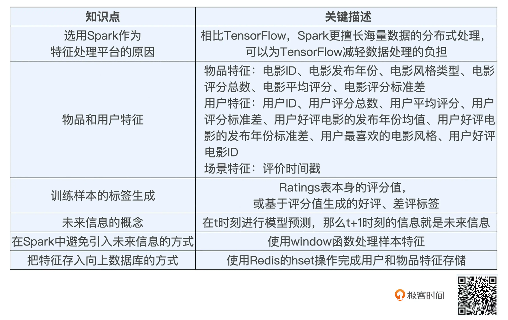

# 模型准备-模型特征、训练样本的处理


## 物品和用户特征都有哪些？


MovieLens 数据集中，可供我们提取特征的数据表有两个，分别是 movies 表和 ratings 表，它们的数据格式如下：


按照“物品特征”“用户特征”“场景特征”，这三大类推荐系统特征的顺序，来看一看从这两张表中能提取出什么样的特征。


#### 物品特征

“物品特征”在我们的项目里指的就是电影特征了，从 movies 表中我们可以提取出电影的基本信息，包括 movieId、title（电影名）、releaseYear（发布年份）和 genre（风格类型）。除此之外，我们还可以利用 ratings 表为每个电影提取出一些统计类的特征，包括电影的平均评分、评分标准差等等。


#### 用户特征

乍一看，从 movies 和 ratings 表中，除了 userId 我们好像找不到其他直接可用的用户信息了。这个时候，千万不要忘了我们之前提到过的，用户特征最重要的部分就是历史行为特征。所以，从用户的评分历史中，我们其实可以提取出非常多有价值的特征。比如，我们可以根据 ratings 表的历史联合 movies 表的电影信息，提取出用户统计类特征，它包括用户评分总数、用户平均评分、用户评分标准差、用户好评电影的发布年份均值、用户好评电影的发布年份标准差、用户最喜欢的电影风格，以及用户好评电影 ID 等等。


#### 场景特征

评分的时间戳，我们把它作为代表时间场景的特征放到特征工程中。


### 特征总结


## 特征工程代码

SparrowRecsys 项目中的 com.wzhe.sparrowrecsys.offline.spark.featureeng.FeatureEngForRecModel 对象，里面包含了所有特征工程的代码。这里，我们只讲几个有代表性的统计型特征的处理方法。


```scala
val movieRatingFeatures = samplesWithMovies3.groupBy(col("movieId"))
  .agg(count(lit(1)).as("movieRatingCount"),
   avg(col("rating")).as("movieAvgRating"),
   stddev(col("rating")).as("movieRatingStddev"))
```


计算统计型特征的典型方法，就是利用 Spark 中的 groupBy 操作，将原始评分数据按照 movieId 分组，然后用 agg 聚合操作来计算一些统计型特征。比如，在上面的代码中，我们就分别使用了 count 内置聚合函数来统计电影评价次数（movieRatingCount），用 avg 函数来统计评分均值（movieAvgRating），以及使用 stddev 函数来计算评价分数的标准差（movieRatingStddev）。


**一般来说，我们不会人为预设哪个特征有用，哪个特征无用，而是让模型自己去判断，如果一个特征的加入没有提升模型效果，我们再去除这个特征。就像我刚才虽然提取了不少特征，但并不是说每个模型都会使用全部的特征，而是根据模型结构、模型效果有针对性地部分使用它们。**


## 最终的训练样本是什么样的？

对于一个推荐模型来说，它的根本任务是预测一个用户 U 对一个物品 I 在场景 C 下的喜好分数。所以在训练时，我们要为模型生成一组包含 U、I、C 的特征，以及最终真实得分的样本。在 SparrowRecsys 中，这样的样本就是基于评分数据 ratings，联合用户、物品特征得来的。


其中，用户特征和物品特征都需要我们提前生成好，然后让它们与 ratings 数据进行 join 后，生成最终的训练样本，具体的实现也在 FeatureEngForRecModel 中，你可以先参考我在下面贴出的关键代码。这样，我们就解决了第一个关键问题。


```scala
//读取原始ratings数据
val ratingSamples = spark.read.format("csv").option("header", "true").load(ratingsResourcesPath.getPath)
//添加样本标签
val ratingSamplesWithLabel = addSampleLabel(ratingSamples)
//添加物品（电影）特征
val samplesWithMovieFeatures = addMovieFeatures(movieSamples, ratingSamplesWithLabel)
//添加用户特征
val samplesWithUserFeatures = addUserFeatures(samplesWithMovieFeatures)
```


接着，我们来看第二个关键问题，也就是样本的标签是什么，对于 MovieLens 数据集来说，用户对电影的评分是最直接的标签数据，因为它就是我们想要预测的用户对电影的评价，所以 ratings 表中的 0-5 的评分数据自然可以作为样本的标签。


但对于很多应用来说，我们基本上不可能拿到它们的评分数据，更多的是点击、观看、购买这些隐性的反馈数据，所以业界更多使用 CTR 预估这类解决二分类问题的模型去解决推荐问题。


为了让我们的实践过程更接近真实的应用场景，我也对 MovieLens 数据集进行了进一步处理。具体来说就是，把评分大于等于 3.5 分的样本标签标识为 1，意为“喜欢”，评分小于 3.5 分的样本标签标识为 0，意为“不喜欢”。这样一来，我们可以完全把推荐问题转换为 CTR 预估问题。


## 如何在生成样本时避免引入“未来信息”？


训练模型所需要的训练样本我们已经得到了，但是，在处理训练样本的时候，还有一个问题我们一定要注意，那就是引入未来信息（Future Information）的问题，这也是我们在实际工作中经常会遇到的问题。


什么叫做未来信息呢？如果我们在 t 时刻进行模型预测，那么 t+1 时刻的信息就是未来信息。这个问题在模型线上服务的时候是不存在的，因为未来的事情还未发生，我们不可能知道。但在离线训练的时候，我们就容易犯这样的错误。比如说，我们利用 t 时刻的样本进行训练，但是使用了全量的样本生成特征，这些特征就包含了 t+1 时刻的未来信息，这就是一个典型的引入未来信息的错误例子。


这样说可能还是有点抽象，我们用刚才讲过的特征举个例子。刚才我们说到有一个用户特征叫做用户平均评分（userAvgRating），我们通过把用户评论过的电影评分取均值得到它。假设，一个用户今年评论过三部电影，分别是 11 月 1 日评价电影 A，评分为 3 分，11 月 2 日评价电影 B，评分为 4 分，11 月 3 日评价电影 C，评分为 5 分。如果让你利用电影 B 这条评价记录生成样本，样本中 userAvgRating 这个特征的值应该取多少呢？


有的同学会说，应该取评价过的电影评分的均值啊，(3+4+5)/3=4 分，应该取 4 分啊。这就错了，因为在样本 B 发生的时候，样本 C 还未产生啊，它属于未来信息，你怎么能把 C 的评分也加进去计算呢？而且样本 B 的评分也不应该加进去，因为 userAvgRating 指的是历史评分均值，B 的评分是我们要预估的值，也不可以加到历史评分中去，所以正确答案是 3 分，我们只能考虑电影 A 的评分。


因此，在处理历史行为相关的特征的时候，我们一定要考虑未来信息问题。类似的还有用户评分总数、用户评分标准差、用户最喜欢的电影风格、用户好评电影 ID 等一系列特征。


那在 Spark 中，我们应该如何处理这些跟历史行为相关的特征呢？这就需要用到 window 函数了。比如说，我在生成 userAvgRating 这个特征的时候，是使用下面的代码生成的：


```scala
withColumn("userAvgRating", avg(col("rating"))
  .over(Window.partitionBy("userId")
    .orderBy(col("timestamp")).rowsBetween(-100, -1)))
```


代码中有一个over(Window.partitionBy("userId").orderBy(col("timestamp")))操作，它的意思是，在做 rating 平均这个操作的时候，我们不要对这个 userId 下面的所有评分取平均值，而是要创建一个滑动窗口，先把这个用户下面的评分按照时间排序，再让这个滑动窗口一一滑动，滑动窗口的位置始终在当前 rating 前一个 rating 的位置。这样，我们再对滑动窗口内的分数做平均，就不会引入未来信息了。


## 如何把特征数据存入线上供模型服务用？


在生成好特征和训练样本之后，还有一个问题需要我们解决，那就是特征的线上存储问题。因为训练样本是供离线训练使用的，而线上模型推断过程是要使用线上特征的。


好在，特征数据库 Redis 已经为我们提供了解决办法。我们把用户特征和物品特征分别存入 Redis，线上推断的时候，再把所需的用户特征和物品特征分别取出，拼接成模型所需的特征向量就可以了。


FeatureEngForRecModel 中的 extractAndSaveUserFeaturesToRedis 函数给出了详细的 Redis 操作，我把其中的关键操作放在了下面。


```scala
val userKey = userFeaturePrefix + sample.getAs[String]("userId")
val valueMap = mutable.Map[String, String]()
valueMap("userRatedMovie1") = sample.getAs[String]("userRatedMovie1")
valueMap("userRatedMovie2") = sample.getAs[String]("userRatedMovie2")
...
valueMap("userAvgRating") = sample.getAs[String]("userAvgRating")
valueMap("userRatingStddev") = sample.getAs[String]("userRatingStddev")


redisClient.hset(userKey, JavaConversions.mapAsJavaMap(valueMap))
```

代码中使用了 Redis 一个新的操作 hset，它的作用是把一个 Map 存入 Redis。这样做有什么好处呢？对于这里的用户特征来说，Map 中存储的就是特征的键值对，又因为这个 Map 本身是 userId 的值，所以，每个 userId 都拥有一组用户特征。这样一来，我们就可以在推荐服务器内部，通过 userId 来取出所有对应的用户特征了。当然，物品特征的储存方式是一样的。


## 知识点总结


