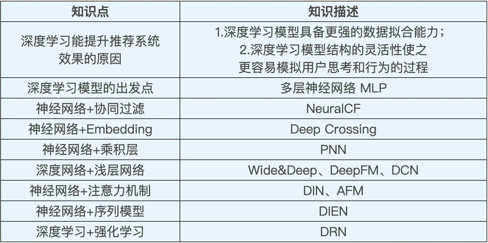

# 深度学习推荐模型发展的整体脉络

## 深度学习模型的强拟合能力

经典的推荐算法，矩阵分解。在矩阵分解模型的结构（图 1 左）中，用户 One-hot 向量和物品 One-hot 向量分居两侧，它们会先通过隐向量层转换成用户和物品隐向量，再通过点积的方式交叉生成最终的打分预测。

但是，点积这种特征向量交叉的方式毕竟过于简单了，在数据模式比较复杂的情况下，往往存在欠拟合的情况。而深度学习就能大大加强模型的拟合能力，比如在 NeuralCF（神经网络协同过滤）模型中，点积层被替换为多层神经网络，理论上多层神经网络具备拟合任意函数的能力，所以我们通过增加神经网络层的方式就能解决模型欠拟合的问题了。

## 深度学习模型结构的灵活性

如果你读过一些深度学习相关的论文肯定会发现，每篇论文中的模型结构都不尽相同，就像图 3 展示的那样，它们有的是好多层，有的像一个串是串在一起的，而有的像一张网一样，拥有多个输入和多个输出，甚至还有的像金字塔，会从输入到输出逐层变窄。

虽然，模型结构的复杂性让我们难以掌握它们的规律，但也正是因为深度模型拥有这样的灵活性，让它能够更轻松地模拟人们的思考过程和行为过程，让推荐模型像一个无所不知的超级大脑一样，把用户猜得更透。

这其中典型的例子就是阿里巴巴的模型 DIN（深度兴趣网络）和 DIEN（深度兴趣进化网络）。它们通过在模型结构中引入注意力机制和模拟兴趣进化的序列模型，来更好地模拟用户的行为

重点关注图 4 的 DIN 模型，它在神经网络中增加了一个叫做“激活单元“的结构，这个单元就是为了模拟人类的注意力机制。举个例子来说，我们在购买电子产品，比如说笔记本电脑的时候，更容易拿之前购买电脑的经验，或者其他电子产品的经验来指导当前的购买行为，很少会借鉴购买衣服和鞋子的经验。这就是一个典型的注意力机制，我们只会注意到相关度更高的历史购买行为，而 DIN 模型就是模拟了人类的注意力特点。

DIN 模型的改进版 DIEN 模型就更厉害了，它不仅引入了注意力机制，还模拟了用户兴趣随时间的演化过程。我们来看那些彩色的层，这一层层的序列结构模拟的正是用户兴趣变迁的历史，通过模拟变迁的历史，DIEN 模型可以更好地预测下一步用户会喜欢什么。

## 深度学习推荐模型的演化关系图

深度学习模型 5 年内的发展过程图，图中的每一个节点都是一个重要的模型结构，节点之间的连线也揭示了不用模型间的联系。

整个演化图最中心部分，这是深度学习最基础的结构，我们叫它“多层神经网络”或者“多层感知机”，简称 MLP（MultiLayer Perceptron）。多层感知机的原理就像一个黑盒，会对输入的特征进行深度地组合交叉，然后输出对兴趣值的预测。其他的深度推荐模型全都是在多层感知机的基础上，进行结构上的改进而生成的，所以“多层感知机”是整个演化图的核心。

从多层感知机向上，还有一个重点模型我们需要知道，那就是 Deep Crossing。Deep Crossing 实际上是一类经典深度学习模型的代表，相比于 MLP，Deep Crossing 在原始特征和 MLP 之间加入了 Embedding 层。这样一来，输入的稀疏特征先转换成稠密 Embedding 向量，再参与到 MLP 中进行训练，这就解决了 MLP 不善于处理稀疏特征的问题。可以说，Embedding+MLP 的结构是最经典，也是应用最广的深度学习推荐模型结构。

从 MLP 向下，我们看到了 Google 提出的推荐模型 Wide&Deep。它把深层的 MLP 和单层的神经网络结合起来，希望同时让网络具备很好的“记忆性”和“泛化性”。对“记忆性”和“泛化性”这两个名词陌生的同学也不用着急，我们后面的课程会专门来讲解 Wide&Deep。

Wide&Deep 提出以来，凭借着“易实现”“易落地”“易改造”的特点，获得了业界的广泛应用。围绕着 Wide&Deep 还衍生出了诸多变种，比如，通过改造 Wide 部分提出的 Deep&Cross 和 DeepFM，通过改造 Deep 部分提出的 AFM、NFM 等等。总之，Wide&Deep 是业界又一得到广泛应用的深度推荐模型。

除此之外，我们还可以看到经典的深度学习模型跟其他机器学习子领域的交叉。这里，我给你举 3 个比较著名的例子：第 1 个是深度学习和注意力机制的结合，诞生了阿里的深度兴趣网络 DIN，浙大和新加坡国立提出的 AFM 等等；第 2 个是把序列模型引入 MLP+Embedding 的经典结构，诞生了阿里的深度兴趣进化网络 DIEN；第 3 个是把深度学习和强化学习结合在一起，诞生了微软的深度强化学习网络 DRN，以及包括美团、阿里在内的非常有价值的业界应用。

#### 模型改进的四个方向

一是改变神经网络的复杂程度。 从最简单的单层神经网络模型 AutoRec，到经典的深度神经网络结构 Deep Crossing，它们主要的进化方式在于增加了深度神经网络的层数和结构复杂度。

二是改变特征交叉方式。 这种演进方式的要点在于大大提高了深度学习网络中特征交叉的能力。比如说，改变了用户向量和物品向量互操作方式的 NeuralCF，定义了多种特征向量交叉操作的 PNN 等等。

三是把多种模型组合应用。 组合模型主要指的就是以 Wide&Deep 模型为代表的一系列把不同结构组合在一起的改进思路。它通过组合两种甚至多种不同特点、优势互补的深度学习网络，来提升模型的综合能力。

四是让深度推荐模型和其他领域进行交叉。 我们从 DIN、DIEN、DRN 等模型中可以看出，深度推荐模型无时无刻不在从其他研究领域汲取新的知识。事实上，这个过程从未停歇，我们从今年的推荐系统顶会 Recsys2020 中可以看到，NLP 领域的著名模型 Bert 又与推荐模型结合起来，并且产生了非常好的效果。一般来说，自然语言处理、图像处理、强化学习这些领域都是推荐系统经常汲取新知识的地方。

## 知识点总结

