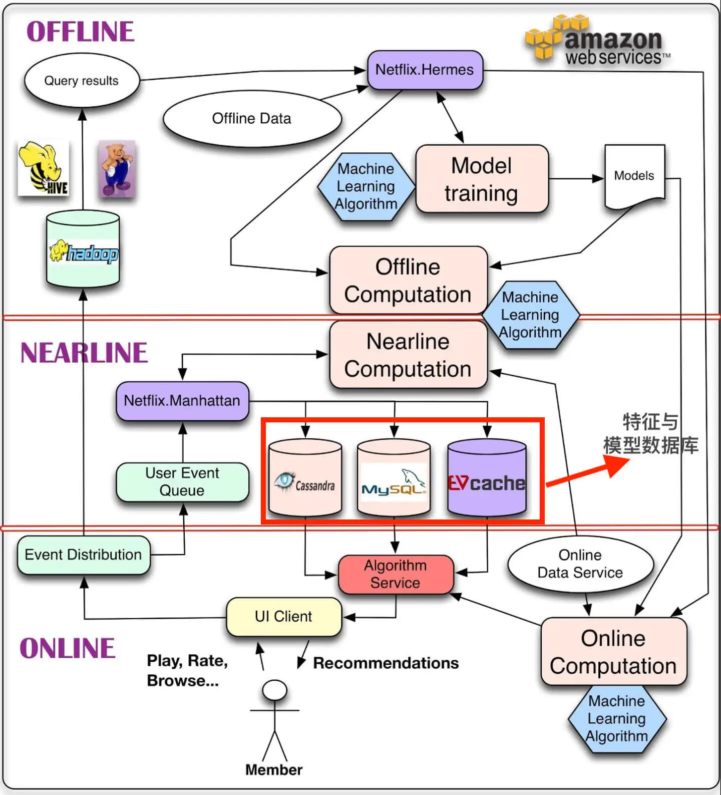
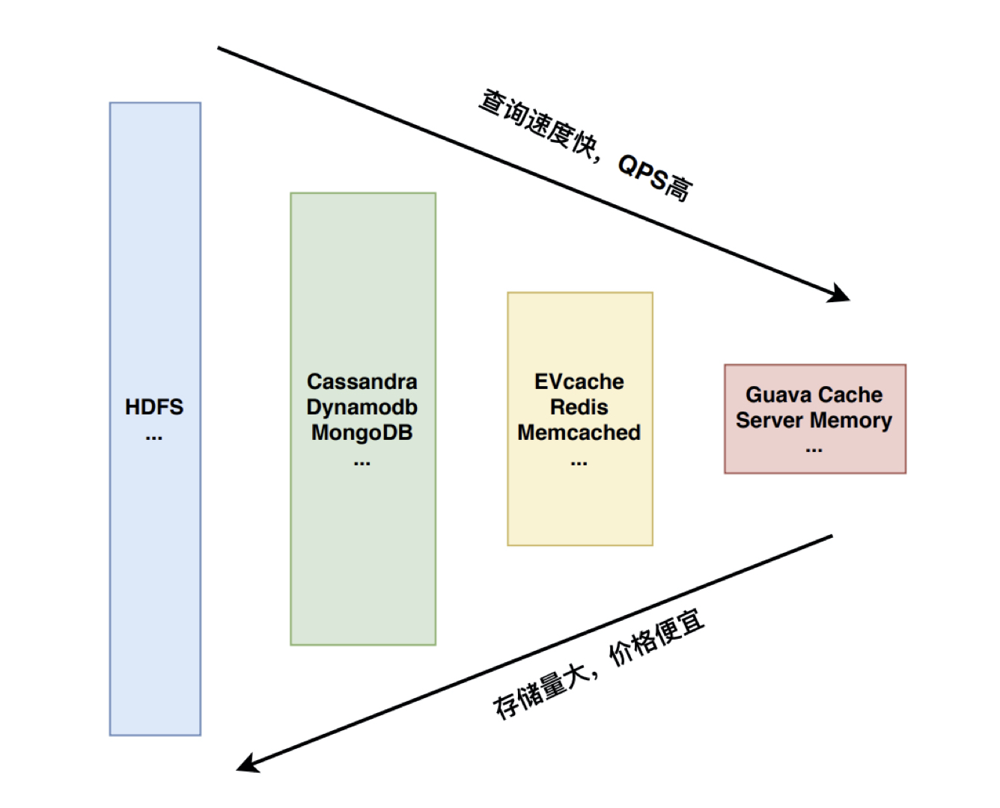
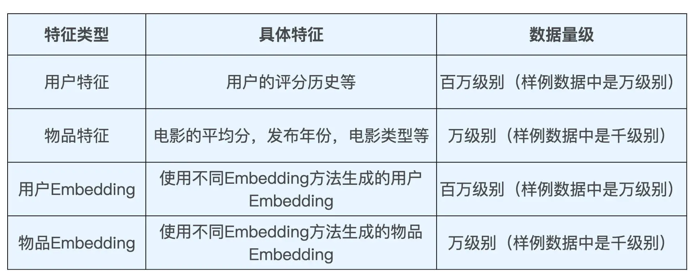
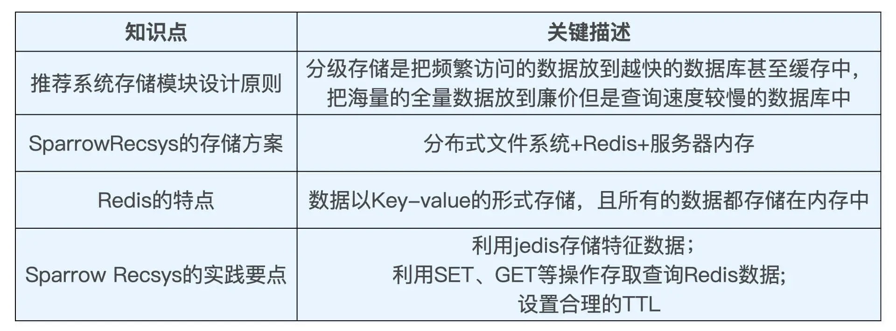

# 用Redis解决推荐系统特征的存储问题

## netflix推荐系统架构

### 分级存储的设计

“分级存储，把越频繁访问的数据放到越快的数据库甚至缓存中，把海量的全量数据放到廉价但是查询速度较慢的数据库中”。

## 运行离线程序，通过 jedis 客户端写入 Redis

	if (saveToRedis) {
	  //创建redis client
	  val redisClient = new Jedis(redisEndpoint, redisPort)
	  val params = SetParams.setParams()
	  //设置ttl为24小时
	  params.ex(60 * 60 * 24)
	  //遍历存储embedding向量
	  for (movieId <- model.getVectors.keys) {
	    //key的形式为前缀+movieId，例如i2vEmb:361
	    //value的形式是由Embedding向量生成的字符串，例如 "0.1693846 0.2964318 -0.13044095 0.37574086 0.55175656 0.03217995 1.327348 -0.81346786 0.45146862 0.49406642"
	    redisClient.set(redisKeyPrefix + ":" + movieId, model.getVectors(movieId).mkString(" "), params)
	  }
	  //关闭客户端连接
	  redisClient.close()
	}

## 在推荐服务器中把 Redis 数据读取出来

在服务器端，根据刚才梳理出的存储方案，我们希望服务器能够把所有物品 Embedding 阶段性地全部缓存在服务器内部，用户 Embedding 则进行实时查询

	//创建redis client
	Jedis redisClient = new Jedis(REDIS_END_POINT, REDIS_PORT);
	//查询出所有以embKey为前缀的数据
	Set<String> movieEmbKeys = redisClient.keys(embKey + "*");
	int validEmbCount = 0;
	//遍历查出的key
	for (String movieEmbKey : movieEmbKeys){
	    String movieId = movieEmbKey.split(":")[1];
	    Movie m = getMovieById(Integer.parseInt(movieId));
	    if (null == m) {
	        continue;
	    }
	    //用redisClient的get方法查询出key对应的value，再set到内存中的movie结构中
	    m.setEmb(parseEmbStr(redisClient.get(movieEmbKey)));
	    validEmbCount++;
	}
	redisClient.close();

## 总结

