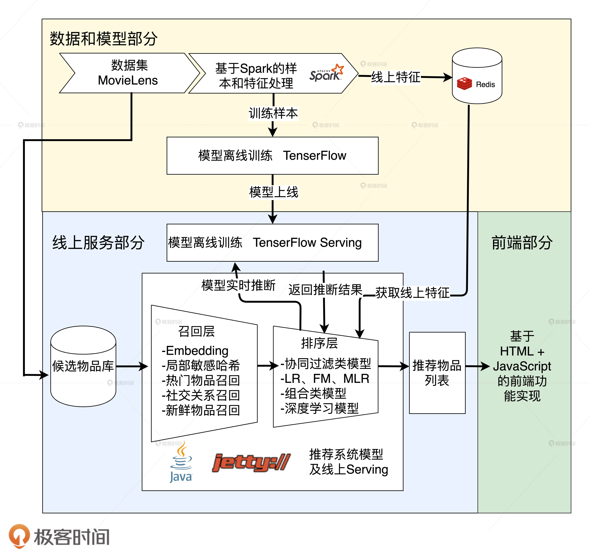

# 用深度学习模型实现Sparrow RecSys的个性化推荐功能


## “猜你喜欢”推荐功能的技术架构





首先，我们来看数据和模型部分。左上角是我们使用的数据集 MovieLens，它经过 Spark 的处理之后，会生成两部分数据，分别从两个出口出去，特征部分会存入 Redis 供线上推断时推荐服务器使用，样本部分则提供给 TensorFlow 训练模型。


TensorFlow 完成模型训练之后，会导出模型文件，然后模型文件会载入到 TensorFlow Serving 中，接着 TensorFlow Serving 会对外开放模型服务 API，供推荐服务器调用。


接下来，我们再看推荐服务器部分。在这部分里，基于 MovieLens 数据集生成的候选电影集合会依次经过候选物品获取、召回层、排序层这三步，最终生成“猜你喜欢”的电影推荐列表，然后返回给前端，前端利用 HTML 和 JavaScript 把它们展示给用户。


整个过程中，除了排序层和 TensorFlow Serving 的实现，其他部分我们都已经在之前的实战中一一实现过。所以今天，我们会重点讲解推荐服务器排序层和 TensorFlow Serving 的实现。


## 排序层 +TensorFlow Serving 的实现


在推荐服务器内部，经过召回层之后，我们会得到几百量级的候选物品集。最后我们到底从这几百部电影中推荐哪些给用户，这个工作就交由排序层来处理。因为排序的工作是整个推荐系统提高效果的重中之重，在业界的实际应用中，往往交由评估效果最好的深度推荐模型来处理。整个的排序过程可以分为三个部分：

- 准备线上推断所需的特征，拼接成 JSON 格式的特征样本；
- 把所有候选物品的特征样本批量发送给 TensorFlow Serving API；
- 根据 TensorFlow Serving API 返回的推断得分进行排序，生成推荐列表。


#### 第一步

首先，第一步的实现重点在于特征样本的拼接。实践例子里，我们选用了 NeuralCF 作为排序模型，而 NerualCF 所需的特征只有 userId 和 itemId ，所以特征是比较好准备的。我们下面看一下如何拼接特征形成模型推断所需的样本。详细的代码，你可以参考 com.wzhe.sparrowrecsys.online.recprocess.RecForYouProcess。

```python
/**
 * call TenserFlow serving to get the NeuralCF model inference result
 * @param user              input user
 * @param candidates        candidate movies
 * @param candidateScoreMap save prediction score into the score map
 */
public static void callNeuralCFTFServing(User user, List<Movie> candidates, HashMap<Movie, Double> candidateScoreMap){
    if (null == user || null == candidates || candidates.size() == 0){
        return;
    }
    //保存所有样本的JSON数组
    JSONArray instances = new JSONArray();
    for (Movie m : candidates){
        JSONObject instance = new JSONObject();
        //为每个样本添加特征，userId和movieId
        instance.put("userId", user.getUserId());
        instance.put("movieId", m.getMovieId());
        instances.put(instance);
    }
    JSONObject instancesRoot = new JSONObject();
    instancesRoot.put("instances", instances);
    //请求TensorFlow Serving API
    String predictionScores = asyncSinglePostRequest("http://localhost:8501/v1/models/recmodel:predict", instancesRoot.toString());
    //获取返回预估值
    JSONObject predictionsObject = new JSONObject(predictionScores);
    JSONArray scores = predictionsObject.getJSONArray("predictions");
    //将预估值加入返回的map
    for (int i = 0 ; i < candidates.size(); i++){
        candidateScoreMap.put(candidates.get(i), scores.getJSONArray(i).getDouble(0));
    }
}
```


#### 第二步


第二步的重点在于如何建立起 TensorFlow Serving API。想要搭建起我们自己的 TensorFlow Serving API，只需要把之前载入的测试模型文件换成我们自己的模型文件就可以了。这里，我就以 NerualCF 模型为例，带你看一看模型文件是如何被导出和导入的。


首先是模型的导出。在 NeuralCF 的 TensorFlow 实现中，我们已经把训练好的模型保存在了 model 这个结构中，接下来需要调用 tf.keras.models.save_model 这一函数来把模型序列化。


从下面的代码中你可以看到，这一函数需要传入的参数有要保存的 model 结构，保存的路径，还有是否覆盖路径 overwrite 等等。其中，我们要注意的是保存路径。你可以看到，我在保存路径中加上了一个模型版本号 002，这对于 TensorFlow Serving 是很重要的，因为 TensorFlow Serving 总是会找到版本号最大的模型文件进行载入，这样做就保证了我们每次载入的都是最新训练的模型。详细代码请你参考 NeuralCF.py。


```python
tf.keras.models.save_model(
    model,
  "file:///Users/zhewang/Workspace/SparrowRecSys/src/main/resources/webroot/modeldata/neuralcf/002",
    overwrite=True,
    include_optimizer=True,
    save_format=None,
    signatures=None,
    options=None
)
```


其次是模型的导入，导入命令非常简单就是 TensorFlow Serving API 的启动命令，我们直接看下面命令中的参数。


```
docker run -t --rm -p 8501:8501     -v "/Users/zhewang/Workspace/SparrowRecSys/src/main/resources/webroot/modeldata/neuralcf:/models/recmodel"     -e MODEL_NAME=recmodel     tensorflow/serving &
```


#### 第3步


**获取返回得分和排序。**TensorFlow Serving API 的返回得分格式。它的返回值也是一个 JSON 数组的格式，数组中每一项对应着之前发送过去的候选电影样本，所以我们只要把返回的预估值赋给相应的样本，然后按照预估值排序就可以了。详细的过程你也可以参考 com.wzhe.sparrowrecsys.online.recprocess.RecForYouProcess 中全部排序层的代码。


```python
{
    "predictions": [[0.824034274], [0.86393261], [0.921346784], [0.957705915], [0.875154734], [0.905113697], [0.831545711], [0.926080644], [0.898158073]...
    ]
}
```

