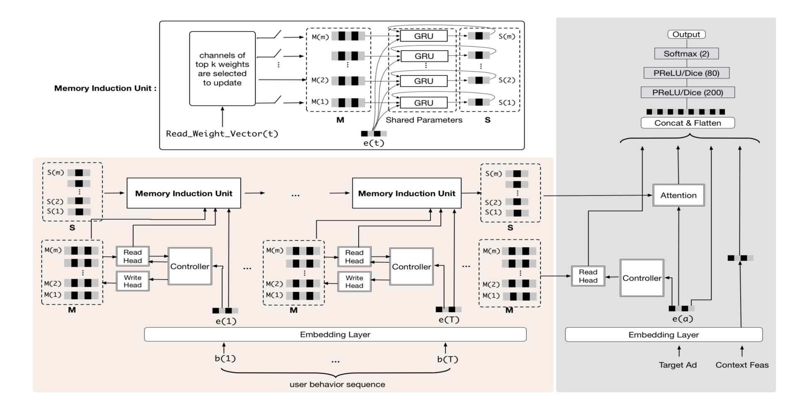
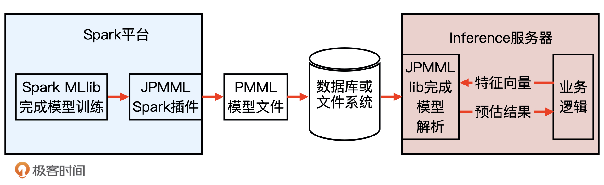
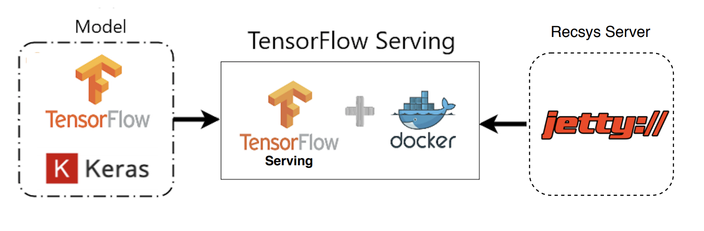

# 线模型部署到线上


## 背景

在实验室的环境下，我们经常使用 Spark MLlib、TensorFlow、PyTorch 这些流行的机器学习库来训练模型，因为不用直接服务用户，所以往往得到一些离线的训练结果就觉得大功告成了。但在业界的生产环境中，模型需要在线上运行，实时地根据用户请求生成模型的预估值。这个把模型部署在线上环境，并实时进行模型推断（Inference）的过程就是模型服务。


## 业界的主流模型服务方法

业界主流的模型服务方法有 4 种，分别是预存推荐结果或 Embedding 结果、预训练 Embedding+ 轻量级线上模型、PMML 模型以及 TensorFlow Serving。


## 预存推荐结果或 Embedding 结果

对于推荐系统线上服务来说，最简单直接的模型服务方法就是在离线环境下生成对每个用户的推荐结果，然后将结果预存到以 Redis 为代表的线上数据库中。这样，我们在线上环境直接取出预存数据推荐给用户即可。


由于这些优缺点的存在，这种直接存储推荐结果的方式往往只适用于用户规模较小，或者一些冷启动、热门榜单等特殊的应用场景中。


## 预训练 Embedding+ 轻量级线上模型


直接预存 Embedding 的方法让模型表达能力受限这个问题的产生，主要是因为我们仅仅采用了“相似度计算”这样非常简单的方式去得到最终的推荐分数。既然如此，那我们能不能在线上实现一个比较复杂的操作，甚至是用神经网络来生成最终的预估值呢？当然是可行的，这就是业界很多公司采用的“预训练 Embedding+ 轻量级线上模型”的模型服务方式。


用复杂深度学习网络离线训练生成 Embedding，存入内存数据库，再在线上实现逻辑回归或浅层神经网络等轻量级模型来拟合优化目标。


阿里的推荐模型 MIMN（Multi-channel user Interest Memory Network，多通道用户兴趣记忆网络）的结构。神经网络，才是真正在线上服务的部分。


仔细看这张图你会注意到，左边粉色的部分是复杂模型部分，右边灰色的部分是简单模型部分。看这张图的时候，其实你不需要纠结于复杂模型的结构细节，你只要知道左边的部分不管多复杂，它们其实是在线下训练生成的，而右边的部分是一个经典的多层神经网络，它才是真正在线上服务的部分。





这两部分的接口在哪里呢？你可以看一看图中连接处的位置，有两个被虚线框框住的数据结构，分别是 S(1)-S(m) 和 M(1)-M(m)。它们其实就是在离线生成的 Embedding 向量，在 MIMN 模型中，它们被称为“多通道用户兴趣向量”，这些 Embedding 向量就是连接离线模型和线上模型部分的接口。


线上部分从 Redis 之类的模型数据库中拿到这些离线生成 Embedding 向量，然后跟其他特征的 Embedding 向量组合在一起，扔给一个标准的多层神经网络进行预估，这就是一个典型的“预训练 Embedding+ 轻量级线上模型”的服务方式。


它的好处显而易见，就是我们隔离了离线模型的复杂性和线上推断的效率要求，离线环境下，你可以尽情地使用复杂结构构建你的模型，只要最终的结果是 Embedding，就可以轻松地供给线上推断使用。


## 利用 PMML 转换和部署模型

虽然 Embedding+ 轻量级模型的方法既实用又高效，但它还是把模型进行了割裂，让模型不完全是 End2End（端到端）训练 +End2End 部署这种最“完美”的方式。那有没有能够在离线训练完模型之后什么都不用做，直接部署模型的方式呢？当然是有的，也就是我接下来要讲的脱离于平台的通用模型部署方式，PMML。


PMML 的全称是“预测模型标记语言”(Predictive Model Markup Language, PMML)，它是一种通用的以 XML 的形式表示不同模型结构参数的标记语言。在模型上线的过程中，PMML 经常作为中间媒介连接离线训练平台和线上预测平台。


以 Spark MLlib 模型的训练和上线过程为例，来和你详细解释一下，PMML 在整个机器学习模型训练及上线流程中扮演的角色。





例子使用了 JPMML 作为序列化和解析 PMML 文件的 library（库），JPMML 项目分为 Spark 和 Java Server 两部分。Spark 部分的 library 完成 Spark MLlib 模型的序列化，生成 PMML 文件，并且把它保存到线上服务器能够触达的数据库或文件系统中，而 Java Server 部分则完成 PMML 模型的解析，生成预估模型，完成了与业务逻辑的整合。


JPMML 在 Java Server 部分只进行推断，不考虑模型训练、分布式部署等一系列问题，因此 library 比较轻，能够高效地完成推断过程。与 JPMML 相似的开源项目还有 MLeap，同样采用了 PMML 作为模型转换和上线的媒介。


## TensorFlow Serving


对于具有复杂结构的深度学习模型来说，PMML 语言的表示能力还是比较有限的，还不足以支持复杂的深度学习模型结构。由于咱们课程中的推荐模型篇，会主要使用 TensorFlow 来构建深度学习推荐模型，这个时候 PMML 的能力就有点不足了。想要上线 TensorFlow 模型，我们就需要借助 TensorFlow 的原生模型服务模块，也就是 TensorFlow Serving 的支持。


从整体工作流程来看，TensorFlow Serving 和 PMML 类工具的流程一致，它们都经历了模型存储、模型载入还原以及提供服务的过程。在具体细节上，TensorFlow 在离线把模型序列化，存储到文件系统，TensorFlow Serving 把模型文件载入到模型服务器，还原模型推断过程，对外以 HTTP 接口或 gRPC 接口的方式提供模型服务。


再具体到咱们的 Sparrow Recsys 项目中，我们会在离线使用 TensorFlow 的 Keras 接口完成模型构建和训练，再利用 TensorFlow Serving 载入模型，用 Docker 作为服务容器，然后在 Jetty 推荐服务器中发出 HTTP 请求到 TensorFlow Serving，获得模型推断结果，最后推荐服务器利用这一结果完成推荐排序。



## 实战搭建 TensorFlow Serving 模型服务

总的来说，搭建一个 TensorFlow Serving 的服务主要有 3 步，分别是安装 Docker，建立 TensorFlow Serving 服务，以及请求 TensorFlow Serving 获得预估结果。


### 1.安装 Docker

(略)


### 2.建立 TensorFlow Serving 服务


安装bazel

```
brew install bazel
```


```dockerfile
# 从docker仓库中下载tensorflow/serving镜像
docker pull tensorflow/serving
```

然后，我们再从 TenSorflow 的官方 GitHub 地址下载 TensorFlow Serving 相关的测试模型文件：

```dockerfile
# 把tensorflow/serving的测试代码clone到本地
git clone https://github.com/tensorflow/serving
# 指定测试数据的地址
TESTDATA="$(pwd)/serving/tensorflow_serving/servables/tensorflow/testdata"
```

最后，我们在 Docker 中启动一个包含 TensorFlow Serving 的模型服务容器，并载入我们刚才下载的测试模型文件 half_plus_two

```dockerfile
# 启动TensorFlow Serving容器，在8501端口运行模型服务API
docker run -t --rm -p 8501:8501 \
    -v "$TESTDATA/saved_model_half_plus_two_cpu:/models/half_plus_two" \
    -e MODEL_NAME=half_plus_two \
    tensorflow/serving &
```


### 3.请求 TensorFlow Serving 获得预估结果


```bash
# 请求模型服务API
curl -d '{"instances": [1.0, 2.0, 5.0]}' \
    -X POST http://localhost:8501/v1/models/half_plus_two:predict
```

如果你看到了下图这样的返回结果，就说明 TensorFlow Serving 服务已经成功建立起来了

```bash
# 返回模型推断结果如下
# Returns => { "predictions": [2.5, 3.0, 4.5] }
```


官方教程：

https://www.tensorflow.org/tfx/serving/docker